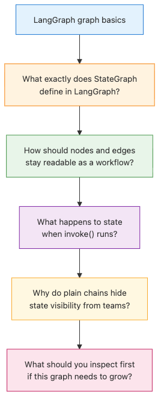

# LangGraph introduction and graph basics

## Questions this post answers

- What exactly does `StateGraph` define in LangGraph?
- How should you connect nodes and edges so the workflow stays readable?
- What happens to state when you call `invoke()`?

> StateGraph is a blueprint that turns node functions plus transition rules into an executable workflow over shared state.

Example code: [github.com/yeongseon-books/langgraph-101](https://github.com/yeongseon-books/langgraph-101/tree/main/en/01-graph-basics)

The most useful first mental shift is this: LangGraph is not “a few chains glued together.” It is a graph where state moves through named steps. This post builds the smallest possible graph so you can see node registration, edge wiring, and `invoke()` in one place.


## Minimal runnable example

```python
from typing import TypedDict

from langgraph.graph import END, START, StateGraph

class ArticleState(TypedDict):
    user_request: str
    topic: str
    outline: list[str]
    answer: str

def choose_topic(state: ArticleState) -> ArticleState:
    request = state["user_request"].lower()
    if "checkpoint" in request:
        topic = "checkpoints"
    elif "tool" in request:
        topic = "tool calling"
    else:
        topic = "graph basics"
    return {"topic": topic}

def build_outline(state: ArticleState) -> ArticleState:
    outline = [
        f"Define {state['topic']}",
        "Show the nodes in the graph",
        "Explain how invoke() runs the graph",
    ]
    return {"outline": outline}

def write_answer(state: ArticleState) -> ArticleState:
    bullet_lines = "\n".join(f"- {item}" for item in state["outline"])
    answer = (
        f"Request: {state['user_request']}\n"
        f"Chosen topic: {state['topic']}\n"
        "Teaching outline:\n"
        f"{bullet_lines}"
    )
    return {"answer": answer}

def build_graph():
    graph = StateGraph(ArticleState)
    graph.add_node("choose_topic", choose_topic)
    graph.add_node("build_outline", build_outline)
    graph.add_node("write_answer", write_answer)

    graph.add_edge(START, "choose_topic")
    graph.add_edge("choose_topic", "build_outline")
    graph.add_edge("build_outline", "write_answer")
    graph.add_edge("write_answer", END)

    return graph.compile()

if __name__ == "__main__":
    app = build_graph()
    result = app.invoke(
        {
            "user_request": "Explain how a LangGraph StateGraph works.",
            "topic": "",
            "outline": [],
            "answer": "",
        }
    )
    print(result["answer"])
```

~~~
Output
Request: Explain how a LangGraph StateGraph works.
Chosen topic: graph basics
Teaching outline:
- Define graph basics
- Show the nodes in the graph
- Explain how invoke() runs the graph
~~~

Runnable file: `/root/Github/langgraph-101/en/01-graph-basics/main.py`

## What to notice in this code

- `StateGraph(ArticleState)` declares the shared schema for the whole workflow.
- Each node receives full state and returns only the fields it wants to update.
- `START -> choose_topic -> build_outline -> write_answer -> END` makes execution order explicit in code.

## Where engineers get confused

- A node does not need to reconstruct the entire state object. Returning changed fields is enough.
- `StateGraph` is not limited to DAG-style pipelines. Later posts add loops and branches on the same abstraction.
- `invoke()` returns the final state, not just the output of the last node.

## Checklist

- [ ] Does state contain only fields that another node actually needs
- [ ] Are node names descriptive enough to read the flow quickly
- [ ] Is the path from `START` to `END` free of unnecessary steps

## Summary

At this stage, the important skill is not “building a graph” but learning to see workflow as visible state transitions. In the next post, we keep that state alive across calls with checkpoints and `thread_id`.

<!-- toc:begin -->
## In this series

- **LangGraph introduction and graph basics (current)**
- State management and checkpoints (upcoming)
- Conditional edges and branching (upcoming)
- Tool-calling agents (upcoming)
- Multi-agent systems (upcoming)
- Completing LangGraph (upcoming)

<!-- toc:end -->

---

## References

- [LangGraph concepts: low level](https://langchain-ai.github.io/langgraph/concepts/low_level/)
- [StateGraph API reference](https://langchain-ai.github.io/langgraph/reference/graphs/)
- [LangGraph introduction tutorial](https://langchain-ai.github.io/langgraph/tutorials/introduction/)

Tags: LangGraph, Agent, Python, LLM
