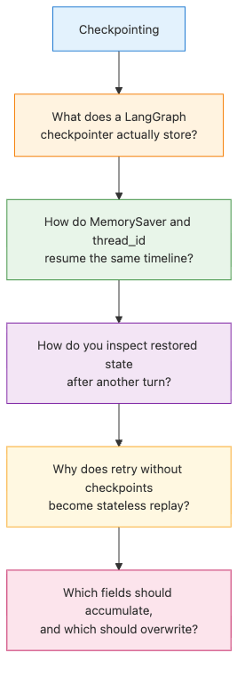
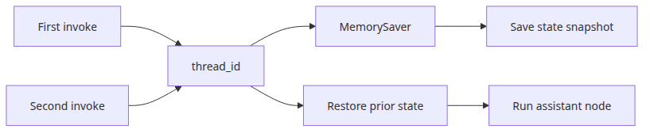
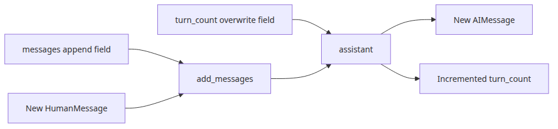
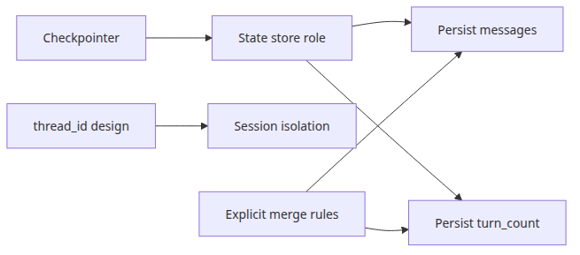
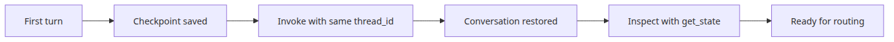

# State management and checkpoints

## Questions this post answers

- What does a LangGraph checkpointer actually store?
- How do `MemorySaver` and `thread_id` let a graph resume later?
- How do you inspect the restored state after another turn?

> A checkpointer snapshots graph state so the next invocation can continue from the same conversation timeline instead of starting from zero.

Example code: [github.com/yeongseon-books/langgraph-101](https://github.com/yeongseon-books/langgraph-101/tree/main/en/02-state-and-checkpoints)

As soon as an agent becomes conversational, single-shot execution stops being enough. You need to save state between turns, reload it with the same session key, and verify what the graph actually kept. In LangGraph, that job belongs to the checkpointer.


## Minimal runnable example


```python
from typing import Annotated

from langchain_core.messages import AIMessage, BaseMessage, HumanMessage
from langgraph.checkpoint.memory import MemorySaver
from langgraph.graph import END, START, StateGraph
from langgraph.graph.message import add_messages
from typing_extensions import TypedDict

class ChatState(TypedDict):
    messages: Annotated[list[BaseMessage], add_messages]
    turn_count: int

def assistant(state: ChatState) -> ChatState:
    human_messages = [msg.content for msg in state["messages"] if isinstance(msg, HumanMessage)]
    latest = human_messages[-1]
    remembered = human_messages[:-1]
    memory_line = "No earlier user turns saved yet."
    if remembered:
        memory_line = f"Earlier user turns: {', '.join(remembered)}"
    reply = AIMessage(
        content=(
            f"Turn {state.get('turn_count', 0) + 1}. "
            f"Latest user message: {latest}. {memory_line}"
        )
    )
    return {"messages": [reply], "turn_count": state.get("turn_count", 0) + 1}

def build_graph():
    graph = StateGraph(ChatState)
    graph.add_node("assistant", assistant)
    graph.add_edge(START, "assistant")
    graph.add_edge("assistant", END)
    return graph.compile(checkpointer=MemorySaver())

if __name__ == "__main__":
    app = build_graph()
    config = {"configurable": {"thread_id": "memory-demo"}}

    first = app.invoke(
        {"messages": [HumanMessage(content="My project is about LangGraph.")], "turn_count": 0},
        config=config,
    )
    print("First reply:")
    print(first["messages"][-1].content)

    second = app.invoke(
        {"messages": [HumanMessage(content="What did I say my project was about?")]},
        config=config,
    )
    print("\nSecond reply after resume:")
    print(second["messages"][-1].content)

    snapshot = app.get_state(config)
    print(f"\nSaved message count: {len(snapshot.values['messages'])}")
    print(f"Saved turn count: {snapshot.values['turn_count']}")
```

Runnable file: `/root/Github/langgraph-101/en/02-state-and-checkpoints/main.py`

## What to notice in this code


- `add_messages` appends new messages instead of overwriting history.
- `graph.compile(checkpointer=MemorySaver())` attaches persistence in one place.
- The second `invoke()` sends only the new message, but the same `thread_id` restores prior state automatically.

## Where engineers get confused


- A checkpointer is not “memory magic.” It is a state store that makes memory-like behavior possible.
- A weak `thread_id` strategy can mix sessions from different users.
- Persistence does not mean every field merges the way you want. Accumulating fields must be modeled explicitly.

## Checklist

- [ ] Do you have a clear `thread_id` rule for session identity
- [ ] Did you separate append-only fields from overwrite fields
- [ ] Did you verify saved values with `get_state()` after another turn

## Summary


Once you add a checkpointer, a graph stops being a one-off function call and becomes a resumable conversation system. In the next post, we use saved state to decide which node should run next with conditional edges.

<!-- toc:begin -->
## In this series

- [LangGraph introduction and graph basics](./01-graph-basics.md)
- **State management and checkpoints (current)**
- Conditional edges and branching (upcoming)
- Tool-calling agents (upcoming)
- Multi-agent systems (upcoming)
- Completing LangGraph (upcoming)

<!-- toc:end -->

---

## References

- [LangGraph persistence guide](https://langchain-ai.github.io/langgraph/how-tos/persistence/)
- [MemorySaver reference](https://langchain-ai.github.io/langgraph/reference/checkpoints/)
- [Working with messages in graph state](https://langchain-ai.github.io/langgraph/concepts/low_level/#working-with-messages-in-graph-state)

Tags: LangGraph, Agent, Python, LLM
