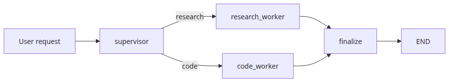
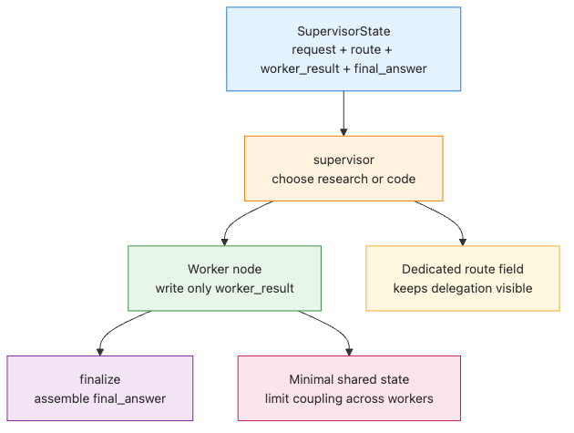
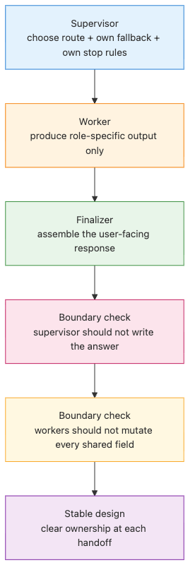
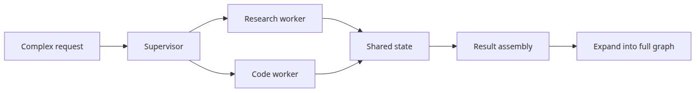

# Multi-agent systems

## Questions this post answers

- How do you express the supervisor-worker pattern in LangGraph?
- What should a supervisor node decide before handing work to a worker?
- How much shared state should multiple agents actually share?

> A multi-agent graph is not just “more LLM calls.” It is a delegation structure where roles, handoffs, and state boundaries stay explicit.

Example code: [github.com/yeongseon-books/langgraph-101](https://github.com/yeongseon-books/langgraph-101/tree/main/en/05-multi-agent)

If you push every task into one giant agent, prompts grow, roles blur, and behavior becomes harder to debug. A supervisor-worker graph fixes that by separating routing, execution, and final assembly into named nodes.


## Minimal runnable example


```python
import os
from typing import Literal, TypedDict

from langchain_core.messages import HumanMessage, SystemMessage
from langchain_groq import ChatGroq
from langgraph.graph import END, START, StateGraph

class SupervisorState(TypedDict):
    request: str
    route: str
    worker_result: str
    final_answer: str

def llm() -> ChatGroq:
    return ChatGroq(model="llama-3.1-8b-instant", temperature=0.0, api_key=os.environ["GROQ_API_KEY"])

def supervisor(state: SupervisorState) -> SupervisorState:
    request_lower = state["request"].lower()
    if any(keyword in request_lower for keyword in ("code", "python", "function", "implement", "write")):
        return {"route": "code"}
    if any(keyword in request_lower for keyword in ("what", "why", "explain", "concept")):
        return {"route": "research"}

    response = llm().invoke(
        [
            SystemMessage(content="Classify the request as research or code. Return only one label: research or code."),
            HumanMessage(content=state["request"]),
        ]
    )
    route = response.content.strip().lower()
    if route not in {"research", "code"}:
        route = "research"
    return {"route": route}

def route_to_worker(state: SupervisorState) -> Literal["research_worker", "code_worker"]:
    return "code_worker" if state["route"] == "code" else "research_worker"

def research_worker(state: SupervisorState) -> SupervisorState:
    response = llm().invoke(
        [
            SystemMessage(content="You are a research worker for the LangGraph framework in the LangChain ecosystem. Explain concepts with crisp bullet points and practical engineering language."),
            HumanMessage(content=state["request"]),
        ]
    )
    return {"worker_result": response.content}

def code_worker(state: SupervisorState) -> SupervisorState:
    response = llm().invoke(
        [
            SystemMessage(content="You are a coding worker for LangGraph tutorials. Produce short Python-focused answers with one small example."),
            HumanMessage(content=state["request"]),
        ]
    )
    return {"worker_result": response.content}

def finalize(state: SupervisorState) -> SupervisorState:
    final_answer = (
        f"Supervisor route: {state['route']}\n"
        f"Worker output:\n{state['worker_result']}"
    )
    return {"final_answer": final_answer}

def build_graph():
    graph = StateGraph(SupervisorState)
    graph.add_node("supervisor", supervisor)
    graph.add_node("research_worker", research_worker)
    graph.add_node("code_worker", code_worker)
    graph.add_node("finalize", finalize)

    graph.add_edge(START, "supervisor")
    graph.add_conditional_edges(
        "supervisor",
        route_to_worker,
        {"research_worker": "research_worker", "code_worker": "code_worker"},
    )
    graph.add_edge("research_worker", "finalize")
    graph.add_edge("code_worker", "finalize")
    graph.add_edge("finalize", END)
    return graph.compile()
```

Runnable file: `/root/Github/langgraph-101/en/05-multi-agent/main.py`

Run it with:

```bash
export GROQ_API_KEY=... && python main.py
```

## What to notice in this code


- The supervisor decides the route but does not try to answer the request itself.
- Workers write to dedicated shared fields like `worker_result`.
- `finalize` keeps answer assembly in one place, which makes future expansion easier.

## Where engineers get confused


- “Multi-agent” does not automatically mean “better.” Weak role boundaries often produce worse results than one well-designed agent.
- If the supervisor also does the substantive work, you are drifting back toward a monolith.
- Oversharing state increases coupling. Most workers need a small, explicit contract instead.

## Checklist

- [ ] Can you explain the supervisor and worker responsibilities in one sentence each
- [ ] Are worker outputs stored in clearly named fields
- [ ] Is there a dedicated final assembly node for debugging and extension

## Summary


The heart of multi-agent design is delegation, not model count. In the final post, we combine checkpoints, routing, and tool loops into one complete LangGraph agent skeleton.

<!-- toc:begin -->
## In this series

- [LangGraph introduction and graph basics](./01-graph-basics.md)
- [State management and checkpoints](./02-state-and-checkpoints.md)
- [Conditional edges and branching](./03-conditional-edges.md)
- [Tool-calling agents](./04-tool-calling-agent.md)
- **Multi-agent systems (current)**
- Completing LangGraph (upcoming)

<!-- toc:end -->

---

## References

- [LangGraph multi-agent concepts](https://langchain-ai.github.io/langgraph/concepts/multi_agent/)
- [LangGraph supervisor tutorial](https://langchain-ai.github.io/langgraph/tutorials/multi_agent/agent_supervisor/)
- [LangGraph multi-agent network guide](https://langchain-ai.github.io/langgraph/how-tos/multi-agent-network/)

Tags: LangGraph, Agent, Python, LLM
