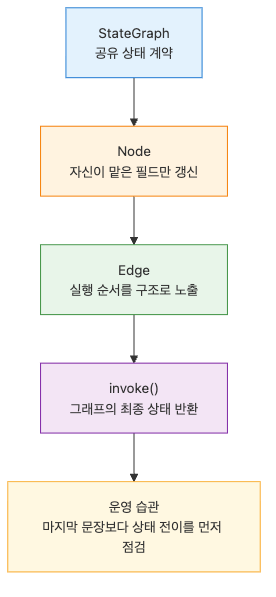

# LangGraph 소개와 그래프 기초

## 이 글에서 다룰 문제

- LangGraph에서 `StateGraph`는 정확히 무엇을 정의할까요?
- 노드와 엣지를 어떻게 연결해야 흐름이 읽히는 그래프가 될까요?
- `invoke()`를 호출하면 상태는 어떤 순서로 바뀌고 무엇이 최종 결과로 남을까요?

> StateGraph는 노드 함수와 전이 규칙을 하나의 공유 상태 위에 올려서, 실행 가능한 워크플로로 바꿔 주는 설계도입니다.

예제 코드: [github.com/yeongseon-books/langgraph-101](https://github.com/yeongseon-books/langgraph-101/tree/main/en/01-graph-basics)

LangGraph를 처음 볼 때 가장 먼저 바꿔야 하는 관점은 이것입니다. LangGraph는 체인 몇 개를 이어 붙인 도구가 아니라, 상태가 이름 붙은 단계들을 따라 이동하는 그래프입니다. 이 글에서는 가장 작은 예제를 통해 노드 등록, 엣지 연결, `invoke()` 실행을 한 번에 살펴보겠습니다.


이 글에서 답할 질문

## 최소 실행 예제


START에서 END로 이어지는 기본 그래프 흐름

```python
from typing import TypedDict

from langgraph.graph import END, START, StateGraph

class ArticleState(TypedDict):
    user_request: str
    topic: str
    outline: list[str]
    answer: str

def choose_topic(state: ArticleState) -> ArticleState:
    request = state["user_request"].lower()
    if "checkpoint" in request:
        topic = "checkpoints"
    elif "tool" in request:
        topic = "tool calling"
    else:
        topic = "graph basics"
    return {"topic": topic}

def build_outline(state: ArticleState) -> ArticleState:
    outline = [
        f"Define {state['topic']}",
        "Show the nodes in the graph",
        "Explain how invoke() runs the graph",
    ]
    return {"outline": outline}

def write_answer(state: ArticleState) -> ArticleState:
    bullet_lines = "\n".join(f"- {item}" for item in state["outline"])
    answer = (
        f"Request: {state['user_request']}\n"
        f"Chosen topic: {state['topic']}\n"
        "Teaching outline:\n"
        f"{bullet_lines}"
    )
    return {"answer": answer}

def build_graph():
    graph = StateGraph(ArticleState)
    graph.add_node("choose_topic", choose_topic)
    graph.add_node("build_outline", build_outline)
    graph.add_node("write_answer", write_answer)

    graph.add_edge(START, "choose_topic")
    graph.add_edge("choose_topic", "build_outline")
    graph.add_edge("build_outline", "write_answer")
    graph.add_edge("write_answer", END)

    return graph.compile()

if __name__ == "__main__":
    app = build_graph()
    result = app.invoke(
        {
            "user_request": "Explain how a LangGraph StateGraph works.",
            "topic": "",
            "outline": [],
            "answer": "",
        }
    )
    print(result["answer"])
```

실행 파일: `/root/Github/langgraph-101/en/01-graph-basics/main.py`

## 이 코드에서 먼저 봐야 할 점


요청이 상태 필드로 매핑되는 구조

- `StateGraph(ArticleState)`는 그래프 전체가 공유할 상태 스키마를 선언합니다.
- 각 노드는 전체 상태를 입력으로 받지만, 자신이 바꾸려는 필드만 반환하면 됩니다.
- `START -> choose_topic -> build_outline -> write_answer -> END`처럼 실행 순서가 코드에 그대로 드러납니다.

여기서 중요한 점은 LangGraph가 함수 호출 순서를 암묵적으로 숨기지 않는다는 사실입니다. 체인 코드에서는 호출 순서를 머릿속으로 따라가야 할 때가 많지만, 그래프에서는 흐름이 구조로 남습니다. 실무에서 디버깅이 쉬워지는 이유도 여기에 있습니다.

## 어디서 자주 헷갈릴까요?


정의에서 invoke까지 이어지는 실행 흐름

- 노드가 상태 전체를 다시 만들어 반환할 필요는 없습니다. 바뀐 필드만 돌려주면 충분합니다.
- `StateGraph`는 단순한 DAG 파이프라인에만 쓰는 도구가 아닙니다. 다음 글들에서 같은 추상화 위에 루프와 분기를 올립니다.
- `invoke()`는 마지막 노드의 출력만 주는 함수가 아니라, 실행이 끝난 뒤의 최종 상태를 반환합니다.

특히 입문 단계에서는 노드를 일반 함수처럼만 생각해서, 마지막 노드가 곧 결과라고 오해하기 쉽습니다. 하지만 LangGraph의 기본 단위는 함수가 아니라 상태 전이입니다. 이 관점을 잡아야 나중에 체크포인트, 멀티턴 대화, 도구 호출 루프를 자연스럽게 이해할 수 있습니다.

## 체크리스트

- [ ] 상태에 다른 노드가 실제로 필요로 하는 필드만 넣었는가
- [ ] 노드 이름만 읽어도 흐름이 빠르게 떠오르는가
- [ ] `START`에서 `END`까지 불필요한 단계 없이 연결했는가

## 정리



상태 스키마와 노드 조립 구조

이 단계에서 익혀야 할 핵심은 그래프를 만드는 문법 자체보다, 워크플로를 눈에 보이는 상태 전이로 바라보는 습관입니다. 다음 글에서는 이 상태를 호출 사이에 유지하기 위해 체크포인트와 `thread_id`를 붙여 보겠습니다.

<!-- toc:begin -->
## 시리즈 목차

- **LangGraph 소개와 그래프 기초 (현재 글)**
- 상태 관리와 체크포인트 (예정)
- 조건부 엣지와 분기 흐름 (예정)
- 도구 호출 에이전트 (예정)
- 멀티 에이전트 시스템 (예정)
- LangGraph 완성 (예정)

<!-- toc:end -->

---

## 참고 자료

- [LangGraph concepts: low level](https://langchain-ai.github.io/langgraph/concepts/low_level/)
- [StateGraph API reference](https://langchain-ai.github.io/langgraph/reference/graphs/)
- [LangGraph introduction tutorial](https://langchain-ai.github.io/langgraph/tutorials/introduction/)

Tags: LangGraph, Agent, Python, LLM
