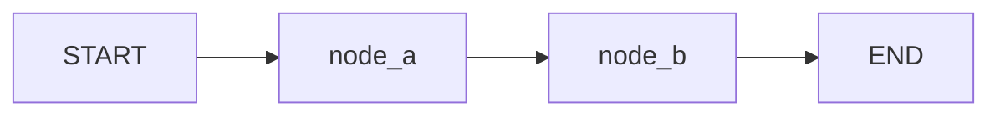

# LangGraph 소개와 그래프 기초

> LangGraph 101 시리즈 (1/6)

## 이 글에서 다룰 문제

*LangChain* 의 *LCEL* 은 *직선 흐름* 에 *강합니다*. *조건 분기* 와 *루프* 가 *섞이면* *코드* 가 *복잡* 해집니다. *LangGraph* 는 *흐름* 을 *데이터* 로 *명시* 합니다.

## 개념 한눈에 보기



## Before/After

**Before**: "`if`, `for` 가 *섞인* *체인 함수* 가 *길어지고* *디버깅* 이 *어려워* *집니다*."

**After**: "*노드* 와 *엣지* 로 *흐름* 이 *그림* 처럼 *드러* *납니다*."

## 실습: 첫 그래프 5단계

### 1단계 — 상태 타입 정의

```python
from typing import TypedDict

class State(TypedDict):
    counter: int
    log: list[str]
```

### 2단계 — 노드 두 개 작성

```python
def increment(state: State) -> dict:
    return {"counter": state["counter"] + 1, "log": ["incremented"]}

def double(state: State) -> dict:
    return {"counter": state["counter"] * 2, "log": ["doubled"]}
```

### 3단계 — 그래프 빌드

```python
from langgraph.graph import StateGraph, START, END

builder = StateGraph(State)
builder.add_node("inc", increment)
builder.add_node("dbl", double)
builder.add_edge(START, "inc")
builder.add_edge("inc", "dbl")
builder.add_edge("dbl", END)
```

### 4단계 — compile

```python
graph = builder.compile()
```

### 5단계 — invoke

```python
result = graph.invoke({"counter": 1, "log": []})
print(result)
# {'counter': 4, 'log': ['doubled']}
```

## 이 코드에서 주목할 점

- *노드* 는 *부분 상태 dict* 만 *반환* 합니다. *나머지 키* 는 *건드리지* *않습니다*.
- *기본 reducer* 는 *덮어* *쓰기* 입니다. *log 리스트* 가 *마지막* *값* 으로 *바뀌는* *이유* 입니다.
- *2편* 에서 *Annotated* 와 *add_messages* 로 *누적 동작* 을 *바꿉니다*.

## 자주 하는 실수 5가지

1. ***START / END 누락*** — *컴파일* 시 *진입점/종점* 오류 가 *납니다*.
2. ***노드 이름 중복*** — *add_node* 가 *조용* 히 *기존 노드* 를 *덮어* *씁니다*.
3. ***전체 상태 반환*** — *부분 상태* 만 *반환* 해도 *충분* 합니다.
4. ***reducer 미지정*** — *list / set* 누적이 *깨집니다* (*2편* 참고).
5. ***compile 누락*** — *builder* 를 *직접* *invoke* 하면 *동작* *안* 합니다.

## 실무에서는 이렇게 쓰입니다

*프로덕션* 에서는 *분기 가 있는 에이전트*, *Human-in-the-loop* 워크플로, *멀티 에이전트* 시스템을 *그래프* 로 *그립니다*. *LangSmith* 가 *각 노드* *입출력* 을 *그대로* *시각화* 합니다.

## 체크리스트

- [ ] *State* TypedDict *정의*.
- [ ] *모든 노드* 가 *부분 상태 dict* *반환*.
- [ ] *START → ... → END* *경로* *완성*.
- [ ] *compile* 후 *invoke*.

## 정리 및 다음 단계

다음 글은 *상태 관리와 체크포인트* 입니다.

<!-- toc:begin -->
## 시리즈 목차

- **LangGraph 소개와 그래프 기초 (현재 글)**
- 상태 관리와 체크포인트 (예정)
- 조건부 엣지와 분기 흐름 (예정)
- 도구 호출 에이전트 (예정)
- 멀티 에이전트 시스템 (예정)
- LangGraph 완성 (예정)

<!-- toc:end -->

## 참고 자료

- [LangGraph quickstart](https://langchain-ai.github.io/langgraph/tutorials/introduction/)
- [StateGraph reference](https://langchain-ai.github.io/langgraph/reference/graphs/)
- [LangGraph concepts](https://langchain-ai.github.io/langgraph/concepts/low_level/)
- [LangGraph GitHub](https://github.com/langchain-ai/langgraph)

Tags: LangGraph, Agent, Python, LLM
