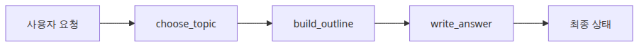
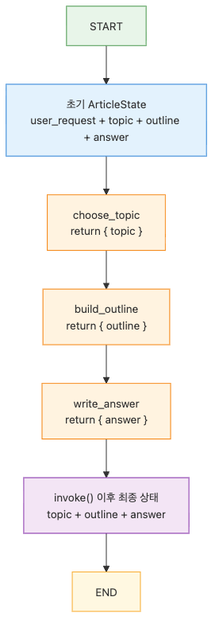
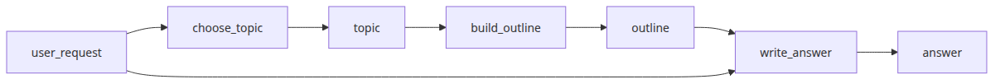
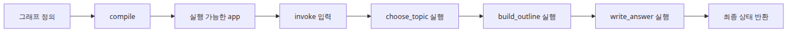

# LangGraph 소개와 그래프 기초

LangChain 스타일의 에이전트를 처음 묶기 시작하면 많은 팀이 비슷한 벽을 만납니다. 프롬프트를 바꾸면 답변은 달라지는데, 왜 달라졌는지는 설명하기 어렵고, 한 단계에서 생긴 문제가 다음 단계의 문장 안으로 숨어 버립니다. 겉으로는 “모델이 좀 불안정하다”는 문제처럼 보이지만, 실제로는 워크플로가 코드 구조에 드러나지 않아서 생기는 경우가 더 많습니다.

이 글은 LangGraph 101 시리즈의 첫 번째 글입니다. 여기서는 LangGraph를 편리한 에이전트 유틸리티가 아니라, 상태가 단계별로 명시적으로 이동하는 그래프 런타임으로 읽는 출발점을 잡습니다.

운영에 들어가면 이 문제는 훨씬 더 선명해집니다. 어떤 요청은 깔끔하게 끝나는데 어떤 요청은 같은 도구를 두 번 호출하고, 어떤 세션은 중간 상태가 남지 않아 재현이 되지 않으며, 어떤 팀은 마지막 답변만 비교하다가 앞단 라우팅 오류를 한참 뒤에야 발견합니다. 현업에서 제가 자주 본 근본 원인은 단순합니다. 워크플로는 분명 존재하는데, 그 워크플로가 구조로 보이지 않는 것입니다.

이 글에서 붙잡아야 할 관점은 분명합니다. **LangGraph는 프롬프트를 영리하게 쓰는 도구라기보다, 상태 전이와 실행 규칙을 숨기지 않게 만드는 구조**입니다.

이 감각이 한 번 잡히면 뒤의 글도 훨씬 쉬워집니다. 체크포인트는 “기억 기능”이 아니라 상태 스냅샷 저장소로 읽히고, 조건부 엣지는 “if 문 대체재”가 아니라 런타임 라우팅 규칙으로 보이기 시작합니다. 도구 호출 루프도 마찬가지입니다. 노드, 엣지, 상태를 분리해서 보는 팀은 실패를 단계별로 추적하고, 긴 체인 하나로만 보는 팀은 마지막 결과 문자열부터 붙잡는 경우가 많습니다.

LangGraph 입문에서 가장 큰 차이는 문법 암기가 아니라 멘탈 모델입니다. `StateGraph`, `add_node()`, `add_edge()`, `invoke()`를 외우는 것만으로는 운영 감각이 생기지 않습니다. 반대로 “상태가 어디서 바뀌고, 왜 다음 단계가 선택됐는가”를 읽는 눈이 생기면, 작은 예제도 곧바로 실무 구조의 축소판으로 보이기 시작합니다.

---

## 이 글에서 다룰 문제

- LangGraph에서 `StateGraph`는 정확히 무엇을 정의할까요?
- 노드와 엣지를 어떻게 연결해야 흐름이 읽히는 그래프가 될까요?
- `invoke()`를 호출하면 상태는 어떤 순서로 바뀌고 무엇이 최종 결과로 남을까요?
- LangChain 체인만으로 시작한 팀이 왜 상태 추적에서 자주 막힐까요?
- 첫 번째 그래프를 만든 뒤 어디를 보면 “이 구조는 나중에도 버틸 수 있겠다”는 판단을 할 수 있을까요?

## 왜 이 글이 중요한가

LangGraph를 배우는 이유를 “그래프 기반 에이전트 프레임워크이기 때문”이라고만 설명하면 감각이 잘 안 옵니다. 더 현실적인 이유는 따로 있습니다. 에이전트가 길어질수록, 그리고 한 번의 답변이 여러 단계 호출을 거칠수록, 팀은 반드시 **흐름을 설명할 수 있는 구조**를 원하게 됩니다.

예를 들어 어떤 요청이 들어와서 주제를 고르고, 개요를 만들고, 최종 답변을 조립하는 흐름이 있다고 해 보겠습니다. 이걸 일반 함수 체인으로만 묶어 두면 실행은 됩니다. 하지만 “왜 이 단계가 먼저 실행됐는가”, “어느 단계가 어떤 필드를 바꿨는가”, “최종 답변이 이상할 때 어디부터 봐야 하는가” 같은 질문에 답하기가 어렵습니다. 현업에서는 이 설명 가능성이 곧 유지보수 비용입니다.

저는 팀들이 이 지점을 과소평가하는 장면을 자주 봤습니다. 초반에는 예제가 짧아서 체인 구조도 충분해 보입니다. 그런데 도구 호출 하나가 붙고, 대화 상태가 생기고, 분기가 들어가는 순간부터 “눈으로 따라가던 구조”가 갑자기 머릿속 퍼즐이 됩니다. LangGraph의 가치는 이 시점에서 드러납니다. 흐름을 런타임이 아니라 **구조 자체로 남겨 두기** 때문입니다.

그래서 이 글의 목표는 단순히 첫 번째 그래프를 실행하는 데 있지 않습니다. LangGraph를 왜 “상태 기계처럼” 읽어야 하는지, 그리고 그 관점이 다음 단계의 체크포인트, 분기, 도구 호출을 왜 쉽게 만드는지 감을 잡는 데 있습니다.

---

## LangGraph를 이해하는 가장 좋은 방법: 명시적 상태 기계 멘탈 모델

LangGraph를 처음 배울 때 가장 도움이 되는 문장은 이것입니다. **LangGraph = 명시적 상태 기계(explicit state machine)** 입니다. 저는 이 표현이 가장 실용적이라고 생각합니다. 노드는 상태를 읽고 일부를 갱신하며, 엣지는 다음 단계로의 이동 규칙을 드러내고, `invoke()`는 그 전이가 끝난 뒤의 최종 상태를 돌려줍니다.

> LangGraph의 핵심은 그래프 모양이 아닙니다. 어떤 상태가 존재하고, 어느 노드가 그 상태를 바꾸며, 어떤 규칙이 다음 단계를 선택하는지가 코드 구조에 드러난다는 점입니다.

많은 입문자가 LangGraph를 “체인 여러 개를 그래프 형태로 그려 놓은 것” 정도로 이해합니다. 틀린 말은 아니지만, 그 설명만으로는 왜 LangGraph가 디버깅에 강한지 설명하기 어렵습니다. 중요한 차이는 호출 개수가 아니라 **상태와 전이가 명시적이라는 점**입니다.

이 관점을 가장 단순하게 정리하면 아래 표처럼 볼 수 있습니다.

| 구성 요소 | LangGraph에서의 역할 | 실무에서 왜 중요한가 |
| --- | --- | --- |
| **State** | 노드들이 공유하는 데이터 계약 | 어떤 단계가 무엇을 읽고 쓰는지 추적할 수 있습니다 |
| **Node** | 상태를 받아 일부 필드를 바꾸는 작업 단위 | 책임 경계를 분리하고 테스트 범위를 줄일 수 있습니다 |
| **Edge** | 다음 노드로 이동하는 규칙 | 실행 순서와 분기 이유를 구조로 남길 수 있습니다 |
| **START / END** | 그래프의 입구와 출구 | 워크플로의 시작점과 종료 조건을 분명히 합니다 |
| **invoke()** | 초기 상태를 넣고 최종 상태를 받는 실행 진입점 | 마지막 답변이 아니라 전체 실행 결과를 검증하게 만듭니다 |

이 표가 중요한 이유는 단순한 용어 정리가 아니기 때문입니다. 운영하면서 에이전트가 흔들릴 때 실제 질문은 늘 비슷합니다. “어느 노드가 `topic`을 잘못 골랐지?”, “왜 여기서 종료 안 하고 다음 단계로 갔지?”, “최종 답변이 이상한데 상태는 언제부터 틀어졌지?” 이 질문들은 결국 Node, Edge, State 셋을 분리해서 볼 수 있어야 빠르게 답이 나옵니다.

현업에서 저는 여기서 두 부류를 자주 봅니다. 한 부류는 마지막 출력 문자열만 비교합니다. 다른 부류는 상태 필드와 전이 순서를 같이 읽습니다. 전자는 증상부터 보고, 후자는 원인까지 따라갑니다. LangGraph가 주는 실전 이점은 바로 두 번째 읽기 방식을 구조적으로 돕는 데 있습니다.



*이 글에서 답할 질문*

---

## 최소 실행 예제

가장 작은 예제로 보겠습니다. 사용자의 요청을 받아 주제를 고르고, 그 주제로 개요를 만든 뒤, 마지막에 답변 문자열을 조립하는 그래프입니다. 구조는 단순하지만 LangGraph의 핵심 요소가 모두 들어 있습니다.



*START에서 END로 이어지는 기본 그래프 흐름*

```python
from typing import TypedDict

from langgraph.graph import END, START, StateGraph

class ArticleState(TypedDict):
    user_request: str
    topic: str
    outline: list[str]
    answer: str

def choose_topic(state: ArticleState) -> ArticleState:
    request = state["user_request"].lower()
    if "checkpoint" in request:
        topic = "checkpoints"
    elif "tool" in request:
        topic = "tool calling"
    else:
        topic = "graph basics"
    return {"topic": topic}

def build_outline(state: ArticleState) -> ArticleState:
    outline = [
        f"Define {state['topic']}",
        "Show the nodes in the graph",
        "Explain how invoke() runs the graph",
    ]
    return {"outline": outline}

def write_answer(state: ArticleState) -> ArticleState:
    bullet_lines = "\n".join(f"- {item}" for item in state["outline"])
    answer = (
        f"Request: {state['user_request']}\n"
        f"Chosen topic: {state['topic']}\n"
        "Teaching outline:\n"
        f"{bullet_lines}"
    )
    return {"answer": answer}

def build_graph():
    graph = StateGraph(ArticleState)
    graph.add_node("choose_topic", choose_topic)
    graph.add_node("build_outline", build_outline)
    graph.add_node("write_answer", write_answer)

    graph.add_edge(START, "choose_topic")
    graph.add_edge("choose_topic", "build_outline")
    graph.add_edge("build_outline", "write_answer")
    graph.add_edge("write_answer", END)

    return graph.compile()

if __name__ == "__main__":
    app = build_graph()
    result = app.invoke(
        {
            "user_request": "Explain how a LangGraph StateGraph works.",
            "topic": "",
            "outline": [],
            "answer": "",
        }
    )
    print(result["answer"])
```

이 코드는 문법 데모 이상입니다. 운영 관점에서 보면 세 가지를 동시에 검증하게 해 줍니다. 첫째, 상태 계약이 `ArticleState`에 모여 있어서 어떤 필드가 어디서 채워지는지 바로 읽을 수 있습니다. 둘째, `choose_topic -> build_outline -> write_answer` 순서가 엣지로 고정되어 있어서 호출 흐름이 숨어 있지 않습니다. 셋째, `invoke()` 결과를 보면 마지막 노드 하나의 반환값이 아니라 전체 전이 이후의 상태를 받는다는 사실이 드러납니다.

제가 입문 예제에서 일부러 이런 단순한 구조를 선호하는 이유도 여기에 있습니다. 처음부터 LLM 호출이나 도구 호출을 넣으면 “뭐가 핵심인지”가 흐려집니다. 여기서는 오직 상태 전이만 보이게 만들어 두고, 이후 글에서 메모리와 분기, 도구를 위에 쌓는 편이 훨씬 이해가 빠릅니다.

실행 파일 경로를 남겨 두는 것도 좋지만, 그보다 먼저 기억할 점은 이 코드가 **그래프를 함수 합성 대신 상태 기계로 읽는 첫 연습**이라는 사실입니다. 예제가 작을수록 구조를 눈에 익히기 쉽고, 그 구조를 눈에 익혀야 다음 단계의 복잡성이 견딜 만해집니다.

예제 코드: [github.com/yeongseon-books/langgraph-101](https://github.com/yeongseon-books/langgraph-101/tree/main/en/01-graph-basics)

---

## 실행 결과를 먼저 검증해 보기

위 예제가 정말 `StateGraph`처럼 동작하는지 확인하려면, 마지막 문자열만 보지 말고 최종 상태 전체를 함께 확인하는 편이 좋습니다. 입문 단계에서 이 검증 습관을 들여 두면 이후 체크포인트와 조건부 엣지를 붙였을 때도 어디서부터 봐야 할지 빨리 감이 옵니다.

```python
app = build_graph()
result = app.invoke(
    {
        "user_request": "Explain how a LangGraph StateGraph works.",
        "topic": "",
        "outline": [],
        "answer": "",
    }
)

assert result["topic"] == "graph basics"
assert result["outline"] == [
    "Define graph basics",
    "Show the nodes in the graph",
    "Explain how invoke() runs the graph",
]
assert "Chosen topic: graph basics" in result["answer"]

print(result)
```

**Expected output:**

```text
{
  'user_request': 'Explain how a LangGraph StateGraph works.',
  'topic': 'graph basics',
  'outline': [
    'Define graph basics',
    'Show the nodes in the graph',
    'Explain how invoke() runs the graph'
  ],
  'answer': 'Request: Explain how a LangGraph StateGraph works.\n...'
}
```

이 검증이 중요한 이유는 `invoke()`가 마지막 노드의 부분 반환값만 주는 함수처럼 읽히지 않게 만들기 때문입니다. `topic`, `outline`, `answer`가 모두 함께 남아 있음을 눈으로 확인하면, 그래프를 “최종 문장 생성기”가 아니라 “중간 상태가 보이는 워크플로”로 읽기 쉬워집니다.

---

## 실패가 시작되는 지점을 어떻게 좁힐까

그래프 기초 단계에서 가장 자주 만나는 실패는 복잡한 오류가 아니라 구조를 잘못 읽는 데서 시작합니다. 아래 세 가지는 작은 예제에서도 바로 재현됩니다.

1. **입력 초기값을 비워 두지 않기**  
   `topic`, `outline`, `answer`를 초기화하지 않고 넘기면 노드가 기대하는 상태 계약이 흐려집니다. TypedDict가 계약을 보여 주더라도, 호출부가 그 계약을 지키지 않으면 디버깅이 어려워집니다.

2. **마지막 문자열만 비교하지 않기**  
   `answer`만 보면 `write_answer()`를 먼저 의심하기 쉽습니다. 하지만 실제 원인은 `choose_topic()`에서 잘못된 route를 골랐거나 `build_outline()`이 비어 있는 리스트를 만들었기 때문일 수 있습니다.

3. **노드 책임을 넓히지 않기**  
   `choose_topic()`가 outline까지 만들고, `build_outline()`가 answer 일부까지 조립하기 시작하면 노드 이름이 책임을 설명하지 못합니다. 이때부터 그래프는 보이는데 흐름은 설명되지 않는 상태가 됩니다.

제가 실무에서 먼저 하는 점검도 비슷합니다. `StateGraph` 정의를 보고, 각 노드가 바꾸는 필드를 보고, 마지막에 `invoke()` 결과에서 필드별 상태를 따로 확인합니다. 이 순서만 지켜도 “모델이 흔들린다”는 막연한 진단이 “어느 노드가 어느 필드를 잘못 갱신했다”는 구체적인 진단으로 바뀌기 쉽습니다.

---

## 이 코드에서 먼저 봐야 할 점

코드 전체를 한 번에 읽기보다, 처음에는 아래 세 지점만 잡는 편이 좋습니다.



*요청이 상태 필드로 매핑되는 구조*

- `StateGraph(ArticleState)`는 그래프 전체가 공유할 상태 스키마를 선언합니다.
- 각 노드는 전체 상태를 입력으로 받지만, 자신이 바꾸려는 필드만 반환하면 됩니다.
- `START -> choose_topic -> build_outline -> write_answer -> END`처럼 실행 순서가 코드에 그대로 드러납니다.

첫 번째 포인트는 `ArticleState`입니다. 이 타입 하나만 봐도 그래프가 어떤 데이터를 주고받는지 감이 옵니다. 저는 현업에서 상태 정의가 분산돼 있을수록 디버깅 비용이 빨리 올라가는 걸 자주 봤습니다. 반대로 상태 계약이 한곳에 모여 있으면 “이 필드는 누가 채우지?” 같은 질문이 훨씬 빨리 정리됩니다.

두 번째 포인트는 노드의 반환 방식입니다. LangGraph 노드는 전체 상태를 매번 재조립할 필요가 없습니다. 자신이 바꾸는 필드만 돌려주면 됩니다. 이 규칙을 이해하면 노드 책임이 줄어들고, 어떤 업데이트가 어디서 일어났는지도 선명해집니다.

세 번째 포인트는 엣지입니다. 체인 코드에서는 실행 순서를 머릿속으로 따라가야 할 때가 많습니다. 하지만 그래프에서는 그 순서가 코드 구조에 박혀 있습니다. 운영하면서 “왜 이 단계가 먼저 돌았지?”를 따질 수 있다는 건, 단순히 예쁘게 그릴 수 있다는 의미보다 훨씬 큽니다.

---

## 어디서 자주 헷갈릴까요?

입문 단계에서 가장 많이 생기는 오해는 문법보다 멘탈 모델에서 나옵니다. 아래 세 가지는 특히 자주 나옵니다.



*정의에서 invoke까지 이어지는 실행 흐름*

- 노드가 상태 전체를 다시 만들어 반환할 필요는 없습니다. 바뀐 필드만 돌려주면 충분합니다.
- `StateGraph`는 단순한 DAG 파이프라인에만 쓰는 도구가 아닙니다. 같은 추상화 위에 루프와 분기를 올릴 수 있습니다.
- `invoke()`는 마지막 노드의 출력만 주는 함수가 아니라, 실행이 끝난 뒤의 최종 상태를 반환합니다.

LangGraph를 처음 붙인 팀에서 저는 정말 비슷한 장면을 여러 번 봤습니다. 그래프는 분명 `START -> choose_topic -> build_outline -> write_answer -> END`처럼 단순한데, 결과가 이상해지면 다들 마지막 노드부터 고칩니다. “답변 문자열이 이상하네. 그럼 `write_answer()`가 문제겠지”라고 들어가지만, 실제 원인은 앞 단계에서 `topic`이 잘못 골라졌거나 `outline`이 기대와 다르게 누락된 경우가 많습니다.

여기서 첫 번째 안티패턴은 **Implicit State 안티패턴**입니다. 상태가 어디서 어떻게 바뀌는지 명확히 읽지 않고, 마지막 출력만 보고 수정하는 방식입니다. 이 안티패턴에 빠지면 문제는 앞에서 생겼는데 수리는 뒤에서 하게 됩니다. 그 결과 디버깅 시간이 길어지고, 임시 패치가 쌓이며, 다음 분기나 체크포인트를 붙일 때 구조가 더 빨리 무너집니다.

두 번째 안티패턴은 **Full Rewrite State 안티패턴**입니다. 노드가 안전하려면 상태 전체를 항상 다시 만들어야 한다고 믿는 경우입니다. 그래서 작은 업데이트 하나를 위해 모든 필드를 매번 재조립하고, 그 과정에서 기존 값을 빈 문자열로 덮어쓰거나 의도치 않게 초기화해 버립니다. 겉으로는 명시적이라 안전해 보이지만, 실제로는 변경 범위를 불필요하게 넓히는 방식입니다.

운영 관점에서 더 중요한 건 마지막 오해입니다. `invoke()`를 “마지막 함수의 출력”으로 이해하면, 중간 상태 검증이 사라집니다. 반대로 “최종 상태 스냅샷”으로 이해하면 `topic`, `outline`, `answer`를 각각 검사할 수 있습니다. 이 차이가 나중에 체크포인트, 멀티턴 대화, 도구 호출 루프를 붙일 때 바로 생산성 차이로 이어집니다.

제가 본 팀들 중 빨리 안정되는 팀은 결과 문장보다 상태 전이를 먼저 읽었습니다. LangGraph의 장점은 흐름이 숨지 않는 데 있습니다. 그 장점을 살리려면, 마지막 답변을 보기 전에 “각 노드가 어떤 필드를 바꿨는가”를 순서대로 확인하는 습관을 먼저 들이는 편이 좋습니다.

---

## 첫 번째 운영 체크리스트

그래프가 작을 때부터 아래 항목을 확인해 두면, 다음 글에서 체크포인트와 분기를 붙일 때 훨씬 덜 흔들립니다.

- [ ] 상태에 다른 노드가 실제로 필요로 하는 필드만 넣었는가
- [ ] 노드 이름만 읽어도 흐름이 빠르게 떠오르는가
- [ ] 각 노드가 바꾸는 필드가 명확하게 제한되어 있는가
- [ ] `START`에서 `END`까지 불필요한 단계 없이 연결했는가
- [ ] 최종 답변이 이상할 때 어떤 상태 필드부터 확인할지 팀이 합의했는가

이 체크리스트의 핵심은 “작동하느냐”보다 “설명 가능하냐”입니다. 그래프 입문 단계에서는 둘 다 중요하지만, 장기적으로 더 비싼 것은 대개 설명 불가능한 구조입니다.

---

## 실무에서는 이렇게 생각한다

입문 글에서 너무 이른 이야기처럼 들릴 수 있지만, 저는 첫 번째 그래프를 만들 때부터 운영 질문을 같이 붙여 보는 편이 좋다고 생각합니다. 예를 들어 이런 질문입니다. “이 노드가 나중에 외부 API 호출로 바뀌면 어디에서 재시도 정책을 붙일까?” “이 상태 필드가 체크포인트에 저장되면 다음 턴에서도 의미가 유지될까?” “이 분기가 나중에 조건부 엣지로 커져도 이름이 그대로 버틸까?”

이 질문을 지금 던지는 이유는 겁을 주려는 게 아닙니다. 오히려 반대입니다. LangGraph의 장점은 나중에 커질 구조를 지금부터 작은 형태로 드러낼 수 있다는 점입니다. 노드, 엣지, 상태를 분리해 생각하는 습관만 잡히면, 이후에 메모리와 라우팅을 붙이는 일은 “새로운 세계”가 아니라 “같은 구조의 확장”으로 느껴집니다.

현업에서 저는 LangGraph를 잘 쓰는 팀일수록 LLM 호출보다 상태 계약을 먼저 리뷰하는 걸 자주 봤습니다. 이유는 단순합니다. 모델은 바꿀 수 있어도, 흐름이 숨어 있는 구조는 바꾸기 어렵기 때문입니다. 첫 번째 글에서 꼭 가져가야 할 운영 감각도 여기 있습니다. **LangGraph의 기본 단위는 답변 생성이 아니라 상태 전이 설계**라는 점입니다.

---

## 정리: LangGraph는 체인 조립기가 아니라, 상태 전이를 드러내는 런타임이다

LangGraph를 처음 보면 `add_node()`와 `add_edge()` 같은 API가 먼저 눈에 들어옵니다. 그건 자연스러운 반응입니다. 하지만 운영을 오래 할수록 진짜 중요한 건 API 이름보다 **무엇이 상태로 남고, 어떤 규칙으로 다음 단계가 선택되는가**입니다.

이 글에서 가장 먼저 가져가야 할 핵심은 세 가지입니다. 첫째, `StateGraph`는 함수 묶음이 아니라 공유 상태 계약 위에 실행 규칙을 올리는 구조입니다. 둘째, 노드는 상태 전체를 다시 쓰는 곳이 아니라 자신이 책임지는 필드만 갱신하는 작업 단위입니다. 셋째, `invoke()`는 마지막 함수의 반환값이 아니라 전체 실행 뒤의 최종 상태를 돌려줍니다.

이 관점이 중요한 이유는 다음 단계의 모든 주제가 여기서 이어지기 때문입니다. 체크포인트는 이 상태를 호출 사이에 저장하는 방법이고, 조건부 엣지는 이 상태를 보고 다음 노드를 고르는 방법이며, 도구 호출 루프는 상태와 전이가 반복되는 구조입니다. 첫 번째 글에서 상태 기계 관점을 못 잡으면 나중 주제들이 모두 “기능 추가”처럼 보입니다. 반대로 지금 이 관점을 잡으면 이후 글들은 같은 모델의 확장으로 읽힙니다.

저는 입문 글의 성공 기준을 “코드가 한 번 돌아갔다”로 잡지 않습니다. 그보다 중요한 건 이 코드를 본 뒤, 누군가가 그래프를 설명할 수 있느냐입니다. 어떤 상태가 있고, 어느 노드가 바꾸고, 왜 그 순서로 흘러가며, 결과가 이상할 때 어디부터 보면 되는지 말할 수 있다면 출발은 제대로 잡힌 셈입니다.

다음 글에서는 이 상태를 호출 사이에 유지하기 위해 체크포인트와 `thread_id`를 붙여 보겠습니다. 여기서 만든 최소 그래프가 왜 좋은 출발점이었는지, 그때 더 분명하게 드러날 것입니다.

---

## 운영 체크리스트

- [ ] 상태 스키마를 한눈에 읽을 수 있게 유지했다
- [ ] 각 노드의 책임을 한 문장으로 설명할 수 있다
- [ ] 마지막 답변이 아니라 중간 상태 필드를 검증하는 습관을 팀 규칙으로 정했다
- [ ] 앞으로 체크포인트에 저장돼도 무리가 없는 필드 구조인지 검토했다
- [ ] 분기와 루프가 생겨도 버틸 수 있는 노드 이름과 엣지 구조를 사용했다

<!-- toc:begin -->
## 시리즈 목차

- **LangGraph 소개와 그래프 기초 (현재 글)**
- 상태 관리와 체크포인트 (예정)
- 조건부 엣지와 분기 흐름 (예정)
- 도구 호출 에이전트 (예정)
- 멀티 에이전트 시스템 (예정)
- LangGraph 완성 (예정)

<!-- toc:end -->

---

## 참고 자료

### 공식 문서
- [LangGraph concepts: low level](https://langchain-ai.github.io/langgraph/concepts/low_level/)
- [StateGraph API reference](https://langchain-ai.github.io/langgraph/reference/graphs/)
- [LangGraph introduction tutorial](https://langchain-ai.github.io/langgraph/tutorials/introduction/)

### 소스 코드와 예제
- [langchain-ai/langgraph GitHub repository](https://github.com/langchain-ai/langgraph)
- [LangGraph quickstart](https://langchain-ai.github.io/langgraph/tutorials/get-started/1-build-basic-chatbot/)

### 관련 시리즈
- [LangChain 101](../../langchain-101/ko/01-lcel-runnable-basics.md) — LangGraph가 노드 안에서 호출하는 Runnable과 LCEL을 다룹니다. 그래프가 아니라 그래프의 한 노드에서 무엇이 실행되는지가 흐릿하면 이 시리즈로 한 단계 내려가 읽기를 권장합니다.
- [AI Agent 101](../../ai-agent-101/ko/)

---

Tags: LangGraph, Agent, Python, LLM
