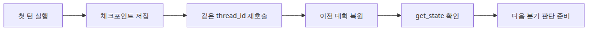

# 상태 관리와 체크포인트

## 이 글에서 답할 질문

- LangGraph 체크포인터는 무엇을 저장할까요?
- `MemorySaver`와 `thread_id`를 쓰면 그래프를 어떻게 이어서 실행할까요?
- 재개된 그래프에서 현재 상태를 어떻게 확인할 수 있을까요?

> 체크포인터는 노드 실행 결과를 스냅샷으로 저장해 다음 호출이 같은 상태 흐름 위에서 다시 시작되게 해줍니다.

예제 코드: [github.com/yeongseon-books/langgraph-101](https://github.com/yeongseon-books/langgraph-101/tree/main/ko/02-state-and-checkpoints)

에이전트를 서비스로 만들기 시작하면 "이번 호출만 잘 끝나면 된다"는 가정이 바로 깨집니다. 사용자와 두 번째, 세 번째 턴을 이어 가려면 상태를 저장하고 같은 세션으로 다시 불러와야 합니다. LangGraph에서는 체크포인터가 이 역할을 맡습니다.


## 최소 실행 예제


```python
from typing import Annotated

from langchain_core.messages import AIMessage, BaseMessage, HumanMessage
from langgraph.checkpoint.memory import MemorySaver
from langgraph.graph import END, START, StateGraph
from langgraph.graph.message import add_messages
from typing_extensions import TypedDict

class ChatState(TypedDict):
    messages: Annotated[list[BaseMessage], add_messages]
    turn_count: int

def assistant(state: ChatState) -> ChatState:
    human_messages = [msg.content for msg in state["messages"] if isinstance(msg, HumanMessage)]
    latest = human_messages[-1]
    remembered = human_messages[:-1]
    memory_line = "No earlier user turns saved yet."
    if remembered:
        memory_line = f"Earlier user turns: {', '.join(remembered)}"
    reply = AIMessage(
        content=(
            f"Turn {state.get('turn_count', 0) + 1}. "
            f"Latest user message: {latest}. {memory_line}"
        )
    )
    return {"messages": [reply], "turn_count": state.get("turn_count", 0) + 1}

def build_graph():
    graph = StateGraph(ChatState)
    graph.add_node("assistant", assistant)
    graph.add_edge(START, "assistant")
    graph.add_edge("assistant", END)
    return graph.compile(checkpointer=MemorySaver())

if __name__ == "__main__":
    app = build_graph()
    config = {"configurable": {"thread_id": "memory-demo"}}

    first = app.invoke(
        {"messages": [HumanMessage(content="My project is about LangGraph.")], "turn_count": 0},
        config=config,
    )
    print("First reply:")
    print(first["messages"][-1].content)

    second = app.invoke(
        {"messages": [HumanMessage(content="What did I say my project was about?")]},
        config=config,
    )
    print("\nSecond reply after resume:")
    print(second["messages"][-1].content)

    snapshot = app.get_state(config)
    print(f"\nSaved message count: {len(snapshot.values['messages'])}")
    print(f"Saved turn count: {snapshot.values['turn_count']}")
```

실행 파일: `/root/Github/langgraph-101/ko/02-state-and-checkpoints/main.py`

## 이 코드에서 봐야 할 것


- `add_messages`는 새 메시지를 덮어쓰지 않고 누적합니다.
- `graph.compile(checkpointer=MemorySaver())` 한 줄로 저장과 복원 동작이 붙습니다.
- 두 번째 `invoke()`에서 전체 히스토리를 다시 넘기지 않아도 같은 `thread_id`면 이전 상태가 복원됩니다.

## 실무에서 헷갈리는 지점


- 체크포인터는 "메모리 기능"이 아니라 "상태 저장소"입니다. 기억처럼 보이는 것은 저장된 상태를 다시 읽기 때문입니다.
- `thread_id`를 잘못 설계하면 서로 다른 사용자의 상태가 섞일 수 있습니다.
- 체크포인터를 붙였다고 모든 필드가 자동 병합되는 것은 아닙니다. 누적 필드는 `Annotated[..., add_messages]`처럼 명시해야 합니다.

## 체크리스트

- [ ] 세션을 구분할 `thread_id` 규칙이 정해져 있는가
- [ ] 누적 필드와 덮어쓰기 필드를 구분했는가
- [ ] `get_state()`로 저장된 값이 기대대로 남는지 확인했는가

## 정리


체크포인터를 붙이는 순간 LangGraph는 단발성 함수 호출에서 대화형 시스템으로 한 단계 올라갑니다. 다음 글에서는 저장된 상태를 읽어 다음 노드를 바꾸는 조건부 엣지로 넘어갑니다.

<!-- toc:begin -->
## 시리즈 목차

- [LangGraph 소개와 그래프 기초](./01-graph-basics.md)
- **상태 관리와 체크포인트 (현재 글)**
- 조건부 엣지와 분기 흐름 (예정)
- 도구 호출 에이전트 (예정)
- 멀티 에이전트 시스템 (예정)
- LangGraph 완성 (예정)

<!-- toc:end -->

---

## 참고 자료

- [LangGraph persistence 가이드](https://langchain-ai.github.io/langgraph/how-tos/persistence/)
- [MemorySaver 레퍼런스](https://langchain-ai.github.io/langgraph/reference/checkpoints/)
- [MessagesState와 메시지 누적 방식](https://langchain-ai.github.io/langgraph/concepts/low_level/#working-with-messages-in-graph-state)

Tags: LangGraph, Agent, Python, LLM
