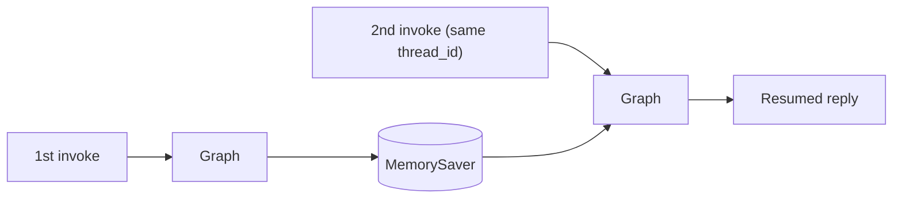

# 상태 관리와 체크포인트

> LangGraph 101 시리즈 (2/6)

## 이 글에서 다룰 문제

*에이전트* 를 *실서비스* 로 *옮기면* *한 턴* 으로 *끝나는* *호출* 은 *없습니다*. *멀티턴* *대화*, *human-in-the-loop*, *재시도* *모두* *상태* 를 *어딘가* 에 *저장* 해야 *합니다*. *LangGraph* 는 *이* *역할* 을 *체크포인터* 로 *분리* 합니다.

## 전체 흐름


## Before/After

**Before**: "*매 호출* 마다 *전체* *대화 히스토리* 를 *직접* *넘겨야* *합니다*."

**After**: "*같은* *thread_id* 만 *주면* *이전* *상태* 가 *자동* 으로 *복원* 됩니다."

## 대화 상태 저장 5단계

### 1단계 — 상태 타입 정의

```python
from typing import Annotated
from typing_extensions import TypedDict
from langchain_core.messages import BaseMessage
from langgraph.graph.message import add_messages

class ChatState(TypedDict):
    messages: Annotated[list[BaseMessage], add_messages]
    turn_count: int
```

### 2단계 — 어시스턴트 노드

```python
from langchain_core.messages import AIMessage, HumanMessage

def assistant(state: ChatState) -> dict:
    user_turns = [m.content for m in state["messages"] if isinstance(m, HumanMessage)]
    latest = user_turns[-1]
    earlier = ", ".join(user_turns[:-1]) or "none"
    reply = AIMessage(
        content=f"Turn {state.get('turn_count', 0) + 1}. Latest: {latest}. Earlier: {earlier}"
    )
    return {"messages": [reply], "turn_count": state.get("turn_count", 0) + 1}
```

### 3단계 — 체크포인터 붙여 컴파일

```python
from langgraph.graph import StateGraph, START, END
from langgraph.checkpoint.memory import MemorySaver

builder = StateGraph(ChatState)
builder.add_node("assistant", assistant)
builder.add_edge(START, "assistant")
builder.add_edge("assistant", END)

app = builder.compile(checkpointer=MemorySaver())
```

### 4단계 — 첫 invoke

```python
config = {"configurable": {"thread_id": "demo-1"}}

first = app.invoke(
    {"messages": [HumanMessage(content="My project is about LangGraph.")], "turn_count": 0},
    config=config,
)
print(first["messages"][-1].content)
```

### 5단계 — 재개 invoke와 스냅샷

```python
second = app.invoke(
    {"messages": [HumanMessage(content="What did I say my project was about?")]},
    config=config,
)
print(second["messages"][-1].content)

snapshot = app.get_state(config)
print(len(snapshot.values["messages"]), snapshot.values["turn_count"])
```

## 이 코드에서 주목할 점

- *두 번째* *invoke* 는 *과거* *메시지* 를 *다시* *넘기지* *않습니다*. *체크포인터* 가 *복원* 합니다.
- *add_messages* 가 *없었다면* *messages* *리스트* 가 *덮어써* *집니다*.
- *config* 의 *thread_id* 가 *세션* *경계* 입니다. *바꾸면* *대화* 가 *완전* 히 *분리* 됩니다.

## 자주 하는 실수 5가지

1. ***Annotated 누락*** — *messages* 가 *매번* *덮어써* *지면서* *대화* 가 *사라* *집니다*.
2. ***thread_id 공유*** — *서로* *다른* *사용자* 의 *상태* 가 *섞입니다*.
3. ***체크포인터 미지정*** — *compile()* 만 *하면* *상태* 가 *세션* *밖* 으로 *나가지* *못합니다*.
4. ***전체 히스토리 재전송*** — *재개* 시 *과거* *메시지* 를 *다시* *넣으면* *중복* 누적 됩니다.
5. ***MemorySaver 프로덕션 사용*** — *프로세스* *종료* 시 *전부* *소실* 됩니다. *DB* *기반* *체크포인터* 로 *교체* 합니다.

## 실무에서는 이렇게 쓰입니다

*프로덕션* 에서는 *MemorySaver* 대신 *PostgresSaver*, *RedisSaver* 같은 *영속* *체크포인터* 를 *씁니다*. *thread_id* 는 *대화 ID*, *세션 ID*, *사용자 ID + 채널* *조합* 등으로 *설계* 합니다.

## 체크리스트

- [ ] *Annotated[..., add_messages]* 적용.
- [ ] *compile(checkpointer=...)* 호출.
- [ ] *config* 에 *thread_id* 전달.
- [ ] *get_state* 로 *스냅샷* 확인.

## 정리 및 다음 단계

다음 글은 *조건부 엣지와 분기 흐름* 입니다.

<!-- toc:begin -->
## 시리즈 목차

- [LangGraph 소개와 그래프 기초](./01-graph-basics.md)
- **상태 관리와 체크포인트 (현재 글)**
- 조건부 엣지와 분기 흐름 (예정)
- 도구 호출 에이전트 (예정)
- 멀티 에이전트 시스템 (예정)
- LangGraph 완성 (예정)

<!-- toc:end -->

## 참고 자료

- [LangGraph persistence](https://langchain-ai.github.io/langgraph/concepts/persistence/)
- [Checkpointer reference](https://langchain-ai.github.io/langgraph/reference/checkpoints/)
- [MessagesState concepts](https://langchain-ai.github.io/langgraph/concepts/low_level/#messagesstate)
- [LangGraph how-tos](https://langchain-ai.github.io/langgraph/how-tos/)

Tags: LangGraph, Agent, Python, LLM
