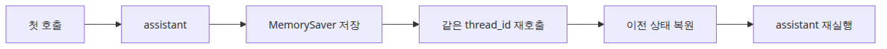
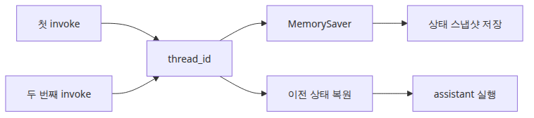
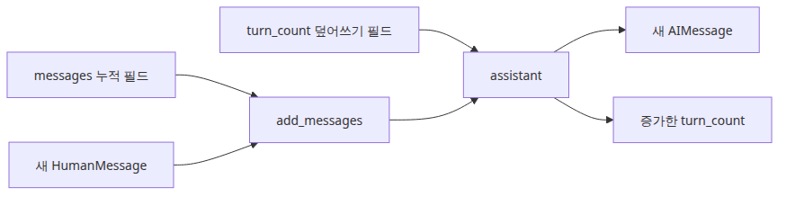
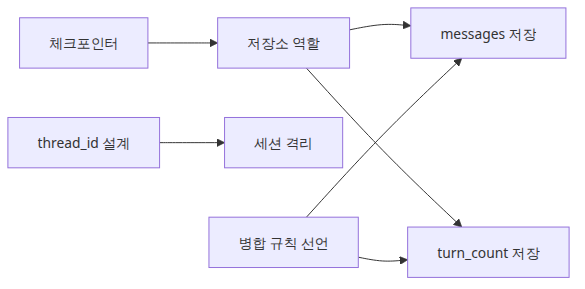

# 상태 관리와 체크포인트

이 글은 LangGraph 101 시리즈의 두 번째 글입니다. 에이전트가 한 번의 요청으로 끝날 때는 상태를 대충 넘겨도 크게 문제가 없을 수 있습니다. 하지만 워크플로가 두 번째 턴까지 살아남아야 하는 순간부터 상황이 완전히 달라집니다. 첫 번째 턴에서 사용자가 무엇을 말했는지, 어떤 도구 결과가 아직 유효한지, 지금이 몇 번째 응답인지가 모두 중요해지기 때문입니다.

운영에서는 이 문제가 더 거칠게 드러납니다. 어떤 세션은 잘 이어지는데 프로세스가 한 번 재시작되자 맥락이 끊기고, 어떤 요청은 부분 실패 뒤 다시 돌렸더니 이미 비용을 낸 작업을 또 수행합니다. 체크포인트가 없는 장기 실행 에이전트는 실패 자체보다도, **실패 뒤에 질서 있게 복구할 수 없다는 점**이 더 위험한 경우가 많습니다.

특히 도구 호출과 멀티턴 대화가 붙기 시작하면 “마지막 사용자 메시지만 다시 보내면 되지 않을까?”라는 순진한 우회로가 얼마나 약한지 금방 드러납니다. 메시지 누적 규칙도 사라지고, turn counter도 사라지고, 요약 상태와 외부 도구 응답도 함께 사라집니다. 겉으로는 재시도처럼 보여도, 실제로는 이전 세션의 옷만 입은 새 실행이 되기 쉽습니다.

여기서는 체크포인트를 “대화를 기억하는 기능”이 아니라, **상태를 저장하고 같은 대화 타임라인 위에서 다시 실행을 잇게 만드는 런타임 계층**으로 이해해 보겠습니다. 핵심은 분명합니다. **State는 그래프의 단일 진실 공급원이고, Checkpoint는 그 진실을 호출 사이에 보존하는 장치**입니다.

이 관점이 잡히면 다음 글도 훨씬 쉬워집니다. 조건부 엣지는 저장된 상태를 보고 다음 경로를 고르는 규칙이 되고, 도구 호출 루프는 같은 상태 타임라인 위에서 반복되는 전이 구조로 읽힙니다. 반대로 상태를 막연한 메모리 비유로만 이해하면, 왜 `thread_id`가 필요한지, 왜 병합 규칙을 필드마다 다르게 설계해야 하는지가 계속 흐릿하게 남습니다.

---

## 이 글에서 다룰 문제

- LangGraph의 체크포인터는 실제로 무엇을 저장할까요?
- `MemorySaver`와 `thread_id`를 쓰면 그래프는 어떻게 이전 대화를 이어 갈까요?
- 다음 턴이 끝난 뒤 복원된 상태를 어떻게 확인할 수 있을까요?
- 체크포인트 없이 retry를 구현하면 운영에서 어떤 종류의 사고가 반복될까요?
- 어떤 필드는 누적하고 어떤 필드는 덮어써야 하는지, 어디서 판단해야 할까요?

## 왜 이 글이 중요한가

체크포인트를 단순히 “대화형 기능을 위한 메모리”로만 이해하면 절반만 본 셈입니다. 더 중요한 이유는 실패 복구와 재현성입니다. 에이전트가 한 턴 안에서 끝나지 않고 다음 호출로 이어지는 순간, 상태 저장은 사용자 경험 문제이기도 하지만 동시에 **운영 안정성 문제**가 됩니다.

예를 들어 첫 번째 호출에서 사용자가 프로젝트 주제를 말했고, 두 번째 호출에서 “아까 내가 뭐라고 했지?”라고 물었다고 해 보겠습니다. 상태가 남아 있지 않다면 답변 품질이 떨어지는 정도로 끝날 수 있습니다. 하지만 실제 프로덕션에서는 여기에 도구 호출, 누적 메시지, 검토 단계, 외부 시스템 부작용이 함께 얽힙니다. 그러면 단순한 맥락 손실이 아니라 중복 실행, 잘못된 회복, 비용 폭증으로 이어질 수 있습니다.

저는 팀들이 checkpoint가 없을 때 자주 같은 실수를 반복하는 걸 봤습니다. 실패한 요청을 복구하려고 마지막 사용자 입력만 다시 보내고, “왜 이번에는 응답이 다르지?”를 뒤늦게 묻습니다. 그런데 그때 이미 빠져 버린 것은 단순한 문장 한 줄이 아닙니다. 이전 턴의 메시지 누적, branch 결정 근거, turn count, 일부 도구 결과까지 함께 사라져 있습니다.

그래서 이 글의 목표는 `MemorySaver` 사용법을 보여 주는 데 있지 않습니다. 더 중요한 목표는 **체크포인트를 붙이는 순간 그래프가 왜 단발 함수 호출에서 이어 실행 가능한 시스템으로 바뀌는지**를 이해하는 데 있습니다.

---

## LangGraph를 이해하는 가장 좋은 방법: State는 단일 진실 공급원, Checkpoint는 그 저장소

체크포인트 주제에서 가장 먼저 잡아야 할 문장은 이것입니다. **State는 그래프의 단일 진실 공급원이고, Checkpoint는 그 진실을 보존하는 저장 계층**입니다. 저는 이 문장이 LangGraph의 영속성 모델을 가장 정확하게 설명한다고 생각합니다.

> State는 그래프의 단일 진실 공급원입니다. 모든 노드는 State를 읽고, 변형하고, 다음 노드로 넘깁니다. Checkpoint는 그 State를 호출 사이에 저장해서, 그래프가 같은 타임라인 위에서 다시 시작되도록 만듭니다.

많은 입문자가 체크포인터를 “메모리를 넣는 옵션” 정도로 이해합니다. 하지만 운영 관점에서는 그보다 더 구체적으로 읽어야 합니다. 체크포인터는 상태 스냅샷을 저장하고, 같은 세션 식별자(`thread_id`)가 들어왔을 때 그 스냅샷을 다시 그래프에 공급합니다. 즉, 기억을 흉내 내는 마법이 아니라 **재개 가능한 실행 컨텍스트**를 만드는 장치입니다.

가장 단순하게 정리하면 아래 표처럼 볼 수 있습니다.

| 구성 요소 | 역할 | 실무에서 왜 중요한가 |
| --- | --- | --- |
| **State** | 현재까지의 메시지, 카운터, 누적 결과 같은 공유 데이터 | 어느 시점에 무엇이 남아 있어야 하는지 검증할 수 있습니다 |
| **Checkpoint** | 특정 시점의 State 스냅샷 | 실패 후 재개와 재현 가능한 디버깅의 출발점이 됩니다 |
| **thread_id** | 같은 대화 타임라인을 식별하는 키 | 서로 다른 사용자 세션이 섞이지 않도록 막습니다 |
| **merge rule** | 새 상태와 저장된 상태를 어떤 방식으로 합칠지 정하는 규칙 | 메시지 누적과 카운터 갱신을 같은 방식으로 다루지 않게 해 줍니다 |
| **get_state()** | 현재 저장된 상태를 직접 확인하는 진단 진입점 | “정말 저장됐는가?”를 코드로 확인할 수 있습니다 |

이 표가 중요한 이유는 운영 질문이 늘 여기서 나오기 때문입니다. 메시지가 왜 사라졌지? 왜 다른 사용자의 세션이 섞였지? 왜 retry 이후 turn count가 이상하지? 왜 같은 질문을 다시 보냈는데 도구 호출 횟수가 달라졌지? 이런 질문들은 모델 품질이 아니라 state, checkpoint, merge rule, session identity 문제인 경우가 많습니다.

현업에서 저는 checkpoint가 붙은 그래프를 볼 때 먼저 세 가지를 봅니다. 상태가 어디까지 저장되는가, 세션 키가 얼마나 안정적인가, 병합 규칙이 필드 특성에 맞는가. 이 세 가지를 먼저 읽으면 “기억이 된다/안 된다” 수준을 넘어, 왜 복구와 재개가 성공하거나 실패하는지를 설명할 수 있습니다.



*이 글에서 답할 질문*

---

## 최소 실행 예제

가장 작은 재개 예제로 보겠습니다. 첫 번째 호출에서 사용자의 메시지를 저장하고, 두 번째 호출에서는 같은 `thread_id`를 사용해 이전 대화 상태를 이어 받습니다. 마지막에는 `get_state()`로 실제 저장값을 직접 확인합니다.



*thread_id를 통한 대화 재개 흐름*

```python
from typing import Annotated

from langchain_core.messages import AIMessage, BaseMessage, HumanMessage
from langgraph.checkpoint.memory import MemorySaver
from langgraph.graph import END, START, StateGraph
from langgraph.graph.message import add_messages
from typing_extensions import TypedDict

class ChatState(TypedDict):
    messages: Annotated[list[BaseMessage], add_messages]
    turn_count: int

def assistant(state: ChatState) -> ChatState:
    human_messages = [msg.content for msg in state["messages"] if isinstance(msg, HumanMessage)]
    latest = human_messages[-1]
    remembered = human_messages[:-1]
    memory_line = "No earlier user turns saved yet."
    if remembered:
        memory_line = f"Earlier user turns: {', '.join(remembered)}"
    reply = AIMessage(
        content=(
            f"Turn {state.get('turn_count', 0) + 1}. "
            f"Latest user message: {latest}. {memory_line}"
        )
    )
    return {"messages": [reply], "turn_count": state.get("turn_count", 0) + 1}

def build_graph():
    graph = StateGraph(ChatState)
    graph.add_node("assistant", assistant)
    graph.add_edge(START, "assistant")
    graph.add_edge("assistant", END)
    return graph.compile(checkpointer=MemorySaver())

if __name__ == "__main__":
    app = build_graph()
    config = {"configurable": {"thread_id": "memory-demo"}}

    first = app.invoke(
        {"messages": [HumanMessage(content="My project is about LangGraph.")], "turn_count": 0},
        config=config,
    )
    print("First reply:")
    print(first["messages"][-1].content)

    second = app.invoke(
        {"messages": [HumanMessage(content="What did I say my project was about?")]},
        config=config,
    )
    print("\nSecond reply after resume:")
    print(second["messages"][-1].content)

    snapshot = app.get_state(config)
    print(f"\nSaved message count: {len(snapshot.values['messages'])}")
    print(f"Saved turn count: {snapshot.values['turn_count']}")
```

이 예제는 단순하지만 운영에서 중요한 것을 세 가지 보여 줍니다. 첫째, `compile(checkpointer=MemorySaver())` 한 줄로 영속성 계층이 그래프 바깥이 아니라 그래프 구조 안에 붙습니다. 둘째, 두 번째 `invoke()`가 새 메시지만 받아도 같은 `thread_id` 덕분에 이전 상태를 이어서 실행할 수 있습니다. 셋째, `get_state()`를 통해 “정말 저장됐는가?”를 사람이 추측이 아니라 데이터로 확인할 수 있습니다.

제가 이런 예제를 좋아하는 이유는 checkpoint를 감성적인 기억 비유 대신, 검증 가능한 저장 계층으로 보게 만들기 때문입니다. 첫 번째 호출과 두 번째 호출 사이에 무엇이 유지되는지, 어떤 값이 누적되고 어떤 값이 갱신되는지, 어디서 세션 경계가 생기는지를 코드로 바로 읽을 수 있습니다.

실행 파일 경로보다 더 중요한 점도 있습니다. 이 코드는 “대화형처럼 보이는 함수 호출”과 “실제로 재개 가능한 시스템”의 차이를 눈앞에 드러냅니다. 그 차이를 이해해야 이후 분기와 tool loop를 붙일 때도 안정적인 복구 전략을 설계할 수 있습니다.

예제 코드: [github.com/yeongseon-books/langgraph-101](https://github.com/yeongseon-books/langgraph-101/tree/main/en/02-state-and-checkpoints)

---

## 이 코드에서 먼저 봐야 할 점

처음부터 모든 라인을 해석하기보다, 아래 세 지점부터 잡는 편이 이해가 빠릅니다.



*메시지 누적과 turn_count 업데이트*

- `add_messages`는 새 메시지를 누적하고, 기존 대화 이력을 덮어쓰지 않도록 만듭니다.
- `graph.compile(checkpointer=MemorySaver())` 한 줄에서 지속성 계층을 붙입니다.
- 두 번째 `invoke()`는 새 메시지만 보내지만, 같은 `thread_id`가 이전 상태를 자동으로 복원합니다.

첫 번째 포인트는 메시지 병합 방식입니다. `messages`는 덮어쓰기보다 누적이 필요한 필드입니다. 그래서 `add_messages` 같은 병합 규칙이 중요합니다. 저는 현업에서 이런 필드를 일반 문자열처럼 다뤘다가, 재개는 되는데 이력은 사라지는 이상한 상태를 자주 봤습니다.

두 번째 포인트는 체크포인터 부착 위치입니다. `MemorySaver()`는 단순한 헬퍼가 아니라 그래프가 호출 사이에 상태를 유지하도록 만드는 런타임 계층입니다. 이 계층이 구조에 명시적으로 보이기 때문에, “이 그래프는 resumable한가?”라는 질문에 코드 수준에서 답할 수 있습니다.

세 번째 포인트는 세션 키입니다. 같은 `thread_id`를 주면 이전 상태가 이어집니다. 말은 단순하지만 운영에서는 이 키 설계가 아주 중요합니다. 키가 약하면 서로 다른 사용자 세션이 섞이고, 키가 너무 자주 바뀌면 아무 것도 이어지지 않습니다. 체크포인트 설계는 결국 상태 저장소 설계이자 세션 경계 설계입니다.

---

## 어디서 자주 헷갈릴까요?

체크포인트 입문에서 가장 많이 생기는 오해는 “저장된다면 다 해결됐다”는 기대입니다. 실제로는 저장 그 자체보다 **무엇이 어떻게 합쳐지고, 어떤 키 아래 보존되는가**가 더 중요합니다.



*체크포인터와 병합 규칙의 관계*

- 체크포인터가 있다고 해서 자동으로 모든 필드가 원하는 방식으로 합쳐지지는 않습니다.
- `thread_id` 전략이 약하면 서로 다른 사용자의 세션이 섞일 수 있습니다.
- 메시지처럼 누적돼야 하는 필드는 상태 모델에서 명시적으로 설계해야 합니다.

여기서 가장 자주 보는 사고는 **Stateless Replay 안티패턴**입니다. 체크포인트 없이 retry를 구현하면서 마지막 사용자 입력만 다시 보내는 방식입니다. 처음에는 단순하고 빠르게 보입니다. 하지만 실제로는 이전 메시지 누적, turn count, 도구 결과, branch 결정 근거가 모두 빠진 상태에서 “비슷한 요청”을 다시 돌리는 셈입니다. 겉으로는 복구처럼 보이지만, 실상은 전혀 다른 실행을 새로 시작하는 경우가 많습니다.

이 안티패턴이 production에서 왜 위험할까요? 첫째, 같은 세션처럼 보여도 실제로는 다른 상태 위에서 실행되므로 재현성이 무너집니다. 둘째, 외부 API 호출이나 도구 실행이 붙어 있으면 중복 작업과 비용이 생길 수 있습니다. 셋째, 부분 실패 뒤에 어디서부터 이어야 하는지 판단할 근거가 사라져서, 결국 “처음부터 다시”밖에 선택지가 남지 않습니다.

또 다른 함정은 병합 규칙을 모든 필드에 똑같이 적용하는 것입니다. 예를 들어 `messages`는 누적돼야 하지만 `turn_count`는 최신 값으로 갱신되면 됩니다. 둘을 같은 방식으로 처리하면 어떤 세션은 이력이 사라지고, 어떤 세션은 필요 없는 데이터가 과하게 쌓입니다. 상태 필드마다 시간 축이 다르다는 감각이 여기서 중요합니다.

제가 본 팀들 중 checkpoint를 안정적으로 쓰는 팀은 먼저 필드 분류부터 했습니다. 누적 필드, 덮어쓰기 필드, 파생 필드, 저장하지 않아도 되는 필드를 따로 나누는 식입니다. 체크포인터를 켠 다음에야 병합 규칙을 고민하면 대개 늦습니다. 상태 모델 자체가 이미 복구 전략의 일부이기 때문입니다.

---

## 첫 번째 운영 체크리스트

체크포인트를 붙이는 순간부터 아래 항목은 기능 확인이 아니라 안정성 확인 항목이 됩니다.

- [ ] 세션 식별용 `thread_id` 규칙을 명확히 정했는가
- [ ] 누적 필드와 덮어쓰기 필드를 분리해서 모델링했는가
- [ ] 재시도 시 어떤 상태를 재사용하고 어떤 값은 새로 계산할지 합의했는가
- [ ] 다음 턴 실행 뒤 `get_state()`로 실제 저장값을 확인했는가
- [ ] 프로세스 재시작 뒤에도 원하는 타임라인이 이어지는지 검증했는가

이 체크리스트의 핵심은 “기억되는가”가 아닙니다. “복구 가능한가, 설명 가능한가”입니다. 체크포인트는 편의 기능이 아니라 장애 대응 경계이기도 합니다.

---

## 실무에서는 이렇게 생각한다

체크포인터를 붙인 순간 그래프는 단발 호출 모음이 아니라 세션 시스템이 됩니다. 그래서 운영 질문도 달라집니다. “대답을 잘했나?”보다 먼저 “세션 키가 안정적인가?”, “이 필드를 정말 저장해야 하나?”, “time travel처럼 이전 상태를 다시 읽어야 할 때 어디를 기준점으로 삼을까?” 같은 질문이 붙기 시작합니다.

현업에서 저는 이 시점부터 checkpoint를 저장소 설계와 함께 봅니다. 메모리 기반 예제는 출발점으로 좋지만, 실제 서비스에서는 프로세스 재시작과 다중 인스턴스 환경을 고려해야 합니다. 결국 “상태를 어디에 두는가”는 성능과 비용 문제이기도 하지만, 동시에 어떤 수준의 복구를 약속할 수 있는가의 문제이기도 합니다.

또 하나 중요한 감각은 replay와 time travel을 구분하는 것입니다. replay는 같은 입력을 다시 돌리는 행위일 수 있지만, time travel은 저장된 특정 상태 지점에서 다시 시작하는 행위에 가깝습니다. 둘을 혼동하면 디버깅도, 실험도, 운영 복구도 모두 흐려집니다. 체크포인트를 붙였다는 사실만으로 time travel이 자동 완성되는 것은 아니지만, 적어도 그 출발점은 생깁니다.

제가 본 강한 팀들은 프롬프트보다 상태 저장 전략을 먼저 리뷰했습니다. 이유는 단순합니다. 프롬프트는 바꾸기 쉬워도, 잘못 설계된 세션 경계와 병합 규칙은 나중에 전체 그래프를 흔들기 때문입니다. 이 글에서 꼭 가져가야 할 운영 감각도 여기 있습니다. **대화 품질 이전에 상태 복구 전략이 먼저 서야 장기 운영이 가능합니다.**

---

## 정리: 체크포인트는 기억 기능이 아니라, 재개 가능한 그래프를 만드는 계층이다

체크포인트를 처음 보면 “이전 대화를 기억하게 해 주는 기능”으로 이해하기 쉽습니다. 그 설명도 틀리진 않지만, 운영 관점에서는 너무 약합니다. 더 중요한 설명은 이렇습니다. 체크포인트는 그래프 상태를 저장하고, 같은 세션 식별자로 다시 불러와서, **실행을 이어 갈 수 있게 만드는 계층**입니다.

이 글에서 먼저 가져가야 할 핵심은 세 가지입니다. 첫째, State는 그래프의 단일 진실 공급원입니다. 둘째, Checkpoint는 그 State를 호출 사이에 보존합니다. 셋째, `thread_id`와 병합 규칙은 “기억이 된다/안 된다”를 넘어, 어떤 세션이 어떤 방식으로 복구되는지를 결정합니다.

이 관점이 중요한 이유는 다음 글의 조건부 엣지와 바로 이어지기 때문입니다. 분기는 결국 현재 상태를 보고 결정됩니다. 그런데 상태가 저장되지 않거나 잘못 합쳐진다면, 분기 품질도 함께 흔들릴 수밖에 없습니다. 체크포인트는 단순한 persistence 주제가 아니라 이후 라우팅 품질의 바탕이기도 합니다.

저는 checkpoint가 붙은 그래프를 볼 때 “이제 대화가 된다”보다 “이제 실패 후에도 설명 가능한가?”를 먼저 봅니다. 어느 턴에서 무엇이 저장됐는지, 어떤 키로 이어졌는지, 어떤 필드가 누적됐는지 말할 수 있다면 출발은 제대로 잡힌 셈입니다.

다음 글에서는 이렇게 저장된 상태를 바탕으로 어떤 노드가 다음에 실행될지 조건부 엣지로 결정해 보겠습니다. 이때 비로소 state와 checkpoint가 왜 분기 설계의 전제인지 더 선명하게 보일 것입니다.

---

## 운영 체크리스트

- [ ] `thread_id`를 사용자 세션 또는 대화 단위와 일관되게 매핑했다
- [ ] 저장이 필요한 필드와 저장하면 안 되는 필드를 구분했다
- [ ] replay와 time travel을 같은 개념으로 다루지 않도록 팀 용어를 정리했다
- [ ] 부분 실패 뒤 어디서부터 재개할지 기준점을 문서화했다
- [ ] `get_state()` 결과를 이용해 저장 상태를 실제로 점검하는 절차를 만들었다

<!-- toc:begin -->
## 시리즈 목차

- [LangGraph 소개와 그래프 기초](./01-graph-basics.md)
- **상태 관리와 체크포인트 (현재 글)**
- 조건부 엣지와 분기 흐름 (예정)
- 도구 호출 에이전트 (예정)
- 멀티 에이전트 시스템 (예정)
- LangGraph 완성 (예정)

<!-- toc:end -->

---

## 참고 자료

### 공식 문서
- [LangGraph persistence guide](https://langchain-ai.github.io/langgraph/how-tos/persistence/)
- [MemorySaver reference](https://langchain-ai.github.io/langgraph/reference/checkpoints/)
- [Working with messages in graph state](https://langchain-ai.github.io/langgraph/concepts/low_level/#working-with-messages-in-graph-state)

### 관련 시리즈
- [LangGraph 소개와 그래프 기초](./01-graph-basics.md)
- [LangChain 101](../../langchain-101/ko/)

---

Tags: LangGraph, Agent, Python, LLM
