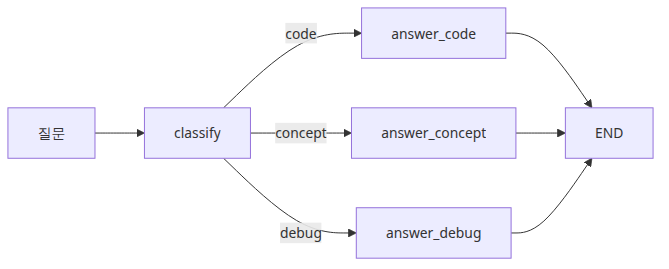
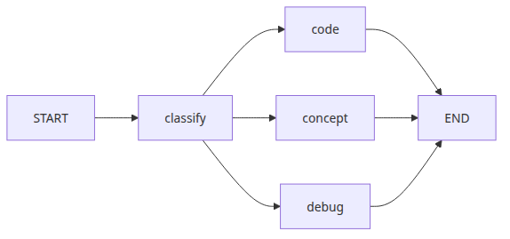
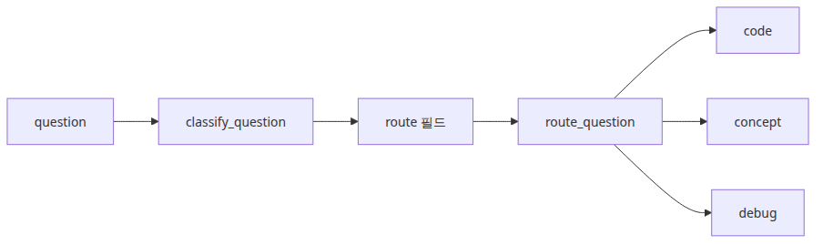
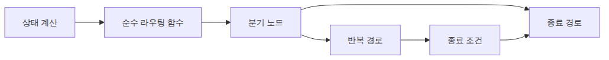

# 조건부 엣지와 분기 흐름

에이전트가 언제나 한 경로만 따른다면 그래프는 생각보다 단순합니다. 하지만 실제 시스템은 거의 그렇지 않습니다. 어떤 요청은 코드 생성으로 가야 하고, 어떤 요청은 개념 설명으로, 어떤 요청은 오류 분석으로 보내야 합니다. 이 분기 판단을 긴 `if/elif/else` 안에 묻어 두면 실행은 되지만, 왜 그 길을 탔는지는 바로 흐려집니다.

이 글은 LangGraph 101 시리즈의 세 번째 글입니다. 여기서는 조건부 엣지를 단순한 분기 문법이 아니라, 상태를 읽고 다음 경로를 공개적으로 결정하는 라우팅 계층으로 봅니다.

운영에서 더 까다로운 순간은 분기 실패가 조용히 시작될 때입니다. 분류 라벨 하나가 비어 있고, 예상 밖 문자열 하나가 흘러들어오고, default 경로 하나가 빠져 있는 순간 겉으로는 “가끔 이상한 입력에서만 실패하는 시스템”처럼 보이기 쉽습니다. 하지만 실제로는 모델 품질보다 **라우팅 계약이 약한 구조 문제**인 경우가 더 많습니다.

여기에 루프까지 겹치면 비용은 더 빨리 커집니다. 잘못된 route 하나가 실행을 반복되면 안 되는 노드들 사이로 튕기게 만들 수도 있고, 멈춰야 할 워크플로를 계속 앞으로 밀어낼 수도 있습니다. 현업에서 저는 이런 상황이 종종 “모델이 예측 불가능하다”는 말로 포장되는 장면을 봤습니다. 하지만 생산 환경에서 더 근본적인 원인은 대개 분기 규칙이 충분히 명시적이지 않았다는 데 있습니다.

여기서는 조건부 엣지를 단순한 편의 문법이 아니라, **그래프가 다음 노드를 공개적으로 선택하는 의사결정 지점**으로 이해해 보겠습니다. 핵심은 분명합니다. **Conditional Edge는 상태를 읽고, 그 상태를 다음 경로 선택으로 번역하며, 라우팅 경계를 코드 구조 위로 드러내는 장치**입니다.

이 관점이 잡히면 다음 글의 도구 호출 에이전트도 훨씬 쉬워집니다. 도구 호출 루프 역시 결국 “지금 상태가 무엇인가?”를 보고 다음 행동을 정하는 구조이기 때문입니다. 반대로 분기를 런타임의 작은 `if` 정도로만 보면 fallback, 종료 규칙, 관측성 설계가 왜 중요한지 끝까지 흐릿하게 남습니다.

---

## 이 글에서 다룰 문제

- 언제 `add_conditional_edges()`를 써야 할까요?
- 라우팅 함수는 무엇만 해야 하고, 무엇은 하지 말아야 할까요?
- 분기가 많은 그래프가 무한 루프로 무너지지 않게 하려면 무엇을 설계해야 할까요?
- default 경로가 없는 분기 구조는 운영에서 어떤 식으로 실패할까요?
- 분기 근거를 상태에 남기면 디버깅과 관측성이 어떻게 달라질까요?

## 왜 이 글이 중요한가

조건부 엣지를 배우는 이유를 “그래프를 branch할 수 있으니까”라고만 설명하면 너무 약합니다. 더 현실적인 이유는 설명 가능한 라우팅입니다. 에이전트가 여러 역할을 맡기 시작하는 순간, 팀은 반드시 “왜 이 요청이 이 노드로 갔는가”를 설명할 수 있어야 합니다.

예를 들어 어떤 질문은 코드 작성으로 보내고, 어떤 질문은 개념 설명으로 보내고, 어떤 질문은 디버깅 흐름으로 보내야 한다고 해 보겠습니다. 이 판단을 한 노드 안의 긴 `if/elif/else`에만 숨겨 두면 동작은 합니다. 하지만 “왜 debug로 분기됐지?”, “왜 여기서는 concept로 빠졌지?”, “왜 종료 안 하고 다시 classify로 돌아갔지?” 같은 질문에 답하기가 급격히 어려워집니다.

저는 팀들이 이 지점을 과소평가하다가, 나중에 LangSmith 추적 화면만 붙잡고 있는 장면을 자주 봤습니다. 관측 도구가 있어도 구조가 숨겨져 있으면 해석이 어렵습니다. 반대로 분기 근거가 상태 필드와 path map으로 드러나 있으면, 로그와 state snapshot만으로도 의사결정을 재구성할 수 있습니다.

그래서 이 글의 목표는 조건부 엣지 API를 외우는 데 있지 않습니다. 더 중요한 목표는 **분기 로직을 그래프 구조 위로 끌어올릴 때 운영 난이도가 왜 내려가는지**를 이해하는 데 있습니다.

---

## LangGraph를 이해하는 가장 좋은 방법: Conditional Edge는 그래프의 의사결정 지점이다

조건부 엣지에서 가장 먼저 잡아야 할 문장은 이것입니다. **Conditional Edge는 그래프의 의사결정 지점**입니다. 저는 이 표현이 가장 실용적이라고 생각합니다. 노드가 상태를 만들고, 라우터가 그 상태를 읽고, 조건부 엣지가 다음 노드를 확정합니다. 즉, 분기 판단이 코드 안쪽에 숨어 있지 않고 그래프 위에 드러납니다.

> Conditional Edge는 그래프의 의사결정 지점입니다. 노드는 상태를 만들고, 라우터는 그 상태를 읽고, 엣지는 그 판단을 다음 경로로 바꿉니다. 이 분리가 있어야 “왜 이 길로 갔는가”를 운영 중에도 설명할 수 있습니다.

많은 입문자가 조건부 엣지를 “`if/else`를 그래프로 옮긴 것” 정도로 이해합니다. 절반은 맞지만, 절반은 놓칩니다. 중요한 차이는 분기 결과가 **구조와 상태에 명시적으로 남는다**는 점입니다. 이게 있어야 fallback 경로, 종료 조건, loop 안전장치를 모두 같은 모델 안에서 다룰 수 있습니다.

가장 단순하게 정리하면 아래 표처럼 볼 수 있습니다.

| 구성 요소 | 역할 | 실무에서 왜 중요한가 |
| --- | --- | --- |
| **분류 노드** | 요청을 읽고 라우팅 근거를 상태에 기록 | 왜 특정 경로 후보가 나왔는지 흔적을 남깁니다 |
| **라우터 함수** | 상태를 보고 다음 라벨을 반환 | 부작용 없는 의사결정 계층을 분리할 수 있습니다 |
| **조건부 엣지** | 라벨을 실제 대상 노드로 매핑 | 분기 계약을 코드 구조에서 읽을 수 있습니다 |
| **default / fallback 경로** | 예상 밖 라벨이나 미분류 상태를 처리 | dead-end와 불규칙 실패를 줄입니다 |
| **종료 조건** | 루프와 분기를 언제 멈출지 정의 | 무한 branching과 runaway cost를 막습니다 |

이 표가 중요한 이유는 운영 질문이 늘 여기서 나오기 때문입니다. 라우팅 함수가 왜 debug를 골랐지? unknown route는 어디로 가지? fallback이 없으면 무슨 일이 생기지? 종료 조건은 어디서 보장하지? 이런 질문은 모두 conditional edge를 단순한 문법이 아니라 의사결정 경계로 봐야 답이 나옵니다.

현업에서 저는 분기가 많은 그래프를 볼 때 먼저 세 가지를 봅니다. 라우팅 근거가 상태에 남는가, 예상 밖 입력을 처리할 default가 있는가, 루프와 종료가 서로 분리돼 있는가. 이 세 가지를 먼저 확인하면 “가끔 이상한 요청에서만 터지는” 시스템을 훨씬 빨리 해석할 수 있습니다.



*이 글에서 답할 질문*

---

## 최소 실행 예제

가장 작은 분기 예제로 보겠습니다. 사용자의 질문을 읽고 `code`, `concept`, `debug` 셋 중 하나로 분류한 뒤, 조건부 엣지로 다음 노드를 선택하는 구조입니다. 예제는 단순하지만 실제 에이전트의 라우팅 뼈대와 거의 같습니다.



*classify 노드에서 세 갈래로 분기하는 구조*

```python
from typing import Literal, TypedDict

from langgraph.graph import END, START, StateGraph

class RouterState(TypedDict):
    question: str
    route: str
    answer: str

def classify_question(state: RouterState) -> RouterState:
    text = state["question"].lower()
    if any(word in text for word in ("bug", "error", "traceback")):
        route = "debug"
    elif any(word in text for word in ("code", "implement", "write")):
        route = "code"
    else:
        route = "concept"
    return {"route": route}

def route_question(state: RouterState) -> Literal["code", "concept", "debug"]:
    return state["route"]

def answer_code(_: RouterState) -> RouterState:
    return {"answer": "Route: code. Next node should generate or review code."}

def answer_concept(_: RouterState) -> RouterState:
    return {"answer": "Route: concept. Next node should explain the idea clearly."}

def answer_debug(_: RouterState) -> RouterState:
    return {"answer": "Route: debug. Next node should inspect failure details first."}

def build_graph():
    graph = StateGraph(RouterState)
    graph.add_node("classify", classify_question)
    graph.add_node("code", answer_code)
    graph.add_node("concept", answer_concept)
    graph.add_node("debug", answer_debug)

    graph.add_edge(START, "classify")
    graph.add_conditional_edges(
        "classify",
        route_question,
        {"code": "code", "concept": "concept", "debug": "debug"},
    )
    graph.add_edge("code", END)
    graph.add_edge("concept", END)
    graph.add_edge("debug", END)

    return graph.compile()

if __name__ == "__main__":
    app = build_graph()
    for question in [
        "Write Python code for quicksort.",
        "What is a checkpoint in LangGraph?",
        "I got a traceback while running my graph.",
    ]:
        result = app.invoke({"question": question, "route": "", "answer": ""})
        print(f"Question: {question}")
        print(f"Route: {result['route']}")
        print(f"Answer: {result['answer']}\n")
```

이 예제는 단순해 보여도 운영에서 중요한 것을 세 가지 보여 줍니다. 첫째, `classify_question()`이 라우팅 근거를 `route` 필드에 남기기 때문에 결과 문자열만 보지 않아도 분기 이유를 추적할 수 있습니다. 둘째, `route_question()`은 부작용 없이 다음 라벨만 반환해서, 의사결정과 실제 작업 노드를 분리합니다. 셋째, path map이 라벨과 실제 대상 노드의 관계를 구조로 고정하기 때문에 라우팅 계약을 코드에서 읽을 수 있습니다.

제가 이런 형태의 예제를 좋아하는 이유도 여기에 있습니다. 분기라는 주제를 “복잡한 에이전트 행동” 대신 “명시적 상태 + 명시적 라우팅”으로 보여 줄 수 있기 때문입니다. 처음부터 tool call과 loop를 함께 넣으면 구조보다 현상만 눈에 들어오기 쉽습니다. 여기서는 오직 의사결정 경계만 보이게 해서 다음 글의 도구 호출 루프로 자연스럽게 이어지게 만듭니다.

실행 파일 경로보다 더 중요한 점도 있습니다. 이 코드는 “분기가 있는 함수”와 “분기가 설명 가능한 그래프”의 차이를 드러냅니다. 이 차이를 이해해야 default 경로, fallback 설계, recursion limit 같은 운영 안전장치도 같은 구조 안에서 읽힙니다.

예제 코드: [github.com/yeongseon-books/langgraph-101](https://github.com/yeongseon-books/langgraph-101/tree/main/en/03-conditional-edges)

---

## default route를 코드로 고정해 두기

입문 예제는 `code`, `concept`, `debug` 세 경로만 있어도 충분하지만, 운영 예제라면 fallback을 함께 보여 주는 편이 좋습니다. 예상 밖 문자열이 들어왔을 때 그래프가 어디로 가야 하는지 구조에 남겨 두지 않으면, branch는 되는데 복구는 어려운 상태가 생기기 쉽습니다.

```python
from typing import Literal

def route_question(state: RouterState) -> Literal["code", "concept", "debug", "fallback"]:
    route = state.get("route", "").strip().lower()
    if route in {"code", "concept", "debug"}:
        return route
    return "fallback"

def answer_fallback(_: RouterState) -> RouterState:
    return {
        "answer": (
            "Route: fallback. The classifier returned an unknown label, "
            "so the graph is taking the safest explanatory path first."
        )
    }

graph.add_node("fallback", answer_fallback)
graph.add_conditional_edges(
    "classify",
    route_question,
    {
        "code": "code",
        "concept": "concept",
        "debug": "debug",
        "fallback": "fallback",
    },
)
graph.add_edge("fallback", END)
```

**Expected output:**

```text
Question: Explain LangGraph with an unknown route label.
Route: fallback
Answer: Route: fallback. The classifier returned an unknown label, so the graph is taking the safest explanatory path first.
```

이 코드는 분기 구조를 과하게 복잡하게 만들지 않으면서도, “정의되지 않은 route는 어디로 가는가?”라는 운영 질문에 바로 답을 줍니다. 분기가 늘어날수록 이 fallback 경로는 선택지가 아니라 안전장치에 가까워집니다.

---

## 분기 실패를 운영에서 어떻게 읽을까

조건부 엣지에서 장애가 생길 때, 실제 원인은 대개 모델 성능보다 계약 부재에서 나옵니다. 아래 세 가지는 특히 자주 보입니다.

1. **분기 근거는 있는데 fallback이 없는 경우**  
   `route="other"` 같은 값이 한 번만 나와도 그래프가 갑자기 예외로 끝날 수 있습니다. 이 문제는 classifier 품질이 아니라 path map 완성도 문제입니다.

2. **라우터 함수가 부작용을 함께 떠안는 경우**  
   라우팅 함수 안에서 외부 API를 부르거나 상태를 추가로 갱신하면, 분기 판단과 실행 작업이 섞입니다. 그러면 “왜 이 route가 나왔는가”와 “라우팅 중 무슨 일이 있었는가”가 같은 디버깅 문제로 붙어 버립니다.

3. **loop 종료와 branch 선택을 같은 문제로 다루는 경우**  
   route는 다음 단계를 정하는 문제이고, 종료 조건은 언제 멈출지를 정하는 문제입니다. 둘을 한 덩어리로 다루면 어떤 요청은 지나치게 빨리 끝나고, 어떤 요청은 이유 없이 반복되기 쉽습니다.

제가 실무에서 branch-heavy 그래프를 볼 때 먼저 확인하는 것도 비슷합니다. route 필드가 상태에 남는지, unknown route가 안전하게 수습되는지, 종료 규칙이 분기 규칙과 분리되어 있는지 봅니다. 이 세 가지가 선명하면 희귀한 라우팅 장애도 훨씬 빨리 설명됩니다.

---

## 이 코드에서 먼저 봐야 할 점

코드 전체를 한 번에 읽기보다, 아래 세 지점부터 보는 편이 이해가 빠릅니다.



*질문이 route 필드로 흐르는 구조*

- `classify_question()`은 라우팅 신호를 상태에 기록합니다.
- `route_question()`의 역할은 하나뿐입니다. 부작용 없이 다음 노드 이름을 반환합니다.
- path map 덕분에 분기 라벨과 실제 대상 노드가 코드에서 분명하게 대응됩니다.

첫 번째 포인트는 분기 근거를 상태에 남긴다는 점입니다. 단순히 어떤 노드로 갔는지만 보는 것과, 왜 그 노드로 갔는지를 상태 필드로 함께 남기는 것은 운영에서 큰 차이를 만듭니다. 저는 현업에서 분기 결과만 있고 근거가 없어서, 재현이 어려운 라우팅 버그를 한참 뒤에야 설명하는 경우를 자주 봤습니다.

두 번째 포인트는 라우터 함수의 순수성입니다. `route_question()`은 다음 노드 이름만 돌려줍니다. 여기서 외부 API를 부르거나 상태를 추가로 바꾸기 시작하면, 분기 판단과 작업 수행이 섞여 버립니다. 그러면 “왜 debug로 갔지?”와 “debug로 가는 중 무슨 부작용이 있었지?”가 한 덩어리가 되어 디버깅 비용이 급격히 올라갑니다.

세 번째 포인트는 path map입니다. 이 매핑은 사소해 보여도 중요합니다. route 문자열과 실제 대상 노드가 코드 구조 안에서 명시적으로 연결되기 때문입니다. 운영하면서 라우팅 계약을 바꿔야 할 때도 어디를 고쳐야 하는지 바로 보입니다.

---

## 어디서 자주 헷갈릴까요?

조건부 엣지 입문에서 가장 흔한 오해는 “route만 잘 나오면 됐다”는 생각입니다. 실제로는 route 값보다 **예상 밖 route를 어떻게 처리할지, 종료는 어디서 보장할지, fallback은 무엇인지**가 더 중요할 때가 많습니다.



*분기와 루프의 종료 설계*

- 분류 로직과 부작용이 있는 작업을 같은 라우터 함수에 섞으면 디버깅이 어려워집니다.
- 조건부 엣지는 일회성 `if/else`만이 아니라 루프 제어에도 쓰입니다. 그래서 종료 조건을 따로 설계해야 합니다.
- 라우트 문자열은 런타임 계약입니다. 오타가 나면 그래프 실패로 이어지므로 `Literal[...]`이 유용합니다.

여기서 가장 자주 보는 사고는 **Conditional Edge Without Default 안티패턴**입니다. 분류기는 여러 값을 낼 수 있는데 path map은 행복 경로만 정의해 둔 상태입니다. 평소에는 잘 돕니다. 그런데 예상 밖 입력에서 빈 문자열이나 미정의 라벨이 나오면 그래프는 더 이상 갈 곳이 없어집니다. 어떤 시스템은 즉시 예외로 죽고, 어떤 시스템은 upstream retry와 만나면서 같은 요청을 반복 처리하기도 합니다.

이 안티패턴이 production에서 왜 위험할까요? 첫째, 분기 실패가 “가끔만 터지는 희귀 오류”처럼 보여서 원인 파악이 늦어집니다. 둘째, fallback이 없으면 사용자 경험이 갑자기 hard fail로 바뀝니다. 셋째, loop와 결합된 구조에서는 종료 대신 같은 분기 판단이 반복되면서 비용과 지연이 함께 커질 수 있습니다. 분기 설계에서 default는 편의가 아니라 안전장치입니다.

또 다른 함정은 라우터 함수 안에 너무 많은 의미를 넣는 것입니다. 분류도 하고, 로그도 남기고, 외부 판정 API도 호출하고, 상태도 바꾸기 시작하면 결국 라우터가 또 하나의 거대한 작업 노드가 됩니다. 저는 팀들이 여기서 “분기 이유는 simple한데 왜 재현이 이렇게 어렵지?”라고 묻는 장면을 자주 봤습니다. 이유는 라우터가 이미 의사결정 계층이 아니라 부작용 계층이 돼 버렸기 때문입니다.

제가 본 강한 팀들은 분기를 설계할 때 먼저 세 가지를 문서화했습니다. 가능한 route 집합, unknown route 시 fallback, loop일 경우 종료 조건입니다. 이 세 가지가 명시되지 않으면 그래프는 branching을 가진 시스템이 아니라 branching처럼 보이는 우연한 실행 흐름이 되기 쉽습니다.

---

## 첫 번째 운영 체크리스트

조건부 엣지를 붙이는 순간부터 아래 항목은 단순한 코드 리뷰 항목이 아니라 라우팅 안정성 점검 항목이 됩니다.

- [ ] 분기 결정이 전용 상태 필드에 기록되는가
- [ ] 라우팅 함수가 순수 함수로 유지되는가
- [ ] 정의되지 않은 route를 처리할 default 또는 fallback 전략이 있는가
- [ ] 모든 분기가 정상 종료되거나 안정적인 다음 단계로 이어지는가
- [ ] loop 구조라면 종료 조건과 recursion limit 기준을 분리해서 설계했는가

이 체크리스트의 핵심은 “branch가 되느냐”가 아닙니다. “branch가 설명 가능하고 안전하냐”입니다. 분기는 기능이 아니라 운영 경계이기도 합니다.

---

## 실무에서는 이렇게 생각한다

조건부 엣지를 붙인 순간 그래프는 단순한 선형 워크플로를 벗어납니다. 그래서 운영 질문도 달라집니다. “답이 좋았나?”보다 먼저 “왜 이 route가 선택됐지?”, “fallback은 언제 타지?”, “이 분기는 종료 가능한 구조인가?” 같은 질문이 붙기 시작합니다.

현업에서 저는 분기 설계를 observability 설계와 함께 봅니다. route 필드가 저장되는지, path map이 코드 리뷰에서 읽히는지, unknown route가 따로 집계되는지 같은 질문이 중요합니다. 분기 시스템은 잘 돌 때보다 잘못 돌 때 더 많은 정보를 남겨야 합니다. 그래야 희귀 오류가 구조 오류로 승격되기 전에 잡을 수 있습니다.

또 하나 중요한 감각은 “분기”와 “loop”를 따로 보지 않는 것입니다. 실제 에이전트에서는 tool call 이후 다시 classify로 돌아오거나, review 결과에 따라 다른 경로로 빠지는 일이 흔합니다. 이때 conditional edge는 한 번의 분기 장치이면서 동시에 loop의 제어 장치가 됩니다. 그래서 default와 종료 조건이 더 중요해집니다.

제가 본 강한 팀들은 분류 정확도보다 라우팅 계약을 먼저 리뷰했습니다. 이유는 단순합니다. 모델 분류가 조금 흔들려도 fallback과 종료가 설계돼 있으면 시스템은 버팁니다. 반대로 라우팅 계약이 약하면, 좋은 모델도 불안정한 그래프 위에서는 금방 이상한 시스템이 됩니다.

---

## 정리: Conditional Edge는 분기 문법이 아니라, 그래프를 설명 가능하게 만드는 라우팅 계층이다

조건부 엣지를 처음 보면 “그래프에서 if/else를 쓰는 방법”처럼 보일 수 있습니다. 그 설명도 틀리진 않지만, 운영 관점에서는 너무 약합니다. 더 중요한 설명은 이렇습니다. conditional edge는 현재 상태를 읽어 다음 노드를 선택하고, 그 선택을 구조와 상태에 모두 드러내는 라우팅 계층입니다.

이 글에서 먼저 가져가야 할 핵심은 세 가지입니다. 첫째, 분기 근거는 상태에 남겨야 합니다. 둘째, 라우터 함수는 가능한 한 순수하고 결정적이어야 합니다. 셋째, default/fallback과 종료 조건은 optional 장식이 아니라 production 안전장치입니다.

이 관점이 중요한 이유는 다음 글의 도구 호출 에이전트와 바로 이어지기 때문입니다. tool routing은 결국 “지금 어떤 상태인가?”를 보고 다음 행동을 고르는 구조입니다. conditional edge를 의사결정 지점으로 이해하면, 도구 호출 루프도 같은 모델의 확장으로 읽힙니다.

저는 분기가 붙은 그래프를 볼 때 “경로가 많다”보다 “경로가 설명된다”를 먼저 봅니다. 어떤 상태가 route를 만들었는지, unknown route는 어디로 가는지, loop는 어디서 멈추는지 말할 수 있다면 출발은 제대로 잡힌 셈입니다.

다음 글에서는 이 분기 구조를 실제 도구 호출 에이전트와 결합해, 워크플로가 어떻게 에이전트 행동으로 확장되는지 보겠습니다. 그때 conditional edge가 왜 단순한 분기 문법이 아니라 에이전트 제어 계층인지 더 선명하게 드러날 것입니다.

---

## 운영 체크리스트

- [ ] route 필드와 라우터 함수의 책임 경계를 문서화했다
- [ ] unknown route에 대한 fallback 경로를 정했다
- [ ] loop가 생길 때 종료 조건과 recursion limit 기준을 함께 정의했다
- [ ] 분기 결과를 상태 또는 로그에서 복원할 수 있게 만들었다
- [ ] 다음 단계 노드가 route 계약을 어겨도 빠르게 감지할 수 있는 검증 지점을 넣었다

<!-- toc:begin -->
## 시리즈 목차

- [LangGraph 소개와 그래프 기초](./01-graph-basics.md)
- [상태 관리와 체크포인트](./02-state-and-checkpoints.md)
- **조건부 엣지와 분기 흐름 (현재 글)**
- 도구 호출 에이전트 (예정)
- 멀티 에이전트 시스템 (예정)
- LangGraph 완성 (예정)

<!-- toc:end -->

---

## 참고 자료

### 공식 문서
- [LangGraph branching guide](https://langchain-ai.github.io/langgraph/how-tos/branching/)
- [LangGraph low-level concepts: edges](https://langchain-ai.github.io/langgraph/concepts/low_level/)
- [LangGraph recursion limit guide](https://langchain-ai.github.io/langgraph/how-tos/recursion-limit/)

### 소스 코드와 예제
- [langchain-ai/langgraph GitHub repository](https://github.com/langchain-ai/langgraph)
- [LangGraph quickstart with routing](https://langchain-ai.github.io/langgraph/tutorials/get-started/4-add-tools/)

### 관련 시리즈
- [상태 관리와 체크포인트](./02-state-and-checkpoints.md)
- [LangGraph 소개와 그래프 기초](./01-graph-basics.md)

---

Tags: LangGraph, Agent, Python, LLM
