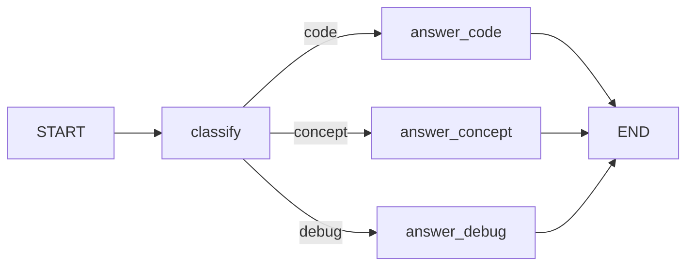

# 조건부 엣지와 분기 흐름

> LangGraph 101 시리즈 (3/6)

## 이 글에서 다룰 문제

*실서비스* *질문* 은 *균일* 하지 *않습니다*. *디버깅 요청*, *코드 생성*, *개념 설명* 은 *서로* *다른* *경로* 가 *적절* 합니다. *if/else* 를 *노드* *안* 에 *숨기면* *그래프* 가 *그림* 으로 *드러나지* *않습니다*. *조건부* *엣지* 는 *분기* 를 *그래프* *위* 로 *끌어* *올립니다*.

## 개념 한눈에 보기



## Before/After

**Before**: "*노드* *내부* *if/else* 가 *길어지면서* *그래프* 가 *직선* 처럼 *보입니다*."

**After**: "*조건부* *엣지* 가 *분기* 를 *명시* 해 *그림* 으로 *읽힙니다*."

## 실습: 라우팅 그래프 5단계

### 1단계 — 상태와 라벨 타입

```python
from typing import Literal, TypedDict

class RouterState(TypedDict):
    question: str
    route: str
    answer: str

Route = Literal["code", "concept", "debug"]
```

### 2단계 — 분류 노드

```python
def classify(state: RouterState) -> dict:
    text = state["question"].lower()
    if any(w in text for w in ("bug", "error", "traceback")):
        return {"route": "debug"}
    if any(w in text for w in ("code", "implement", "write")):
        return {"route": "code"}
    return {"route": "concept"}
```

### 3단계 — 답변 노드 세 개

```python
def answer_code(_: RouterState) -> dict:
    return {"answer": "Route: code. Generate or review code next."}

def answer_concept(_: RouterState) -> dict:
    return {"answer": "Route: concept. Explain the idea clearly."}

def answer_debug(_: RouterState) -> dict:
    return {"answer": "Route: debug. Inspect failure details first."}
```

### 4단계 — 라우터 함수와 그래프

```python
from langgraph.graph import StateGraph, START, END

def route_question(state: RouterState) -> Route:
    return state["route"]  # type: ignore[return-value]

builder = StateGraph(RouterState)
builder.add_node("classify", classify)
builder.add_node("code", answer_code)
builder.add_node("concept", answer_concept)
builder.add_node("debug", answer_debug)

builder.add_edge(START, "classify")
builder.add_conditional_edges(
    "classify",
    route_question,
    {"code": "code", "concept": "concept", "debug": "debug"},
)
builder.add_edge("code", END)
builder.add_edge("concept", END)
builder.add_edge("debug", END)

graph = builder.compile()
```

### 5단계 — 세 가지 질문 실행

```python
for q in [
    "Write Python code for quicksort.",
    "What is a checkpoint in LangGraph?",
    "I got a traceback while running my graph.",
]:
    result = graph.invoke({"question": q, "route": "", "answer": ""})
    print(result["route"], "|", result["answer"])
```

## 이 코드에서 주목할 점

- *classify* 는 *상태* 에 *route* 를 *씁니다*. *분기* *근거* 가 *상태* *위* 에 *남* *습니다*.
- *route_question* 은 *부작용* 이 *없습니다*. *문자열* 만 *반환* 합니다.
- *path_map* 덕에 *라벨* 과 *노드 이름* *대응* 이 *한* *눈* 에 *보입니다*.

## 자주 하는 실수 5가지

1. ***라우터에서 LLM 호출*** — *분류* 와 *라우팅* 을 *섞으면* *디버깅* 이 *어려워* *집니다*.
2. ***path_map 누락*** — *라우터* 가 *노드 이름* 을 *직접* *반환* 해도 *되지만* *변경* 시 *추적* *어렵* *습니다*.
3. ***루프 종료 조건 부재*** — *조건부* 엣지로 *루프* 만들 때 *recursion limit* 도달 합니다.
4. ***라벨 오타*** — *Literal* 미사용 시 *런타임* 까지 *발견* *불가*.
5. ***모든 분기 END 미연결*** — *path_map* 의 *값* 중 *하나* 가 *END* 로 *닫히지* *않으면* *행* 됩니다.

## 실무에서는 이렇게 쓰입니다

*프로덕션* *에이전트* 에서는 *intent* *분류*, *권한* *체크*, *비용* *기반* *모델* *선택* 등을 *조건부* 엣지로 *표현* 합니다. *LangSmith* *trace* 가 *어느* *경로* 를 *탔는지* *시각화* 합니다.

## 체크리스트

- [ ] *router* 가 *부작용* *없는* *순수* 함수.
- [ ] *Literal* 로 *반환* *타입* *고정*.
- [ ] *path_map* *명시*.
- [ ] *모든* 경로 가 *END* 또는 *다음* *노드* 로 *닫힘*.

## 정리 및 다음 단계

다음 글은 *도구 호출 에이전트* 입니다.

<!-- toc:begin -->
## 시리즈 목차

- [LangGraph 소개와 그래프 기초](./01-graph-basics.md)
- [상태 관리와 체크포인트](./02-state-and-checkpoints.md)
- **조건부 엣지와 분기 흐름 (현재 글)**
- 도구 호출 에이전트 (예정)
- 멀티 에이전트 시스템 (예정)
- LangGraph 완성 (예정)

<!-- toc:end -->

## 참고 자료

- [Conditional edges how-to](https://langchain-ai.github.io/langgraph/how-tos/branching/)
- [Low-level concepts: edges](https://langchain-ai.github.io/langgraph/concepts/low_level/#edges)
- [Recursion limit](https://langchain-ai.github.io/langgraph/how-tos/recursion-limit/)
- [LangGraph reference](https://langchain-ai.github.io/langgraph/reference/graphs/)

Tags: LangGraph, Agent, Python, LLM
