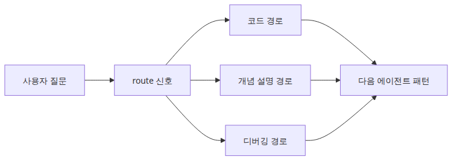

# 조건부 엣지와 분기 흐름

실제 에이전트 워크플로는 한 경로만 계속 따라가지 않습니다. 어떤 요청은 코드 생성으로, 어떤 요청은 개념 설명으로, 어떤 요청은 디버깅으로 가야 합니다. LangGraph는 라우팅 노드 하나와 조건부 엣지 정의 하나로 그 분기를 그래프 위에 드러냅니다.

이 글은 LangGraph 101 시리즈의 3번째 글입니다.

## 이 글에서 다룰 문제

- 언제 `add_conditional_edges()`를 써야 할까요?
- 라우팅 함수는 무엇만 해야 하고, 무엇은 하지 말아야 할까요?
- 분기가 많은 그래프가 무한 루프로 무너지지 않게 하려면 무엇을 설계해야 할까요?

> 조건부 엣지는 상태를 보고 다음 노드 이름을 결정하는 장치입니다. 숨겨진 제어 흐름을 런타임의 명시적 분기로 끌어올린다고 생각하면 됩니다.

예제 코드: [github.com/yeongseon-books/langgraph-101](https://github.com/yeongseon-books/langgraph-101/tree/main/en/03-conditional-edges)


이 글에서 답할 질문

## 최소 실행 예제


classify 노드에서 세 갈래로 분기하는 구조

```python
from typing import Literal, TypedDict

from langgraph.graph import END, START, StateGraph

class RouterState(TypedDict):
    question: str
    route: str
    answer: str

def classify_question(state: RouterState) -> RouterState:
    text = state["question"].lower()
    if any(word in text for word in ("bug", "error", "traceback")):
        route = "debug"
    elif any(word in text for word in ("code", "implement", "write")):
        route = "code"
    else:
        route = "concept"
    return {"route": route}

def route_question(state: RouterState) -> Literal["code", "concept", "debug"]:
    return state["route"]

def answer_code(_: RouterState) -> RouterState:
    return {"answer": "Route: code. Next node should generate or review code."}

def answer_concept(_: RouterState) -> RouterState:
    return {"answer": "Route: concept. Next node should explain the idea clearly."}

def answer_debug(_: RouterState) -> RouterState:
    return {"answer": "Route: debug. Next node should inspect failure details first."}

def build_graph():
    graph = StateGraph(RouterState)
    graph.add_node("classify", classify_question)
    graph.add_node("code", answer_code)
    graph.add_node("concept", answer_concept)
    graph.add_node("debug", answer_debug)

    graph.add_edge(START, "classify")
    graph.add_conditional_edges(
        "classify",
        route_question,
        {"code": "code", "concept": "concept", "debug": "debug"},
    )
    graph.add_edge("code", END)
    graph.add_edge("concept", END)
    graph.add_edge("debug", END)

    return graph.compile()

if __name__ == "__main__":
    app = build_graph()
    for question in [
        "Write Python code for quicksort.",
        "What is a checkpoint in LangGraph?",
        "I got a traceback while running my graph.",
    ]:
        result = app.invoke({"question": question, "route": "", "answer": ""})
        print(f"Question: {question}")
        print(f"Route: {result['route']}")
        print(f"Answer: {result['answer']}\n")
```

실행 파일: `/root/Github/langgraph-101/en/03-conditional-edges/main.py`

## 이 코드에서 먼저 봐야 할 점


질문이 route 필드로 흐르는 구조

- `classify_question()`은 라우팅 신호를 상태에 기록합니다.
- `route_question()`의 역할은 하나뿐입니다. 부작용 없이 다음 노드 이름을 반환합니다.
- path map 덕분에 분기 라벨과 실제 대상 노드가 코드에서 분명하게 대응됩니다.

이 패턴의 장점은 분기 근거가 상태에 남는다는 점입니다. 단순히 `if/else`를 노드 내부에 숨기면 실행은 되더라도, 왜 그 경로를 탔는지 추적하기가 어렵습니다. 반면 `route` 필드를 남기면 LangSmith 같은 추적 도구가 없어도 상태만 보고 의사결정을 복원할 수 있습니다.

## 어디서 자주 헷갈릴까요?


분기와 루프의 종료 설계

- 분류 로직과 부작용이 있는 작업을 같은 라우터 함수에 섞으면 디버깅이 어려워집니다.
- 조건부 엣지는 일회성 `if/else`만이 아니라 루프 제어에도 쓰입니다. 그래서 종료 조건을 따로 설계해야 합니다.
- 라우트 문자열은 런타임 계약입니다. 오타가 나면 그래프 실패로 이어지므로 `Literal[...]`이 유용합니다.

실무 감각으로 보면 조건부 엣지는 곧 운영 경계입니다. 어떤 분기에서 외부 API를 호출하고, 어떤 분기에서 사람이 검토하고, 어떤 분기에서 종료하는지가 모두 여기에 걸립니다. 그래서 라우팅 함수는 가능한 한 단순하고 결정적이어야 합니다.

## 체크리스트

- [ ] 분기 결정이 전용 상태 필드에 기록되는가
- [ ] 라우팅 함수가 순수 함수로 유지되는가
- [ ] 모든 분기가 정상 종료되거나 안정적인 다음 단계로 이어지는가

## 정리



질문 유형에 따라 달라지는 라우팅 흐름

조건부 엣지를 쓰는 순간 LangGraph는 단순한 워크플로 도구보다 훨씬 더 그래프다운 느낌을 줍니다. 다음 글에서는 이 분기 구조를 실제 도구 호출 루프와 결합해, 워크플로를 에이전트 행동으로 확장해 보겠습니다.

<!-- toc:begin -->
## 시리즈 목차

- [LangGraph 소개와 그래프 기초](./01-graph-basics.md)
- [상태 관리와 체크포인트](./02-state-and-checkpoints.md)
- **조건부 엣지와 분기 흐름 (현재 글)**
- 도구 호출 에이전트 (예정)
- 멀티 에이전트 시스템 (예정)
- LangGraph 완성 (예정)

<!-- toc:end -->

---

## 참고 자료

- [LangGraph branching guide](https://langchain-ai.github.io/langgraph/how-tos/branching/)
- [LangGraph low-level concepts: edges](https://langchain-ai.github.io/langgraph/concepts/low_level/)
- [LangGraph recursion limit guide](https://langchain-ai.github.io/langgraph/how-tos/recursion-limit/)

Tags: LangGraph, Agent, Python, LLM
