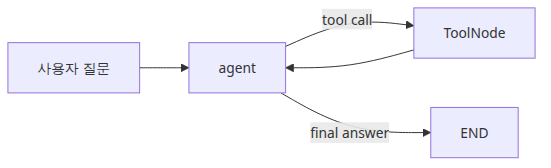
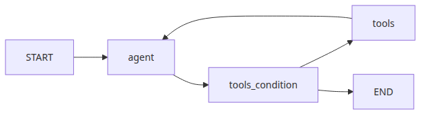
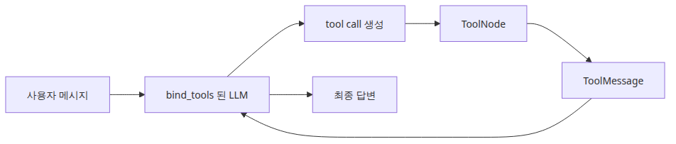
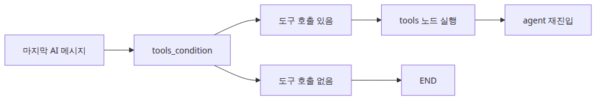

# 도구 호출 에이전트

이 글은 LangGraph 101 시리즈의 네 번째 글입니다. 도구를 쓰는 에이전트는 데모에서는 늘 똑똑해 보입니다. 계산이 필요하면 계산기를 부르고, 카운팅이 필요하면 텍스트 도구를 부르고, 그 결과를 바탕으로 답을 돌려주기 때문입니다. 하지만 운영으로 들어가면 질문이 곧바로 바뀝니다. 왜 이 요청만 도구를 세 번 호출했는지, 왜 존재하지도 않는 도구를 요청했는지, 왜 실패한 결과를 읽고도 같은 도구를 다시 부르는지가 중요해집니다.

보통 핵심 문제는 모델이 도구를 사용할 수 있느냐가 아닙니다. 그 주위를 둘러싼 루프가 **명시적이고, 들여다볼 수 있고, 통제 가능한가**가 더 중요합니다. 도구 호출이 모델 내부의 불투명한 습관처럼 남아 있으면, 실패한 도구 재시도와 성공한 도구 후속 응답, 최종 답변 조립이 한 덩어리로 섞입니다. 그 순간 재현은 어려워지고, 로깅 경계는 약해지고, 비용이 어디서 커지는지도 읽기 힘들어집니다.

특히 side effect가 있는 도구가 붙는 순간 위험은 훨씬 커집니다. 읽기 전용 계산기나 카운터는 비교적 안전합니다. 하지만 외부 API를 호출하거나 파일을 수정하거나 티켓을 생성하는 도구라면, 한 번의 잘못된 루프가 중복 실행과 잘못된 상태 변경으로 이어질 수 있습니다. 현업에서 저는 이 지점을 “도구를 붙였으니 에이전트가 더 강해졌다”는 기대만으로 넘겼다가, 나중에 실패 복구 비용과 불필요한 재시도 비용을 크게 치르는 팀을 자주 봤습니다.

여기서는 도구 호출 에이전트를 “모델이 알아서 도구를 쓰는 구조”가 아니라, **LLM 판단과 실제 도구 실행을 분리한 안전한 실행 환경**으로 이해해 보겠습니다. 핵심은 분명합니다. **Tool-calling agent는 LLM 노드, ToolNode, 그리고 명시적 종료 규칙이 결합된 제어 루프**입니다.

---

## 이 글에서 다룰 문제

- LangGraph 에이전트에서 `ToolNode`는 어떤 책임을 대신 맡을까요?
- `ChatGroq.bind_tools()`와 조건부 엣지는 어떻게 함께 동작할까요?
- 그래프는 언제 도구 루프를 멈추고 최종 답변으로 종료할까요?
- 모델이 잘못된 도구를 요청하거나, 같은 도구를 반복 호출하면 어떻게 통제할 수 있을까요?
- side-effect가 있는 도구를 붙일 때 어떤 안전 장치를 먼저 고민해야 할까요?

## 왜 이 글이 중요한가

도구 호출 에이전트를 배우는 이유를 “LLM이 계산도 하고 검색도 하게 만들 수 있으니까”라고만 설명하면 너무 약합니다. 더 현실적인 이유는 근거 있는 실행과 통제 가능한 루프입니다. 모델이 모르는 걸 외부 기능으로 보완하는 순간, 팀은 반드시 “왜 이 도구가 호출됐는가”, “이 호출이 성공했는가”, “언제 종료해야 하는가”를 설명할 수 있어야 합니다.

예를 들어 계산이 필요한 질문과 단순 설명 질문이 섞여 있다고 해 보겠습니다. 모델이 도구를 요청할 수도 있고, 그냥 답할 수도 있습니다. 이 흐름을 하나의 함수 안에 다 몰아넣으면 실행은 됩니다. 하지만 “왜 이 요청에서만 계산기를 두 번 불렀지?”, “도구가 실패한 뒤 어떤 기준으로 다시 답변으로 돌아왔지?”, “왜 여기서는 도구 없이 바로 끝났지?” 같은 질문에 답하기가 급격히 어려워집니다.

그래서 이 글의 목표는 `ToolNode` API를 외우는 데 있지 않습니다. 더 중요한 목표는 **도구 호출 루프를 명시적인 그래프로 만들면 왜 안전성과 디버깅 가능성이 함께 좋아지는지**를 이해하는 데 있습니다.

---

## LangGraph를 이해하는 가장 좋은 방법: Tool-calling Agent는 LLM + 안전한 tool 실행 envelope다

도구 호출 에이전트에서 가장 먼저 잡아야 할 문장은 이것입니다. **Tool-calling Agent는 LLM + 안전한 tool 실행 envelope**입니다. 저는 이 표현이 가장 실용적이라고 생각합니다. 모델은 도구 필요 여부를 판단하고, `ToolNode`는 실제 실행과 결과 메시지 생성을 담당하며, 조건부 엣지는 이 루프가 계속될지 종료될지를 결정합니다.

> 도구 호출 에이전트의 핵심은 모델이 똑똑한가가 아닙니다. 모델의 판단, 실제 도구 실행, 종료 규칙이 서로 분리돼 있어야 안전한 루프가 됩니다. 이 경계가 없으면 도구 실패와 agent 판단 실패가 같은 덩어리로 섞입니다.

많은 입문자가 tool calling을 “LLM이 외부 기능을 부를 수 있게 만드는 옵션” 정도로 이해합니다. 절반은 맞지만, 절반은 놓칩니다. 중요한 차이는 도구 요청과 도구 실행이 **서로 다른 계층으로 분리된다**는 점입니다. 이 분리가 있어야 권한 검사, 로깅, 실패 복구, retry 정책을 모델 프롬프트 밖의 구조로 붙일 수 있습니다.

가장 단순하게 정리하면 아래 표처럼 볼 수 있습니다.

| 구성 요소 | 역할 | 실무에서 왜 중요한가 |
| --- | --- | --- |
| **LLM 노드** | 도구가 필요한지 판단하고 tool call을 생성 | 판단과 응답 생성 로직을 한곳에서 통제할 수 있습니다 |
| **ToolNode** | 실제 도구 실행과 `ToolMessage` 생성 | 모델 판단과 side-effect 실행을 분리할 수 있습니다 |
| **tools_condition** | tool call이 있으면 `tools`, 없으면 종료로 보냄 | 루프와 종료 규칙을 구조로 드러냅니다 |
| **Tool Schema / docstring** | 입력과 출력 계약을 모델에 설명 | 잘못된 도구 요청과 해석 오류를 줄이는 기준이 됩니다 |
| **Loop Guard** | recursion limit, fallback, timeout 같은 안전 장치 | 무한 루프와 runaway cost를 막습니다 |

이 표가 중요한 이유는 운영 질문이 늘 여기서 나오기 때문입니다. 모델이 왜 도구를 요청했지? 도구는 실제로 성공했나? 실패 후 왜 또 같은 도구를 불렀지? 언제 그냥 종료해야 하지? 이런 질문은 tool calling을 단순한 LLM 기능이 아니라 실행 envelope로 봐야 제대로 답이 나옵니다.



*이 글에서 답할 질문*

---

## 최소 실행 예제

가장 작은 tool loop 예제로 보겠습니다. 모델이 질문을 읽고 필요한 경우 도구 호출을 요청하고, `ToolNode`가 실제 도구를 실행한 뒤, 그 결과를 다시 모델이 읽어 최종 답을 만듭니다. 예제는 단순하지만 tool-using agent의 핵심 루프가 모두 들어 있습니다.



*agent와 tools 사이의 도구 루프*

```python
import ast
import json
import math
import operator
from typing import Any, Callable

from langchain_core.messages import HumanMessage, SystemMessage
from langchain_core.tools import tool
from langchain_groq import ChatGroq
from langgraph.graph import END, START, MessagesState, StateGraph
from langgraph.prebuilt import ToolNode, tools_condition

ALLOWED_BINARY_OPERATORS = {
    ast.Add: operator.add,
    ast.Sub: operator.sub,
    ast.Mult: operator.mul,
    ast.Div: operator.truediv,
    ast.FloorDiv: operator.floordiv,
    ast.Mod: operator.mod,
    ast.Pow: operator.pow,
}
ALLOWED_UNARY_OPERATORS = {
    ast.UAdd: operator.pos,
    ast.USub: operator.neg,
}
ALLOWED_FUNCTIONS: dict[str, Callable[..., Any]] = {
    name: value
    for name, value in math.__dict__.items()
    if not name.startswith("_") and callable(value)
}
ALLOWED_CONSTANTS = {"pi": math.pi, "e": math.e, "tau": math.tau}

def evaluate_math_expression(expression: str) -> float:
    def _evaluate(node: ast.AST) -> float:
        if isinstance(node, ast.Constant) and isinstance(node.value, (int, float)):
            return float(node.value)
        if isinstance(node, ast.BinOp):
            left = _evaluate(node.left)
            right = _evaluate(node.right)
            operation = ALLOWED_BINARY_OPERATORS.get(type(node.op))
            if operation is None:
                raise ValueError("unsupported operator")
            return float(operation(left, right))
        if isinstance(node, ast.UnaryOp):
            operand = _evaluate(node.operand)
            operation = ALLOWED_UNARY_OPERATORS.get(type(node.op))
            if operation is None:
                raise ValueError("unsupported unary operator")
            return float(operation(operand))
        if isinstance(node, ast.Call) and isinstance(node.func, ast.Name):
            function = ALLOWED_FUNCTIONS.get(node.func.id)
            if function is None or node.keywords:
                raise ValueError("unsupported function")
            arguments = [_evaluate(argument) for argument in node.args]
            return float(function(*arguments))
        if isinstance(node, ast.Name):
            value = ALLOWED_CONSTANTS.get(node.id)
            if value is not None:
                return float(value)
            raise ValueError("unsupported constant")
        raise ValueError("unsupported expression")

    parsed = ast.parse(expression, mode="eval")
    return _evaluate(parsed.body)

@tool
def calculator(expression: str) -> str:
    """Evaluate an arithmetic expression with safe math functions like sqrt(16) or pi * 2."""

    try:
        result = evaluate_math_expression(expression)
    except Exception as exc:
        return f"calculation error: {exc}"
    return str(result)

@tool
def word_stats(text: str) -> str:
    """Return word and character counts for a piece of text."""

    return json.dumps({"words": len(text.split()), "characters": len(text)})

TOOLS = [calculator, word_stats]

def call_model(state: MessagesState):
    llm = ChatGroq(model="llama-3.3-70b-versatile", temperature=0.0, stop_sequences=None).bind_tools(TOOLS)
    system = SystemMessage(
        content="You are a precise assistant. Use tools for calculations or counting tasks."
    )
    response = llm.invoke([system, *state["messages"]])
    return {"messages": [response]}

def build_graph():
    graph = StateGraph(MessagesState)
    graph.add_node("agent", call_model)
    graph.add_node("tools", ToolNode(TOOLS))
    graph.add_edge(START, "agent")
    graph.add_conditional_edges("agent", tools_condition, {"tools": "tools", "__end__": END})
    graph.add_edge("tools", "agent")
    return graph.compile()
```

이 예제는 단순해 보여도 운영에서 중요한 것을 세 가지 보여 줍니다. 첫째, 모델이 도구 필요 여부를 판단하고 실제 실행은 `ToolNode`가 맡기 때문에, 판단 실패와 실행 실패를 서로 다른 계층에서 볼 수 있습니다. 둘째, `tools_condition`이 종료와 루프를 구조로 드러내기 때문에 “왜 여기서 끝났지?” 또는 “왜 여기서 다시 tools로 갔지?”를 코드 수준에서 설명할 수 있습니다. 셋째, `calculator`처럼 안전한 도구 구현을 별도로 두면 side-effect와 권한 범위를 모델 프롬프트 바깥에서 통제할 수 있습니다.

제가 이런 구조를 좋아하는 이유도 여기에 있습니다. tool calling을 “모델이 똑똑하게 외부 기능을 쓴다”는 환상 대신, “판단-실행-재판단”이 분리된 루프로 읽게 만들기 때문입니다. 처음부터 더 많은 도구와 외부 API를 넣으면 현상은 화려해져도 제어 경계는 흐려집니다. 이 차이를 이해해야 side-effect 도구, retry 정책, timeout 정책도 같은 구조 안에서 안정적으로 붙일 수 있습니다.

---

## 이 코드에서 먼저 봐야 할 점

코드 전체를 한 번에 읽기보다, 아래 세 지점부터 잡는 편이 좋습니다.



*도구 호출과 ToolMessage 흐름*

- 도구의 docstring이 모델이 실제로 보는 사용 설명서가 됩니다.
- `ToolNode(TOOLS)`는 실행과 `ToolMessage` 생성 책임을 함께 맡습니다.
- `tools_condition`은 마지막 AI 메시지에 tool call이 있을 때만 `tools`로 보내고, 없으면 그래프를 종료합니다.

첫 번째 포인트는 도구 계약입니다. 모델은 Python 함수 본문을 이해하는 게 아니라, tool schema와 설명을 통해 도구를 배웁니다. 그래서 입력과 출력 계약이 흐릿하면 잘못된 tool call이 늘어나기 쉽습니다. 저는 현업에서 docstring이 모호해서 모델이 도구를 잘못 고르고, 결국 프롬프트만 계속 수정하는 장면을 자주 봤습니다.

두 번째 포인트는 `ToolNode`의 역할 분리입니다. 모델이 도구를 요청했다고 해서 실행까지 모델이 하는 건 아닙니다. `ToolNode`가 실제 실행과 `ToolMessage` 생성을 맡기 때문에, 권한 검사와 로깅, 실패 처리 경계를 이 계층에 붙일 수 있습니다. 이 분리가 있어야 side-effect 도구도 안전하게 다룰 여지가 생깁니다.

세 번째 포인트는 종료 규칙입니다. `tools_condition`은 단순해 보여도 아주 중요합니다. tool call이 없으면 종료하고, 있으면 실행 노드로 보냅니다. 이 구조가 명시적이어야 도구가 필요 없는 질문을 괜히 loop로 돌리지 않고, 반대로 도구가 필요한 질문에서만 loop를 유지할 수 있습니다.

---

## 어디서 자주 헷갈릴까요?

도구 호출 에이전트 입문에서 가장 흔한 오해는 “도구를 붙이면 모델이 더 정확해진다”는 기대입니다. 실제로는 정확성보다 **루프 제어와 side-effect 안전성**이 더 중요한 경우가 많습니다.



*마지막 AI 메시지에서 갈라지는 분기*

- 도구 실행을 모델 루프 안에 직접 넣으면 재시도와 로깅, 테스트가 필요 이상으로 복잡해집니다.
- `bind_tools()`는 모델이 도구를 요청하는 법만 알게 해 줄 뿐, 실행까지 해 주지는 않습니다.
- 결정적인 도구일수록 디버깅이 쉽습니다. 계산기는 `eval()` 대신 엄격한 산술 파서를 쓰는 편이 안전합니다.

여기서 가장 자주 보는 사고는 **Unbounded Tool Loop 안티패턴**입니다. 모델이 도구를 한 번 요청하면, 실패 여부와 종료 조건을 충분히 통제하지 않은 채 다시 같은 질문을 던지고, 또 같은 도구를 부르는 구조입니다. 처음에는 “모델이 스스로 고쳐 보겠지”처럼 보일 수 있습니다. 하지만 실제로는 같은 도구 호출이 반복되면서 token 비용과 외부 호출 비용만 커지고, 최종 답은 오히려 늦게 나오거나 아예 안 나오는 경우가 많습니다.

이 안티패턴이 production에서 왜 위험할까요? 첫째, side-effect 도구라면 중복 실행이 곧 잘못된 상태 변경으로 이어질 수 있습니다. 둘째, 실패 원인이 모델 판단인지 도구 예외인지 구분하기 어려워집니다. 셋째, loop guard가 약하면 timeout과 recursion limit까지 운영 중 임기응변으로 다뤄야 해서 시스템 전체가 불안정해집니다.

제가 본 강한 팀들은 tool-calling agent를 설계할 때 먼저 세 가지를 문서화했습니다. 어떤 도구가 read-only인지, 어떤 도구가 side-effect를 일으키는지, loop를 어디서 끊을지입니다. 이 세 가지가 명시되지 않으면 도구 호출 agent는 똑똑한 assistant가 아니라 통제 어려운 실행기처럼 변하기 쉽습니다.

---

## 첫 번째 운영 체크리스트

도구 호출 루프를 붙이는 순간부터 아래 항목은 단순한 구현 점검이 아니라 실행 안정성 점검 항목이 됩니다.

- [ ] 도구 설명이 입력과 출력 계약을 분명하게 담고 있는가
- [ ] `agent -> tools -> agent` 루프가 그래프에서 명시적으로 보이는가
- [ ] side-effect 도구와 read-only 도구를 구분했는가
- [ ] 도구가 필요 없는 답변은 바로 `END`로 종료되는가
- [ ] timeout, recursion limit, fallback 같은 loop guard를 별도로 설계했는가

이 체크리스트의 핵심은 “도구를 쓰느냐”가 아닙니다. “도구를 안전하게 쓰고 멈출 수 있느냐”입니다. tool calling은 기능이 아니라 실행 경계이기도 합니다.

---

## 실무에서는 이렇게 생각한다

도구 호출 에이전트를 붙인 순간 그래프는 단순한 답변 생성기를 넘어서 실행 시스템이 됩니다. 그래서 운영 질문도 달라집니다. “답이 좋았나?”보다 먼저 “왜 이 도구가 선택됐지?”, “실패했을 때 누가 종료를 결정하지?”, “이 도구는 재시도해도 안전한가?” 같은 질문이 붙기 시작합니다.

또 하나 중요한 감각은 tool loop와 multi-agent handoff를 섞어 생각하지 않는 것입니다. tool loop는 한 agent가 외부 기능을 호출하는 구조에 가깝고, multi-agent는 역할이 다른 주체들이 handoff하는 구조에 가깝습니다. 둘은 함께 쓰일 수 있지만, 역할이 다릅니다. 이 구분이 흐려지면 supervisor가 도구도 직접 부르고, worker처럼 응답도 만들고, 종료 규칙까지 동시에 떠안는 구조가 되기 쉽습니다.

제가 본 강한 팀들은 모델 품질보다 도구 실행 계약을 먼저 리뷰했습니다. 모델이 조금 흔들려도 loop guard와 tool contract가 분명하면 시스템은 버팁니다.

---

## 정리: Tool-calling Agent는 모델 기능이 아니라, 실행을 안전하게 감싸는 그래프 제어 루프다

도구 호출 에이전트를 처음 보면 “모델이 외부 기능도 쓸 수 있게 된 구조”처럼 보일 수 있습니다. 그 설명도 틀리진 않지만, 운영 관점에서는 너무 약합니다. 더 중요한 설명은 이렇습니다. tool-calling agent는 모델이 도구 필요 여부를 판단하고, `ToolNode`가 실제 실행을 맡고, 종료 규칙이 loop를 안전하게 멈추게 만드는 **그래프 제어 루프**입니다.

이 글에서 먼저 가져가야 할 핵심은 세 가지입니다. 첫째, 도구 요청과 실제 실행은 분리돼 있어야 합니다. 둘째, side-effect 도구일수록 schema와 loop guard를 더 엄격하게 가져가야 합니다. 셋째, 종료 규칙과 fallback은 optional 장식이 아니라 production 안전장치입니다.

이 관점이 중요한 이유는 다음 글의 멀티 에이전트와 바로 이어지기 때문입니다. supervisor가 worker를 호출하는 handoff와, agent가 tool을 호출하는 loop는 서로 다른 주제지만 모두 “판단과 실행을 분리하는 구조”라는 공통점을 가집니다. tool calling을 안전한 실행 envelope로 이해하고 있어야, 이후 multi-agent에서도 책임 경계를 더 쉽게 읽을 수 있습니다.

다음 글에서는 이 시리즈의 분기 구조를 supervisor-worker 협업으로 확장해 보겠습니다. 그때 tool loop가 왜 단순한 기능 확장이 아니라 멀티 에이전트 설계의 전 단계였는지가 더 선명하게 드러날 것입니다.

---

## 운영 체크리스트

- [ ] 도구별 권한 수준과 side-effect 여부를 문서화했다
- [ ] 실패한 tool call에 대한 fallback 또는 human-review 경로를 정했다
- [ ] recursion limit, timeout, retry 기준을 loop 밖에서 통제하도록 설계했다
- [ ] `ToolNode` 실행 로그와 모델 tool call 요청을 분리해 추적할 수 있게 만들었다
- [ ] 도구가 늘어나도 schema 품질과 종료 규칙을 유지할 검증 절차를 만들었다

<!-- toc:begin -->
## 시리즈 목차

- [LangGraph 소개와 그래프 기초](./01-graph-basics.md)
- [상태 관리와 체크포인트](./02-state-and-checkpoints.md)
- [조건부 엣지와 분기 흐름](./03-conditional-edges.md)
- **도구 호출 에이전트 (현재 글)**
- 멀티 에이전트 시스템 (예정)
- LangGraph 완성 (예정)

<!-- toc:end -->

---

## 참고 자료

### 공식 문서
- [LangGraph tool-calling how-to](https://langchain-ai.github.io/langgraph/how-tos/tool-calling/)
- [ToolNode API reference](https://langchain-ai.github.io/langgraph/reference/prebuilt/#toolnode)
- [LangChain tool concepts](https://python.langchain.com/docs/concepts/tools/)

### 관련 시리즈
- [조건부 엣지와 분기 흐름](./03-conditional-edges.md)
- [멀티 에이전트 시스템](./05-multi-agent.md)

---

Tags: LangGraph, Agent, Python, LLM
