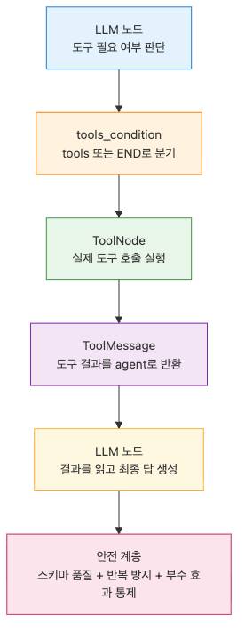

# 도구 호출 에이전트

핵심은 LLM이 똑똑해 보이느냐가 아닙니다. 도구 경로가 명시적이고, 추적 가능하며, 나중에 확장하기 쉬운가가 더 중요합니다. LangGraph 0.4.5 기준으로는 `ToolNode`와 `tools_condition` 조합이 이 루프를 가장 낮은 수준에서 깔끔하게 드러내는 패턴입니다.

이 글은 LangGraph 101 시리즈의 4번째 글입니다.

## 이 글에서 다룰 문제

- LangGraph 에이전트에서 `ToolNode`는 어떤 책임을 대신 맡을까요?
- `ChatGroq.bind_tools()`와 조건부 엣지는 어떻게 함께 동작할까요?
- 그래프는 언제 도구 루프를 멈추고 최종 답변으로 종료할까요?

> 도구 호출 에이전트는 하나의 루프입니다. 모델이 도구 필요 여부를 판단하고, `ToolNode`가 실제 호출을 실행하며, 모델은 그 결과를 읽고 나서 답변을 마무리합니다.

예제 코드: [github.com/yeongseon-books/langgraph-101](https://github.com/yeongseon-books/langgraph-101/tree/main/en/04-tool-calling-agent)


이 글에서 답할 질문

## 최소 실행 예제


agent와 tools 사이의 도구 루프

```python
import ast
import json
import math
import operator
from typing import Any, Callable

from langchain_core.messages import HumanMessage, SystemMessage
from langchain_core.tools import tool
from langchain_groq import ChatGroq
from langgraph.graph import END, START, MessagesState, StateGraph
from langgraph.prebuilt import ToolNode, tools_condition

ALLOWED_BINARY_OPERATORS = {
    ast.Add: operator.add,
    ast.Sub: operator.sub,
    ast.Mult: operator.mul,
    ast.Div: operator.truediv,
    ast.FloorDiv: operator.floordiv,
    ast.Mod: operator.mod,
    ast.Pow: operator.pow,
}
ALLOWED_UNARY_OPERATORS = {
    ast.UAdd: operator.pos,
    ast.USub: operator.neg,
}
ALLOWED_FUNCTIONS: dict[str, Callable[..., Any]] = {
    name: value
    for name, value in math.__dict__.items()
    if not name.startswith("_") and callable(value)
}
ALLOWED_CONSTANTS = {"pi": math.pi, "e": math.e, "tau": math.tau}

def evaluate_math_expression(expression: str) -> float:
    def _evaluate(node: ast.AST) -> float:
        if isinstance(node, ast.Constant) and isinstance(node.value, (int, float)):
            return float(node.value)
        if isinstance(node, ast.BinOp):
            left = _evaluate(node.left)
            right = _evaluate(node.right)
            operation = ALLOWED_BINARY_OPERATORS.get(type(node.op))
            if operation is None:
                raise ValueError("unsupported operator")
            return float(operation(left, right))
        if isinstance(node, ast.UnaryOp):
            operand = _evaluate(node.operand)
            operation = ALLOWED_UNARY_OPERATORS.get(type(node.op))
            if operation is None:
                raise ValueError("unsupported unary operator")
            return float(operation(operand))
        if isinstance(node, ast.Call) and isinstance(node.func, ast.Name):
            function = ALLOWED_FUNCTIONS.get(node.func.id)
            if function is None or node.keywords:
                raise ValueError("unsupported function")
            arguments = [_evaluate(argument) for argument in node.args]
            return float(function(*arguments))
        if isinstance(node, ast.Name):
            value = ALLOWED_CONSTANTS.get(node.id)
            if value is not None:
                return float(value)
            raise ValueError("unsupported constant")
        raise ValueError("unsupported expression")

    parsed = ast.parse(expression, mode="eval")
    return _evaluate(parsed.body)

@tool
def calculator(expression: str) -> str:
    """Evaluate an arithmetic expression with safe math functions like sqrt(16) or pi * 2."""

    try:
        result = evaluate_math_expression(expression)
    except Exception as exc:
        return f"calculation error: {exc}"
    return str(result)

@tool
def word_stats(text: str) -> str:
    """Return word and character counts for a piece of text."""

    return json.dumps({"words": len(text.split()), "characters": len(text)})

TOOLS = [calculator, word_stats]

def call_model(state: MessagesState):
    llm = ChatGroq(model="llama-3.3-70b-versatile", temperature=0.0, stop_sequences=None).bind_tools(TOOLS)
    system = SystemMessage(
        content="You are a precise assistant. Use tools for calculations or counting tasks."
    )
    response = llm.invoke([system, *state["messages"]])
    return {"messages": [response]}

def build_graph():
    graph = StateGraph(MessagesState)
    graph.add_node("agent", call_model)
    graph.add_node("tools", ToolNode(TOOLS))
    graph.add_edge(START, "agent")
    graph.add_conditional_edges("agent", tools_condition, {"tools": "tools", "__end__": END})
    graph.add_edge("tools", "agent")
    return graph.compile()

if __name__ == "__main__":
    app = build_graph()
    for question in [
        "What is sqrt(144) + 25? Use a tool.",
        "Count the words in this sentence: LangGraph makes tool loops explicit.",
    ]:
        result = app.invoke({"messages": [HumanMessage(content=question)]})
        print(f"Question: {question}")
        print(f"Answer: {result['messages'][-1].content}\n")
```

실행 파일: `/root/Github/langgraph-101/en/04-tool-calling-agent/main.py`

실행 방법:

```bash
export GROQ_API_KEY=... && python main.py
```

## 이 코드에서 먼저 봐야 할 점


도구 호출과 ToolMessage 흐름

- 도구의 docstring이 모델이 실제로 보는 사용 설명서가 됩니다.
- `ToolNode(TOOLS)`는 실행과 `ToolMessage` 생성 책임을 함께 맡습니다.
- `tools_condition`은 마지막 AI 메시지에 tool call이 있을 때만 `tools`로 보내고, 없으면 그래프를 종료합니다.

이 구조를 그래프로 분리해 두면 운영 포인트가 명확해집니다. 모델이 도구를 요청했는지, 도구가 성공했는지, 결과를 읽고 다시 답변했는지를 단계별로 확인할 수 있기 때문입니다. 단일 함수 안에 이 과정을 모두 넣으면 재시도, 로깅, 테스트 경계가 쉽게 흐려집니다.

## 어디서 자주 헷갈릴까요?


마지막 AI 메시지에서 갈라지는 분기

- 도구 실행을 모델 루프 안에 직접 넣으면 재시도와 로깅, 테스트가 필요 이상으로 복잡해집니다.
- `bind_tools()`는 모델이 도구를 요청하는 법만 알게 해 줄 뿐, 실행까지 해 주지는 않습니다.
- 결정적인 도구일수록 디버깅이 쉽습니다. 계산기는 `eval()` 대신 엄격한 산술 파서를 쓰는 편이 안전합니다.

실무에서는 여기서 보안과 관측성이 갈립니다. 도구 호출이 분리돼 있으면 권한 검사 노드, 타임아웃 정책, 실패 복구 노드를 옆에 붙이기 쉽습니다. 반대로 모델이 모든 것을 안에서 처리하게 두면, 실패했을 때 어느 계층이 문제인지 파악하기가 어렵습니다.

## 체크리스트

- [ ] 도구 설명이 입력과 출력 계약을 분명하게 담고 있는가
- [ ] `agent -> tools -> agent` 루프가 그래프에서 명시적으로 보이는가
- [ ] 도구가 필요 없는 답변은 바로 `END`로 종료되는가

## 정리



도구 사용 뒤 근거 있는 답변으로 돌아오는 루프

이 단계부터 LangGraph는 단순한 워크플로 도우미보다 에이전트 런타임에 가까운 느낌을 줍니다. 다음 글에서는 같은 패턴을 supervisor-worker 구조로 확장해, 여러 에이전트가 공유 상태 위에서 협력하는 방식을 살펴보겠습니다.

<!-- toc:begin -->
## 시리즈 목차

- [LangGraph 소개와 그래프 기초](./01-graph-basics.md)
- [상태 관리와 체크포인트](./02-state-and-checkpoints.md)
- [조건부 엣지와 분기 흐름](./03-conditional-edges.md)
- **도구 호출 에이전트 (현재 글)**
- 멀티 에이전트 시스템 (예정)
- LangGraph 완성 (예정)

<!-- toc:end -->

---

## 참고 자료

- [LangGraph tool-calling how-to](https://langchain-ai.github.io/langgraph/how-tos/tool-calling/)
- [ToolNode API reference](https://langchain-ai.github.io/langgraph/reference/prebuilt/#toolnode)
- [LangChain tool concepts](https://python.langchain.com/docs/concepts/tools/)

Tags: LangGraph, Agent, Python, LLM
