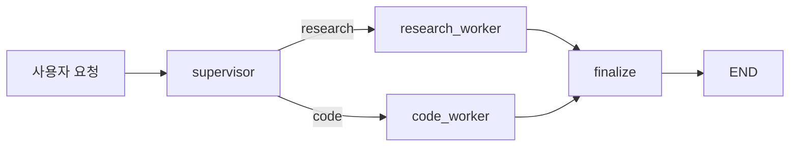

# 멀티 에이전트 시스템

## 이 글에서 답할 질문

- 감독자와 작업자 패턴을 LangGraph에서는 어떻게 표현할까요?
- supervisor 노드는 어떤 기준으로 worker를 선택해야 할까요?
- 여러 에이전트가 협력할 때 공유 상태는 어디까지 가져가야 할까요?

> 멀티 에이전트 그래프는 여러 LLM을 늘어놓는 구조가 아니라 누가 어떤 작업을 맡는지 상태와 엣지로 명시하는 구조입니다.

예제 코드: [github.com/yeongseon-books/langgraph-101](https://github.com/yeongseon-books/langgraph-101/tree/main/ko/05-multi-agent)

복잡한 요청을 하나의 에이전트에 모두 밀어 넣으면 프롬프트가 비대해지고 역할이 흐려집니다. 반대로 supervisor가 요청 성격을 판단하고 적절한 worker에게 넘기면 책임이 분리되고 그래프도 읽기 쉬워집니다.



## 최소 실행 예제

```python
import os
from typing import Literal, TypedDict

from langchain_core.messages import HumanMessage, SystemMessage
from langchain_groq import ChatGroq
from langgraph.graph import END, START, StateGraph

class SupervisorState(TypedDict):
    request: str
    route: str
    worker_result: str
    final_answer: str

def llm() -> ChatGroq:
    return ChatGroq(model="llama-3.1-8b-instant", temperature=0.0, api_key=os.environ["GROQ_API_KEY"])

def supervisor(state: SupervisorState) -> SupervisorState:
    request_lower = state["request"].lower()
    if any(keyword in request_lower for keyword in ("code", "python", "function", "implement", "write")):
        return {"route": "code"}
    if any(keyword in request_lower for keyword in ("what", "why", "explain", "concept")):
        return {"route": "research"}

    response = llm().invoke(
        [
            SystemMessage(content="Classify the request as research or code. Return only one label: research or code."),
            HumanMessage(content=state["request"]),
        ]
    )
    route = response.content.strip().lower()
    if route not in {"research", "code"}:
        route = "research"
    return {"route": route}

def route_to_worker(state: SupervisorState) -> Literal["research_worker", "code_worker"]:
    return "code_worker" if state["route"] == "code" else "research_worker"

def research_worker(state: SupervisorState) -> SupervisorState:
    response = llm().invoke(
        [
            SystemMessage(content="You are a research worker for the LangGraph framework in the LangChain ecosystem. Explain concepts with crisp bullet points and practical engineering language."),
            HumanMessage(content=state["request"]),
        ]
    )
    return {"worker_result": response.content}

def code_worker(state: SupervisorState) -> SupervisorState:
    response = llm().invoke(
        [
            SystemMessage(content="You are a coding worker for LangGraph tutorials. Produce short Python-focused answers with one small example."),
            HumanMessage(content=state["request"]),
        ]
    )
    return {"worker_result": response.content}

def finalize(state: SupervisorState) -> SupervisorState:
    final_answer = (
        f"Supervisor route: {state['route']}\n"
        f"Worker output:\n{state['worker_result']}"
    )
    return {"final_answer": final_answer}

def build_graph():
    graph = StateGraph(SupervisorState)
    graph.add_node("supervisor", supervisor)
    graph.add_node("research_worker", research_worker)
    graph.add_node("code_worker", code_worker)
    graph.add_node("finalize", finalize)

    graph.add_edge(START, "supervisor")
    graph.add_conditional_edges(
        "supervisor",
        route_to_worker,
        {"research_worker": "research_worker", "code_worker": "code_worker"},
    )
    graph.add_edge("research_worker", "finalize")
    graph.add_edge("code_worker", "finalize")
    graph.add_edge("finalize", END)
    return graph.compile()
```

실행 파일: `/root/Github/langgraph-101/ko/05-multi-agent/main.py`

실행:

```bash
export GROQ_API_KEY=... && python main.py
```

## 이 코드에서 봐야 할 것

- supervisor는 직접 답을 만들지 않고 `route`만 결정합니다.
- worker는 각자 `worker_result` 같은 공유 필드에 결과를 씁니다.
- `finalize`가 마지막 조립만 맡기 때문에 worker 수가 늘어나도 정리 지점이 흔들리지 않습니다.

## 실무에서 헷갈리는 지점

- 멀티 에이전트라고 해서 그래프가 자동으로 똑똑해지지는 않습니다. 역할 경계가 애매하면 단일 에이전트보다 더 나빠질 수 있습니다.
- supervisor가 분류도 하고 답변도 하게 만들면 결국 거대한 단일 에이전트로 되돌아갑니다.
- 공유 상태를 과하게 넓히면 worker 간 결합도가 높아집니다. 필요한 결과 필드만 남기는 편이 좋습니다.

## 체크리스트

- [ ] supervisor와 worker 책임이 문장으로 분리 설명되는가
- [ ] worker 출력 필드가 명시적으로 구분돼 있는가
- [ ] 최종 조립 노드가 있어 디버깅 지점이 분명한가

## 정리

멀티 에이전트의 핵심은 LLM 개수가 아니라 작업 위임 구조입니다. 마지막 글에서는 지금까지 만든 체크포인트, 조건 분기, 도구 호출을 한 그래프로 합쳐 전체 LangGraph 에이전트를 완성하겠습니다.

<!-- blog-only:start -->
다음 글: [LangGraph 완성](./06-langgraph-complete.md)
<!-- blog-only:end -->

<!-- toc:begin -->
## 시리즈 목차

- [LangGraph 소개와 그래프 기초](./01-graph-basics.md)
- [상태 관리와 체크포인트](./02-state-and-checkpoints.md)
- [조건부 엣지와 분기 흐름](./03-conditional-edges.md)
- [도구 호출 에이전트](./04-tool-calling-agent.md)
- **멀티 에이전트 시스템 (현재 글)**
- LangGraph 완성 (예정)

<!-- toc:end -->

---

## 참고 자료

- [LangGraph multi-agent concepts](https://langchain-ai.github.io/langgraph/concepts/multi_agent/)
- [LangGraph supervisor tutorial](https://langchain-ai.github.io/langgraph/tutorials/multi_agent/agent_supervisor/)
- [LangGraph multi-agent network guide](https://langchain-ai.github.io/langgraph/how-tos/multi-agent-network/)

Tags: LangGraph, Agent, Python, LLM
