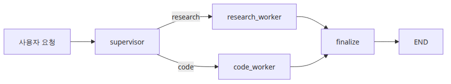
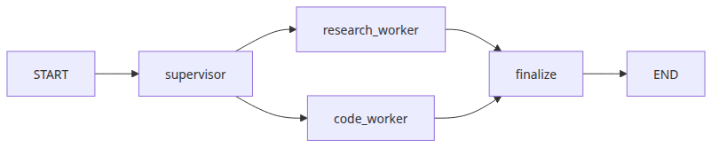
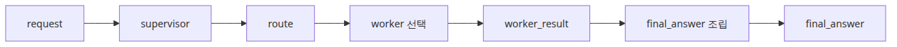
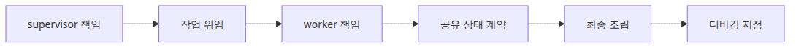
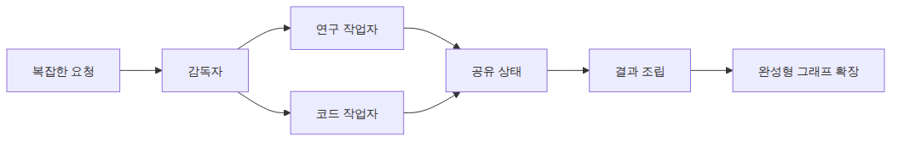

# 멀티 에이전트 시스템

## 이 글에서 다룰 문제

- LangGraph에서 supervisor-worker 패턴을 어떻게 표현할 수 있을까요?
- supervisor 노드는 worker에게 일을 넘기기 전에 무엇을 결정해야 할까요?
- 여러 에이전트가 공유하는 상태는 어느 정도까지 열어 두는 편이 좋을까요?

> 멀티 에이전트 그래프는 단순히 LLM 호출 수를 늘리는 구조가 아닙니다. 역할, 위임, 상태 경계를 명시적으로 드러내는 설계라고 봐야 합니다.

예제 코드: [github.com/yeongseon-books/langgraph-101](https://github.com/yeongseon-books/langgraph-101/tree/main/en/05-multi-agent)

복잡한 요청을 하나의 거대한 에이전트에 모두 밀어 넣으면 프롬프트가 비대해지고 역할 경계가 흐려집니다. supervisor-worker 그래프는 라우팅, 실제 작업, 최종 조립을 별도 노드로 나눠서 이 문제를 줄입니다.



이 글에서 답할 질문

## 최소 실행 예제



supervisor가 worker에게 위임하는 구조

```python
import os
from typing import Literal, TypedDict

from langchain_core.messages import HumanMessage, SystemMessage
from langchain_groq import ChatGroq
from langgraph.graph import END, START, StateGraph

class SupervisorState(TypedDict):
    request: str
    route: str
    worker_result: str
    final_answer: str

def llm() -> ChatGroq:
    return ChatGroq(model="llama-3.1-8b-instant", temperature=0.0, api_key=os.environ["GROQ_API_KEY"])

def supervisor(state: SupervisorState) -> SupervisorState:
    request_lower = state["request"].lower()
    if any(keyword in request_lower for keyword in ("code", "python", "function", "implement", "write")):
        return {"route": "code"}
    if any(keyword in request_lower for keyword in ("what", "why", "explain", "concept")):
        return {"route": "research"}

    response = llm().invoke(
        [
            SystemMessage(content="Classify the request as research or code. Return only one label: research or code."),
            HumanMessage(content=state["request"]),
        ]
    )
    route = response.content.strip().lower()
    if route not in {"research", "code"}:
        route = "research"
    return {"route": route}

def route_to_worker(state: SupervisorState) -> Literal["research_worker", "code_worker"]:
    return "code_worker" if state["route"] == "code" else "research_worker"

def research_worker(state: SupervisorState) -> SupervisorState:
    response = llm().invoke(
        [
            SystemMessage(content="You are a research worker for the LangGraph framework in the LangChain ecosystem. Explain concepts with crisp bullet points and practical engineering language."),
            HumanMessage(content=state["request"]),
        ]
    )
    return {"worker_result": response.content}

def code_worker(state: SupervisorState) -> SupervisorState:
    response = llm().invoke(
        [
            SystemMessage(content="You are a coding worker for LangGraph tutorials. Produce short Python-focused answers with one small example."),
            HumanMessage(content=state["request"]),
        ]
    )
    return {"worker_result": response.content}

def finalize(state: SupervisorState) -> SupervisorState:
    final_answer = (
        f"Supervisor route: {state['route']}\n"
        f"Worker output:\n{state['worker_result']}"
    )
    return {"final_answer": final_answer}

def build_graph():
    graph = StateGraph(SupervisorState)
    graph.add_node("supervisor", supervisor)
    graph.add_node("research_worker", research_worker)
    graph.add_node("code_worker", code_worker)
    graph.add_node("finalize", finalize)

    graph.add_edge(START, "supervisor")
    graph.add_conditional_edges(
        "supervisor",
        route_to_worker,
        {"research_worker": "research_worker", "code_worker": "code_worker"},
    )
    graph.add_edge("research_worker", "finalize")
    graph.add_edge("code_worker", "finalize")
    graph.add_edge("finalize", END)
    return graph.compile()
```

실행 파일: `/root/Github/langgraph-101/en/05-multi-agent/main.py`

실행 방법:

```bash
export GROQ_API_KEY=... && python main.py
```

## 이 코드에서 먼저 봐야 할 점



route와 worker_result가 상태를 따라 흐르는 구조

- supervisor는 경로를 결정하지만, 요청 자체에 답하려고 들지 않습니다.
- worker는 `worker_result` 같은 전용 공유 필드에만 결과를 기록합니다.
- `finalize`가 답변 조립을 한곳에서 맡기 때문에, 나중에 worker가 늘어나도 구조가 흔들리지 않습니다.

이 설계의 핵심은 역할 경계입니다. supervisor는 분류와 위임만, worker는 실제 작업만, finalize는 출력 정리만 담당해야 그래프가 읽힙니다. 역할을 섞기 시작하면 멀티 에이전트처럼 보여도 결국 단일 거대 프롬프트 구조로 되돌아가기 쉽습니다.

## 어디서 자주 헷갈릴까요?



supervisor와 worker 사이의 역할 경계

- 멀티 에이전트라고 해서 자동으로 더 좋은 결과가 나오지는 않습니다. 역할 경계가 약하면 오히려 단일 에이전트보다 품질이 떨어질 수 있습니다.
- supervisor가 실질적인 작업까지 하면 구조는 다시 모놀리식하게 무너집니다.
- 상태를 과하게 공유하면 결합도가 올라갑니다. 대부분의 worker는 작고 명시적인 계약만 필요합니다.

운영 관점에서도 상태를 많이 공유할수록 문제가 커집니다. 어떤 worker가 어떤 필드를 읽고 썼는지 추적하기 어려워지고, 작은 수정이 다른 노드의 동작을 흔들 수 있습니다. 그래서 멀티 에이전트에서는 모델 선택보다 상태 인터페이스 설계가 더 중요할 때가 많습니다.

## 체크리스트

- [ ] supervisor와 worker의 책임을 각각 한 문장으로 설명할 수 있는가
- [ ] worker 출력이 의미 있는 이름의 필드에 저장되는가
- [ ] 디버깅과 확장을 위한 전용 최종 조립 노드가 있는가

## 정리



하나의 supervisor 아래 협력하는 토폴로지

멀티 에이전트 설계의 핵심은 모델 수가 아니라 위임 구조입니다. 다음 글에서는 체크포인트, 라우팅, 도구 호출 루프를 하나의 완성형 LangGraph 예제로 합쳐 보겠습니다.

<!-- toc:begin -->
## 시리즈 목차

- [LangGraph 소개와 그래프 기초](./01-graph-basics.md)
- [상태 관리와 체크포인트](./02-state-and-checkpoints.md)
- [조건부 엣지와 분기 흐름](./03-conditional-edges.md)
- [도구 호출 에이전트](./04-tool-calling-agent.md)
- **멀티 에이전트 시스템 (현재 글)**
- LangGraph 완성 (예정)

<!-- toc:end -->

---

## 참고 자료

- [LangGraph multi-agent concepts](https://langchain-ai.github.io/langgraph/concepts/multi_agent/)
- [LangGraph supervisor tutorial](https://langchain-ai.github.io/langgraph/tutorials/multi_agent/agent_supervisor/)
- [LangGraph multi-agent network guide](https://langchain-ai.github.io/langgraph/how-tos/multi-agent-network/)

Tags: LangGraph, Agent, Python, LLM
