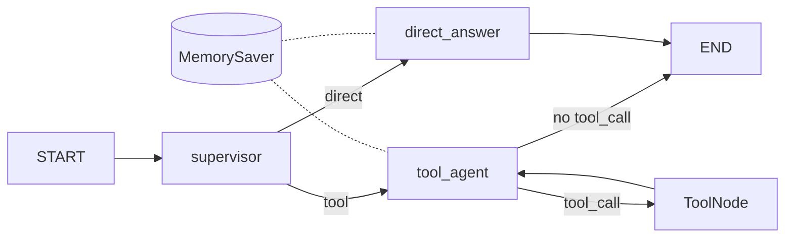

# LangGraph 완성

> LangGraph 101 시리즈 (6/6)

## 이 글에서 다룰 문제

*에이전트* *프로토타입* 의 *완성형* 은 *하나* 의 *큰* *프롬프트* 가 *아닙니다*. *분기*, *도구*, *기억* 이 *각각* *다른* *책임* 으로 *그래프* 위에 *올라가야* *유지보수* 가 *가능* *합니다*. 이 글은 *시리즈* *전체* 의 *조각* 을 *하나* 의 *예제* 로 *모읍니다*.

## 개념 한눈에 보기



## Before/After

**Before**: "*하나* 의 *프롬프트* 가 *분류*, *답변*, *도구* *호출* 을 *모두* *해야* *합니다*."

**After**: "*supervisor* + *direct/tool* *분기* + *체크포인터* 가 *각자* *역할* 을 *맡습니다*."

## 실습: 완성형 그래프 5단계

### 1단계 — 도구와 상태 정의

```python
import json, os
from langchain_core.tools import tool
from langgraph.graph import MessagesState

os.environ.setdefault("GROQ_API_KEY", "your-key-here")

@tool
def add(a: int, b: int) -> int:
    """Add two integers."""
    return a + b

@tool
def word_stats(text: str) -> str:
    """Return word and character counts as JSON."""
    return json.dumps({"words": len(text.split()), "characters": len(text)})

TOOLS = [add, word_stats]

class CompleteState(MessagesState):
    route: str
```

### 2단계 — supervisor와 라우팅

```python
from typing import Literal, cast

def supervisor(state: CompleteState) -> dict:
    text = str(state["messages"][-1].content).lower()
    use_tool = any(k in text for k in ("count", "calculate", "add", "math"))
    return {"route": "tool_agent" if use_tool else "direct_answer"}

def route_after_supervisor(state: CompleteState) -> Literal["direct_answer", "tool_agent"]:
    return cast(Literal["direct_answer", "tool_agent"], state["route"])
```

### 3단계 — direct와 tool agent

```python
from langchain_core.messages import SystemMessage
from langchain_groq import ChatGroq

def base_llm() -> ChatGroq:
    return ChatGroq(model="llama-3.3-70b-versatile", temperature=0)

def direct_answer(state: CompleteState) -> dict:
    sys = SystemMessage(content="Answer clearly using prior conversation when relevant.")
    response = base_llm().invoke([sys, *state["messages"]])
    return {"messages": [response]}

def tool_agent(state: CompleteState) -> dict:
    sys = SystemMessage(content="Use tools for arithmetic or counting. Then answer briefly.")
    response = base_llm().bind_tools(TOOLS).invoke([sys, *state["messages"]])
    return {"messages": [response]}
```

### 4단계 — 그래프 빌드

```python
from langgraph.graph import StateGraph, START, END
from langgraph.prebuilt import ToolNode, tools_condition
from langgraph.checkpoint.memory import MemorySaver

builder = StateGraph(CompleteState)
builder.add_node("supervisor", supervisor)
builder.add_node("direct_answer", direct_answer)
builder.add_node("tool_agent", tool_agent)
builder.add_node("tools", ToolNode(TOOLS))

builder.add_edge(START, "supervisor")
builder.add_conditional_edges(
    "supervisor",
    route_after_supervisor,
    {"direct_answer": "direct_answer", "tool_agent": "tool_agent"},
)
builder.add_edge("direct_answer", END)
builder.add_conditional_edges("tool_agent", tools_condition, {"tools": "tools", "__end__": END})
builder.add_edge("tools", "tool_agent")

app = builder.compile(checkpointer=MemorySaver())
```

### 5단계 — 멀티턴 실행

```python
from langchain_core.messages import HumanMessage

config = {"configurable": {"thread_id": "complete-demo"}}

first = app.invoke(
    {"messages": [HumanMessage(content="Explain explicit state in LangGraph.")], "route": ""},
    config=config,
)
print("Turn 1:", first["messages"][-1].content)

second = app.invoke(
    {"messages": [HumanMessage(content="Now use a tool to calculate add(81, 5).")]},
    config=config,
)
print("Turn 2:", second["messages"][-1].content)
print("저장된 메시지 수:", len(app.get_state(config).values["messages"]))
```

## 이 코드에서 주목할 점

- *supervisor* 가 *direct path* 와 *tool path* 를 *먼저* *나눕니다*. *모든* *질문* 을 *도구* *루프* 로 *보내지* *않습니다*.
- *tool_agent → ToolNode → tool_agent* *루프* 가 *계산형* *질문* 만 *처리* 합니다.
- *MemorySaver* 덕에 *두* *번째* *invoke* 는 *과거* *맥락* 위에 *이어* *집니다*.

## 자주 하는 실수 5가지

1. ***모든 질문 tool path*** — *불필요* 한 *호출* 로 *느리고* *비싸* *집니다*.
2. ***체크포인터 미부착*** — *direct path* 도 *멀티턴* *기억* 을 *잃습니다*.
3. ***route 필드 미정의*** — *MessagesState* 만 *쓰면* *supervisor* *결과* 가 *유실* 됩니다.
4. ***tool path 만 ToolNode*** — *direct path* 도 *tools_condition* 을 *연결* 하면 *행* 됩니다.
5. ***평가 체계 부재*** — *완성형* 이라도 *회귀 테스트* 가 *없으면* *개선* 이 *불가능* 합니다.

## 실무에서는 이렇게 쓰입니다

*프로덕션* *에이전트* 도 *대부분* *이* *형태* 의 *변형* 입니다. *supervisor* 가 *intent* 분류, *worker* 가 *역할별* 처리, *tool path* 가 *외부* *호출*, *체크포인터* 가 *대화* *상태* 를 *책임* *집니다*. *LangSmith* 가 *각* *경로* 의 *지연* 과 *비용* 을 *시각화* 합니다.

## 체크리스트

- [ ] *direct* 와 *tool* *경로* 가 *분리*.
- [ ] *route* 필드 가 *상태* 에 *명시*.
- [ ] *MemorySaver* 부착 후 *thread_id* 사용.
- [ ] *tools_condition* *path_map* 에 *END* 포함.

## 정리 및 다음 단계

이 *시리즈* 의 *핵심* 은 *LangGraph API* 를 *외우는* 것 이 *아니라* *상태*, *엣지*, *체크포인트* 를 *조합* 해 *흐름* 을 *설계* 하는 *감각* 입니다. 다음 단계 로 *LangSmith* *추적*, *영속* *체크포인터* (*Postgres*, *Redis*), *human-in-the-loop* *interrupt* 패턴을 살펴보세요.

<!-- toc:begin -->
## 시리즈 목차

- [LangGraph 소개와 그래프 기초](./01-graph-basics.md)
- [상태 관리와 체크포인트](./02-state-and-checkpoints.md)
- [조건부 엣지와 분기 흐름](./03-conditional-edges.md)
- [도구 호출 에이전트](./04-tool-calling-agent.md)
- [멀티 에이전트 시스템](./05-multi-agent.md)
- **LangGraph 완성 (현재 글)**

<!-- toc:end -->

## 참고 자료

- [LangGraph tutorials](https://langchain-ai.github.io/langgraph/tutorials/)
- [Persistence guide](https://langchain-ai.github.io/langgraph/concepts/persistence/)
- [Prebuilt components](https://langchain-ai.github.io/langgraph/reference/prebuilt/)
- [Human-in-the-loop concepts](https://langchain-ai.github.io/langgraph/concepts/human_in_the_loop/)

Tags: LangGraph, Agent, Python, LLM
