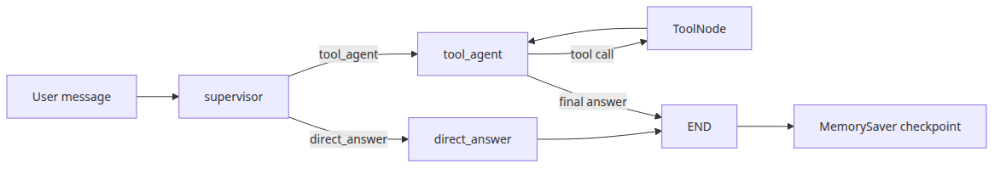
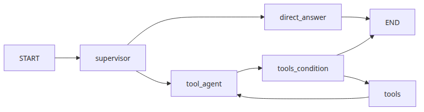
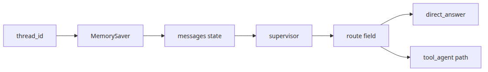
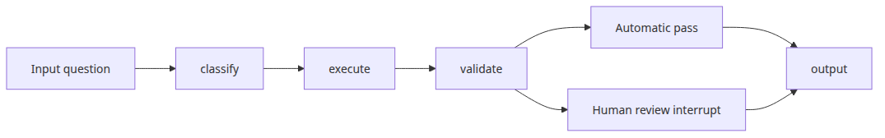
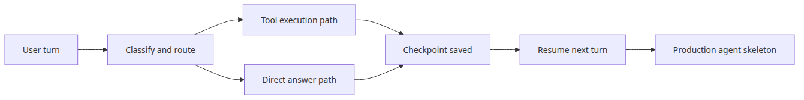

# LangGraph 완성
이 글은 LangGraph 101 시리즈의 마지막 글입니다. 시리즈를 여기까지 따라오면 질문이 바뀝니다. 노드와 엣지를 그릴 수 있는가, 체크포인트를 붙일 수 있는가, 도구를 호출할 수 있는가를 각각 묻는 단계는 이미 지났습니다. 이제 더 중요한 질문은 이것입니다. 이 조각들을 한 그래프 안에 합쳤을 때도 여전히 설명 가능하고, 복구 가능하고, 운영 가능한가입니다.

현업에서 “완성형” 에이전트가 무너지는 장면은 대개 비슷합니다. 단순한 질문도 불필요하게 tool loop로 보내서 지연과 비용이 커지고, checkpoint는 붙어 있는데 route 판단 근거가 흐려서 재개 뒤 동작을 설명하기 어려워지며, supervisor 비슷한 분기 로직이 실제 답변 생성까지 끌어안으면서 구조가 다시 거대한 단일 프롬프트로 돌아갑니다. 겉으로는 기능을 다 붙인 것처럼 보여도, 안쪽에서는 책임 분리가 사라진 상태입니다.

그래서 이 장은 기능을 하나 더 추가하는 글이 아닙니다. 앞선 글에서 본 개념들을 하나의 운영 골격으로 묶는 글입니다. 체크포인트는 문맥을 이어 붙이고, supervisor는 직접 답할지 도구 경로로 보낼지 결정하며, tool loop는 전체 그래프를 오염시키지 않고 필요한 요청에서만 열립니다. 이 조합이 잡혀야 비로소 튜토리얼 밖에서도 써 볼 만한 구조가 됩니다.

여기서는 **직접 답변 경로와 도구 경로를 분리하고, 그 전체 대화를 같은 상태 타임라인 위에 저장하는 구조**를 읽어 보겠습니다. 완성형 LangGraph를 볼 때 먼저 확인할 것은 세 가지입니다. 어떤 요청이 굳이 도구로 가는지, tool loop가 어디서 끝나는지, 그리고 다음 턴이 시작될 때 이전 판단과 결과가 어떤 상태로 되살아나는지입니다. 이 세 가지가 선명하면 그래프는 커져도 읽힙니다.

## 이 글에서 다룰 문제
- routing, tool calling, checkpoint를 한 그래프 안에서 어떻게 결합할 수 있을까요?
- 직접 설명으로 끝내야 할 질문과 도구를 반드시 거쳐야 할 질문은 어디서 분리해야 할까요?
- 같은 `thread_id` 아래에서 첫 턴의 개념 설명과 두 번째 턴의 계산 요청은 어떻게 하나의 대화로 이어질까요?
- `tool_agent -> ToolNode -> tool_agent` 루프는 어떤 요청에서만 열리고, 어디서 명시적으로 끝나야 할까요?
- 체크포인트가 붙어 있어도 route 설계가 약하면 어떤 종류의 혼선이 반복될까요?
- “이제 production-ready한 골격이다”라고 말하기 전에 최소한 무엇을 검증해야 할까요?


*이 글에서 답할 질문*

## 왜 이 글이 중요한가
완성형 예제가 중요한 이유를 “기능이 다 들어 있으니까” 정도로 설명하면 충분하지 않습니다. 더 현실적인 이유는 운영 경계가 여기서 한꺼번에 만난다는 점입니다. routing이 잘못되면 필요 없는 tool loop가 열리고, tool loop가 과하면 비용과 지연이 늘고, checkpoint 설계가 약하면 다음 턴에서 왜 그런 판단이 나왔는지 재구성하기 어려워집니다. 각 요소를 따로 배울 때는 보이지 않던 문제가, 합치는 순간 드러납니다.

예를 들어 사용자가 먼저 LangGraph의 상태 모델을 물었다가, 다음 턴에서 `sqrt(81) + 5`를 계산해 달라고 요청한다고 해 보겠습니다. 이때 첫 번째 질문은 직접 설명 경로로 가는 편이 낫고, 두 번째 질문은 도구 경로로 가야 안전합니다. 그런데 분리가 약하면 두 질문이 모두 같은 프롬프트 안에서 처리되거나, 반대로 둘 다 도구를 거치게 됩니다. 전자는 통제 불가능한 답변을 만들고, 후자는 과한 실행 비용을 만듭니다.

저는 팀들이 이 완성형 조합을 너무 늦게 검토해서, 개별 기능은 다 잘 동작하는데 전체 시스템은 설명하기 어려운 상태를 자주 봤습니다. checkpoint는 있는데 왜 맥락이 흐리지, tool calling은 있는데 왜 필요 없는 요청에도 도구를 부르지, route는 있는데 왜 supervisor가 실제 답까지 하려고 들지 같은 문제가 여기서 한꺼번에 튀어나옵니다. 그래서 이 글의 목표는 “LangGraph 기능 종합본”이 아니라, **상태, 분기, 도구 실행, 재개 가능한 대화를 하나의 운영 모델로 읽는 감각**을 만드는 데 있습니다.

## LangGraph를 이해하는 가장 좋은 방법: 완성형 에이전트는 하나의 거대한 프롬프트가 아니라, 협력하는 상태 기계다
마지막 글에서 가장 먼저 잡아야 할 문장은 이것입니다. **완성형 LangGraph 에이전트는 하나의 거대한 프롬프트가 아니라, supervisor 성격의 분기 로직·tool loop·checkpoint가 명시적 전이로 협력하는 상태 기계**입니다.

> 완성형 에이전트의 핵심은 기능 수가 아닙니다. 어떤 요청을 직접 답하고, 어떤 요청을 도구로 보내며, 그 전체 대화를 어떤 상태 타임라인에 남길지가 분리돼 있어야 운영 가능한 시스템이 됩니다.

많은 입문자가 마지막 단계에서 다시 프롬프트 중심 사고로 돌아갑니다. “강한 모델 하나에 규칙을 다 넣으면 되지 않을까?”라는 생각입니다. 짧은 데모에서는 가능해 보일 수 있습니다. 하지만 운영에서는 직접 답변 경로, 계산·카운팅 같은 도구 경로, 다음 턴 재개를 위한 상태 저장이 서로 다른 책임을 가집니다. 이를 한곳에 뭉개면 어느 지점에서 비용이 생기고, 어느 경로에서 실패했는지, 왜 다음 턴이 이전 맥락을 그렇게 읽었는지가 흐려집니다.

완성형 그래프를 읽을 때는 네 가지만 먼저 붙잡으면 됩니다. supervisor route가 direct path와 tool path를 분리하는가, `ToolNode` 루프가 필요한 요청에서만 열리는가, checkpoint가 전체 메시지 타임라인을 붙잡는가, 종료 규칙이 명시적인가입니다. 마지막 예제의 운영 질문은 거의 모두 여기에서 나옵니다.

## 최소 실행 예제
이제 시리즈에서 다룬 요소를 하나로 묶어 보겠습니다. 예제는 두 경로를 모두 보여 줍니다. 첫 번째 턴에서는 LangGraph 개념 질문에 직접 답하고, 두 번째 턴에서는 계산 요청을 tool loop로 보냅니다. 그리고 두 턴 모두 같은 `thread_id` 아래에서 저장해, 마지막에 checkpoint 상태를 확인합니다.


*supervisor와 tool loop가 결합된 통합 그래프*

```python
import ast
import json
import math
import operator
from typing import Any, Callable, Literal, cast

from langchain_core.messages import HumanMessage, SystemMessage
from langchain_core.runnables import RunnableConfig
from langchain_core.tools import tool
from langchain_groq import ChatGroq
from langgraph.checkpoint.memory import MemorySaver
from langgraph.graph import END, START, MessagesState, StateGraph
from langgraph.prebuilt import ToolNode, tools_condition

ALLOWED_BINARY_OPERATORS = {
    ast.Add: operator.add,
    ast.Sub: operator.sub,
    ast.Mult: operator.mul,
    ast.Div: operator.truediv,
    ast.FloorDiv: operator.floordiv,
    ast.Mod: operator.mod,
    ast.Pow: operator.pow,
}
ALLOWED_UNARY_OPERATORS = {
    ast.UAdd: operator.pos,
    ast.USub: operator.neg,
}
ALLOWED_FUNCTIONS: dict[str, Callable[..., Any]] = {
    name: value
    for name, value in math.__dict__.items()
    if not name.startswith("_") and callable(value)
}
ALLOWED_CONSTANTS = {"pi": math.pi, "e": math.e, "tau": math.tau}

def evaluate_math_expression(expression: str) -> float:
    def _evaluate(node: ast.AST) -> float:
        if isinstance(node, ast.Constant) and isinstance(node.value, (int, float)):
            return float(node.value)
        if isinstance(node, ast.BinOp):
            left = _evaluate(node.left)
            right = _evaluate(node.right)
            operation = ALLOWED_BINARY_OPERATORS.get(type(node.op))
            if operation is None:
                raise ValueError("unsupported operator")
            return float(operation(left, right))
        if isinstance(node, ast.UnaryOp):
            operand = _evaluate(node.operand)
            operation = ALLOWED_UNARY_OPERATORS.get(type(node.op))
            if operation is None:
                raise ValueError("unsupported unary operator")
            return float(operation(operand))
        if isinstance(node, ast.Call) and isinstance(node.func, ast.Name):
            function = ALLOWED_FUNCTIONS.get(node.func.id)
            if function is None or node.keywords:
                raise ValueError("unsupported function")
            arguments = [_evaluate(argument) for argument in node.args]
            return float(function(*arguments))
        if isinstance(node, ast.Name):
            value = ALLOWED_CONSTANTS.get(node.id)
            if value is not None:
                return float(value)
            raise ValueError("unsupported constant")
        raise ValueError("unsupported expression")

    parsed = ast.parse(expression, mode="eval")
    return _evaluate(parsed.body)

@tool
def calculator(expression: str) -> str:
    """Evaluate an arithmetic expression with safe math functions like sqrt(16) or pi * 2."""

    try:
        result = evaluate_math_expression(expression)
    except Exception as exc:
        return f"calculation error: {exc}"
    return str(result)

@tool
def word_stats(text: str) -> str:
    """Return word and character counts for a piece of text."""

    return json.dumps({"words": len(text.split()), "characters": len(text)})

TOOLS = [calculator, word_stats]

class CompleteState(MessagesState):
    route: str

def base_llm() -> ChatGroq:
    return ChatGroq(model="llama-3.3-70b-versatile", temperature=0.0, stop_sequences=None)

def supervisor(state: CompleteState) -> dict[str, str]:
    latest_question = str(state["messages"][-1].content).lower()
    if any(keyword in latest_question for keyword in ("count", "calculate", "math", "sqrt")):
        route = "tool_agent"
    else:
        route = "direct_answer"
    return {"route": route}

def route_after_supervisor(state: CompleteState) -> Literal["direct_answer", "tool_agent"]:
    return cast(Literal["direct_answer", "tool_agent"], state["route"])

def direct_answer(state: CompleteState) -> dict[str, object]:
    system = SystemMessage(
        content=(
            "You are explaining LangGraph from the LangChain ecosystem. "
            "Answer clearly using the full conversation history when it matters."
        )
    )
    response = base_llm().invoke([system, *state["messages"]])
    return {"messages": [response]}

def tool_agent(state: CompleteState) -> dict[str, object]:
    system = SystemMessage(
        content=(
            "You are a precise assistant. Use tools for calculations or counting tasks, "
            "then answer in one concise paragraph."
        )
    )
    response = base_llm().bind_tools(TOOLS).invoke([system, *state["messages"]])
    return {"messages": [response]}

def build_graph():
    graph = StateGraph(CompleteState)
    graph.add_node("supervisor", supervisor)
    graph.add_node("direct_answer", direct_answer)
    graph.add_node("tool_agent", tool_agent)
    graph.add_node("tools", ToolNode(TOOLS))

    graph.add_edge(START, "supervisor")
    graph.add_conditional_edges(
        "supervisor",
        route_after_supervisor,
        {"direct_answer": "direct_answer", "tool_agent": "tool_agent"},
    )
    graph.add_edge("direct_answer", END)
    graph.add_conditional_edges("tool_agent", tools_condition, {"tools": "tools", "__end__": END})
    graph.add_edge("tools", "tool_agent")

    return graph.compile(checkpointer=MemorySaver())

if __name__ == "__main__":
    app = build_graph()
    config: RunnableConfig = {"configurable": {"thread_id": "complete-demo"}}

    first = app.invoke(
        {"messages": [HumanMessage(content="Explain what explicit state means in LangGraph.")], "route": ""},
        config=config,
    )
    print("First turn:")
    print(first["messages"][-1].content)

    second = app.invoke(
        {"messages": [HumanMessage(content="Now calculate sqrt(81) + 5 and use a tool.")]},
        config=config,
    )
    print("\nSecond turn:")
    print(second["messages"][-1].content)

    snapshot = app.get_state(config)
    print(f"\nCheckpoint message count: {len(snapshot.values['messages'])}")
```

이 예제는 시리즈 마지막 예제로서 의도적으로 과하지 않게 구성돼 있습니다. direct path, tool path, checkpoint만 넣고도 이미 운영에 필요한 핵심 골격이 모두 보입니다. 첫 번째 턴은 supervisor가 `direct_answer`로 보내고, 두 번째 턴은 `tool_agent`와 `ToolNode` 루프를 열며, 마지막에는 `app.get_state(config)`로 실제 저장 상태를 확인합니다. route를 잘못 잡으면 첫 턴부터 비용이 새고, tool loop 종료가 약하면 두 번째 턴에서 불필요한 왕복이 생기고, checkpoint가 없으면 “같은 대화 안에서 두 종류의 요청을 처리했다”는 사실 자체가 사라집니다.

예제 코드: [github.com/yeongseon-books/langgraph-101](https://github.com/yeongseon-books/langgraph-101/tree/main/en/06-langgraph-complete)

## 이 코드에서 먼저 봐야 할 점

*checkpoint와 route 상태 구조*

- supervisor는 최신 질문만 보고 `direct_answer`와 `tool_agent`를 분리합니다.
- `tool_agent -> ToolNode -> tool_agent` 루프는 도구가 필요한 경우에만 열립니다.
- `compile(checkpointer=MemorySaver())`가 턴 전체를 같은 대화 타임라인으로 묶어 줍니다.

첫 번째 포인트는 route의 절제입니다. supervisor는 복잡한 답변을 만들지 않고, 지금 요청이 어떤 종류인지 판단하는 데 집중합니다. route를 고르던 노드가 “어차피 내가 답도 조금 써 줄게”라고 역할을 넓히기 시작하면 direct path와 tool path가 다시 프롬프트 한 덩어리로 섞입니다.

두 번째 포인트는 loop의 격리이고, 세 번째 포인트는 checkpoint의 범위입니다. `ToolNode`를 거치는 왕복은 필요한 요청에서만 열려야 하며, 여기서는 tool 결과만이 아니라 전체 메시지 타임라인을 저장합니다. 그래서 첫 번째 턴의 개념 설명 뒤에 두 번째 턴이 들어와도 같은 대화 위에서 계속 읽힙니다. 완성형 그래프에서 checkpoint는 옵션이 아니라 여러 실행 경로를 하나의 세션으로 묶는 접착제에 가깝습니다.

## 어디서 자주 헷갈릴까요?
완성형 예제에서 가장 흔한 오해는 “이제 기능이 다 들어갔으니 거의 끝났다”는 기대입니다. 실제로는 이 단계부터 안티패턴도 더 선명하게 드러납니다. direct path, tool path, checkpoint 중 하나라도 경계가 약하면 나머지 둘이 멀쩡해 보여도 전체 시스템은 금방 흔들립니다.


*human review interrupt가 포함된 검증 경로*

- 모든 요청을 tool loop로 보내면 agent는 필요 이상으로 느리고 비싸집니다.
- checkpoint가 있어도 route 기준이 복잡하면 왜 그 경로를 탔는지 설명하기 어려워집니다.
- 도구 실행은 평가가 아닙니다. 안전한 parser, 회귀 테스트, 필요하면 human review 경로가 따로 필요합니다.

여기서 가장 자주 보는 사고는 **Everything-is-a-Tool 안티패턴**입니다. 계산이든 개념 질문이든 전부 도구 경로로 보내는 방식입니다. 처음에는 구현이 단순해 보일 수 있습니다. 하지만 실제로는 도구가 필요 없는 질문까지 `bind_tools()` 호출과 loop 판단을 거치면서 지연과 비용이 누적됩니다. 더 나쁜 경우에는 모델이 굳이 도구를 써야 한다고 착각해 불필요한 호출을 반복합니다.

또 다른 함정은 **Checkpoint가 있으니 복잡한 route도 괜찮다**는 생각과 tool 성공을 곧바로 정답으로 착각하는 태도입니다. 저장된다는 사실과 설명 가능하다는 사실은 다르고, `calculator`가 안전한 AST parser를 쓰는 이유도 여기 있습니다. production에서는 회귀 케이스와 필요 시 human-review interrupt 경로를 별도로 둬야 합니다.

## 첫 번째 운영 체크리스트
완성형 그래프를 처음 묶는 순간부터 아래 항목은 기능 확인이 아니라 운영 가능성 점검 항목이 됩니다.

- [ ] 직접 응답 경로와 도구 경로가 명확하게 분리되어 있는가
- [ ] 같은 `thread_id`로 두 턴 이상 실행했을 때 대화가 예상대로 이어지는가
- [ ] 도구가 필요한 질문과 필요 없는 질문이 의도한 경로로 라우팅되는가
- [ ] tool loop 종료 조건이 명시적으로 드러나는가
- [ ] 계산기 같은 도구가 안전한 파서와 제한된 권한 범위를 유지하는가

이 체크리스트의 핵심은 기능 유무가 아닙니다. 구조가 설명 가능한가, 비용과 실패가 통제 가능한가입니다.

## 실무에서는 이렇게 생각한다
실무에서 완성형 LangGraph를 본다는 것은 “멋진 데모”를 본다는 뜻이 아닙니다. 저는 먼저 direct path가 얼마나 많이 살아남는지 봅니다. production 요청의 상당수는 사실 도구를 필요로 하지 않습니다. 이 경로를 살려 두어야 평균 지연과 비용이 내려가고, tool path는 정말 필요한 요청에만 집중할 수 있습니다.

또 하나 중요한 감각은 checkpoint를 단순한 메모리 기능으로 다루지 않는 것입니다. 완성형 그래프에서는 route 결정, tool 결과, 최종 응답이 모두 같은 세션 타임라인에서 읽혀야 합니다. 그래서 observability도 세션 기준으로 봐야 합니다. 어떤 요청이 어느 path를 탔는지, tool이 몇 번 호출됐는지, 마지막 응답이 어떤 상태 스냅샷 위에서 생성됐는지가 남아야 디버깅이 가능합니다.

현업에서 저는 여기서 평가 경계를 분리합니다. tool 호출 성공률, route 정확도, 최종 답변 품질은 서로 다른 지표입니다. calculator가 정상 동작해도 route가 잘못되면 쓸데없는 계산이 늘고, route가 좋아도 checkpoint가 약하면 다음 턴 품질이 흔들립니다. 완성형 그래프를 잘 운영하는 팀은 모델 하나의 품질보다 경로별 책임과 지표를 먼저 나눕니다.

## 정리: LangGraph 완성은 기능 나열이 아니라, 상태·분기·도구·체크포인트를 하나의 운영 모델로 묶는 일이다

*턴 전반의 production 에이전트 흐름*

마지막 글에서 가져가야 할 핵심은 분명합니다. 완성형 LangGraph는 거대한 만능 프롬프트가 아닙니다. supervisor 성격의 route 판단이 direct path와 tool path를 나누고, 필요한 경우에만 `ToolNode` 루프가 열리며, 그 전체 대화가 checkpoint를 통해 같은 세션 타임라인에 저장되는 구조입니다.

이 시리즈에서 앞서 본 조각들도 여기서 모두 다시 제자리를 찾습니다. 그래프 기초는 흐름을 읽는 눈을 만들었고, 상태와 체크포인트는 세션 타임라인을 만들었고, 조건부 엣지는 경로 선택을 명시했고, tool-calling은 안전한 실행 루프를 붙였고, multi-agent 글은 책임 분리 감각을 더 선명하게 만들었습니다. 마지막 예제는 그 요소들을 한 문장으로 묶습니다. **무엇을 직접 답하고, 무엇을 도구로 보내며, 그 전 과정을 어떻게 저장할 것인가**입니다.

이 글로 LangGraph 101 시리즈를 마무리합니다. 시리즈 전체에서 계속 강조한 것도 결국 하나였습니다. 좋은 에이전트는 한 번의 멋진 응답보다, 상태와 전이를 숨기지 않는 구조에서 나옵니다. 그 구조를 손에 잡히는 코드로 바꾸는 것이 LangGraph의 진짜 가치입니다.

## 운영 체크리스트
- [ ] route 판단, direct answer, tool loop, checkpoint 책임을 각각 한 문장으로 설명할 수 있다
- [ ] direct path와 tool path의 비용·지연·실패 양상을 별도로 관측할 수 있다
- [ ] 같은 `thread_id` 재개 시 이전 메시지와 새 요청이 하나의 대화로 자연스럽게 이어진다
- [ ] 도구는 안전한 입력 파서와 회귀 테스트 케이스를 갖추고 있다
- [ ] human review 또는 fallback 경로를 포함한 종료 전략을 운영 문서에 남겼다

<!-- toc:begin -->
## 시리즈 목차
- [LangGraph 소개와 그래프 기초](./01-graph-basics.md)
- [상태 관리와 체크포인트](./02-state-and-checkpoints.md)
- [조건부 엣지와 분기 흐름](./03-conditional-edges.md)
- [도구 호출 에이전트](./04-tool-calling-agent.md)
- [멀티 에이전트 시스템](./05-multi-agent.md)
- **LangGraph 완성 (현재 글)**
<!-- toc:end -->

## 참고 자료
### 공식 문서
- [LangGraph tutorials](https://langchain-ai.github.io/langgraph/tutorials/)
- [LangGraph persistence guide](https://langchain-ai.github.io/langgraph/how-tos/persistence/)
- [LangGraph prebuilt components](https://langchain-ai.github.io/langgraph/reference/prebuilt/)

### 관련 시리즈
- [상태 관리와 체크포인트](./02-state-and-checkpoints.md)
- [도구 호출 에이전트](./04-tool-calling-agent.md)

Tags: LangGraph, Agent, Python, LLM
