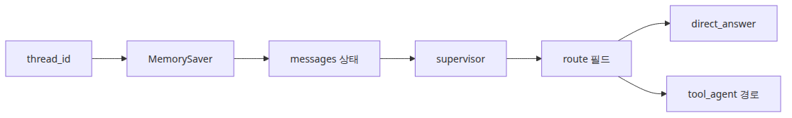
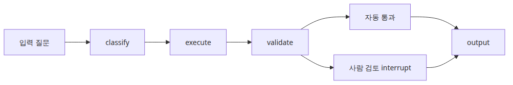
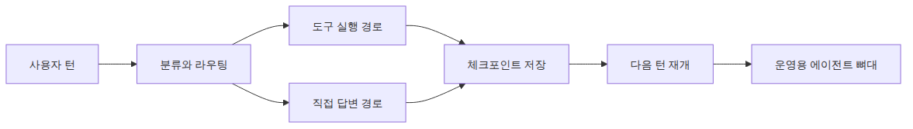

# LangGraph 완성

## 이 글에서 다룰 문제

- 체크포인트, 라우팅, 도구 호출을 하나의 그래프에 어떻게 합칠 수 있을까요?
- 대화 상태를 잃지 않으면서 직접 답변 경로와 도구 경로를 어떻게 분리할까요?
- 결합된 예제를 운영 가능한 프로토타입이라고 부르기 전에 무엇을 검증해야 할까요?

> 완성형 LangGraph 에이전트는 거대한 프롬프트 하나가 아닙니다. supervisor 로직, 도구 실행, 체크포인트가 명시적 전이로 협력하는 상태 머신입니다.

예제 코드: [github.com/yeongseon-books/langgraph-101](https://github.com/yeongseon-books/langgraph-101/tree/main/en/06-langgraph-complete)

이 마지막 예제는 시리즈 전체를 하나로 묶습니다. 들어온 질문을 분류하고, 간단한 개념 질문은 직접 답변 경로로 보내고, 계산이 필요한 질문은 도구 루프로 보내며, 전체 대화를 `MemorySaver`로 저장합니다. 진지한 프로토타입을 만들기에는 이 정도 구조만으로도 출발점이 충분합니다.


이 글에서 답할 질문

## 최소 실행 예제


supervisor와 도구 루프를 결합한 그래프

```python
import ast
import json
import math
import operator
from typing import Any, Callable, Literal, cast

from langchain_core.messages import HumanMessage, SystemMessage
from langchain_core.runnables import RunnableConfig
from langchain_core.tools import tool
from langchain_groq import ChatGroq
from langgraph.checkpoint.memory import MemorySaver
from langgraph.graph import END, START, MessagesState, StateGraph
from langgraph.prebuilt import ToolNode, tools_condition

ALLOWED_BINARY_OPERATORS = {
    ast.Add: operator.add,
    ast.Sub: operator.sub,
    ast.Mult: operator.mul,
    ast.Div: operator.truediv,
    ast.FloorDiv: operator.floordiv,
    ast.Mod: operator.mod,
    ast.Pow: operator.pow,
}
ALLOWED_UNARY_OPERATORS = {
    ast.UAdd: operator.pos,
    ast.USub: operator.neg,
}
ALLOWED_FUNCTIONS: dict[str, Callable[..., Any]] = {
    name: value
    for name, value in math.__dict__.items()
    if not name.startswith("_") and callable(value)
}
ALLOWED_CONSTANTS = {"pi": math.pi, "e": math.e, "tau": math.tau}

def evaluate_math_expression(expression: str) -> float:
    def _evaluate(node: ast.AST) -> float:
        if isinstance(node, ast.Constant) and isinstance(node.value, (int, float)):
            return float(node.value)
        if isinstance(node, ast.BinOp):
            left = _evaluate(node.left)
            right = _evaluate(node.right)
            operation = ALLOWED_BINARY_OPERATORS.get(type(node.op))
            if operation is None:
                raise ValueError("unsupported operator")
            return float(operation(left, right))
        if isinstance(node, ast.UnaryOp):
            operand = _evaluate(node.operand)
            operation = ALLOWED_UNARY_OPERATORS.get(type(node.op))
            if operation is None:
                raise ValueError("unsupported unary operator")
            return float(operation(operand))
        if isinstance(node, ast.Call) and isinstance(node.func, ast.Name):
            function = ALLOWED_FUNCTIONS.get(node.func.id)
            if function is None or node.keywords:
                raise ValueError("unsupported function")
            arguments = [_evaluate(argument) for argument in node.args]
            return float(function(*arguments))
        if isinstance(node, ast.Name):
            value = ALLOWED_CONSTANTS.get(node.id)
            if value is not None:
                return float(value)
            raise ValueError("unsupported constant")
        raise ValueError("unsupported expression")

    parsed = ast.parse(expression, mode="eval")
    return _evaluate(parsed.body)

@tool
def calculator(expression: str) -> str:
    """Evaluate an arithmetic expression with safe math functions like sqrt(16) or pi * 2."""

    try:
        result = evaluate_math_expression(expression)
    except Exception as exc:
        return f"calculation error: {exc}"
    return str(result)

@tool
def word_stats(text: str) -> str:
    """Return word and character counts for a piece of text."""

    return json.dumps({"words": len(text.split()), "characters": len(text)})

TOOLS = [calculator, word_stats]

class CompleteState(MessagesState):
    route: str

def base_llm() -> ChatGroq:
    return ChatGroq(model="llama-3.3-70b-versatile", temperature=0.0, stop_sequences=None)

def supervisor(state: CompleteState) -> dict[str, str]:
    latest_question = str(state["messages"][-1].content).lower()
    if any(keyword in latest_question for keyword in ("count", "calculate", "math", "sqrt")):
        route = "tool_agent"
    else:
        route = "direct_answer"
    return {"route": route}

def route_after_supervisor(state: CompleteState) -> Literal["direct_answer", "tool_agent"]:
    return cast(Literal["direct_answer", "tool_agent"], state["route"])

def direct_answer(state: CompleteState) -> dict[str, object]:
    system = SystemMessage(
        content=(
            "You are explaining LangGraph from the LangChain ecosystem. "
            "Answer clearly using the full conversation history when it matters."
        )
    )
    response = base_llm().invoke([system, *state["messages"]])
    return {"messages": [response]}

def tool_agent(state: CompleteState) -> dict[str, object]:
    system = SystemMessage(
        content=(
            "You are a precise assistant. Use tools for calculations or counting tasks, "
            "then answer in one concise paragraph."
        )
    )
    response = base_llm().bind_tools(TOOLS).invoke([system, *state["messages"]])
    return {"messages": [response]}

def build_graph():
    graph = StateGraph(CompleteState)
    graph.add_node("supervisor", supervisor)
    graph.add_node("direct_answer", direct_answer)
    graph.add_node("tool_agent", tool_agent)
    graph.add_node("tools", ToolNode(TOOLS))

    graph.add_edge(START, "supervisor")
    graph.add_conditional_edges(
        "supervisor",
        route_after_supervisor,
        {"direct_answer": "direct_answer", "tool_agent": "tool_agent"},
    )
    graph.add_edge("direct_answer", END)
    graph.add_conditional_edges("tool_agent", tools_condition, {"tools": "tools", "__end__": END})
    graph.add_edge("tools", "tool_agent")

    return graph.compile(checkpointer=MemorySaver())

if __name__ == "__main__":
    app = build_graph()
    config: RunnableConfig = {"configurable": {"thread_id": "complete-demo"}}

    first = app.invoke(
        {"messages": [HumanMessage(content="Explain what explicit state means in LangGraph.")], "route": ""},
        config=config,
    )
    print("First turn:")
    print(first["messages"][-1].content)

    second = app.invoke(
        {"messages": [HumanMessage(content="Now calculate sqrt(81) + 5 and use a tool.")]},
        config=config,
    )
    print("\nSecond turn:")
    print(second["messages"][-1].content)

    snapshot = app.get_state(config)
    print(f"\nCheckpoint message count: {len(snapshot.values['messages'])}")
```

실행 파일: `/root/Github/langgraph-101/en/06-langgraph-complete/main.py`

실행 방법:

```bash
export GROQ_API_KEY=... && python main.py
```

## 이 코드에서 먼저 봐야 할 점



체크포인트와 route 상태 구조

- supervisor는 직접 답변 경로와 도구 경로를 나눠서 그래프 복잡도를 제어합니다.
- `tool_agent -> ToolNode -> tool_agent` 루프는 도구가 필요한 질문에만 한정됩니다.
- `compile(checkpointer=MemorySaver())`를 붙이면 전체 대화가 턴 사이에서 재개 가능한 상태가 됩니다.

이 예제의 운영 감각은 경로 분리에 있습니다. 모든 요청을 무조건 도구 루프로 보내면 느리고 비싸집니다. 반대로 도구가 필요한 요청까지 직접 답변 경로로 보내면 정확성이 떨어질 수 있습니다. supervisor는 이 균형을 가장 앞단에서 담당합니다.

## 어디서 자주 헷갈릴까요?



검증과 사람 검토 interrupt를 고려한 경로

- 모든 요청을 도구 루프로 보내는 설계는 대개 필요 이상으로 느리고 비쌉니다.
- 체크포인터가 있어도 라우팅 기준은 최신 메시지에서 이해할 수 있을 만큼 단순해야 합니다.
- 도구 실행이 곧 평가를 뜻하지는 않습니다. 회귀 테스트는 따로 있어야 하고, 계산기는 여전히 엄격한 산술 파서를 유지하는 편이 좋습니다.

여기서 많이 놓치는 점은 프로토타입과 운영 경계입니다. 도구가 잘 호출된다고 해서 바로 품질이 보장되지는 않습니다. 어떤 질문이 direct path로 가야 하는지, 어떤 질문이 tool path로 가야 하는지, 같은 `thread_id`에서 상태가 잘 이어지는지를 따로 검증해야 합니다.

## 체크리스트

- [ ] 직접 답변 경로와 도구 경로가 분명하게 분리되어 있는가
- [ ] 같은 `thread_id`로 대화가 기대한 대로 이어지는가
- [ ] 도구 질문과 비도구 질문이 의도한 경로로 라우팅되는가
- [ ] 최종 답변 전에 루프 종료 조건이 명시되어 있는가

## 정리



여러 턴에 걸친 운영형 에이전트 흐름

이 시리즈의 진짜 목표는 LangGraph API를 외우는 데 있지 않았습니다. 상태, 엣지, 체크포인트, 도구 루프를 하나의 시스템으로 설계하는 감각을 익히는 데 있었습니다. 그 멘탈 모델만 잡히면, 쓸 만한 에이전트 골격을 만드는 일은 훨씬 단순해집니다.

<!-- toc:begin -->
## 시리즈 목차

- [LangGraph 소개와 그래프 기초](./01-graph-basics.md)
- [상태 관리와 체크포인트](./02-state-and-checkpoints.md)
- [조건부 엣지와 분기 흐름](./03-conditional-edges.md)
- [도구 호출 에이전트](./04-tool-calling-agent.md)
- [멀티 에이전트 시스템](./05-multi-agent.md)
- **LangGraph 완성 (현재 글)**

<!-- toc:end -->

---

## 참고 자료

- [LangGraph tutorials](https://langchain-ai.github.io/langgraph/tutorials/)
- [LangGraph persistence guide](https://langchain-ai.github.io/langgraph/how-tos/persistence/)
- [LangGraph prebuilt components](https://langchain-ai.github.io/langgraph/reference/prebuilt/)

Tags: LangGraph, Agent, Python, LLM
