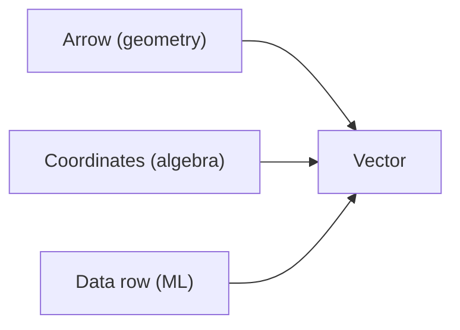

# Vectors

> Linear Algebra 101 series (2/10)

<!-- a-grade-intro:begin -->

**Core question**: Is a *vector* just a *bundle of numbers*, or an *arrow in space*?

> *A vector has *direction and magnitude* — and is also *one row* of your dataset.*

<!-- a-grade-intro:end -->

This is post 2 in the Linear Algebra 101 series.

## What You Will Learn

- The *three views* of a vector — arrow, coordinates, data row
- *Geometric meaning* of *addition and scalar multiplication*
- *Norm and normalization*
- A 5-step hands-on
- Five common pitfalls

## Why It Matters

In ML, *one row of data* is a *vector*. If you cannot *manipulate vectors* properly, you are stuck at the input stage.

> *Vectors are how we package data for machines.*

## Concept at a Glance



## Key Terms

- **Vector**: an *ordered bundle of numbers* — `[x1, x2, ..., xn]`.
- **Dimension**: the *number of entries* in the vector.
- **Norm ||v||**: the *magnitude* — usually *Euclidean length*.
- **Unit vector**: a vector with norm *1*.
- **Scalar multiplication**: changes the *length* and possibly *flips direction*.

## Before/After

**Before**: *"A vector is just a list."* — no geometric meaning.

**After**: *"A vector is a *point/arrow in space*, and *operations are geometric transformations*."*

## Hands-on: Five Steps with Vectors

### Step 1 — Build vectors

```python
import numpy as np
v = np.array([3.0, 4.0])
w = np.array([1.0, 2.0])
print("v:", v, "w:", w)
```

### Step 2 — Addition and subtraction

```python
print("v+w:", v + w)
print("v-w:", v - w)
```

### Step 3 — Scalar multiplication

```python
print("2v:", 2 * v)
print("-v:", -v)
```

### Step 4 — Norm

```python
norm_v = np.linalg.norm(v)
print("||v||:", norm_v)
```

### Step 5 — Normalize to a unit vector

```python
unit_v = v / np.linalg.norm(v)
print("unit v:", unit_v, "norm:", np.linalg.norm(unit_v))
```

## What to Notice in This Code

- *NumPy* vector operations are *element-wise*.
- The *default norm* is *L2 (Euclidean)*.
- *Normalization* keeps *direction* and forces *length 1*.

## Five Common Mistakes

1. **Relying on *implicit broadcasting* despite *shape mismatch*.**
2. **Normalizing a *zero vector* — *division by zero*.**
3. **Sloppy distinction between *row vs column vectors*.**
4. **Confusing *dot product* and *element-wise product*.**
5. **Ignoring *floating-point error*.**

## How This Shows Up in Production

ML feature inputs, *embedding vectors*, *user/item vectors* in recommenders, and *word embeddings* in NLP — all of these are *vector operations*.

## How a Senior Engineer Thinks

- *Always print* the *shape*.
- *Always check* the *norm*.
- Know *when normalization is required*.
- *Visualize* the *geometric meaning*.
- Care about *numerical stability*.

## Checklist

- [ ] You can do *vector addition / scalar multiplication*.
- [ ] You can compute *norms*.
- [ ] You can *normalize*.
- [ ] You understand the *geometric meaning*.

## Practice Problems

1. Compute by hand the *Euclidean norm* of `v = [3, 4]`.
2. Verify in code that the *normalized vector* has norm *1*.
3. Explain why *normalizing the zero vector* is *undefined*.

## Wrap-up and Next Steps

A vector is a *point/arrow in space* and *one row of your data*. The next post covers *matrices*.

<!-- toc:begin -->
- [What Is Linear Algebra?](./01-what-is-linear-algebra.md)
- **Vectors (current)**
- Matrices (upcoming)
- Inner Product and Distance (upcoming)
- Linear Transformations (upcoming)
- Basis and Dimension (upcoming)
- Eigenvalues and Eigenvectors (upcoming)
- Matrix Decomposition (upcoming)
- PCA (upcoming)
- Linear Algebra in Machine Learning (upcoming)
<!-- toc:end -->

## References

- [3Blue1Brown — Vectors](https://www.3blue1brown.com/lessons/vectors)
- [Khan Academy — Vectors](https://www.khanacademy.org/math/linear-algebra/vectors-and-spaces)
- [NumPy — Array creation](https://numpy.org/doc/stable/user/basics.creation.html)
- [Wikipedia — Euclidean vector](https://en.wikipedia.org/wiki/Euclidean_vector)

Tags: LinearAlgebra, Vectors, NumPy, DataScience, Beginner
