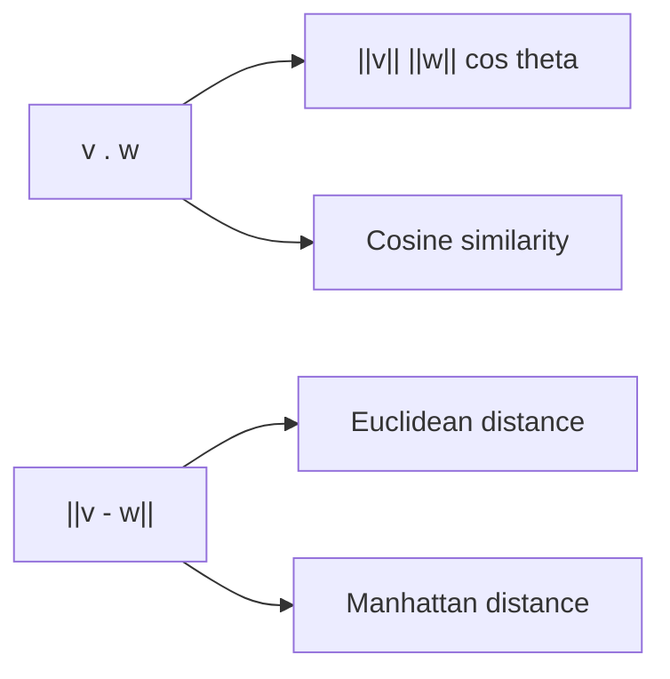

# Inner Product and Distance

> Linear Algebra 101 series (4/10)

<!-- a-grade-intro:begin -->

**Core question**: How do we *quantify* how *similar* two vectors are?

> *Inner product measures *alignment*; distance measures *separation*.*

<!-- a-grade-intro:end -->

## What You Will Learn

- The *definition* and *geometric meaning* of the *inner product*
- *Cosine similarity*
- *Euclidean* and *Manhattan* distance
- A 5-step hands-on
- Five common pitfalls

## Why It Matters

Recommenders, search, and NLP use *similarity / distance* derived from *inner products and distances*. *Vector search* is the same.

> *Inner product is the engine of similarity.*

## Concept at a Glance



## Key Terms

- **Inner product**: `v . w = sum(v_i * w_i)` — a *scalar*.
- **Cosine similarity**: `(v . w) / (||v|| ||w||)` — compares *direction only*.
- **Orthogonal**: `v . w = 0` — *perpendicular*.
- **Euclidean distance**: `||v - w||` — *straight-line distance*.
- **Manhattan distance**: `sum(|v_i - w_i|)` — *grid distance*.

## Before/After

**Before**: *"Inner product is just multiply and add."*

**After**: *"Inner product measures *alignment*; *cosine* gives *directional similarity*."*

## Hands-on: Five Steps with Inner Product and Distance

### Step 1 — Prepare vectors

```python
import numpy as np
v = np.array([1.0, 2.0, 3.0])
w = np.array([4.0, 5.0, 6.0])
```

### Step 2 — Inner product

```python
print("v . w:", np.dot(v, w))
print("v . w:", v @ w)
```

### Step 3 — Cosine similarity

```python
cos_sim = (v @ w) / (np.linalg.norm(v) * np.linalg.norm(w))
print("cosine similarity:", cos_sim)
```

### Step 4 — Euclidean distance

```python
print("Euclidean:", np.linalg.norm(v - w))
```

### Step 5 — Manhattan distance

```python
print("Manhattan:", np.sum(np.abs(v - w)))
```

## What to Notice in This Code

- The *inner product* reflects both *direction and magnitude*.
- *Cosine similarity* reflects only *direction* — *scale-invariant*.
- *Distance* is *dissimilarity* — *smaller means closer*.

## Five Common Mistakes

1. **Confusing *inner product* with *element-wise product*.**
2. **Forgetting to *normalize* before computing *cosine similarity*.**
3. **Computing the *cosine* of a *zero vector* — *division by zero*.**
4. **Ignoring the *geometric difference* between *Euclidean* and *Manhattan*.**
5. **Forgetting that *distance intuition breaks down in high dimensions* (curse of dimensionality).**

## How This Shows Up in Production

Recommenders (*item similarity*), vector databases (*ANN search*), NLP (*embedding similarity*), clustering (*KMeans*) — all run on *inner products and distances*.

## How a Senior Engineer Thinks

- Choose *cosine vs L2* deliberately.
- Knows that *distance intuition fails in high dimensions*.
- Knows that *normalize-then-dot equals cosine*.
- Sees that *metric choice drives model behavior*.
- Picks *vector database indexes* carefully.

## Checklist

- [ ] You can compute the *inner product*.
- [ ] You can compute *cosine similarity*.
- [ ] You know the difference between *Euclidean* and *Manhattan*.
- [ ] You understand *orthogonality*.

## Practice Problems

1. Compute the *inner product* of `v = [1, 0]` and `w = [0, 1]` and confirm they are *orthogonal*.
2. Build pairs of vectors with *cosine similarity* equal to *1, 0, -1*.
3. Build an example where *Euclidean* and *Manhattan* distances differ.

## Wrap-up and Next Steps

Inner product is *similarity*; distance is *dissimilarity*. The next post covers *linear transformations*.

<!-- toc:begin -->
- [What Is Linear Algebra?](./01-what-is-linear-algebra.md)
- [Vectors](./02-vectors.md)
- [Matrices](./03-matrices.md)
- **Inner Product and Distance (current)**
- Linear Transformations (upcoming)
- Basis and Dimension (upcoming)
- Eigenvalues and Eigenvectors (upcoming)
- Matrix Decomposition (upcoming)
- PCA (upcoming)
- Linear Algebra in Machine Learning (upcoming)
<!-- toc:end -->

## References

- [Wikipedia — Dot product](https://en.wikipedia.org/wiki/Dot_product)
- [Wikipedia — Cosine similarity](https://en.wikipedia.org/wiki/Cosine_similarity)
- [3Blue1Brown — Dot products](https://www.3blue1brown.com/lessons/dot-products)
- [scikit-learn — Pairwise metrics](https://scikit-learn.org/stable/modules/metrics.html)

Tags: LinearAlgebra, InnerProduct, Distance, DataScience, Beginner
