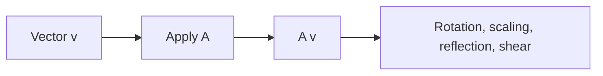

# Linear Transformations

> Linear Algebra 101 series (5/10)

<!-- a-grade-intro:begin -->

**Core question**: When you *multiply by a matrix*, what does that *do geometrically*?

> *A linear transformation reshapes space while keeping *grid lines parallel and evenly spaced*.*

<!-- a-grade-intro:end -->

## What You Will Learn

- The *definition* and *properties* of a *linear transformation*
- *Matrix forms* of *rotation, scaling, reflection, and shear*
- *Composition of transformations* via *matrix multiplication*
- A 5-step hands-on
- Five common pitfalls

## Why It Matters

Each *neural network layer* is a *linear transformation* plus a *nonlinear activation*. *Transformation intuition* equals *model intuition*.

> *Every layer is a transformation of space.*

## Concept at a Glance



## Key Terms

- **Linear transformation**: `T(av + bw) = a T(v) + b T(w)` — preserves *addition and scalar multiplication*.
- **Rotation matrix**: rotates by angle `theta`.
- **Scaling**: a *diagonal matrix* that *stretches/shrinks*.
- **Reflection**: *symmetry* across an axis.
- **Shear**: *slants* the space along a direction.

## Before/After

**Before**: *"A matrix is just a transformation."* — no idea what shape.

**After**: *"Rotation = *angles*; scaling = *diagonal*; reflection = *sign flip*; shear = *off-diagonal*."*

## Hands-on: Five Steps

### Step 1 — Rotation

```python
import numpy as np
theta = np.pi / 4
R = np.array([[np.cos(theta), -np.sin(theta)],
              [np.sin(theta),  np.cos(theta)]])
v = np.array([1.0, 0.0])
print("rotated:", R @ v)
```

### Step 2 — Scaling

```python
S = np.diag([2.0, 0.5])
print("scaled:", S @ np.array([1.0, 1.0]))
```

### Step 3 — Reflection across x-axis

```python
F = np.array([[1.0, 0.0], [0.0, -1.0]])
print("reflected:", F @ np.array([1.0, 1.0]))
```

### Step 4 — Shear

```python
Sh = np.array([[1.0, 1.0], [0.0, 1.0]])
print("sheared:", Sh @ np.array([1.0, 1.0]))
```

### Step 5 — Composition

```python
M = R @ S
print("compose RS:", M @ np.array([1.0, 0.0]))
```

## What to Notice in This Code

- *Matrix multiplication* is *composition* of transformations.
- *Each transformation* has its own *matrix shape*.
- *Order* changes the result.

## Five Common Mistakes

1. **Mixing up *rotation sign* — clockwise vs counter-clockwise.**
2. **A *negative scale* secretly introduces a *reflection*.**
3. **Confusing *shear direction*.**
4. **Reversing the *composition order*.**
5. **Treating a *nonlinear transformation* as if it were *linear*.**

## How This Shows Up in Production

Graphics *model matrices*, *homographies* in computer vision, *data augmentation* (rotation/scaling), and neural network layers — all are *linear transformations*.

## How a Senior Engineer Thinks

- *Visualizes* transformations.
- Tracks *composition order*.
- Checks the *sign of the determinant* for orientation.
- Uses *eigenvectors* to find a transformation's *axes*.
- Knows that *nonlinear transformations* are a separate beast.

## Checklist

- [ ] You can build *rotation/scaling/reflection/shear* matrices.
- [ ] You can express *composition* as a *matrix product*.
- [ ] You understand the impact of *order*.
- [ ] You can read the *geometric meaning*.

## Practice Problems

1. Verify that applying a *45° rotation* twice equals a *90° rotation*.
2. Check whether *reflect-then-rotate* differs from *rotate-then-reflect*.
3. Describe the *effect* of scaling by `(-1, -1)`.

## Wrap-up and Next Steps

Linear transformations *reshape space*. The next post covers *basis and dimension*.

<!-- toc:begin -->
- [What Is Linear Algebra?](./01-what-is-linear-algebra.md)
- [Vectors](./02-vectors.md)
- [Matrices](./03-matrices.md)
- [Inner Product and Distance](./04-inner-product-and-distance.md)
- **Linear Transformations (current)**
- Basis and Dimension (upcoming)
- Eigenvalues and Eigenvectors (upcoming)
- Matrix Decomposition (upcoming)
- PCA (upcoming)
- Linear Algebra in Machine Learning (upcoming)
<!-- toc:end -->

## References

- [3Blue1Brown — Linear transformations](https://www.3blue1brown.com/lessons/linear-transformations)
- [Wikipedia — Linear map](https://en.wikipedia.org/wiki/Linear_map)
- [Wikipedia — Rotation matrix](https://en.wikipedia.org/wiki/Rotation_matrix)
- [Khan Academy — Transformations](https://www.khanacademy.org/math/linear-algebra/matrix-transformations)

Tags: LinearAlgebra, LinearTransformation, Geometry, DataScience, Beginner
