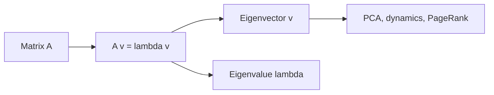

# Eigenvalues and Eigenvectors

> Linear Algebra 101 series (7/10)

<!-- a-grade-intro:begin -->

**Core question**: When you *apply a matrix repeatedly*, are there *axes that do not change direction*?

> *Eigenvectors are the *invariant axes* of a transformation; eigenvalues are the *stretching factors* along those axes.*

<!-- a-grade-intro:end -->

## What You Will Learn

- The *definition* of *eigenvalues / eigenvectors*
- Their *geometric meaning*
- How to compute them with *NumPy*
- A 5-step hands-on
- Five common pitfalls

## Why It Matters

PCA, dynamics, quantum mechanics, PageRank — all rely on *eigendecomposition*. It lets you view a matrix in a *simple coordinate system*.

> *Eigenvectors are the natural axes of a transformation.*

## Concept at a Glance



## Key Terms

- **Eigenvector v**: a *non-zero vector* satisfying `A v = lambda v`.
- **Eigenvalue lambda**: the *scalar factor* along that axis.
- **Eigendecomposition**: `A = V D V^-1` (when diagonalizable).
- **Spectrum**: the *set of all eigenvalues*.
- **Symmetric matrix**: has *real eigenvalues* and *orthogonal eigenvectors*.

## Before/After

**Before**: *"Eigenvalues are something you solve with a formula."* — no idea why they matter.

**After**: *"They reveal the *axes of a transformation* — along which it acts as a *simple scalar*."*

## Hands-on: Five Steps with Eigendecomposition

### Step 1 — Define a matrix

```python
import numpy as np
A = np.array([[2.0, 1.0], [0.0, 3.0]])
```

### Step 2 — Eigenvalues / eigenvectors

```python
vals, vecs = np.linalg.eig(A)
print("eigenvalues:", vals)
print("eigenvectors:\n", vecs)
```

### Step 3 — Verify

```python
for i in range(len(vals)):
    Av = A @ vecs[:, i]
    lv = vals[i] * vecs[:, i]
    print("A v == lambda v:", np.allclose(Av, lv))
```

### Step 4 — Symmetric matrix

```python
S = np.array([[2.0, 1.0], [1.0, 2.0]])
sv, svc = np.linalg.eigh(S)  # for symmetric/Hermitian
print("sym eigenvalues:", sv)
print("orthogonal? ", np.allclose(svc.T @ svc, np.eye(2)))
```

### Step 5 — Power iteration and stability

```python
M = np.array([[0.9, 0.1], [0.2, 0.8]])
v = np.array([1.0, 0.0])
for _ in range(50):
    v = M @ v
print("steady state:", v / np.linalg.norm(v, 1))
```

## What to Notice in This Code

- *Eigendecomposition* simplifies the *transformation*.
- For *symmetric* matrices, prefer *eigh* — it is more *stable*.
- *Power iteration* converges toward the *largest-eigenvalue direction*.

## Five Common Mistakes

1. **Assuming *every matrix* is *diagonalizable*.**
2. **Ignoring *complex eigenvalues*.**
3. **Using *eig* on symmetric matrices or *eigh* on non-symmetric ones.**
4. **Forgetting that *eigenvector sign / scale* is arbitrary.**
5. **Ignoring *numerical stability*.**

## How This Shows Up in Production

PCA (*eigendecomposition of the covariance matrix*), PageRank (*top eigenvector*), dynamical systems (*stability analysis*), quantum mechanics (*energy eigenstates*) — all are *eigendecompositions*.

## How a Senior Engineer Thinks

- Use *eigh* whenever the matrix is *symmetric*.
- Reads the *condition number* for stability.
- Interprets *complex eigenvalues* physically.
- Tracks *eigenvector signs*.
- Picks *power iteration* when appropriate.

## Checklist

- [ ] You can compute *eigenvalues / eigenvectors*.
- [ ] You know how *symmetric matrices* differ.
- [ ] You can *verify* with the eigenvector equation.
- [ ] You understand *power iteration convergence*.

## Practice Problems

1. Compute by hand the eigenvalues / eigenvectors of `diag(2, 3)`.
2. Verify that the *eigenvectors* of a *symmetric matrix* are *orthogonal*.
3. Estimate the *top eigenvector* using *power iteration*.

## Wrap-up and Next Steps

Eigendecomposition reveals a transformation's *natural axes*. The next post covers *matrix decomposition*.

<!-- toc:begin -->
- [What Is Linear Algebra?](./01-what-is-linear-algebra.md)
- [Vectors](./02-vectors.md)
- [Matrices](./03-matrices.md)
- [Inner Product and Distance](./04-inner-product-and-distance.md)
- [Linear Transformations](./05-linear-transformation.md)
- [Basis and Dimension](./06-basis-and-dimension.md)
- **Eigenvalues and Eigenvectors (current)**
- Matrix Decomposition (upcoming)
- PCA (upcoming)
- Linear Algebra in Machine Learning (upcoming)
<!-- toc:end -->

## References

- [3Blue1Brown — Eigenvectors and eigenvalues](https://www.3blue1brown.com/lessons/eigenvalues)
- [Wikipedia — Eigenvalues and eigenvectors](https://en.wikipedia.org/wiki/Eigenvalues_and_eigenvectors)
- [NumPy — linalg.eig](https://numpy.org/doc/stable/reference/generated/numpy.linalg.eig.html)
- [NumPy — linalg.eigh](https://numpy.org/doc/stable/reference/generated/numpy.linalg.eigh.html)

Tags: LinearAlgebra, Eigenvalues, Eigenvectors, DataScience, Beginner
