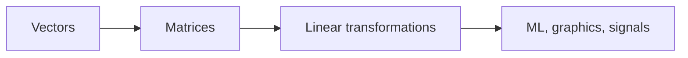

# 선형대수란 무엇인가?

> Linear Algebra 101 시리즈 (1/10)


## 이 글에서 다룰 문제

ML, 통계, 그래픽스, 신호처리 — 모두 벡터와 행렬 위에서 돌아갑니다. 선형대수 감각이 약하면 모델 내부를 읽기 어렵습니다.

> *Linear algebra is the language of data.*

## 전체 흐름


## Before/After

**Before**: *“행렬은 그냥 숫자판”* — *왜 곱하는지* 모름.

**After**: *“행렬 곱 = 선형변환의 합성 — 공간을 회전·확대·반사하는 규칙.”*

## 5단계 선형대수 직관

### 1단계 — 벡터 만들기

```python
import numpy as np
v = np.array([3.0, 4.0])
print("v:", v, "norm:", np.linalg.norm(v))
```

### 2단계 — 행렬 만들기

```python
A = np.array([[1.0, 2.0],
              [3.0, 4.0]])
print("A shape:", A.shape)
```

### 3단계 — 선형변환 적용

```python
y = A @ v
print("Av:", y)
```

### 4단계 — 회전 변환

```python
theta = np.pi / 2
R = np.array([[np.cos(theta), -np.sin(theta)],
              [np.sin(theta),  np.cos(theta)]])
print("R v:", R @ v)
```

### 5단계 — 합성 변환

```python
print("R(A v):", R @ (A @ v))
print("(R A) v:", (R @ A) @ v)
```

## 이 코드에서 주목할 점

- 벡터는 방향과 크기를 함께 담는 대상입니다. 단순한 숫자열이 아닙니다.
- 행렬 곱은 변환의 합성이므로 순서가 중요합니다.
- NumPy는 선형대수 계산에 널리 쓰이는 표준 라이브러리입니다.

## 자주 하는 실수 5가지

1. **행과 열의 크기를 맞추지 않고 연산하는 실수**
2. **행렬 곱과 원소별 곱을 헷갈리는 실수**
3. **행렬 곱이 비가환이라는 사실을 잊는 실수**
4. **벡터를 단순한 숫자열로만 보는 실수**
5. **차원과 기저의 의미를 암기만 하고 넘기는 실수**

## 실무에서는 이렇게 쓰입니다

추천 시스템, 이미지 처리, 그래픽스, 딥러닝의 모든 레이어는 행렬 연산 위에서 돌아갑니다. NumPy, PyTorch, TensorFlow는 이런 계산을 빠르게 수행하는 핵심 도구입니다.

## 체크리스트

- [ ] 벡터와 행렬을 만들 수 있다.
- [ ] 행렬 곱을 수행할 수 있다.
- [ ] 선형변환의 의미를 안다.
- [ ] 형상을 맞춰 연산할 수 있다.

## 정리 및 다음 단계

선형대수는 공간을 설명하는 언어입니다. 다음 글에서는 벡터의 연산과 기하학적 의미를 더 깊게 다룹니다.

<!-- toc:begin -->
- **선형대수란 무엇인가? (현재 글)**
- 벡터 (예정)
- 행렬 (예정)
- 내적과 거리 (예정)
- 선형변환 (예정)
- 기저와 차원 (예정)
- 고유값과 고유벡터 (예정)
- 행렬 분해 (예정)
- PCA (예정)
- 머신러닝에서의 선형대수 (예정)
<!-- toc:end -->

## 참고 자료

- [3Blue1Brown — Essence of Linear Algebra](https://www.3blue1brown.com/topics/linear-algebra)
- [Khan Academy — Linear Algebra](https://www.khanacademy.org/math/linear-algebra)
- [Gilbert Strang — Linear Algebra (MIT OCW)](https://ocw.mit.edu/courses/18-06-linear-algebra-spring-2010/)
- [NumPy — Linear algebra](https://numpy.org/doc/stable/reference/routines.linalg.html)

Tags: LinearAlgebra, Foundations, Vectors, DataScience, Beginner
