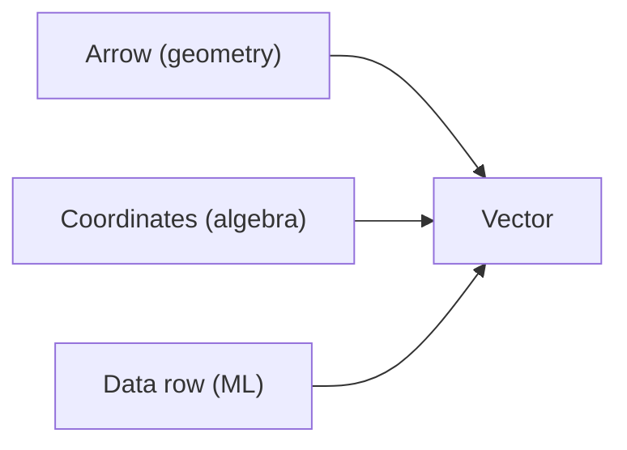

# 벡터

머신러닝에서 데이터 한 행은 벡터이고, 임베딩도 벡터이며, 그래디언트도 결국 벡터입니다. 그런데 벡터를 숫자 묶음으로만 보면 계산은 따라가도 의미는 잘 남지 않습니다. 벡터는 대수적 표현이면서 동시에 공간 속 방향이기 때문입니다.

이 글은 Linear Algebra 101 시리즈의 2번째 글입니다. 여기서는 벡터를 좌표, 화살표, 데이터 표현이라는 세 관점으로 함께 읽어 보겠습니다.

## 이 글에서 다룰 문제

- 벡터는 단순한 리스트와 무엇이 다를까요?
- 벡터 덧셈과 스칼라곱은 기하학적으로 무엇을 뜻할까요?
- 노름은 왜 길이 이상의 의미를 가질까요?
- 정규화는 언제 필요하고 언제 조심해야 할까요?

> 벡터는 숫자를 담는 그릇이면서 동시에 공간의 방향을 나타내는 기본 단위입니다. 이 두 관점을 함께 잡아야 선형대수와 머신러닝이 연결됩니다.

## 왜 중요한가

모델 입력 피처, 사용자 임베딩, 단어 임베딩, 손실 함수의 그래디언트는 모두 벡터로 표현됩니다. 그래서 벡터를 정확히 다루면 모델 바깥의 데이터 전처리부터 모델 안쪽의 계산까지 같은 언어로 읽을 수 있습니다.

특히 정규화와 유사도 계산은 벡터 이해가 약하면 바로 흔들립니다. 방향이 중요한 문제인지, 크기까지 중요한 문제인지 구분하지 못하면 비슷한 데이터를 비교하는 기준도 금방 틀어집니다. 벡터는 선형대수의 출발점이지만, 동시에 실무에서 끝까지 따라오는 기본 단위입니다.

## 핵심 개념 한눈에 보기



벡터를 세 가지로 읽으면 훨씬 편해집니다. 기하학에서는 화살표, 대수에서는 좌표열, 머신러닝에서는 데이터 한 행입니다. 표현은 달라도 모두 같은 대상을 다른 언어로 본 것입니다.

## 핵심 용어

- 벡터: 순서가 있는 숫자 묶음이며 방향과 크기를 표현합니다.
- 차원: 벡터에 들어 있는 좌표의 개수입니다.
- 노름: 벡터의 길이입니다. 보통 먼저 유클리드 노름을 배웁니다.
- 단위벡터: 노름이 1인 벡터입니다.
- 스칼라곱: 길이를 늘리거나 줄이고, 필요하면 방향을 뒤집는 연산입니다.

## 읽기 전과 후

읽기 전에는 벡터를 파이썬 리스트처럼 받아들이기 쉽습니다. 그러면 덧셈은 원소끼리 더하는 규칙으로 끝나고, 정규화도 공식 하나처럼만 남습니다.

읽은 후에는 벡터 덧셈이 화살표의 결합이고, 스칼라곱이 길이와 방향을 바꾸는 변환이며, 정규화가 방향을 유지한 채 길이만 1로 맞추는 절차라는 점이 자연스럽게 보입니다.

## 다섯 단계로 벡터 다루기

### 1단계 — 벡터 만들기

```python
import numpy as np
v = np.array([3.0, 4.0])
w = np.array([1.0, 2.0])
print("v:", v, "w:", w)
```

두 벡터를 준비합니다. 이 단계에서 중요한 것은 값 자체보다 차원입니다. 같은 차원의 벡터끼리만 자연스럽게 더하고 뺄 수 있습니다.

### 2단계 — 덧셈과 뺄셈

```python
print("v+w:", v + w)
print("v-w:", v - w)
```

벡터 덧셈은 같은 공간에서 두 이동을 이어 붙이는 연산으로 볼 수 있습니다. 뺄셈은 한 벡터에서 다른 벡터로 향하는 차이를 만듭니다.

### 3단계 — 스칼라곱

```python
print("2v:", 2 * v)
print("-v:", -v)
```

스칼라곱은 벡터의 길이를 조절합니다. 양수를 곱하면 길이가 바뀌고, 음수를 곱하면 방향까지 뒤집힙니다. 벡터가 단순한 데이터 배열이 아니라 기하학적 대상이라는 점이 여기서 분명해집니다.

### 4단계 — 노름

```python
norm_v = np.linalg.norm(v)
print("||v||:", norm_v)
```

노름은 벡터의 크기를 숫자 하나로 요약합니다. 이후 내적, 거리, 코사인 유사도를 이해할 때 계속 등장하므로 여기서 감을 잡아 두는 편이 좋습니다.

### 5단계 — 정규화

```python
unit_v = v / np.linalg.norm(v)
print("unit v:", unit_v, "norm:", np.linalg.norm(unit_v))
```

정규화는 벡터의 방향은 유지하고 길이만 1로 맞춥니다. 크기보다 방향 비교가 중요한 문제에서는 이 단계가 거의 기본 전처리처럼 쓰입니다.

## 이 코드에서 먼저 볼 점

- NumPy의 기본 벡터 연산은 원소별로 작동합니다.
- 노름은 보통 L2 기준으로 먼저 이해하면 충분합니다.
- 정규화는 방향 비교를 쉽게 만들어 줍니다.
- 행벡터와 열벡터 구분은 뒤로 갈수록 더 중요해집니다.

## 자주 하는 실수

1. 형상이 맞지 않는데도 브로드캐스팅에 기대서 연산합니다.
2. 영벡터를 정규화해 0으로 나누는 문제를 만듭니다.
3. 행벡터와 열벡터를 같은 것으로 취급합니다.
4. 내적과 원소곱을 헷갈립니다.
5. 부동소수점 오차를 고려하지 않고 결과를 단정합니다.

## 실무에서는 이렇게 읽는다

시니어 엔지니어는 벡터를 볼 때 값보다 먼저 의미를 봅니다. 이 벡터가 입력 피처인지, 임베딩인지, 그래디언트인지에 따라 크기와 방향의 해석이 달라지기 때문입니다. 예를 들어 임베딩 비교에서는 정규화가 자연스럽지만, 수량 자체가 의미인 피처 벡터에서는 함부로 정규화하면 정보가 사라질 수 있습니다.

또한 벡터 연산에서 형상을 자주 출력하고, 노름을 확인하며, 정규화 여부를 의도적으로 결정합니다. 벡터 감각이 좋아지면 이후에 나오는 내적, 거리, 선형변환도 훨씬 덜 추상적으로 느껴집니다.

## 체크리스트

- [ ] 벡터 덧셈과 스칼라곱을 설명할 수 있습니다.
- [ ] 노름을 계산하고 의미를 말할 수 있습니다.
- [ ] 정규화가 언제 필요한지 알고 있습니다.
- [ ] 벡터를 기하학적 대상과 데이터 표현으로 함께 볼 수 있습니다.

## 연습 문제

1. `v = [3, 4]`의 유클리드 노름을 손으로 계산해 보세요.
2. 정규화한 벡터의 노름이 1인지 코드로 확인해 보세요.
3. 영벡터를 정규화할 수 없는 이유를 설명해 보세요.

## 정리와 다음 글

벡터는 숫자 묶음이지만 그 이상입니다. 공간의 방향과 크기를 담고, 데이터 한 행을 표현하며, 다양한 모델 계산의 기본 단위가 됩니다. 덧셈과 스칼라곱, 노름과 정규화를 함께 이해하면 벡터는 더 이상 기초 문법이 아니라 여러 주제를 묶는 공통 구조로 보입니다.

다음 글에서는 행렬을 다룹니다. 벡터 하나를 이해했다면 이제 여러 벡터를 묶고, 그 벡터들에 규칙을 적용하는 행렬로 자연스럽게 넘어갈 수 있습니다.

<!-- toc:begin -->
- [선형대수란 무엇인가?](./01-what-is-linear-algebra.md)
- **벡터 (현재 글)**
- 행렬 (예정)
- 내적과 거리 (예정)
- 선형변환 (예정)
- 기저와 차원 (예정)
- 고유값과 고유벡터 (예정)
- 행렬 분해 (예정)
- PCA (예정)
- 머신러닝에서의 선형대수 (예정)
<!-- toc:end -->

## 참고 자료

- [3Blue1Brown — Vectors](https://www.3blue1brown.com/lessons/vectors)
- [Khan Academy — Vectors](https://www.khanacademy.org/math/linear-algebra/vectors-and-spaces)
- [NumPy — Array creation](https://numpy.org/doc/stable/user/basics.creation.html)
- [Wikipedia — Euclidean vector](https://en.wikipedia.org/wiki/Euclidean_vector)

Tags: LinearAlgebra, Vectors, NumPy, DataScience, Beginner
