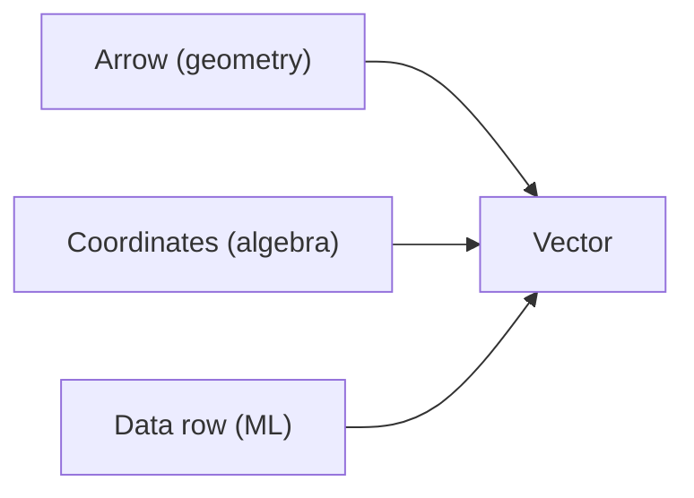

# 벡터

> Linear Algebra 101 시리즈 (2/10)


## 이 글에서 다룰 문제

ML에서 데이터의 한 행은 벡터입니다. 벡터 연산을 제대로 다루지 못하면 모델 입력 단계부터 막힙니다.

> *Vectors are how we package data for machines.*

## 전체 흐름


## Before/After

**Before**: *“벡터는 그냥 리스트.”* — 기하학적 의미를 놓칩니다.

**After**: *“벡터는 *공간의 점/화살표* 이며 *연산은 기하학적 변형*.”*

## 5단계 벡터 다루기

### 1단계 — 벡터 만들기

```python
import numpy as np
v = np.array([3.0, 4.0])
w = np.array([1.0, 2.0])
print("v:", v, "w:", w)
```

### 2단계 — 덧셈과 뺄셈

```python
print("v+w:", v + w)
print("v-w:", v - w)
```

### 3단계 — 스칼라곱

```python
print("2v:", 2 * v)
print("-v:", -v)
```

### 4단계 — 노름

```python
norm_v = np.linalg.norm(v)
print("||v||:", norm_v)
```

### 5단계 — 정규화 (단위벡터)

```python
unit_v = v / np.linalg.norm(v)
print("unit v:", unit_v, "norm:", np.linalg.norm(unit_v))
```

## 이 코드에서 주목할 점

- NumPy의 기본 벡터 연산은 원소별로 적용됩니다.
- 노름은 보통 L2(유클리드) 기준으로 먼저 이해하면 좋습니다.
- 정규화는 방향은 유지하고 길이만 1로 맞추는 연산입니다.

## 자주 하는 실수 5가지

1. **차원 불일치 상황에서 암묵적 broadcasting에 기대는 실수**
2. **노름이 0인 벡터를 정규화해서 0으로 나누는 실수**
3. **행벡터와 열벡터 구분을 대충 넘기는 실수**
4. **내적과 원소곱을 헷갈리는 실수**
5. **부동소수점 오차를 무시하는 실수**

## 실무에서는 이렇게 쓰입니다

ML 입력 피처, 임베딩 벡터, 추천 시스템의 유저·아이템 벡터, NLP의 단어 임베딩은 모두 벡터 연산 위에 서 있습니다.

## 체크리스트

- [ ] 벡터 덧셈과 스칼라곱을 할 수 있다.
- [ ] 노름을 계산할 수 있다.
- [ ] 정규화를 할 수 있다.
- [ ] 벡터의 기하학적 의미를 안다.

## 정리 및 다음 단계

벡터는 공간의 점이자 화살표이며, 데이터의 한 행을 표현하는 기본 단위이기도 합니다. 다음 글에서는 행렬을 다룹니다.

<!-- toc:begin -->
- [선형대수란 무엇인가?](./01-what-is-linear-algebra.md)
- **벡터 (현재 글)**
- 행렬 (예정)
- 내적과 거리 (예정)
- 선형변환 (예정)
- 기저와 차원 (예정)
- 고유값과 고유벡터 (예정)
- 행렬 분해 (예정)
- PCA (예정)
- 머신러닝에서의 선형대수 (예정)
<!-- toc:end -->

## 참고 자료

- [3Blue1Brown — Vectors](https://www.3blue1brown.com/lessons/vectors)
- [Khan Academy — Vectors](https://www.khanacademy.org/math/linear-algebra/vectors-and-spaces)
- [NumPy — Array creation](https://numpy.org/doc/stable/user/basics.creation.html)
- [Wikipedia — Euclidean vector](https://en.wikipedia.org/wiki/Euclidean_vector)

Tags: LinearAlgebra, Vectors, NumPy, DataScience, Beginner
