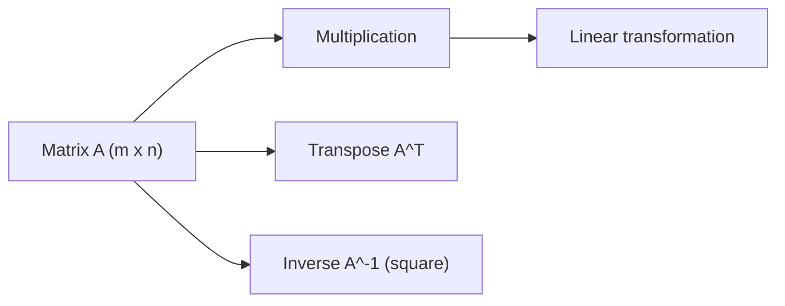

# 행렬

> Linear Algebra 101 시리즈 (3/10)


## 이 글에서 다룰 문제

행렬은 데이터셋을 담는 그릇이면서 동시에 변환을 표현하는 도구입니다. ML의 많은 레이어가 행렬 곱 위에서 돌아갑니다.

> *Matrices are linear transformations in disguise.*

## 전체 흐름


## Before/After

**Before**: *“행렬 곱은 그냥 행과 열의 합.”* — 왜 그런 계산을 하는지 감이 없습니다.

**After**: *“행렬 곱 = *변환의 합성*. 한 변환 후 또 한 변환을 적용.”*

## 5단계 행렬 다루기

### 1단계 — 행렬 만들기

```python
import numpy as np
A = np.array([[1.0, 2.0], [3.0, 4.0]])
print("A:", A, "shape:", A.shape)
```

### 2단계 — 전치

```python
print("A^T:", A.T)
```

### 3단계 — 행렬 곱

```python
B = np.array([[5.0, 6.0], [7.0, 8.0]])
print("A B:", A @ B)
print("B A:", B @ A)  # 다름! 비가환
```

### 4단계 — 항등행렬

```python
I = np.eye(2)
print("I:", I)
print("A I = A:", A @ I)
```

### 5단계 — 역행렬

```python
A_inv = np.linalg.inv(A)
print("A^-1:", A_inv)
print("A A^-1 ~ I:", A @ A_inv)
```

## 이 코드에서 주목할 점

- 행렬 곱은 비가환이므로 `A B`와 `B A`가 일반적으로 다릅니다.
- 역행렬은 모든 행렬에 존재하지 않습니다.
- NumPy에서 `@`는 행렬 곱이고 `*`는 원소곱입니다.

## 자주 하는 실수 5가지

1. **`@`와 `*`의 의미를 혼동하는 실수**
2. **형상을 맞추지 않아 broadcasting 문제를 만드는 실수**
3. **특이행렬의 역행렬을 구하려는 실수**
4. **행렬 곱의 비가환성을 잊는 실수**
5. **부동소수점 오차 때문에 결과가 완전한 항등행렬이 아니어도 무작정 넘기는 실수**

## 실무에서는 이렇게 쓰입니다

선형 회귀의 정규방정식, 신경망의 가중치 행렬, 그래픽스의 변환 행렬, 추천 시스템의 유저-아이템 행렬은 모두 행렬 연산의 응용입니다.

## 체크리스트

- [ ] 행렬 곱을 수행할 수 있다.
- [ ] 전치를 구할 수 있다.
- [ ] 역행렬이 존재하는 조건을 안다.
- [ ] 비가환성을 인지한다.

## 정리 및 다음 단계

행렬은 변환을 압축해서 표현하는 도구입니다. 다음 글에서는 내적과 거리를 다룹니다.

<!-- toc:begin -->
- [선형대수란 무엇인가?](./01-what-is-linear-algebra.md)
- [벡터](./02-vectors.md)
- **행렬 (현재 글)**
- 내적과 거리 (예정)
- 선형변환 (예정)
- 기저와 차원 (예정)
- 고유값과 고유벡터 (예정)
- 행렬 분해 (예정)
- PCA (예정)
- 머신러닝에서의 선형대수 (예정)
<!-- toc:end -->

## 참고 자료

- [3Blue1Brown — Matrix multiplication](https://www.3blue1brown.com/lessons/matrix-multiplication)
- [Khan Academy — Matrices](https://www.khanacademy.org/math/algebra-home/alg-matrices)
- [NumPy — linalg.inv](https://numpy.org/doc/stable/reference/generated/numpy.linalg.inv.html)
- [Wikipedia — Matrix](https://en.wikipedia.org/wiki/Matrix_(mathematics))

Tags: LinearAlgebra, Matrices, NumPy, DataScience, Beginner
