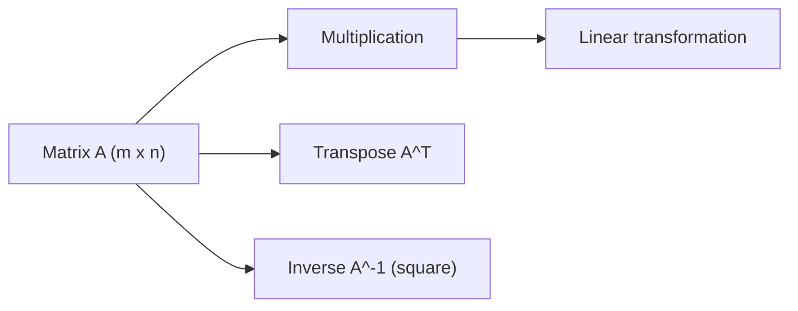

# 행렬

행렬은 선형대수에서 가장 자주 보이는 표기입니다. 데이터셋을 담는 테이블처럼 보이기도 하고, 어떤 벡터를 다른 벡터로 보내는 규칙처럼 읽히기도 합니다. 그래서 행렬을 숫자판으로만 이해하면 계산은 따라가도 왜 곱하는지는 남지 않습니다.

이 글은 Linear Algebra 101 시리즈의 3번째 글입니다. 여기서는 행렬을 형상과 변환이라는 두 관점으로 함께 이해해 보겠습니다.

## 이 글에서 다룰 문제

- 행렬은 단순한 숫자 표와 무엇이 다를까요?
- 행렬 곱은 왜 변환의 합성으로 읽어야 할까요?
- 전치와 항등행렬, 역행렬은 각각 무엇을 뜻할까요?
- 형상을 먼저 보는 습관이 왜 중요할까요?

> 행렬은 여러 숫자를 적어 둔 표이면서 동시에 벡터 공간에 작용하는 규칙의 압축 표현입니다. 이 두 해석이 연결되어야 행렬 곱이 살아 움직입니다.

## 왜 중요한가

선형회귀의 설계 행렬, 신경망의 가중치, 추천 시스템의 사용자-아이템 표현, 그래픽스의 변환 행렬은 모두 행렬로 적힙니다. 즉 행렬은 데이터 보관용 표기이면서 계산의 핵심 엔진입니다.

또한 실무에서 가장 흔한 오류 중 일부는 형상 불일치에서 시작합니다. 행렬이 몇 행 몇 열인지, 어떤 벡터를 입력으로 받아 어떤 벡터를 출력하는지 읽지 못하면 코드가 돌아가도 의미는 틀릴 수 있습니다. 행렬은 값보다 구조를 먼저 보는 훈련이 중요합니다.

## 핵심 개념 한눈에 보기



행렬은 여러 역할을 동시에 가집니다. 표, 변환, 계산 규칙이 겹쳐 있습니다. 전치는 행과 열을 바꾸고, 항등행렬은 변환을 하지 않으며, 역행렬은 가능한 경우 원래 상태로 되돌립니다.

## 핵심 용어

- 행렬: `m x n` 형태의 숫자 배열입니다.
- 전치: 행과 열을 바꾼 행렬 `A^T`입니다.
- 항등행렬: 대각선만 1이고 나머지는 0인 행렬로, 벡터를 그대로 둡니다.
- 역행렬: `A A^-1 = I`를 만족하는 행렬입니다. 항상 존재하지는 않습니다.
- 행렬 곱: 안쪽 차원이 맞을 때 정의되는 합성 연산입니다.

## 읽기 전과 후

읽기 전에는 행렬 곱을 행과 열을 기계적으로 맞추는 절차로 보기 쉽습니다. 이 경우 왜 순서가 중요한지도 잘 남지 않습니다.

읽은 후에는 행렬 곱을 한 변환 뒤에 다른 변환을 적용하는 합성으로 읽게 됩니다. 그러면 비가환성이 낯선 규칙이 아니라 자연스러운 결과가 됩니다.

## 다섯 단계로 행렬 다루기

### 1단계 — 행렬 만들기

```python
import numpy as np
A = np.array([[1.0, 2.0], [3.0, 4.0]])
print("A:", A, "shape:", A.shape)
```

먼저 행렬을 만들고 형상을 확인합니다. 실무에서 가장 먼저 확인해야 할 정보도 바로 이 형상입니다.

### 2단계 — 전치

```python
print("A^T:", A.T)
```

전치는 행과 열의 역할을 바꿉니다. 데이터 분석에서는 샘플과 피처의 축을 바꿔 보는 데도 자주 등장하고, 수식 전개에서도 매우 자주 나옵니다.

### 3단계 — 행렬 곱

```python
B = np.array([[5.0, 6.0], [7.0, 8.0]])
print("A B:", A @ B)
print("B A:", B @ A)  # different! non-commutative
```

`A @ B`와 `B @ A`를 함께 보는 이유는 곱셈 순서가 결과를 바꾼다는 사실을 몸으로 익히기 위해서입니다. 행렬 곱은 덧셈처럼 순서를 바꿔도 같은 연산이 아닙니다.

### 4단계 — 항등행렬

```python
I = np.eye(2)
print("I:", I)
print("A I = A:", A @ I)
```

항등행렬은 아무것도 바꾸지 않는 변환입니다. 함수 관점으로 보면 입력을 그대로 돌려주는 규칙입니다.

### 5단계 — 역행렬

```python
A_inv = np.linalg.inv(A)
print("A^-1:", A_inv)
print("A A^-1 ~ I:", A @ A_inv)
```

역행렬은 가능한 경우 변환을 되돌립니다. 다만 모든 행렬에 존재하지 않고, 수치 계산에서는 직접 역행렬을 구하는 방식이 항상 최선도 아닙니다.

## 이 코드에서 먼저 볼 점

- 행렬 곱은 비가환입니다.
- `@`는 행렬 곱이고 `*`는 원소별 곱입니다.
- 역행렬은 모든 행렬에 존재하지 않습니다.
- 부동소수점 오차 때문에 `A A^-1`는 대개 정확한 항등행렬이 아니라 거의 같은 값으로 나옵니다.

## 자주 하는 실수

1. `@`와 `*`를 같은 의미로 사용합니다.
2. 형상을 맞추지 않아 의도치 않은 브로드캐스팅을 만듭니다.
3. 특이행렬의 역행렬을 구하려고 합니다.
4. 행렬 곱이 비가환이라는 사실을 잊습니다.
5. 근사 결과를 정확한 등식처럼 다룹니다.

## 실무에서는 이렇게 읽는다

시니어 엔지니어는 행렬을 볼 때 먼저 계산보다 구조를 봅니다. 입력이 몇 차원이고, 출력이 몇 차원이며, 이 행렬이 데이터 표현인지 변환인지부터 구분합니다. 그래야 모델 디버깅에서 형상 문제와 의미 문제를 분리할 수 있습니다.

또한 직접 역행렬을 구하기보다 QR, SVD, LU 같은 분해를 더 선호합니다. 수치 안정성과 계산 비용을 함께 보기 때문입니다. 행렬을 잘 다룬다는 말은 공식을 안다는 뜻보다, 어떤 계산을 어떤 도구로 풀어야 안정적인지 판단할 수 있다는 뜻에 가깝습니다.

## 체크리스트

- [ ] 행렬의 형상을 읽고 설명할 수 있습니다.
- [ ] 행렬 곱을 수행하고 순서 차이를 이해합니다.
- [ ] 전치와 항등행렬의 역할을 설명할 수 있습니다.
- [ ] 역행렬이 언제 존재하지 않는지 알고 있습니다.

## 연습 문제

1. 2x2 행렬 하나를 골라 전치와 역행렬을 직접 계산해 보세요.
2. 항등행렬을 임의의 벡터에 곱했을 때 결과가 왜 바뀌지 않는지 설명해 보세요.
3. 특이행렬 예시를 하나 만들고 역행렬이 왜 없는지 말해 보세요.

## 정리와 다음 글

행렬은 숫자 표이면서 동시에 변환의 압축 표현입니다. 전치는 축의 역할을 바꾸고, 항등행렬은 변환하지 않으며, 행렬 곱은 변환을 이어 붙입니다. 이 관점이 잡히면 행렬은 더 이상 계산 규칙의 모음이 아니라 공간을 다루는 실질적인 도구가 됩니다.

다음 글에서는 벡터 사이의 비교 기준인 내적과 거리를 다룹니다. 행렬이 벡터를 어떻게 바꾸는지 봤다면, 이제 벡터끼리 얼마나 비슷하고 얼마나 떨어져 있는지도 수식으로 읽을 차례입니다.

<!-- toc:begin -->
- [선형대수란 무엇인가?](./01-what-is-linear-algebra.md)
- [벡터](./02-vectors.md)
- **행렬 (현재 글)**
- 내적과 거리 (예정)
- 선형변환 (예정)
- 기저와 차원 (예정)
- 고유값과 고유벡터 (예정)
- 행렬 분해 (예정)
- PCA (예정)
- 머신러닝에서의 선형대수 (예정)
<!-- toc:end -->

## 참고 자료

- [3Blue1Brown — Matrix multiplication](https://www.3blue1brown.com/lessons/matrix-multiplication)
- [Khan Academy — Matrices](https://www.khanacademy.org/math/algebra-home/alg-matrices)
- [NumPy — linalg.inv](https://numpy.org/doc/stable/reference/generated/numpy.linalg.inv.html)
- [Wikipedia — Matrix](https://en.wikipedia.org/wiki/Matrix_(mathematics))

Tags: LinearAlgebra, Matrices, NumPy, DataScience, Beginner
