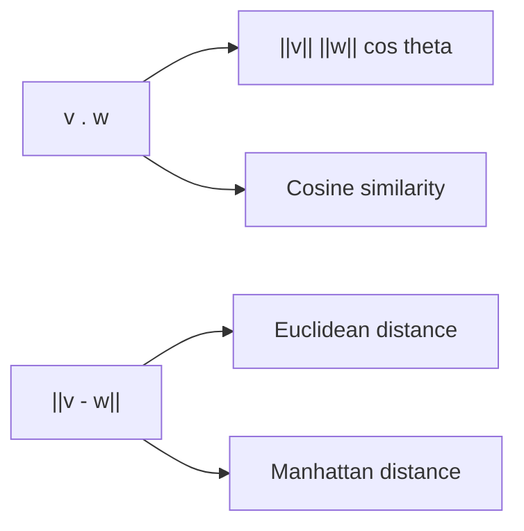

# 내적과 거리

벡터를 표현할 수 있게 되면 다음 질문이 바로 따라옵니다. 두 벡터는 얼마나 비슷한가, 얼마나 떨어져 있는가 하는 질문입니다. 추천 시스템, 벡터 검색, 임베딩 비교가 모두 결국 이 질문을 수치로 바꾸는 작업입니다.

이 글은 Linear Algebra 101 시리즈의 4번째 글입니다. 여기서는 내적, 코사인 유사도, 유클리드 거리와 맨해튼 거리를 한 흐름으로 연결해 보겠습니다.

## 이 글에서 다룰 문제

- 내적은 왜 숫자 하나로 나올까요?
- 코사인 유사도는 내적과 어떻게 연결될까요?
- 유클리드 거리와 맨해튼 거리는 무엇이 다를까요?
- 비슷하다는 말과 가깝다는 말은 왜 항상 같지 않을까요?

> 내적은 두 벡터가 얼마나 같은 방향을 보는지 측정하고, 거리는 두 벡터가 공간에서 얼마나 떨어져 있는지 측정합니다. 질문이 다르니 결과도 다르게 읽어야 합니다.

## 왜 중요한가

문서 임베딩 검색에서는 방향 유사성이 중요해 코사인 유사도를 많이 씁니다. 반면 실제 좌표 차이의 크기가 중요한 문제에서는 유클리드 거리나 다른 거리 함수가 더 자연스럽습니다. 따라서 벡터 비교에서 무엇을 비슷하다고 부를지 먼저 정해야 합니다.

실무에서 이 감각이 없으면 메트릭 선택이 습관이 됩니다. 아무 이유 없이 코사인을 쓰거나, 무조건 L2 거리를 쓰는 식입니다. 하지만 비교 기준 하나만 바뀌어도 검색 결과, 추천 순위, 군집 구조가 크게 달라질 수 있습니다. 내적과 거리는 공식을 외우는 주제가 아니라 비교의 기준을 선택하는 주제입니다.

## 핵심 개념 한눈에 보기



내적은 같은 계산을 두 가지로 읽게 해 줍니다. 좌표별 곱의 합으로 볼 수도 있고, 길이와 각도의 관계로 볼 수도 있습니다. 거리는 벡터 차이의 크기입니다. 그래서 내적은 정렬 정도를, 거리는 분리 정도를 보여 준다고 생각하면 편합니다.

## 핵심 용어

- 내적: `v . w = sum(v_i * w_i)` 형태의 스칼라입니다.
- 코사인 유사도: `(v . w) / (||v|| ||w||)`로 방향만 비교합니다.
- 직교: 내적이 0인 관계입니다.
- 유클리드 거리: `||v - w||`로 표현하는 직선 거리입니다.
- 맨해튼 거리: `sum(|v_i - w_i|)`로 계산하는 격자형 거리입니다.

## 읽기 전과 후

읽기 전에는 내적을 단순한 곱셈-덧셈 공식으로 보기 쉽습니다. 그러면 왜 코사인 유사도가 등장하는지, 왜 거리 함수에 따라 결과 해석이 달라지는지 잘 연결되지 않습니다.

읽은 후에는 내적이 방향 정렬을, 거리가 분리 정도를 보여 준다는 점이 분명해집니다. 같은 두 벡터를 놓고도 무엇을 묻느냐에 따라 다른 척도를 써야 한다는 감각이 생깁니다.

## 다섯 단계로 비교 기준 익히기

### 1단계 — 벡터 준비

```python
import numpy as np
v = np.array([1.0, 2.0, 3.0])
w = np.array([4.0, 5.0, 6.0])
```

먼저 비교할 두 벡터를 준비합니다. 예제는 단순하지만 내적과 거리의 차이를 한눈에 보기 좋습니다.

### 2단계 — 내적

```python
print("v . w:", np.dot(v, w))
print("v . w:", v @ w)
```

내적은 같은 위치의 원소를 곱해 모두 더한 값입니다. NumPy에서는 `np.dot`과 `@` 표기가 함께 쓰입니다.

### 3단계 — 코사인 유사도

```python
cos_sim = (v @ w) / (np.linalg.norm(v) * np.linalg.norm(w))
print("cosine similarity:", cos_sim)
```

여기서는 길이의 영향을 나눠 제거합니다. 그래서 코사인 유사도는 크기가 아니라 방향 유사성을 보여 줍니다.

### 4단계 — 유클리드 거리

```python
print("Euclidean:", np.linalg.norm(v - w))
```

유클리드 거리는 두 벡터 차이의 길이입니다. 두 점 사이를 직선으로 잰다고 생각하면 됩니다.

### 5단계 — 맨해튼 거리

```python
print("Manhattan:", np.sum(np.abs(v - w)))
```

맨해튼 거리는 좌표별 차이의 절댓값을 모두 더합니다. 어떤 문제에서는 직선 거리보다 이 방식이 더 자연스러울 수 있습니다.

## 이 코드에서 먼저 볼 점

- 내적은 방향과 크기를 함께 반영합니다.
- 코사인 유사도는 방향만 비교합니다.
- 거리는 값이 작을수록 더 가깝게 읽습니다.
- 같은 데이터라도 척도 선택에 따라 해석이 달라집니다.

## 자주 하는 실수

1. 내적과 원소별 곱을 같은 것으로 다룹니다.
2. 코사인 유사도 계산에서 정규화를 빼먹습니다.
3. 영벡터에 코사인 유사도를 적용해 0으로 나눕니다.
4. 유클리드 거리와 맨해튼 거리를 같은 감각으로 읽습니다.
5. 고차원에서 거리 직관이 약해진다는 사실을 잊습니다.

## 실무에서는 이렇게 읽는다

시니어 엔지니어는 메트릭을 먼저 고르고 나서 결과를 해석합니다. 문장 임베딩처럼 방향이 중요한 경우에는 정규화 후 코사인 유사도가 자연스럽고, 실제 양적 차이가 중요한 데이터에서는 거리 기반 접근이 더 맞을 수 있습니다.

또한 메트릭 선택이 모델 바깥의 전처리와 연결되어 있다는 점도 놓치지 않습니다. 정규화를 했는지, 스케일이 맞는지, 희소 벡터인지 밀집 벡터인지에 따라 비교 기준 자체가 달라져야 하기 때문입니다. 좋은 비교 기준은 좋은 검색 품질과 추천 품질의 출발점입니다.

## 체크리스트

- [ ] 내적을 계산하고 의미를 설명할 수 있습니다.
- [ ] 코사인 유사도를 계산할 수 있습니다.
- [ ] 유클리드 거리와 맨해튼 거리의 차이를 설명할 수 있습니다.
- [ ] 비슷함과 가까움이 같은 말이 아니라는 점을 이해했습니다.

## 연습 문제

1. `v = [1, 0]`, `w = [0, 1]`의 내적을 계산하고 왜 직교인지 설명해 보세요.
2. 코사인 유사도가 `1`, `0`, `-1`이 되도록 벡터 쌍을 만들어 보세요.
3. 유클리드 거리와 맨해튼 거리가 다르게 나오는 예시를 구성해 보세요.

## 정리와 다음 글

내적은 벡터가 얼마나 같은 방향을 보는지 알려 주고, 코사인 유사도는 그중 방향만 떼어 내 비교합니다. 거리는 두 벡터가 공간에서 얼마나 떨어져 있는지를 보여 줍니다. 이 세 기준을 구분해서 읽을 수 있으면 벡터 검색, 추천, 군집화 같은 주제를 더 선명하게 볼 수 있습니다.

다음 글에서는 선형변환으로 넘어갑니다. 이제 벡터를 비교하는 기준을 익혔으니, 행렬이 벡터 공간 자체를 어떻게 바꾸는지도 같은 언어로 읽어 보겠습니다.

<!-- toc:begin -->
- [선형대수란 무엇인가?](./01-what-is-linear-algebra.md)
- [벡터](./02-vectors.md)
- [행렬](./03-matrices.md)
- **내적과 거리 (현재 글)**
- 선형변환 (예정)
- 기저와 차원 (예정)
- 고유값과 고유벡터 (예정)
- 행렬 분해 (예정)
- PCA (예정)
- 머신러닝에서의 선형대수 (예정)
<!-- toc:end -->

## 참고 자료

- [Wikipedia — Dot product](https://en.wikipedia.org/wiki/Dot_product)
- [Wikipedia — Cosine similarity](https://en.wikipedia.org/wiki/Cosine_similarity)
- [3Blue1Brown — Dot products](https://www.3blue1brown.com/lessons/dot-products)
- [scikit-learn — Pairwise metrics](https://scikit-learn.org/stable/modules/metrics.html)

Tags: LinearAlgebra, InnerProduct, Distance, DataScience, Beginner
