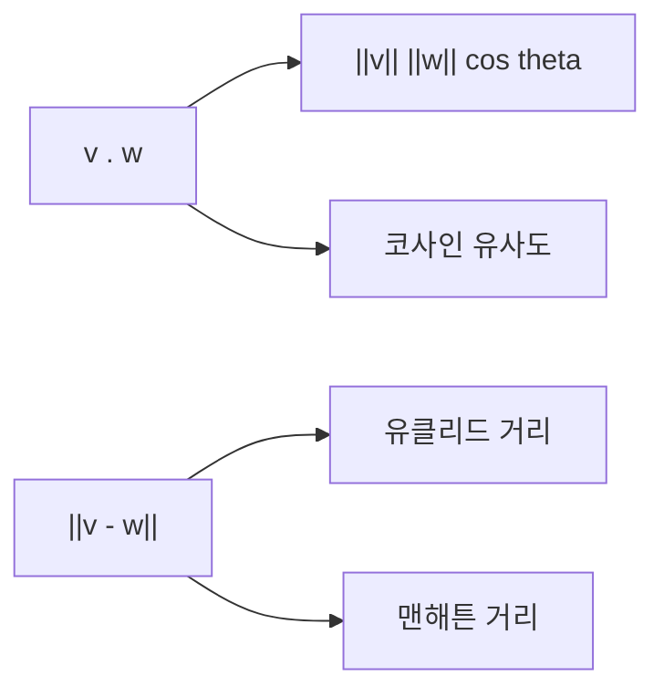

# 내적과 거리

## 이 글에서 다룰 문제

- 내적은 정확히 무엇이고, 왜 결과가 숫자 하나로 나올까요?
- 코사인 유사도는 내적과 어떻게 이어질까요?
- 유클리드 거리와 맨해튼 거리는 무엇이 다를까요?
- 벡터의 방향이 비슷하다는 말은 수식으로 어떻게 드러날까요?
- 추천 시스템, 검색, 임베딩 유사도 계산에서 왜 이 개념이 계속 등장할까요?

> Linear Algebra 101 시리즈 (4/10)

<!-- a-grade-intro:begin -->

핵심 질문은 간단합니다. 두 벡터가 얼마나 비슷한지, 또 얼마나 떨어져 있는지를 숫자로 어떻게 표현할까요?

> 내적은 두 벡터의 정렬 정도를, 거리는 두 벡터의 분리 정도를 보여줍니다.

<!-- a-grade-intro:end -->

내적과 거리는 선형대수 교과서 안에만 머무는 개념이 아닙니다. 추천 시스템의 아이템 유사도, 검색의 벡터 점수, NLP의 임베딩 비교는 모두 이 두 도구 위에 서 있습니다. 벡터 검색을 이해하려면 결국 “얼마나 같은 방향을 보느냐”와 “얼마나 떨어져 있느냐”를 함께 읽을 수 있어야 합니다.

## 왜 중요한가

초보자에게 내적은 종종 “곱해서 더하는 계산”으로만 보입니다. 틀린 말은 아니지만, 그 설명만으로는 왜 코사인 유사도가 나오고 왜 거리 함수가 모델의 동작을 바꾸는지까지 연결되지 않습니다. 실무에서는 같은 벡터라도 어떤 척도를 쓰느냐에 따라 가장 비슷한 결과가 달라집니다.

예를 들어 문서 임베딩 검색에서는 크기보다 방향이 더 중요한 경우가 많아서 코사인 유사도를 자주 씁니다. 반대로 실제 차이의 크기 자체가 중요하면 유클리드 거리나 다른 거리 함수를 씁니다. 결국 내적과 거리를 이해한다는 말은, 벡터를 비교하는 기준을 스스로 고를 수 있다는 뜻입니다.

## 한눈에 보는 구조



## 핵심 용어

- **내적(inner product)**: `v . w = sum(v_i * w_i)` 형태로 계산되는 스칼라입니다.
- **코사인 유사도**: `(v . w) / (||v|| ||w||)`로 계산하며 방향의 유사성을 봅니다.
- **직교(orthogonal)**: `v . w = 0`이면 두 벡터는 서로 직교합니다.
- **유클리드 거리**: `||v - w||`로 표현하는 직선 거리입니다.
- **맨해튼 거리**: `sum(|v_i - w_i|)`로 계산하는 격자형 거리입니다.

## 직교를 이해하면 벡터 비교가 쉬워진다

직교는 내적을 배울 때 꼭 넘어야 하는 지점입니다. 두 벡터의 내적이 0이라는 말은, 서로 전혀 같은 방향 성분을 공유하지 않는다는 뜻입니다. 좌표축의 기본 벡터를 떠올리면 이해가 쉽습니다. 오른쪽을 가리키는 벡터와 위쪽을 가리키는 벡터는 둘 다 분명히 존재하지만, 서로를 같은 방향으로 밀어 주지는 않습니다.

이 감각은 뒤로 갈수록 더 중요해집니다. 기저를 배우거나 차원을 이해할 때도, 서로 독립적인 방향을 어떻게 구분할지 판단하는 기준으로 직교가 계속 등장합니다. 지금 단계에서 내적과 직교의 관계를 분명히 잡아 두면 이후 글의 난도가 훨씬 낮아집니다.

## 내적을 어떻게 이해하면 좋은가

내적의 계산은 단순합니다. 같은 위치의 원소를 곱하고 모두 더하면 됩니다. 그런데 해석은 계산보다 훨씬 중요합니다. 내적 값이 크면 두 벡터가 비슷한 방향을 본다는 뜻이고, 0이면 서로 직각 방향이라는 뜻이며, 음수면 반대 방향 성분이 크다는 뜻입니다.

이걸 기하학적으로 쓰면 `v . w = ||v|| ||w|| cos theta`가 됩니다. 같은 계산이 곱셈-덧셈으로도 보이고, 길이와 각도의 관계로도 보입니다. 그래서 내적은 단순한 산술 연산이 아니라 방향과 크기를 함께 담는 비교 도구입니다.

## 코사인 유사도는 왜 따로 볼까

코사인 유사도는 내적을 정규화한 형태입니다. 벡터의 길이를 나눠 버리기 때문에, 크기 차이를 제거하고 방향만 비교할 수 있습니다. 문서 임베딩이나 사용자 취향 벡터처럼 “얼마나 같은 방향을 향하느냐”가 중요한 문제에서는 이 성질이 아주 유용합니다.

예를 들어 `[1, 2, 3]`과 `[2, 4, 6]`은 크기는 다르지만 완전히 같은 방향입니다. 내적 값 자체는 커지지만, 코사인 유사도는 1이 나옵니다. 방향 유사도만 보고 싶다면 바로 이 차이가 중요합니다.

## 거리는 무엇을 말해 줄까

거리는 유사도가 아니라 분리 정도를 재는 도구입니다. 값이 작을수록 두 벡터가 가깝고, 값이 클수록 멉니다. 같은 벡터 비교 문제라도 어떤 거리 함수를 쓰느냐에 따라 모델의 판단이 달라질 수 있습니다.

유클리드 거리는 우리가 가장 익숙한 직선 거리입니다. 반면 맨해튼 거리는 격자 위를 가듯이 축 방향 이동량을 모두 더합니다. 좌표별 차이를 얼마나 민감하게 볼지에 따라 둘의 해석이 달라집니다. 그래서 거리 함수는 단순한 계산 선택이 아니라 문제 해석의 선택입니다.

여기서 중요한 점이 하나 더 있습니다. 유사도와 거리는 서로 반대쪽에서 같은 대상을 보는 경우가 많지만, 항상 완전히 같은 순위를 만들지는 않습니다. 벡터를 정규화했는지, 각 좌표의 스케일이 어떤지, 데이터가 희소한지 밀집한지에 따라 더 잘 맞는 척도가 달라집니다. 그래서 실무에서는 수식을 외우는 것보다도, 이 데이터에서 무엇을 비슷하다고 볼지 먼저 정의하는 습관이 더 중요합니다.

## Before / After

**Before**: 내적은 그냥 곱해서 더한 값입니다.

**After**: 내적은 두 벡터의 정렬 정도를 보여 주고, 코사인 유사도는 그중 방향만 분리해서 비교합니다.

## 실습: 내적과 거리를 5단계로 계산해 보기

### 1단계 — 벡터 준비

```python
import numpy as np
v = np.array([1.0, 2.0, 3.0])
w = np.array([4.0, 5.0, 6.0])
```

먼저 비교할 두 벡터를 준비합니다. 예시는 단순하지만, 이후 단계에서 내적·유사도·거리가 서로 어떻게 연결되는지 한 번에 확인하기 좋습니다.

### 2단계 — 내적

```python
print("v . w:", np.dot(v, w))
print("v . w:", v @ w)
```

`np.dot(v, w)`와 `v @ w`는 같은 내적 계산입니다. NumPy에서는 둘 다 자주 보이므로 둘을 함께 알아 두는 편이 좋습니다.

### 3단계 — 코사인 유사도

```python
cos_sim = (v @ w) / (np.linalg.norm(v) * np.linalg.norm(w))
print("cosine similarity:", cos_sim)
```

여기서는 길이의 영향을 제거하기 위해 두 벡터의 노름(norm)으로 나눕니다. 이 단계가 들어가면 “곱이 큰가?”가 아니라 “방향이 비슷한가?”라는 질문으로 바뀝니다.

### 4단계 — 유클리드 거리

```python
print("Euclidean:", np.linalg.norm(v - w))
```

유클리드 거리는 두 벡터의 차이 `v - w`를 만든 뒤, 그 벡터의 길이를 재는 방식입니다. 두 점 사이를 직선으로 잰다고 생각하면 됩니다.

### 5단계 — 맨해튼 거리

```python
print("Manhattan:", np.sum(np.abs(v - w)))
```

맨해튼 거리는 좌표별 차이의 절댓값을 모두 더합니다. 직선으로 가는 대신 가로·세로 블록을 따라 움직이는 거리라고 보면 감이 잘 옵니다.

## 이 코드에서 주목할 점

- 내적은 방향과 크기를 함께 반영합니다.
- 코사인 유사도는 방향만 반영하므로 스케일 변화에 덜 민감합니다.
- 거리는 비유사도 척도라서 값이 작을수록 가깝습니다.
- 같은 두 벡터를 놓고도 내적과 거리의 해석은 서로 다릅니다.

실습 코드가 짧다고 해서 담고 있는 뜻까지 가벼운 것은 아닙니다. 같은 `v`, `w`를 두고도 내적, 코사인 유사도, 거리라는 세 개의 렌즈를 번갈아 끼워 보는 순간 벡터 비교의 기본 문법이 한꺼번에 정리됩니다. 이후에 임베딩, 최근접 이웃 검색, 군집화 알고리즘을 배울 때도 결국 같은 문법이 조금 더 큰 규모로 반복됩니다.

## 자주 하는 실수 5가지

1. **내적과 원소별 곱을 같은 것으로 보는 실수**

   `v * w`는 원소별 곱이고, `v @ w` 또는 `np.dot(v, w)`는 내적입니다. 둘은 결과 형태부터 다릅니다.

2. **코사인 유사도에서 정규화를 빼먹는 실수**

   내적만 계산하고 유사도라고 부르면 방향과 크기가 섞여 버립니다. 코사인 유사도는 반드시 `||v|| ||w||`로 나누어야 합니다.

3. **영벡터에 코사인 유사도를 적용하는 실수**

   길이가 0인 벡터는 분모가 0이므로 바로 계산하면 안 됩니다. 영벡터는 별도 예외 처리해야 합니다.

4. **유클리드 거리와 맨해튼 거리를 같은 감각으로 읽는 실수**

   두 거리 함수는 좌표 차이를 모으는 방식이 다릅니다. 문제 성격에 따라 더 맞는 척도가 달라집니다.

5. **고차원에서 거리 직관이 약해진다는 점을 잊는 실수**

   차원이 높아질수록 가까움과 멂의 차이가 둔해지는 일이 생깁니다. 벡터 검색이나 임베딩 비교에서는 이 점을 항상 염두에 둬야 합니다.

## 실무에서는 이렇게 나타난다

추천 시스템에서는 비슷한 아이템이나 사용자를 찾을 때 내적과 유사도를 씁니다. 벡터 데이터베이스에서는 임베딩 간 거리를 줄이거나 유사도를 키우는 방식으로 가까운 후보를 찾습니다. NLP에서는 문장 임베딩이 얼마나 비슷한 방향을 향하는지로 의미 유사성을 추정합니다. 군집화에서도 결국 어떤 점들이 서로 가깝다고 볼지를 거리 함수가 결정합니다.

같은 모델이라도 척도를 바꾸면 결과 해석이 바뀝니다. 그래서 실무에서 중요한 질문은 “어떤 수식을 아느냐”보다 “이 문제에 어떤 비교 기준이 맞느냐”입니다.

예를 들어 상품 추천에서 구매량처럼 크기 자체가 의미를 가지는 벡터라면, 단순히 방향만 보는 방식이 부족할 수 있습니다. 반대로 문장 임베딩처럼 길이보다 의미 방향이 더 중요한 데이터에서는 코사인 유사도가 훨씬 자연스럽습니다. 어느 쪽이 더 우월하다고 외우기보다, 데이터가 담은 의미를 먼저 읽고 그에 맞는 메트릭을 고르는 편이 훨씬 실용적입니다.

또 하나 자주 놓치는 부분은 전처리입니다. 정규화를 한 뒤 비교할지, 그대로 비교할지에 따라 결과가 달라집니다. 검색 품질이 이상하게 흔들릴 때 모델만 의심하기보다, 입력 벡터를 만드는 과정과 비교 메트릭이 서로 맞는지도 함께 확인해야 합니다. 내적과 거리의 선택은 모델 바깥의 파이프라인 설계와도 깊게 연결됩니다.

## 시니어 엔지니어는 이렇게 판단합니다

- 코사인 유사도와 유클리드 거리를 습관처럼 바꾸지 않고, 왜 그 척도를 쓰는지 설명합니다.
- 정규화 후 내적이 사실상 코사인 유사도와 연결된다는 점을 알고 있습니다.
- 고차원 벡터에서 거리 직관이 쉽게 무너진다는 점을 경계합니다.
- 메트릭 선택이 검색 품질, 클러스터링 결과, 추천 랭킹을 바꾼다는 사실을 압니다.
- 벡터 데이터베이스 인덱스와 메트릭이 함께 설계되어야 한다는 점을 놓치지 않습니다.

## 작은 사고 실험

벡터를 단순한 숫자 묶음으로만 보면 내적과 거리가 따로 노는 공식처럼 보일 수 있습니다. 하지만 벡터를 “방향과 크기를 가진 화살표”로 보면 이야기가 달라집니다. 내적은 두 화살표가 얼마나 같은 쪽을 향하는지 묻고, 거리는 화살표 끝점이 서로 얼마나 떨어져 있는지 묻습니다. 질문이 다르니 답도 다르게 나오는 것이 자연스럽습니다.

이 사고 실험을 머릿속에 두면 공식을 외우지 않고도 많은 상황을 설명할 수 있습니다. 방향만 같으면 코사인 유사도는 높게 나오고, 실제 위치 차이가 크면 거리는 크게 나옵니다. 즉, 비슷하다는 말도 무엇을 기준으로 하느냐에 따라 의미가 달라집니다. 선형대수는 바로 그 기준을 명확한 수식으로 바꿔 주는 학문입니다.

## 체크리스트

- [ ] 내적을 계산할 수 있습니다.
- [ ] 코사인 유사도를 계산할 수 있습니다.
- [ ] 유클리드 거리와 맨해튼 거리의 차이를 설명할 수 있습니다.
- [ ] 직교가 무엇인지 설명할 수 있습니다.

## 연습 문제

1. `v = [1, 0]`, `w = [0, 1]`의 내적을 계산하고 두 벡터가 왜 직교인지 확인해 보세요.
2. 코사인 유사도가 각각 `1`, `0`, `-1`이 되도록 벡터 쌍을 직접 만들어 보세요.
3. 유클리드 거리와 맨해튼 거리가 서로 다르게 나오는 예시를 하나 구성해 보세요.

## 정리와 다음 글

내적은 두 벡터가 얼마나 같은 방향을 향하는지 읽는 기본 도구입니다. 코사인 유사도는 그중 방향만 떼어 내어 비교하는 방법이고, 거리는 두 벡터가 얼마나 떨어져 있는지를 보여 줍니다. 이 세 가지를 구분해서 읽을 수 있으면 벡터 검색, 추천, 임베딩 비교의 기초가 훨씬 단단해집니다. 다음 글에서는 벡터와 행렬이 실제로 다른 벡터를 어떻게 만들어 내는지, 즉 선형변환을 다룹니다.

여기까지 이해했다면 이제 벡터를 단순한 숫자 배열이 아니라 비교 가능한 대상, 변환 가능한 대상으로 보기 시작한 것입니다. 이 시점부터 선형대수의 여러 주제가 서로 연결됩니다. 내적과 거리를 익혀 두면 다음 글의 선형변환도 훨씬 덜 추상적으로 느껴질 것입니다.

<!-- toc:begin -->
- [선형대수란 무엇인가?](./01-what-is-linear-algebra.md)
- [벡터](./02-vectors.md)
- [행렬](./03-matrices.md)
- **내적과 거리 (현재 글)**
- 선형변환 (예정)
- 기저와 차원 (예정)
- 고유값과 고유벡터 (예정)
- 행렬 분해 (예정)
- PCA (예정)
- 머신러닝에서의 선형대수 (예정)
<!-- toc:end -->

## 참고 자료

- [Wikipedia — Dot product](https://en.wikipedia.org/wiki/Dot_product)
- [Wikipedia — Cosine similarity](https://en.wikipedia.org/wiki/Cosine_similarity)
- [3Blue1Brown — Dot products](https://www.3blue1brown.com/lessons/dot-products)
- [scikit-learn — Pairwise metrics](https://scikit-learn.org/stable/modules/metrics.html)

Tags: LinearAlgebra, InnerProduct, Distance, DataScience, Beginner
