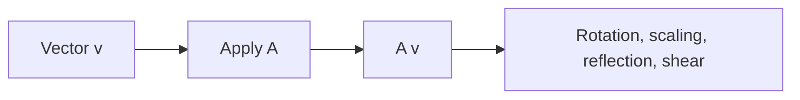

# 선형변환

> Linear Algebra 101 시리즈 (5/10)

<!-- a-grade-intro:begin -->

**핵심 질문**: *행렬을 곱한다* 는 행위는 *기하학적으로 무엇* 일까요?

> *선형변환은 *공간의 격자선을 평행하고 등간격* 으로 *유지* 하면서 *변형* 한다.*

<!-- a-grade-intro:end -->

## 이 글에서 배울 것

- *선형변환* 의 *정의와 성질*
- *회전/확대/반사/전단* 의 *행렬 표현*
- *변환의 합성* 과 *행렬 곱*
- 5단계 실습
- 흔한 함정 5가지

## 왜 중요한가

신경망의 *각 레이어* 가 *선형변환* + *비선형 활성* 입니다. *변환의 직관* 이 *모델의 직관* 입니다.

> *Every layer is a transformation of space.*

## 개념 한눈에 보기



## 핵심 용어 정리

- **선형변환**: `T(av + bw) = a T(v) + b T(w)` — *합과 스칼라곱* 보존.
- **회전 행렬**: 각도 `theta` 만큼 회전.
- **스케일링**: 대각 행렬로 *확대/축소*.
- **반사**: *축* 에 대한 *대칭*.
- **전단(shear)**: *한 방향* 으로 *비스듬히* 이동.

## Before/After

**Before**: *“행렬은 그냥 변환”* — *모양은 모름*.

**After**: *“회전은 *각도*, 스케일링은 *대각*, 반사는 *부호 반전*, 전단은 *비대각*.”*

## 실습: 5단계 변환

### 1단계 — 회전

```python
import numpy as np
theta = np.pi / 4
R = np.array([[np.cos(theta), -np.sin(theta)],
              [np.sin(theta),  np.cos(theta)]])
v = np.array([1.0, 0.0])
print("rotated:", R @ v)
```

### 2단계 — 스케일링

```python
S = np.diag([2.0, 0.5])
print("scaled:", S @ np.array([1.0, 1.0]))
```

### 3단계 — 반사 (x축 대칭)

```python
F = np.array([[1.0, 0.0], [0.0, -1.0]])
print("reflected:", F @ np.array([1.0, 1.0]))
```

### 4단계 — 전단

```python
Sh = np.array([[1.0, 1.0], [0.0, 1.0]])
print("sheared:", Sh @ np.array([1.0, 1.0]))
```

### 5단계 — 변환의 합성

```python
M = R @ S
print("compose RS:", M @ np.array([1.0, 0.0]))
```

## 이 코드에서 주목할 점

- *행렬 곱* 은 *변환의 합성*.
- *각 변환* 은 *고유한 행렬 모양* 을 가짐.
- *순서* 가 결과를 바꿈.

## 자주 하는 실수 5가지

1. ***회전 부호* 헷갈림 — 시계/반시계.**
2. ***스케일링이 음수* 일 때 *반사 발생*.**
3. ***전단* 의 *방향* 헷갈림.**
4. ***변환 합성 순서* 거꾸로.**
5. ***비선형 변환* 을 *선형* 으로 착각.**

## 실무에서는 이렇게 쓰입니다

CG/그래픽스의 *모델 행렬*, 컴퓨터 비전의 *호모그래피*, *데이터 증강(회전/스케일)*, 신경망 레이어 — 모두 *선형변환* 입니다.

## 시니어 엔지니어는 이렇게 생각합니다

- *변환을 그림으로* 본다.
- *합성 순서* 를 의식한다.
- *행렬식의 부호* 로 *방향 보존* 을 확인.
- *고유벡터* 로 *변환의 축* 을 본다.
- *비선형은 별도* 임을 안다.

## 체크리스트

- [ ] *회전/스케일/반사/전단* 행렬을 만들 수 있다.
- [ ] *변환 합성* 을 행렬 곱으로 표현 가능.
- [ ] *순서* 의 영향 안다.
- [ ] *기하학적 의미* 를 안다.

## 연습 문제

1. *45도 회전 행렬* 을 두 번 곱한 결과가 *90도 회전* 임을 확인하세요.
2. *반사 후 회전* 과 *회전 후 반사* 가 *다른지* 확인하세요.
3. *스케일링이 (-1, -1)* 일 때 *효과* 를 적으세요.

## 정리 및 다음 단계

선형변환은 *공간의 변형* 입니다. 다음 글에서는 *기저와 차원* 을 다룹니다.

<!-- toc:begin -->
- [선형대수란 무엇인가?](./01-what-is-linear-algebra.md)
- [벡터](./02-vectors.md)
- [행렬](./03-matrices.md)
- [내적과 거리](./04-inner-product-and-distance.md)
- **선형변환 (현재 글)**
- 기저와 차원 (예정)
- 고유값과 고유벡터 (예정)
- 행렬 분해 (예정)
- PCA (예정)
- 머신러닝에서의 선형대수 (예정)
<!-- toc:end -->

## 참고 자료

- [3Blue1Brown — Linear transformations](https://www.3blue1brown.com/lessons/linear-transformations)
- [Wikipedia — Linear map](https://en.wikipedia.org/wiki/Linear_map)
- [Wikipedia — Rotation matrix](https://en.wikipedia.org/wiki/Rotation_matrix)
- [Khan Academy — Transformations](https://www.khanacademy.org/math/linear-algebra/matrix-transformations)

Tags: LinearAlgebra, LinearTransformation, Geometry, DataScience, Beginner
