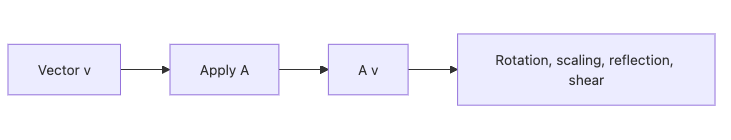

# 선형변환

행렬을 배우고 나면 다음 질문이 남습니다. 그래서 행렬이 실제로 공간에 무엇을 하는가 하는 질문입니다. 이 질문에 답하는 개념이 선형변환입니다. 행렬은 결국 선형변환을 좌표계 안에서 적어 놓은 표현이기 때문입니다.

이 글은 Linear Algebra 101 시리즈의 5번째 글입니다. 여기서는 회전, 확대, 반사, 전단을 예로 들어 선형변환을 기하학적으로 읽어 보겠습니다.

## 이 글에서 다룰 문제

- 행렬을 곱한다는 말은 공간에 어떤 변화를 주는 걸까요?
- 회전, 확대, 반사, 전단은 행렬 모양으로 어떻게 드러날까요?
- 변환의 합성은 왜 행렬 곱으로 표현될까요?
- 선형변환과 비선형변환은 어디서 갈릴까요?

> 선형변환은 공간을 다시 그리는 규칙입니다. 다만 아무렇게나 바꾸는 것이 아니라 덧셈과 스칼라곱 구조를 보존하는 방식으로 바꿉니다.

## 왜 중요한가

신경망의 각 레이어는 선형변환과 비선형 활성화의 조합입니다. 컴퓨터 그래픽스의 모델 행렬, 컴퓨터 비전의 좌표 변환, 데이터 증강의 회전과 확대도 모두 같은 틀로 설명할 수 있습니다.

선형변환 감각이 생기면 행렬이 더 이상 숫자판이 아닙니다. 어떤 행렬은 축을 늘리고, 어떤 행렬은 공간을 돌리고, 어떤 행렬은 방향을 뒤집습니다. 그 순간부터 선형대수 계산은 움직임과 구조를 설명하는 언어가 됩니다.

## 핵심 개념 한눈에 보기



*하나의 행렬이 회전, 확대, 반사, 전단 같은 공간 변화를 만든다는 점을 보여 주는 개념도입니다.*

선형변환의 핵심은 입력 벡터 하나가 아니라 공간 전체가 함께 바뀐다는 점입니다. 격자는 평행성과 비율을 유지한 채 회전하거나 늘어나거나 기울어집니다.

## 핵심 용어

- 선형변환: `T(av + bw) = a T(v) + b T(w)`를 만족하는 규칙입니다.
- 회전: 각도를 유지한 채 방향만 돌리는 변환입니다.
- 확대와 축소: 대각 성분으로 길이를 조절하는 변환입니다.
- 반사: 축이나 직선을 기준으로 방향을 뒤집는 변환입니다.
- 전단: 한 축 방향으로 공간을 기울이는 변환입니다.

## 읽기 전과 후

읽기 전에는 행렬이 그냥 변환이라고만 들립니다. 하지만 무엇을 얼마나 어떻게 바꾸는지는 흐릿합니다.

읽은 후에는 회전은 각도로, 확대는 대각 성분으로, 반사는 부호 반전으로, 전단은 비대각 성분으로 읽히기 시작합니다. 행렬의 모양과 기하학적 효과가 연결됩니다.

## 다섯 단계로 변환 읽기

### 1단계 — 회전

```python
import numpy as np
theta = np.pi / 4
R = np.array([[np.cos(theta), -np.sin(theta)],
              [np.sin(theta),  np.cos(theta)]])
v = np.array([1.0, 0.0])
print("rotated:", R @ v)
```

회전 행렬은 방향을 바꾸되 구조를 보존하는 대표적인 선형변환입니다. 좌표가 바뀌어도 공간의 기본 질서는 유지됩니다.

### 2단계 — 확대와 축소

```python
S = np.diag([2.0, 0.5])
print("scaled:", S @ np.array([1.0, 1.0]))
```

대각행렬은 각 축을 독립적으로 늘리거나 줄입니다. 축별 스케일이 어떻게 달라지는지 바로 읽기 좋습니다.

### 3단계 — 반사

```python
F = np.array([[1.0, 0.0], [0.0, -1.0]])
print("reflected:", F @ np.array([1.0, 1.0]))
```

반사는 한 축에 대해 부호를 뒤집습니다. 공간의 방향성이 바뀌는 좋은 예입니다.

### 4단계 — 전단

```python
Sh = np.array([[1.0, 1.0], [0.0, 1.0]])
print("sheared:", Sh @ np.array([1.0, 1.0]))
```

전단은 격자를 기울입니다. 직사각형이 평행사변형으로 바뀌는 식의 변화를 떠올리면 감이 잘 옵니다.

### 5단계 — 변환 합성

```python
M = R @ S
print("compose RS:", M @ np.array([1.0, 0.0]))
```

합성은 선형변환의 진짜 핵심입니다. 먼저 확대하고 회전한 결과를 하나의 행렬로 묶어 표현할 수 있습니다.

## 작은 수치 예시로 다시 보기

- 45도 회전 행렬을 `[1, 0]`에 적용하면 결과는 대략 `[0.707, 0.707]`입니다. 방향만 바뀌고 길이는 유지됩니다.
- 대각행렬 `diag(2, 0.5)`를 `[1, 1]`에 적용하면 `[2., 0.5]`가 됩니다. 축마다 다른 비율로 늘고 줄어듭니다.
- `R @ S`를 먼저 만들어 두면 여러 변환을 하나의 행렬로 묶어 다룰 수 있습니다.

## 이 코드에서 먼저 볼 점

- 행렬 곱은 변환의 합성입니다.
- 각 변환은 특징적인 행렬 모양을 가집니다.
- 순서가 바뀌면 결과도 바뀝니다.
- 선형변환은 공간의 구조를 보존하는 변환입니다.

## 자주 하는 실수

1. 회전 방향의 부호를 뒤집습니다.
2. 음수 스케일이 반사 효과를 포함한다는 점을 놓칩니다.
3. 전단이 어느 축을 기준으로 기울어지는지 헷갈립니다.
4. 합성 순서를 거꾸로 적용합니다.
5. 비선형변환을 선형변환처럼 다룹니다.

## 실무에서는 이렇게 읽는다

시니어 엔지니어는 행렬을 볼 때 그 행렬이 공간을 어떻게 바꾸는지 떠올립니다. 좌표계가 회전하는지, 축별 스케일이 달라지는지, 방향성이 뒤집히는지를 읽을 수 있어야 모델 내부의 계산도 감이 잡힙니다.

또한 합성 순서를 매우 조심합니다. 그래픽스 파이프라인이든 신경망 레이어든 계산 순서가 바뀌면 완전히 다른 변환이 되기 때문입니다. 선형변환 감각은 계산을 그림으로 번역하는 능력과 거의 같습니다.

## 체크리스트

- [ ] 회전, 확대, 반사, 전단 행렬을 구분할 수 있습니다.
- [ ] 행렬 곱을 변환 합성으로 설명할 수 있습니다.
- [ ] 순서가 결과를 바꾼다는 점을 이해합니다.
- [ ] 선형변환과 비선형변환의 차이를 말할 수 있습니다.

## 연습 문제

1. 45도 회전을 두 번 적용하면 왜 90도 회전과 같은지 확인해 보세요.
2. 반사 후 회전과 회전 후 반사가 왜 다른지 예를 들어 설명해 보세요.
3. `(-1, -1)` 스케일링이 공간에 어떤 효과를 만드는지 말해 보세요.

## 정리와 다음 글

선형변환은 행렬을 공간의 언어로 번역해 주는 개념입니다. 회전, 확대, 반사, 전단은 모두 다른 모습이지만, 덧셈과 스칼라곱을 보존한다는 공통 규칙 아래 묶입니다. 이 관점이 잡히면 행렬 계산은 공간을 재구성하는 규칙으로 보이기 시작합니다.

다음 글에서는 기저와 차원으로 넘어갑니다. 공간을 바꾸는 규칙을 봤다면, 이제 그 공간을 표현하는 축과 축의 개수가 무엇인지 정리할 차례입니다.

<!-- toc:begin -->
- [선형대수란 무엇인가?](./01-what-is-linear-algebra.md)
- [벡터](./02-vectors.md)
- [행렬](./03-matrices.md)
- [내적과 거리](./04-inner-product-and-distance.md)
- **선형변환 (현재 글)**
- 기저와 차원 (예정)
- 고유값과 고유벡터 (예정)
- 행렬 분해 (예정)
- PCA (예정)
- 머신러닝에서의 선형대수 (예정)
<!-- toc:end -->

## 참고 자료

- [3Blue1Brown — Linear transformations](https://www.3blue1brown.com/lessons/linear-transformations)
- [Wikipedia — Linear map](https://en.wikipedia.org/wiki/Linear_map)
- [Wikipedia — Rotation matrix](https://en.wikipedia.org/wiki/Rotation_matrix)
- [Khan Academy — Transformations](https://www.khanacademy.org/math/linear-algebra/matrix-transformations)

Tags: LinearAlgebra, LinearTransformation, Geometry, DataScience, Beginner
