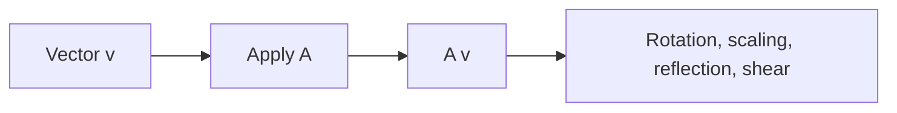

# 선형변환

> Linear Algebra 101 시리즈 (5/10)


## 이 글에서 다룰 문제

신경망의 각 레이어는 선형변환과 비선형 활성화의 조합입니다. 변환을 직관적으로 이해하면 모델 동작도 더 잘 보입니다.

> *Every layer is a transformation of space.*

## 전체 흐름


## Before/After

**Before**: *“행렬은 그냥 변환”* — *모양은 모름*.

**After**: *“회전은 각도로, 스케일링은 대각 성분으로, 반사는 부호 반전으로, 전단은 비대각 성분으로 읽는다.”*

## 5단계 변환

### 1단계 — 회전

```python
import numpy as np
theta = np.pi / 4
R = np.array([[np.cos(theta), -np.sin(theta)],
              [np.sin(theta),  np.cos(theta)]])
v = np.array([1.0, 0.0])
print("rotated:", R @ v)
```

### 2단계 — 스케일링

```python
S = np.diag([2.0, 0.5])
print("scaled:", S @ np.array([1.0, 1.0]))
```

### 3단계 — 반사 (x축 대칭)

```python
F = np.array([[1.0, 0.0], [0.0, -1.0]])
print("reflected:", F @ np.array([1.0, 1.0]))
```

### 4단계 — 전단

```python
Sh = np.array([[1.0, 1.0], [0.0, 1.0]])
print("sheared:", Sh @ np.array([1.0, 1.0]))
```

### 5단계 — 변환의 합성

```python
M = R @ S
print("compose RS:", M @ np.array([1.0, 0.0]))
```

## 이 코드에서 주목할 점

- 행렬 곱은 변환을 합성하는 연산입니다.
- 각 변환은 저마다 특징적인 행렬 모양을 가집니다.
- 적용 순서가 바뀌면 결과도 달라집니다.

## 자주 하는 실수 5가지

1. **회전 부호를 헷갈려 시계 방향과 반시계 방향을 뒤집는 실수**
2. **스케일링 값이 음수일 때 반사 효과가 생긴다는 점을 놓치는 실수**
3. **전단의 방향을 잘못 읽는 실수**
4. **변환 합성 순서를 거꾸로 적용하는 실수**
5. **비선형 변환을 선형변환으로 착각하는 실수**

## 실무에서는 이렇게 쓰입니다

CG와 그래픽스의 모델 행렬, 컴퓨터 비전의 호모그래피, 데이터 증강의 회전·스케일, 신경망 레이어는 모두 선형변환으로 설명할 수 있습니다.

## 체크리스트

- [ ] 회전·스케일·반사·전단 행렬을 만들 수 있다.
- [ ] 변환 합성을 행렬 곱으로 표현할 수 있다.
- [ ] 순서의 영향을 안다.
- [ ] 기하학적 의미를 안다.

## 정리 및 다음 단계

선형변환은 공간을 바꾸는 규칙입니다. 다음 글에서는 기저와 차원을 다룹니다.

<!-- toc:begin -->
- [선형대수란 무엇인가?](./01-what-is-linear-algebra.md)
- [벡터](./02-vectors.md)
- [행렬](./03-matrices.md)
- [내적과 거리](./04-inner-product-and-distance.md)
- **선형변환 (현재 글)**
- 기저와 차원 (예정)
- 고유값과 고유벡터 (예정)
- 행렬 분해 (예정)
- PCA (예정)
- 머신러닝에서의 선형대수 (예정)
<!-- toc:end -->

## 참고 자료

- [3Blue1Brown — Linear transformations](https://www.3blue1brown.com/lessons/linear-transformations)
- [Wikipedia — Linear map](https://en.wikipedia.org/wiki/Linear_map)
- [Wikipedia — Rotation matrix](https://en.wikipedia.org/wiki/Rotation_matrix)
- [Khan Academy — Transformations](https://www.khanacademy.org/math/linear-algebra/matrix-transformations)

Tags: LinearAlgebra, LinearTransformation, Geometry, DataScience, Beginner
