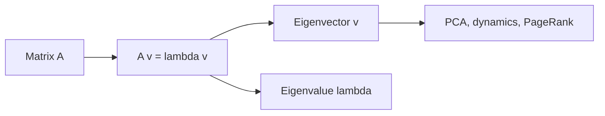

# 고유값과 고유벡터

> Linear Algebra 101 시리즈 (7/10)

<!-- a-grade-intro:begin -->

**핵심 질문**: 행렬을 *반복 적용* 했을 때 *변하지 않는 축* 이 있을까요?

> *고유벡터는 *변환의 불변 축*, 고유값은 *그 축에서의 신축률* 이다.*

<!-- a-grade-intro:end -->

## 이 글에서 배울 것

- *고유값/고유벡터* 의 *정의*
- *기하학적 의미*
- *NumPy* 로 구하기
- 5단계 실습
- 흔한 함정 5가지

## 왜 중요한가

PCA, 동역학, 양자역학, 페이지랭크 — 모두 *고유분해* 가 핵심입니다. *행렬을 단순한 좌표계* 에서 보게 해줍니다.

> *Eigenvectors are the natural axes of a transformation.*

## 개념 한눈에 보기



## 핵심 용어 정리

- **고유벡터 v**: `A v = lambda v` 를 만족하는 *영이 아닌 벡터*.
- **고유값 lambda**: *그 축에서의 스칼라 배율*.
- **고유분해**: `A = V D V^-1` (대각화 가능한 경우).
- **스펙트럼**: 모든 고유값의 집합.
- **대칭행렬**: 고유값이 *실수*, 고유벡터가 *직교*.

## Before/After

**Before**: *“고유값은 공식으로 푸는 것”* — *왜* 중요한지 모름.

**After**: *“변환의 *축* 을 찾는 도구 — 그 축에선 *단순한 스칼라곱*.”*

## 실습: 5단계 고유분해

### 1단계 — 행렬 정의

```python
import numpy as np
A = np.array([[2.0, 1.0], [0.0, 3.0]])
```

### 2단계 — 고유값/고유벡터

```python
vals, vecs = np.linalg.eig(A)
print("eigenvalues:", vals)
print("eigenvectors:\n", vecs)
```

### 3단계 — 검증

```python
for i in range(len(vals)):
    Av = A @ vecs[:, i]
    lv = vals[i] * vecs[:, i]
    print("A v == lambda v:", np.allclose(Av, lv))
```

### 4단계 — 대칭행렬

```python
S = np.array([[2.0, 1.0], [1.0, 2.0]])
sv, svc = np.linalg.eigh(S)  # 대칭/에르미트 전용
print("sym eigenvalues:", sv)
print("orthogonal? ", np.allclose(svc.T @ svc, np.eye(2)))
```

### 5단계 — 거듭제곱과 안정성

```python
M = np.array([[0.9, 0.1], [0.2, 0.8]])
v = np.array([1.0, 0.0])
for _ in range(50):
    v = M @ v
print("steady state:", v / np.linalg.norm(v, 1))
```

## 이 코드에서 주목할 점

- *고유분해* 는 *변환을 단순화*.
- *대칭행렬* 은 *eigh* 로 안정적.
- *거듭제곱* 은 *최대 고유값 방향* 으로 수렴.

## 자주 하는 실수 5가지

1. ***모든 행렬* 에 *대각화 가능* 가정.**
2. ***복소 고유값* 무시.**
3. ***대칭에 eig*, *비대칭에 eigh* 잘못 사용.**
4. ***고유벡터의 부호/스케일* 임의성 망각.**
5. ***수치 안정성* 무시.**

## 실무에서는 이렇게 쓰입니다

PCA(*공분산 행렬의 고유분해*), 페이지랭크(*최대 고유벡터*), 동역학 시스템(*안정성 분석*), 양자역학(*에너지 고유상태*) — 모두 *고유분해* 입니다.

## 시니어 엔지니어는 이렇게 생각합니다

- *대칭이면 eigh* 를 쓴다.
- *조건수* 로 *수치 안정성* 을 본다.
- *복소 고유값* 의 *물리적 의미* 를 본다.
- *고유벡터의 부호* 를 의식한다.
- *Power method* 를 *상황에 맞게* 사용.

## 체크리스트

- [ ] *고유값/고유벡터* 계산 가능.
- [ ] *대칭행렬* 차이 안다.
- [ ] *검증식* 으로 확인 가능.
- [ ] *거듭제곱 수렴* 을 안다.

## 연습 문제

1. *대각행렬 diag(2, 3)* 의 고유값/고유벡터를 손으로 구하세요.
2. *대칭행렬* 의 *고유벡터가 직교* 임을 확인하세요.
3. *Power method* 로 *최대 고유벡터* 를 추정하세요.

## 정리 및 다음 단계

고유분해는 *변환의 자연스러운 축* 을 찾습니다. 다음 글에서는 *행렬 분해* 를 다룹니다.

<!-- toc:begin -->
- [선형대수란 무엇인가?](./01-what-is-linear-algebra.md)
- [벡터](./02-vectors.md)
- [행렬](./03-matrices.md)
- [내적과 거리](./04-inner-product-and-distance.md)
- [선형변환](./05-linear-transformation.md)
- [기저와 차원](./06-basis-and-dimension.md)
- **고유값과 고유벡터 (현재 글)**
- 행렬 분해 (예정)
- PCA (예정)
- 머신러닝에서의 선형대수 (예정)
<!-- toc:end -->

## 참고 자료

- [3Blue1Brown — Eigenvectors and eigenvalues](https://www.3blue1brown.com/lessons/eigenvalues)
- [Wikipedia — Eigenvalues and eigenvectors](https://en.wikipedia.org/wiki/Eigenvalues_and_eigenvectors)
- [NumPy — linalg.eig](https://numpy.org/doc/stable/reference/generated/numpy.linalg.eig.html)
- [NumPy — linalg.eigh](https://numpy.org/doc/stable/reference/generated/numpy.linalg.eigh.html)

Tags: LinearAlgebra, Eigenvalues, Eigenvectors, DataScience, Beginner
