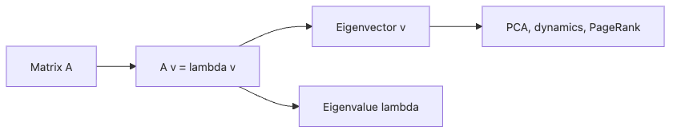

# 고유값과 고유벡터

선형변환을 여러 번 적용해 보면 어떤 방향은 유독 특별하게 남습니다. 다른 방향은 비틀리고 섞이는데, 어떤 방향은 방향 자체는 유지한 채 길이만 바뀝니다. 고유값과 고유벡터는 바로 이 특별한 축을 설명하는 도구입니다.

이 글은 Linear Algebra 101 시리즈의 7번째 글입니다. 여기서는 고유값과 고유벡터를 변환의 자연스러운 축이라는 관점으로 읽어 보겠습니다.

## 이 글에서 다룰 문제

- 행렬을 반복해서 적용할 때 왜 어떤 방향은 유지될까요?
- 고유벡터와 고유값은 각각 무엇을 뜻할까요?
- 대칭행렬에서 결과가 특히 깔끔해지는 이유는 무엇일까요?
- PCA, PageRank, 동역학 분석과는 어떻게 연결될까요?

> 고유벡터는 변환이 방향을 바꾸지 않는 축이고, 고유값은 그 축을 얼마나 늘리거나 줄이는지 알려 주는 계수입니다.

## 왜 중요한가

고유분해는 행렬을 더 단순한 좌표계에서 읽게 해 줍니다. 복잡한 변환도 적절한 축을 찾으면 축별 확대와 축소처럼 간단한 모습으로 바뀔 수 있습니다. 그래서 PCA, 안정성 분석, PageRank 같은 주제에서 반복해서 등장합니다.

특히 변환을 해석하고 싶을 때 고유값과 고유벡터는 매우 강력합니다. 이 도구가 있으면 행렬 전체를 한꺼번에 보지 않고도, 어떤 방향이 지배적인지, 어떤 모드가 커지고 작아지는지 읽을 수 있습니다.

## 핵심 개념 한눈에 보기



*고유값 문제에서 고유벡터와 응용 주제로 뻗어 가는 연결 구조를 요약한 그림입니다.*

`A v = lambda v`는 고유값 문제의 핵심 문장입니다. 행렬 `A`를 적용해도 방향은 `v` 그대로이고 길이만 `lambda`배 바뀝니다.

## 핵심 용어

- 고유벡터: `A v = lambda v`를 만족하는 0이 아닌 벡터입니다.
- 고유값: 그 방향에서의 확대 또는 축소 비율입니다.
- 고유분해: 가능한 경우 행렬을 `V D V^-1` 형태로 분해하는 방식입니다.
- 스펙트럼: 행렬이 가진 모든 고유값 집합입니다.
- 대칭행렬: 실수 고유값과 서로 직교하는 고유벡터를 갖는 중요한 행렬 부류입니다.

## 읽기 전과 후

읽기 전에는 고유값을 공식으로 푸는 문제처럼 여기기 쉽습니다. 그러면 왜 중요한지 연결이 약합니다.

읽은 후에는 고유값과 고유벡터가 변환의 자연스러운 축을 찾는 도구라는 점이 보입니다. 변환을 가장 단순하게 읽을 수 있는 좌표계를 찾는 과정이라고 생각하면 훨씬 이해가 쉽습니다.

## 다섯 단계로 고유분해 읽기

### 1단계 — 행렬 정의

```python
import numpy as np
A = np.array([[2.0, 1.0], [0.0, 3.0]])
```

먼저 간단한 2x2 행렬을 준비합니다. 예제가 작을수록 고유벡터 검증 과정을 읽기 쉽습니다.

### 2단계 — 고유값과 고유벡터 계산

```python
vals, vecs = np.linalg.eig(A)
print("eigenvalues:", vals)
print("eigenvectors:\n", vecs)
```

NumPy는 고유값과 고유벡터를 함께 반환합니다. 각 열벡터가 하나의 고유벡터에 해당합니다.

### 3단계 — 식으로 검증

```python
for i in range(len(vals)):
    Av = A @ vecs[:, i]
    lv = vals[i] * vecs[:, i]
    print("A v == lambda v:", np.allclose(Av, lv))
```

고유분해는 결과를 반드시 검증해 보는 습관이 좋습니다. 계산된 벡터가 정말 정의를 만족하는지 직접 확인할 수 있기 때문입니다.

### 4단계 — 대칭행렬

```python
S = np.array([[2.0, 1.0], [1.0, 2.0]])
sv, svc = np.linalg.eigh(S)  # for symmetric/Hermitian
print("sym eigenvalues:", sv)
print("orthogonal? ", np.allclose(svc.T @ svc, np.eye(2)))
```

대칭행렬은 구조가 깔끔해서 고유벡터가 서로 직교합니다. 그래서 수치적으로도 다루기 더 편한 경우가 많습니다.

### 5단계 — 거듭제곱 반복과 지배 방향

```python
M = np.array([[0.9, 0.1], [0.2, 0.8]])
v = np.array([1.0, 0.0])
for _ in range(50):
    v = M @ v
print("steady state:", v / np.linalg.norm(v, 1))
```

행렬을 반복해서 곱하면 보통 가장 큰 고유값 방향이 두드러집니다. 이 감각은 페이지랭크나 반복 알고리즘을 이해할 때 중요합니다.

## 작은 수치 예시로 다시 보기

- `[[2, 1], [0, 3]]`의 고유값은 `2`와 `3`입니다. 변환이 특별히 보존하는 축이 둘 있다는 뜻입니다.
- `np.allclose(A @ v, lambda * v)`가 `True`로 나오면 계산된 벡터가 실제 고유벡터라는 뜻입니다.
- 거듭제곱 반복을 계속하면 벡터는 지배적인 방향으로 수렴합니다. 이 예제에서는 대략 `[0.5, 0.5]` 근처 방향이 드러납니다.

## 이 코드에서 먼저 볼 점

- 고유분해는 변환을 더 단순한 축으로 바꿔 읽게 해 줍니다.
- 대칭행렬에는 `eigh`를 쓰는 편이 안정적입니다.
- 반복 곱셈은 지배적인 방향을 드러낼 수 있습니다.
- 고유벡터는 부호와 스케일이 고정되지 않습니다.

## 자주 하는 실수

1. 모든 행렬이 대각화 가능하다고 가정합니다.
2. 복소 고유값 가능성을 무시합니다.
3. 대칭행렬에도 무심코 `eig`만 씁니다.
4. 고유벡터의 부호와 스케일이 임의적이라는 점을 잊습니다.
5. 수치 안정성 문제를 가볍게 봅니다.

## 실무에서는 이렇게 읽는다

시니어 엔지니어는 고유분해를 공식 풀이보다 해석 도구로 먼저 봅니다. 어떤 방향이 시스템을 지배하는지, 어떤 모드가 안정적인지, 어떤 축이 가장 많은 분산을 설명하는지를 읽는 데 고유값과 고유벡터를 씁니다.

또한 행렬 구조를 먼저 확인합니다. 대칭행렬인지, 희소행렬인지, 꼭 전체 고유분해가 필요한지, 지배적인 몇 개만 필요한지에 따라 접근법이 달라지기 때문입니다. 좋은 선형대수 감각은 계산보다 해석 우선순위를 정하는 데서 드러납니다.

## 체크리스트

- [ ] 고유값과 고유벡터의 정의를 설명할 수 있습니다.
- [ ] `A v = lambda v`를 코드로 검증할 수 있습니다.
- [ ] 대칭행렬이 왜 특별한지 이해했습니다.
- [ ] 반복 곱셈이 지배적인 방향을 드러낼 수 있다는 점을 압니다.

## 연습 문제

1. `diag(2, 3)`의 고유값과 고유벡터를 직접 구해 보세요.
2. 대칭행렬의 고유벡터가 왜 직교하는지 예시로 확인해 보세요.
3. 거듭제곱 반복으로 가장 큰 고유값 방향을 추정해 보세요.

## 정리와 다음 글

고유값과 고유벡터는 변환이 가장 자연스럽게 보이는 축을 찾아 줍니다. 어떤 방향은 유지되고 길이만 바뀐다는 사실을 잡아내면, 복잡한 행렬도 더 단순한 구조로 읽을 수 있습니다. 이 관점은 PCA, 반복 알고리즘, 안정성 해석의 공통 바탕이 됩니다.

다음 글에서는 행렬 분해를 다룹니다. 고유분해가 한 종류의 분해였다면, 이제 LU, QR, SVD처럼 문제에 따라 더 실용적으로 쓰이는 여러 분해 방식을 함께 정리해 보겠습니다.

<!-- toc:begin -->
- [선형대수란 무엇인가?](./01-what-is-linear-algebra.md)
- [벡터](./02-vectors.md)
- [행렬](./03-matrices.md)
- [내적과 거리](./04-inner-product-and-distance.md)
- [선형변환](./05-linear-transformation.md)
- [기저와 차원](./06-basis-and-dimension.md)
- **고유값과 고유벡터 (현재 글)**
- 행렬 분해 (예정)
- PCA (예정)
- 머신러닝에서의 선형대수 (예정)
<!-- toc:end -->

## 참고 자료

- [3Blue1Brown — Eigenvectors and eigenvalues](https://www.3blue1brown.com/lessons/eigenvalues)
- [Wikipedia — Eigenvalues and eigenvectors](https://en.wikipedia.org/wiki/Eigenvalues_and_eigenvectors)
- [NumPy — linalg.eig](https://numpy.org/doc/stable/reference/generated/numpy.linalg.eig.html)
- [NumPy — linalg.eigh](https://numpy.org/doc/stable/reference/generated/numpy.linalg.eigh.html)

Tags: LinearAlgebra, Eigenvalues, Eigenvectors, DataScience, Beginner
