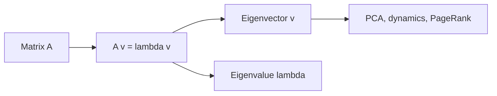

# 고유값과 고유벡터

> Linear Algebra 101 시리즈 (7/10)


## 이 글에서 다룰 문제

PCA, 동역학, 양자역학, 페이지랭크는 모두 고유분해가 핵심입니다. 고유분해를 쓰면 행렬을 더 단순한 좌표계에서 읽을 수 있습니다.

> *Eigenvectors are the natural axes of a transformation.*

## 전체 흐름


## Before/After

**Before**: *“고유값은 공식으로 푸는 것”* — 왜 중요한지 연결이 안 됩니다.

**After**: *“고유값과 고유벡터는 변환의 축을 찾는 도구이고, 그 축에서는 변환이 단순한 스칼라곱처럼 보입니다.”*

## 5단계 고유분해

### 1단계 — 행렬 정의

```python
import numpy as np
A = np.array([[2.0, 1.0], [0.0, 3.0]])
```

### 2단계 — 고유값/고유벡터

```python
vals, vecs = np.linalg.eig(A)
print("eigenvalues:", vals)
print("eigenvectors:\n", vecs)
```

### 3단계 — 검증

```python
for i in range(len(vals)):
    Av = A @ vecs[:, i]
    lv = vals[i] * vecs[:, i]
    print("A v == lambda v:", np.allclose(Av, lv))
```

### 4단계 — 대칭행렬

```python
S = np.array([[2.0, 1.0], [1.0, 2.0]])
sv, svc = np.linalg.eigh(S)  # 대칭/에르미트 전용
print("sym eigenvalues:", sv)
print("orthogonal? ", np.allclose(svc.T @ svc, np.eye(2)))
```

### 5단계 — 거듭제곱과 안정성

```python
M = np.array([[0.9, 0.1], [0.2, 0.8]])
v = np.array([1.0, 0.0])
for _ in range(50):
    v = M @ v
print("steady state:", v / np.linalg.norm(v, 1))
```

## 이 코드에서 주목할 점

- 고유분해를 쓰면 변환을 더 단순하게 해석할 수 있습니다.
- 대칭행렬은 `eigh`를 쓰는 편이 더 안정적입니다.
- 거듭제곱을 반복하면 보통 최대 고유값 방향이 두드러집니다.

## 자주 하는 실수 5가지

1. ***모든 행렬* 에 *대각화 가능* 가정.**
2. ***복소 고유값* 무시.**
3. ***대칭에 eig*, *비대칭에 eigh* 잘못 사용.**
4. ***고유벡터의 부호/스케일* 임의성 망각.**
5. ***수치 안정성* 무시.**

## 실무에서는 이렇게 쓰입니다

PCA의 공분산 행렬 분석, 페이지랭크의 최대 고유벡터 계산, 동역학 시스템의 안정성 분석, 양자역학의 에너지 고유상태 해석은 모두 고유분해와 이어집니다.

## 체크리스트

- [ ] 고유값과 고유벡터를 계산할 수 있다.
- [ ] 대칭행렬에서 계산 방식이 달라지는 이유를 안다.
- [ ] 검증식으로 결과를 확인할 수 있다.
- [ ] 거듭제곱 수렴의 의미를 안다.

## 정리 및 다음 단계

고유분해는 변환이 가장 자연스럽게 드러나는 축을 찾는 과정입니다. 다음 글에서는 행렬 분해를 다룹니다.

<!-- toc:begin -->
- [선형대수란 무엇인가?](./01-what-is-linear-algebra.md)
- [벡터](./02-vectors.md)
- [행렬](./03-matrices.md)
- [내적과 거리](./04-inner-product-and-distance.md)
- [선형변환](./05-linear-transformation.md)
- [기저와 차원](./06-basis-and-dimension.md)
- **고유값과 고유벡터 (현재 글)**
- 행렬 분해 (예정)
- PCA (예정)
- 머신러닝에서의 선형대수 (예정)
<!-- toc:end -->

## 참고 자료

- [3Blue1Brown — Eigenvectors and eigenvalues](https://www.3blue1brown.com/lessons/eigenvalues)
- [Wikipedia — Eigenvalues and eigenvectors](https://en.wikipedia.org/wiki/Eigenvalues_and_eigenvectors)
- [NumPy — linalg.eig](https://numpy.org/doc/stable/reference/generated/numpy.linalg.eig.html)
- [NumPy — linalg.eigh](https://numpy.org/doc/stable/reference/generated/numpy.linalg.eigh.html)

Tags: LinearAlgebra, Eigenvalues, Eigenvectors, DataScience, Beginner
