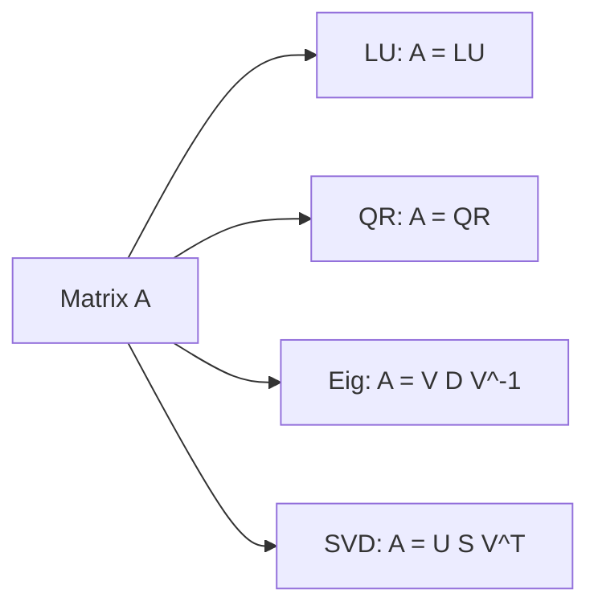

# 행렬 분해

> Linear Algebra 101 시리즈 (8/10)


## 이 글에서 다룰 문제

선형방정식, 최소제곱, PCA, 차원 축소는 모두 행렬 분해가 수치적으로 핵심입니다. 대부분의 경우 역행렬을 직접 구하는 것보다 더 안정적입니다.

> *Decompositions are how numerical linear algebra actually works.*

## 전체 흐름


## Before/After

**Before**: *“역행렬로 모든 걸 푼다.”*

**After**: *“문제에 맞는 분해를 고르면 계산이 더 빠르고 안정적입니다.”*

## 5단계 행렬 분해

### 1단계 — LU 분해

```python
import numpy as np
from scipy.linalg import lu
A = np.array([[4.0, 3.0], [6.0, 3.0]])
P, L, U = lu(A)
print("L:", L)
print("U:", U)
```

### 2단계 — QR 분해

```python
Q, R = np.linalg.qr(A)
print("Q^T Q ~ I:", np.allclose(Q.T @ Q, np.eye(2)))
print("R:", R)
```

### 3단계 — 고유분해

```python
vals, vecs = np.linalg.eig(A)
print("vals:", vals)
```

### 4단계 — SVD

```python
U, S, Vt = np.linalg.svd(A)
print("U:", U)
print("S:", S)
print("Vt:", Vt)
```

### 5단계 — SVD로 재구성

```python
A_reconstructed = U @ np.diag(S) @ Vt
print("close to A:", np.allclose(A_reconstructed, A))
```

## 이 코드에서 주목할 점

- 분해마다 잘 맞는 용도가 다릅니다.
- SVD는 모든 행렬에 대해 정의됩니다.
- 재구성을 해 보면 분해 결과를 검증할 수 있습니다.

## 자주 하는 실수 5가지

1. **LU 분해를 직사각형 행렬에 그대로 적용하려는 실수**
2. **QR과 SVD의 차이를 구분하지 못하는 실수**
3. **SVD 특이값의 정렬 순서를 잊는 실수**
4. **부동소수점 비교에 `==`를 그대로 쓰는 실수**
5. **최소제곱 문제를 `np.linalg.inv`로 직접 풀려는 실수**

## 실무에서는 이렇게 쓰입니다

선형방정식의 LU 분해, 최소제곱의 QR 분해, PCA의 SVD, 추천 시스템의 행렬분해, 이미지 압축의 저랭크 SVD는 모두 행렬 분해의 대표적인 응용입니다.

## 체크리스트

- [ ] LU, QR, Eig, SVD의 용도를 안다.
- [ ] NumPy로 기본 분해를 수행할 수 있다.
- [ ] 재구성으로 결과를 검증할 수 있다.
- [ ] 역행렬보다 분해를 우선 고려할 수 있다.

## 정리 및 다음 단계

행렬 분해는 수치 선형대수의 핵심 도구입니다. 다음 글에서는 PCA를 다룹니다.

<!-- toc:begin -->
- [선형대수란 무엇인가?](./01-what-is-linear-algebra.md)
- [벡터](./02-vectors.md)
- [행렬](./03-matrices.md)
- [내적과 거리](./04-inner-product-and-distance.md)
- [선형변환](./05-linear-transformation.md)
- [기저와 차원](./06-basis-and-dimension.md)
- [고유값과 고유벡터](./07-eigenvalues-and-eigenvectors.md)
- **행렬 분해 (현재 글)**
- PCA (예정)
- 머신러닝에서의 선형대수 (예정)
<!-- toc:end -->

## 참고 자료

- [Wikipedia — Matrix decomposition](https://en.wikipedia.org/wiki/Matrix_decomposition)
- [Wikipedia — Singular value decomposition](https://en.wikipedia.org/wiki/Singular_value_decomposition)
- [NumPy — linalg.svd](https://numpy.org/doc/stable/reference/generated/numpy.linalg.svd.html)
- [SciPy — linalg.lu](https://docs.scipy.org/doc/scipy/reference/generated/scipy.linalg.lu.html)

Tags: LinearAlgebra, Decomposition, SVD, DataScience, Beginner
