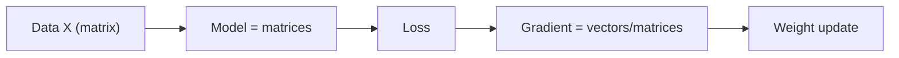

# 머신러닝에서의 선형대수

> Linear Algebra 101 시리즈 (10/10)


## 이 글에서 다룰 문제

선형대수 감각이 약한 ML 엔지니어는 디버깅도 최적화도 어려워집니다. 모델 내부를 읽는 눈이 흐려지기 때문입니다.

> *Every ML algorithm has linear algebra inside.*

## 전체 흐름


## Before/After

**Before**: *“ML은 마법”* — 내부가 블랙박스처럼 느껴집니다.

**After**: *“모든 레이어 = *선형변환 + 비선형* — *행렬과 벡터의 연속*.”*

## 5단계 ML × 선형대수

### 1단계 — 선형회귀 (정규방정식)

```python
import numpy as np
rng = np.random.default_rng(0)
X = rng.normal(size=(100, 3))
y = X @ np.array([1.0, -2.0, 0.5]) + rng.normal(scale=0.1, size=100)
w_hat, *_ = np.linalg.lstsq(X, y, rcond=None)
print("w_hat:", w_hat)
```

### 2단계 — 신경망 한 레이어

```python
W1 = rng.normal(size=(3, 4))
b1 = np.zeros(4)
h = np.maximum(0, X @ W1 + b1)  # 렐루 활성화
print("hidden shape:", h.shape)
```

### 3단계 — 코사인 유사도(임베딩)

```python
emb = rng.normal(size=(5, 8))
norms = np.linalg.norm(emb, axis=1, keepdims=True)
emb_n = emb / norms
sim = emb_n @ emb_n.T
print("sim matrix shape:", sim.shape)
```

### 4단계 — 그래디언트 한 스텝

```python
def loss_and_grad(w, X, y):
    pred = X @ w
    err = pred - y
    loss = (err ** 2).mean()
    grad = 2 * X.T @ err / len(y)
    return loss, grad

w = np.zeros(3)
for _ in range(50):
    L, g = loss_and_grad(w, X, y)
    w -= 0.05 * g
print("learned w:", w)
```

### 5단계 — PCA로 피처 압축

```python
Xc = X - X.mean(axis=0)
U, S, Vt = np.linalg.svd(Xc, full_matrices=False)
X_2d = Xc @ Vt[:2].T
print("compressed:", X_2d.shape)
```

## 이 코드에서 주목할 점

- 모든 레이어는 행렬 곱과 비선형 연산의 조합입니다.
- 그래디언트는 벡터와 행렬에 대한 미분 결과입니다.
- 임베딩 공간에서는 코사인 유사도를 자주 사용합니다.

## 자주 하는 실수 5가지

1. ***형상 불일치* 디버깅 회피.**
2. ***정규화/표준화* 망각.**
3. ***행렬 곱 vs 원소곱* 혼동.**
4. ***그래디언트 형상* 잘못 — *전치 위치* 실수.**
5. ***수치 안정성* 무시 — `inv` 직접 사용.**

## 실무에서는 이렇게 쓰입니다

선형회귀, 로지스틱 회귀, MLP, CNN, RNN, Transformer, 임베딩 검색, 추천 시스템은 모두 선형대수 위에서 돌아갑니다.

## 체크리스트

- [ ] 선형회귀를 `lstsq`로 풀 수 있다.
- [ ] MLP 한 레이어를 만들 수 있다.
- [ ] 코사인 유사도 행렬을 계산할 수 있다.
- [ ] 경사하강법 한 스텝을 구현할 수 있다.

## 정리 및 다음 단계

선형대수는 ML의 골격입니다. 이 시리즈를 통해 모델 내부를 읽는 기본 감각을 얻었길 바랍니다. 다음 단계는 Calculus for ML 시리즈입니다.

<!-- toc:begin -->
- [선형대수란 무엇인가?](./01-what-is-linear-algebra.md)
- [벡터](./02-vectors.md)
- [행렬](./03-matrices.md)
- [내적과 거리](./04-inner-product-and-distance.md)
- [선형변환](./05-linear-transformation.md)
- [기저와 차원](./06-basis-and-dimension.md)
- [고유값과 고유벡터](./07-eigenvalues-and-eigenvectors.md)
- [행렬 분해](./08-matrix-decomposition.md)
- [PCA](./09-pca.md)
- **머신러닝에서의 선형대수 (현재 글)**
<!-- toc:end -->

## 참고 자료

- [Deep Learning Book — Linear Algebra](https://www.deeplearningbook.org/contents/linear_algebra.html)
- [fast.ai — Computational Linear Algebra](https://github.com/fastai/numerical-linear-algebra)
- [Stanford CS229 — Linear Algebra Review](https://cs229.stanford.edu/section/cs229-linalg.pdf)
- [3Blue1Brown — Essence of Linear Algebra](https://www.3blue1brown.com/topics/linear-algebra)

Tags: LinearAlgebra, MachineLearning, DeepLearning, DataScience, Beginner
