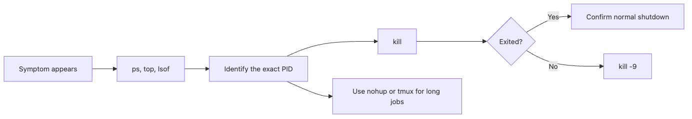

# Process Management

Process problems show up in very practical ways: a port is already in use, CPU spikes to 100 percent, or a long-running job dies the moment your SSH session closes. If you cannot inspect and control processes, those problems stay mysterious longer than they should.

This is post 7 in the Linux CLI 101 series.

## What you will learn

- Checking running processes with `ps` and `top`
- Terminating processes with `kill` and `kill -9`
- Switching between background and foreground with `&`, `bg`, `fg`, `jobs`
- Keeping processes alive after SSH disconnection with `nohup`

## Why it matters

When a web server is consuming 100% CPU, a Python script is stuck in an infinite loop, or a port is already occupied by another process — you need to know how to check and manage processes to resolve any of these.

> You run your Flask dev server and get "Address already in use". A previous server process was never stopped and is still holding port 5000. You need to find and terminate that process.

## Mental Model

> A program is a recipe (code file), and a process is a cook actually cooking with that recipe (running instance). Just as 3 cooks can cook the same recipe simultaneously, 3 processes can run from the same program at the same time.



*A practical escalation path for checking and stopping problematic processes*

```text
Program (python)  ->  Process 1 (PID 1234)  <- check with ps
                 ->  Process 2 (PID 5678)  <- terminate with kill
                 ->  Process 3 (PID 9012)  <- keep with nohup
```

## Core Concepts

| Term | Meaning | Command |
|---|---|---|
| PID | Process ID, unique identifier | `echo $$` (current shell PID) |
| Foreground | Process that occupies the terminal | Default execution mode |
| Background | Process that does not occupy the terminal | `command &` |
| SIGTERM (15) | Graceful termination request | `kill PID` |
| SIGKILL (9) | Forced termination | `kill -9 PID` |

## Before / After

**Before (not knowing process management)**

```text
"The server is stuck and I don't know what's wrong"
-> Close and reopen the terminal
-> Previous process remains as a zombie, causing port conflicts
```

**After (understanding processes)**

```bash
lsof -i :5000                    # Find process holding port 5000
kill $(lsof -t -i :5000)         # Terminate it
python app.py                     # Start normally
```

## Step-by-step practice

### Step 1. Check processes

```bash
ps aux                           # All processes in detail
ps aux | grep python             # Only python-related processes
ps -ef --forest                  # Parent-child tree view
```

### Step 2. Real-time monitoring with top

```bash
top
# Controls:
# q: quit
# M: sort by memory
# P: sort by CPU
# k: kill process (enter PID)
```

### Step 3. Terminate a process

```bash
# Create a practice process
sleep 300 &
# [1] 12345

ps aux | grep sleep
# user  12345  ... sleep 300

kill 12345                       # SIGTERM: graceful termination request
# If it doesn't stop:
kill -9 12345                    # SIGKILL: forced termination
```

### Step 4. Background execution

```bash
sleep 100 &                      # Run in background
# [1] 23456
jobs                             # List background jobs
# [1]+  Running    sleep 100 &

fg %1                            # Bring to foreground
# Ctrl+Z to suspend
bg %1                            # Send back to background
```

### Step 5. Keep processes alive with nohup

```bash
nohup python long_task.py > task.log 2>&1 &
# [1] 34567
# Process continues even after SSH disconnection
# Output saved to task.log
```

## What to notice in this code

- In `ps aux`, `a`=all users, `u`=detailed info, `x`=include processes without a terminal
- `kill` sends SIGTERM (15) by default, giving the program a chance to clean up
- `kill -9` has the kernel kill the process directly — immediate termination with no cleanup
- `nohup` makes the process ignore the HUP (hangup) signal, surviving terminal closure

## Common mistakes

### Mistake 1. Reaching for kill -9 first

`kill -9` does not give the process a chance to close files or save temporary data. Always try `kill` (SIGTERM) first, wait 5-10 seconds, and only use `kill -9` if it still does not stop.

### Mistake 2. Killing the wrong PID

```bash
ps aux | grep python
# Multiple lines appear — verify which is your process
# The last line "grep python" is grep itself — ignore it
```

Use `pgrep -f "python app.py"` to find the exact PID.

### Mistake 3. Not knowing processes die when SSH disconnects

When an SSH session ends, all foreground processes launched in that session are terminated. For long-running tasks, always use `nohup` or `tmux`/`screen`.

### Mistake 4. Ignoring zombie processes

Processes in `Z` (zombie) state in `ps` have already terminated but their parent has not collected the exit status. A few are harmless, but too many can exhaust PIDs.

### Mistake 5. Rebooting to fix port conflicts

Rebooting a server because a port is occupied is an overreaction. Use `lsof -i :PORT` to find the occupying process and terminate it.

## Practical applications

- **Port conflict resolution**: `lsof -i :8080 | grep LISTEN` finds the occupying process
- **Memory leak monitoring**: Periodically check the RSS (memory) column in `top`
- **Batch job execution**: `nohup python etl.py > etl.log 2>&1 &` for long-running tasks
- **Dev server management**: `Ctrl+C` to stop; if that fails, use `kill`
- **Docker debugging**: `ps aux` inside a container to check running services

## How practitioners think about this

Process management is not just "run it and forget" — it includes "how to manage it after running". In production, process managers like `systemd`, `supervisor`, and `pm2` handle auto-restart on crash, log management, and resource limits.

Even during development, process awareness matters. Building the habit of asking "Will the server die if I close this terminal?" and "Is something still running in the background?" prevents production incidents down the road.

## When it breaks, check these first

- If a port conflict appears, do not reboot first. Run `lsof -i :PORT` and confirm which command is holding the port so you can tell whether it is your dev server, another service, or a stale background job.
- If `kill PID` does nothing, re-check the state with `ps -p PID -o pid,stat,cmd`. States like `D` or zombie cleanup issues behave differently from a normal running process.
- If `ps aux | grep python` gives too many lines, use `pgrep -af "python app.py"` or `ps -ef --forest` to narrow the search. Misidentifying the PID is more common than the process itself being weird.
- If jobs die after SSH disconnects, assume they were launched in the foreground until proven otherwise. For anything long-running, make `nohup`, `tmux`, or a process manager part of the default plan.

## Checklist

- [ ] You can check all system processes with `ps aux`
- [ ] You can explain the difference between `kill` and `kill -9`
- [ ] You can run commands in the background with `&` and switch with `fg`/`bg`
- [ ] You can keep processes alive after SSH disconnection with `nohup`
- [ ] You can find processes holding a port with `lsof -i :PORT`

## Exercises

1. Create 3 background processes with `sleep 600 &`, check them with `jobs`, bring one to the foreground with `fg`, and stop it with `Ctrl+C`.
2. Run `ps aux | head -1` to see the column header, then explain the meaning of the PID, CPU%, MEM%, and COMMAND columns.
3. Run `lsof -i :22` to find the PID of the SSH daemon.

## Summary and next

- A process is a running instance of a program with a unique PID.
- Check process status with `ps` and `top`; terminate with `kill`.
- Always follow the order: `kill` (SIGTERM) -> wait -> `kill -9` (SIGKILL).
- Switch between background and foreground with `&`, `bg`, `fg`.
- Use `nohup` or `tmux` to keep processes alive after SSH disconnection.

The next post covers **environment variables and PATH** — how the Shell finds commands and manages configuration.

<!-- toc:begin -->
## Series Table of Contents

- [What Is the CLI and Shell?](./01-what-is-cli-and-shell.md)
- [Files and Directories](./02-files-and-directories.md)
- [Permissions and Ownership](./03-permissions-and-ownership.md)
- [cat, less, head, tail](./04-viewing-files.md)
- [grep, find, xargs](./05-grep-find-xargs.md)
- [Pipes and Redirection](./06-pipe-and-redirection.md)
- **Process Management (current)**
- Environment Variables and PATH (upcoming)
- Shell Script Basics (upcoming)
- SSH and Remote Access (upcoming)

<!-- toc:end -->

## References

- [Linux man page - ps](https://man7.org/linux/man-pages/man1/ps.1.html)
- [Linux man page - kill, signal](https://man7.org/linux/man-pages/man1/kill.1.html)
- [The Missing Semester - Job Control](https://missing.csail.mit.edu/2020/command-line/)
- [systemd for Developers](https://www.freedesktop.org/software/systemd/man/systemd.html)

Tags: Linux, Process, ps, kill, Background, CLI
