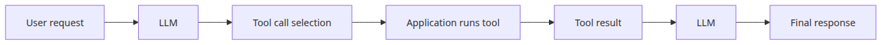
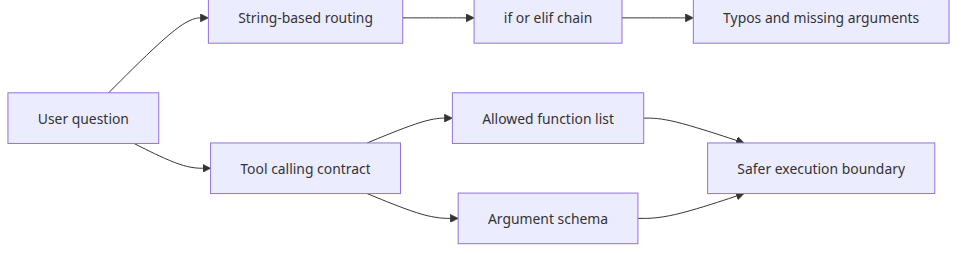
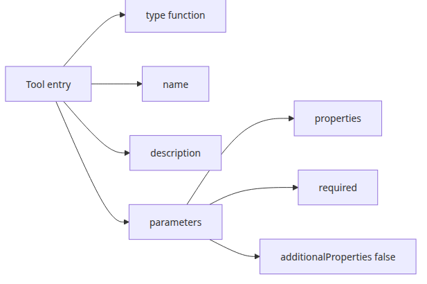
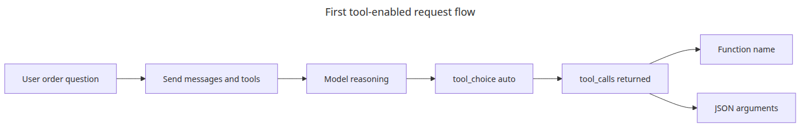
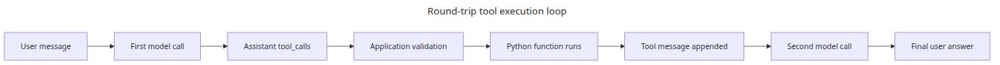
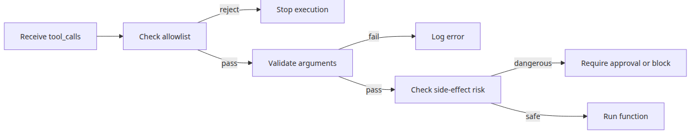

# Tool calling — connecting functions to the model

> LLM API Production 101 (2/6)

Example code: [github.com/yeongseon-books/llm-api-production-101](https://github.com/yeongseon-books/llm-api-production-101/tree/main/en/02-tool-calling)

Once structured output is working, the next request usually arrives quickly: the model should not stop at answering the user, it should connect to application functions. A customer asks about an order, and you want the model to trigger `get_order_status()`. Someone asks about exchange rates, and you want the model to call an internal lookup. A scheduling request should lead to a calendar action instead of a paragraph about calendars.

At that point, many first implementations still rely on string conventions. The model is asked to emit a function name and some arguments in text, and the application maps that result with custom parsing or a pile of `if` statements. It works for a toy example, but it creates a loose execution boundary. Typos in function names, missing parameters, extra keys, and unsafe dispatch logic start accumulating quickly.

Tool calling is a cleaner contract. The application publishes an explicit toolbox: allowed function names, descriptions, and argument schemas. The model does not execute code. It chooses from that toolbox and proposes arguments. The application still owns permission, validation, side effects, and the final decision to run anything.

In this post, we will build the full loop with Groq's `tools` parameter and the `tool_calls` response field. The model will decide when a tool is needed, the application will parse and execute the requested call, and the tool result will be fed back into the conversation so the model can produce a final answer.

This is the second post in the LLM API Production 101 series. Here we focus on connecting model responses to application functions through a controlled tool-calling loop.

The main idea is straightforward: **tool calling is not model autonomy, it is an execution boundary designed by the application**.



*Tool calling: connecting functions to the model*
---

## Questions this chapter answers

- How is tool calling different from function calling, and does the LLM actually run functions?
- How should you write tool definitions (name, description, parameters) so the model picks the right one?
- How do you reduce wrong-tool selection when many tools are exposed?
- How do you build a multi-turn loop that feeds tool results back to the model?
- How do you recover the response when a tool call fails or times out?

## Runtime setup

If you want to run the examples end to end, start with Python 3.10 or later and install the required packages first.

```bash
python3 -m venv .venv
source .venv/bin/activate
pip install groq pydantic
export GROQ_API_KEY="your-issued-key"
```

This post uses the official `groq` SDK and Pydantic for argument validation.

---

## Why string-based dispatch does not scale



*Comparison between string dispatch and tool contracts*
Early implementations often start with something like this:

```python
if "shipping" in user_question:
    result = get_order_status(order_id)
elif "refund" in user_question:
    result = get_refund_policy()
```

Or the model is told to emit text such as `{"function": "get_order_status", "order_id": "ORD-1001"}` and the application parses it manually.

The problem is not that this is impossible. The problem is that the contract is hidden. Function names live partly in prompts, partly in code. Argument requirements are implied rather than enforced. If the model invents a new key or misses a required field, the error shows up late.

Tool calling helps because it makes three things explicit:

- the finite set of callable functions
- the JSON-schema-like shape of each function's arguments
- the structured response path that carries requested tool calls

That makes the system easier to reason about. The model proposes. The application decides.

---

## What goes into the `tools` parameter



*Structure of a tool definition*
With Groq chat completions, tools are typically defined as function descriptors. Each tool includes a name, a description, and an argument schema. Here is a small order-status example.

```python
tools = [
    {
        "type": "function",
        "function": {
            "name": "get_order_status",
            "description": "Look up shipping status by order ID.",
            "parameters": {
                "type": "object",
                "properties": {
                    "order_id": {
                        "type": "string",
                        "description": "An order identifier such as ORD-1001",
                    }
                },
                "required": ["order_id"],
                "additionalProperties": False,
            },
        },
    }
]
```

This definition matters because it communicates function intent to the model without giving up execution control. The description tells the model when the tool is appropriate. The parameter schema tells it which arguments exist and which ones are required. `additionalProperties=False` is also worth including when you want to reduce noisy or invented parameters.

---

## Sending the first tool-enabled request



*First tool-enabled request flow*
The request itself is still a normal chat completion call. The difference is that the model now receives the `tools` list and may return `tool_calls` instead of a final natural-language answer.

```python
import os

from groq import Groq

client = Groq(api_key=os.environ["GROQ_API_KEY"])

tools = [
    {
        "type": "function",
        "function": {
            "name": "get_order_status",
            "description": "Look up shipping status by order ID.",
            "parameters": {
                "type": "object",
                "properties": {
                    "order_id": {"type": "string"}
                },
                "required": ["order_id"],
                "additionalProperties": False,
            },
        },
    }
]

completion = client.chat.completions.create(
    model="llama-3.1-8b-instant",
    messages=[
        {
            "role": "system",
            "content": "Use tools when order questions require a live lookup.",
        },
        {
            "role": "user",
            "content": "Please check the shipping status for order ORD-1001.",
        },
    ],
    tools=tools,
    tool_choice="auto",
    temperature=0,
)

message = completion.choices[0].message
print(message.tool_calls)
```

<!-- injected-output:start -->
**Output**

    [ChatCompletionMessageToolCall(id='1jcy87msp', function=Function(arguments='{"order_id":"ORD-1001"}', name='get_order_status'), type='function')]

<!-- injected-output:end -->

`tool_choice="auto"` lets the model decide whether a tool is needed. In practice, the interesting case is when the assistant message contains one or more `tool_calls`. That means your application has more work to do before a final user-facing answer exists.

---

## Parsing `tool_calls` and routing them safely

A tool call usually includes a function name and a JSON string containing arguments. Before execution, two checks matter: is the function name in the allowlist, and do the arguments parse into the expected shape?

```python
import json
import os

from groq import Groq
from pydantic import BaseModel

class OrderStatusArgs(BaseModel):
    order_id: str

def get_order_status(order_id: str) -> dict:
    fake_db = {
        "ORD-1001": {"status": "in_transit", "eta_days": 2},
        "ORD-1002": {"status": "delivered", "eta_days": 0},
    }
    return fake_db.get(order_id, {"status": "not_found", "eta_days": None})

available_tools = {
    "get_order_status": get_order_status,
}

client = Groq(api_key=os.environ["GROQ_API_KEY"])

tools = [
    {
        "type": "function",
        "function": {
            "name": "get_order_status",
            "description": "Look up shipping status by order ID.",
            "parameters": {
                "type": "object",
                "properties": {
                    "order_id": {"type": "string"}
                },
                "required": ["order_id"],
                "additionalProperties": False,
            },
        },
    }
]

completion = client.chat.completions.create(
    model="llama-3.1-8b-instant",
    messages=[
        {"role": "system", "content": "Use tools for order lookup requests."},
        {"role": "user", "content": "Check ORD-1001 for me."},
    ],
    tools=tools,
    tool_choice="auto",
    temperature=0,
)

message = completion.choices[0].message

for tool_call in message.tool_calls or []:
    function_name = tool_call.function.name
    arguments = json.loads(tool_call.function.arguments)

    if function_name not in available_tools:
        raise ValueError(f"unknown tool: {function_name}")

    validated_args = OrderStatusArgs.model_validate(arguments)
    result = available_tools[function_name](**validated_args.model_dump())
    print(function_name, arguments, result)
```

<!-- injected-output:start -->
**Output**

    get_order_status {'order_id': 'ORD-1001'} {'status': 'in_transit', 'eta_days': 2}

<!-- injected-output:end -->

At this stage, the model has not fully answered the user yet. It has only requested a tool. The application has executed that request. The final conversational answer comes after the tool result is fed back to the model.

---

## Building the full function-execution loop



*Round-trip tool execution loop*
The normal production pattern looks like this:

1. send the user message and tool definitions
2. receive one or more `tool_calls`
3. execute the requested tools in application code
4. append tool results to the conversation
5. send the updated message list back to the model
6. read the final user-facing answer

Here is a complete version of that loop.

```python
import json
import os

from groq import Groq
from pydantic import BaseModel

class OrderStatusArgs(BaseModel):
    order_id: str

def get_order_status(order_id: str) -> dict:
    fake_db = {
        "ORD-1001": {
            "status": "in_transit",
            "location": "Seoul hub",
            "eta_days": 2,
        }
    }
    return fake_db.get(order_id, {"status": "not_found"})

tools = [
    {
        "type": "function",
        "function": {
            "name": "get_order_status",
            "description": "Look up shipping status by order ID.",
            "parameters": {
                "type": "object",
                "properties": {
                    "order_id": {"type": "string"}
                },
                "required": ["order_id"],
                "additionalProperties": False,
            },
        },
    }
]

available_tools = {"get_order_status": get_order_status}

client = Groq(api_key=os.environ["GROQ_API_KEY"])

messages = [
    {"role": "system", "content": "Use tools for order lookups, then answer briefly."},
    {"role": "user", "content": "What is happening with order ORD-1001?"},
]

first = client.chat.completions.create(
    model="llama-3.1-8b-instant",
    messages=messages,
    tools=tools,
    tool_choice="auto",
    temperature=0,
)

assistant_message = first.choices[0].message
messages.append(assistant_message.model_dump())

if not assistant_message.tool_calls:
    print(assistant_message.content)
    raise SystemExit(0)

for tool_call in assistant_message.tool_calls or []:
    function_name = tool_call.function.name
    if function_name not in available_tools:
        raise ValueError(f"unknown tool: {function_name}")

    try:
        arguments = json.loads(tool_call.function.arguments)
        validated_args = OrderStatusArgs.model_validate(arguments)
    except json.JSONDecodeError as exc:
        raise ValueError("tool arguments were not valid JSON") from exc

    tool_result = available_tools[function_name](**validated_args.model_dump())

    messages.append(
        {
            "role": "tool",
            "tool_call_id": tool_call.id,
            "name": function_name,
            "content": json.dumps(tool_result, ensure_ascii=False),
        }
    )

final = client.chat.completions.create(
    model="llama-3.1-8b-instant",
    messages=messages,
    tools=tools,
    temperature=0,
)

print(final.choices[0].message.content)
```

This loop is the important mental model. The model chooses a tool. The application performs the side-effect-free lookup. The tool output becomes another message in the conversation. Then the model turns that structured result into a user-facing answer.

---

## What to guard in production



*Operational guardrails before tool execution*
Tool calling makes a system more useful, but it also introduces new failure paths. A few controls are worth adding early.

First, **never dispatch against arbitrary function names**. Do not let model output resolve against `globals()` or anything equivalent. Use an explicit allowlist.

Second, **validate arguments before execution**. In the unsafe toy pattern, it is easy to go straight from `json.loads()` to `**arguments`, but real systems should usually validate arguments with Pydantic or another schema layer before invoking the function.

Third, **separate read-only tools from state-changing tools**. Looking up an order and cancelling an order should not live behind the same trust assumptions. Side-effecting tools deserve stricter confirmation and often a human or policy gate.

Fourth, **log every tool request and result in a traceable form**. When a user says, "the assistant gave me the wrong status," you will want the tool name, arguments, raw tool result, and final answer in one timeline.

---

## Closing

In this post, we used the `tools` parameter to expose a controlled function interface, parsed `tool_calls` from the model response, and completed the full execution loop that runs a Python function and feeds the result back into the conversation. The important design point is that the model chooses from a toolbox, but the application still owns validation, permissions, and execution.

Structured output gave us a contract for data. Tool calling extends that contract to function requests. The next topic applies the same production mindset to streamed responses, where the result arrives in pieces and error handling must account for partial output instead of one final string.

## Operational checklist

- [ ] Wrote each tool's `description` so the trigger condition is explicit
- [ ] Specified type, enum, and required flags on every parameter
- [ ] Implemented the loop that posts tool output back as a `role: tool` message
- [ ] Standardized error payloads so the model can explain failures to the user
- [ ] Added a guard (max call count) against repeated or infinite tool calls

<!-- toc:begin -->
## In this series

- [Structured output — JSON mode and response schemas](./01-structured-output.md)
- **Tool calling — connecting functions to the model (current)**
- Streaming in depth — chunk handling and error recovery (upcoming)
- Caching strategies — reducing cost and latency (upcoming)
- Retry and error handling — making API calls reliable (upcoming)
- Rate limit management — patterns for staying within limits (upcoming)

<!-- toc:end -->

---

## References

- <https://console.groq.com/docs/tool-use>
- <https://json-schema.org/understanding-json-schema/>

Tags: LLM, OpenAI, Streaming, Python
