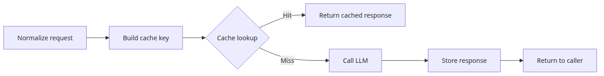
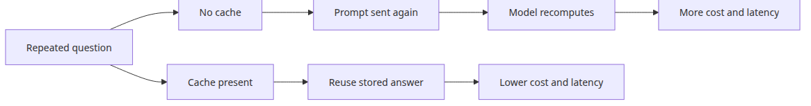
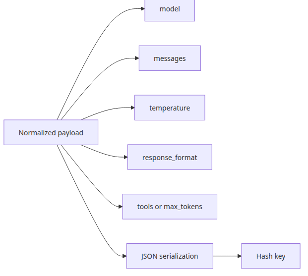
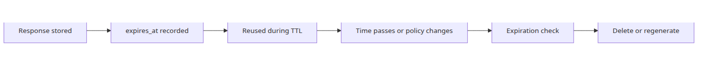
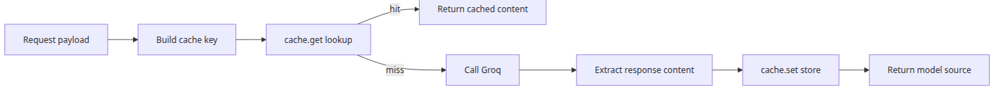
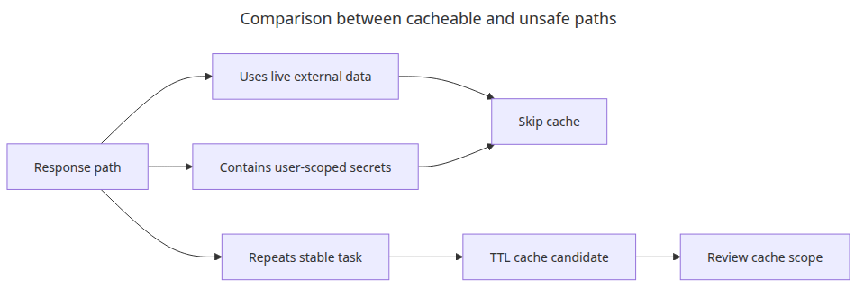

# Caching strategies — reducing cost and latency

> LLM API Production 101 (4/6)

Example code: [github.com/yeongseon-books/llm-api-production-101](https://github.com/yeongseon-books/llm-api-production-101/tree/main/en/04-caching-strategies)

Once an LLM feature reaches production traffic, the first thing that often looks expensive is not the model choice by itself. It is repetition. The same question comes in again, the same system prompt is sent again, the same context is serialized again, and the same answer is generated again. At that point, teams often jump straight to prompt trimming or model switching. Sometimes that is necessary. Often, the cheaper fix is much simpler: stop recomputing work you already paid for.

That is what caching means in this context. The idea is familiar from web servers, databases, CDNs, and search systems, but LLM traffic adds a few complications. The cache key cannot be just the visible user question. Temperature matters. The system prompt matters. The model name matters. Structured-output settings matter. If any of those inputs change, a cached answer may no longer represent the same task.

This post builds the smallest useful cache for an LLM API path: an in-memory cache keyed by a request hash, with TTL-based expiration. The goal is not to jump immediately to Redis or distributed cache design. The goal is to make the core contract precise first: which inputs define sameness, how long a cached answer remains trustworthy, and which responses should never be cached at all.

This is the fourth post in the LLM API Production 101 series. Here we focus on request-hash caching strategies that reduce both cost and latency.

The main idea is simple: **an LLM cache is not a box for prompt outputs, it is a contract for when a request should not be recomputed**.



*Caching strategies: reducing cost and latency*
---

## Questions this chapter answers

- How is caching an LLM response fundamentally different from caching an HTTP response?
- Where do provider-side prompt caches and application caches divide responsibility?
- How do you incorporate the system prompt, user input, and model version into the cache key?
- When should you reach for a semantic cache (embedding similarity), and what are the risks?
- How do you measure the tradeoff between hit rate and response freshness?

## Runtime setup

The examples assume Python 3.10 or later and the official `groq` SDK.

```bash
python3 -m venv .venv
source .venv/bin/activate
pip install groq
export GROQ_API_KEY="your-issued-key"
```

---

## Why an LLM path needs caching



*Cost flow of repeated uncached requests*
Production logs usually show more repetition than people expect. It appears in at least four places:

- FAQ-style chatbots
- internal tools that summarize or rewrite similar text repeatedly
- dashboards where multiple users trigger the same report
- interactive sessions where users re-ask the same question with only tiny variations

Without a cache, the system pays the full latency and token cost every time. That is wasted work when the task is materially the same.

The important part is defining “the same task” correctly. A human may think two prompts look identical while the runtime contract is not. If one request uses a different model, a different system instruction, a different temperature, or a structured-output mode, it is not the same job anymore. Caching starts with that boundary.

---

## What belongs in the cache key



*Structure of a normalized cache key*
The most common mistake is caching only by the visible user prompt.

```python
cache[user_prompt] = response_text
```

That is too loose. These two requests may have the same user text and still be different operations:

- one uses `llama-3.1-8b-instant`, the other uses another model
- one has a summarizer system prompt, the other has a classifier prompt
- one uses `temperature=0`, the other uses `temperature=0.8`
- one expects JSON output, the other expects free-form prose

At minimum, a safe cache key should usually include:

- `model`
- `messages`
- `temperature`
- `response_format`
- when relevant, `tools`, `max_tokens`, and other generation options

In practice, the cleanest pattern is to normalize the entire request payload into canonical JSON and hash that string into a fixed-length key.

---

## Building a request hash

This small function creates a stable cache key from a request payload.

```python
import hashlib
import json
from typing import Any

def build_cache_key(payload: dict[str, Any]) -> str:
    canonical = json.dumps(
        payload,
        ensure_ascii=False,
        sort_keys=True,
        separators=(",", ":"),
    )
    return hashlib.sha256(canonical.encode("utf-8")).hexdigest()

request_payload = {
    "model": "llama-3.1-8b-instant",
    "messages": [
        {"role": "system", "content": "You are a concise summarizer."},
        {"role": "user", "content": "Summarize the difference between FastAPI and Flask in three sentences."},
    ],
    "temperature": 0,
}

print(build_cache_key(request_payload))
```

<!-- injected-output:start -->
**Output**

    6b8029d33b678c483174d55c429edd51a4ab075fab3943a4069fbc89476a6d8f

<!-- injected-output:end -->

This matters because equivalent requests should serialize to the same string before hashing. `sort_keys=True` protects you from dictionary key-order differences. Fixed separators remove whitespace variation. The result is a compact key that still represents the full request contract.

---

## Why TTL matters



*Lifecycle stages of a cached entry*
A hash key is not enough. Without TTL, stale responses can live forever. A model may change, a prompt policy may change, or the underlying business meaning may shift while the cache keeps serving old output. Memory usage also grows without any bound.

TTL makes the cache honest about what it is: a temporary copy, not the source of truth.

For LLM traffic, TTL usually depends on the workload:

- static FAQ paths can use longer TTLs
- internal drafting tools often fit medium TTLs
- real-time summaries need shorter TTLs
- tool-driven answers backed by changing external state may need tiny TTLs or no caching at all

There is no universal correct number. The useful habit is making TTL explicit in code instead of leaving expiration to chance.

---

## A minimal in-memory TTL cache

Here is a single-process cache that stores the value and its expiration time.

```python
import time
from dataclasses import dataclass
from typing import Any

@dataclass
class CacheEntry:
    value: Any
    expires_at: float

class TTLCache:
    def __init__(self) -> None:
        self._store: dict[str, CacheEntry] = {}

    def get(self, key: str) -> Any | None:
        entry = self._store.get(key)
        if entry is None:
            return None

        if time.time() >= entry.expires_at:
            del self._store[key]
            return None

        return entry.value

    def set(self, key: str, value: Any, ttl_seconds: int) -> None:
        self._store[key] = CacheEntry(
            value=value,
            expires_at=time.time() + ttl_seconds,
        )

    def delete(self, key: str) -> None:
        self._store.pop(key, None)
```

This uses lazy eviction: expired entries are removed when they are read. That keeps the implementation small and is enough to explain the core behavior. In a heavier workload, you may also want periodic cleanup or a maximum size policy, but those are second-order concerns compared with getting the cache contract right. It is also important to state the scope clearly. This cache is local to the current process. If you run multiple Uvicorn or Gunicorn workers, each worker has its own in-memory store, so this example is not a service-wide shared cache.

---

## Putting the cache in front of Groq calls



*Execution path for cache hit and miss*
Now we can place the cache directly in front of a completion request.

```python
import hashlib
import json
import os
import time
from dataclasses import dataclass
from typing import Any

from groq import Groq

@dataclass
class CacheEntry:
    value: Any
    expires_at: float

class TTLCache:
    def __init__(self) -> None:
        self._store: dict[str, CacheEntry] = {}

    def get(self, key: str) -> Any | None:
        entry = self._store.get(key)
        if entry is None:
            return None
        if time.time() >= entry.expires_at:
            del self._store[key]
            return None
        return entry.value

    def set(self, key: str, value: Any, ttl_seconds: int) -> None:
        self._store[key] = CacheEntry(value=value, expires_at=time.time() + ttl_seconds)

def build_cache_key(payload: dict[str, Any]) -> str:
    canonical = json.dumps(
        payload,
        ensure_ascii=False,
        sort_keys=True,
        separators=(",", ":"),
    )
    return hashlib.sha256(canonical.encode("utf-8")).hexdigest()

cache = TTLCache()
client = Groq(api_key=os.environ["GROQ_API_KEY"])

def cached_completion(payload: dict[str, Any], ttl_seconds: int = 300) -> dict[str, Any]:
    key = build_cache_key(payload)
    cached = cache.get(key)
    if cached is not None:
        return {"source": "cache", "content": cached}

    completion = client.chat.completions.create(**payload)
    content = completion.choices[0].message.content
    cache.set(key, content, ttl_seconds=ttl_seconds)
    return {"source": "model", "content": content}

payload = {
    "model": "llama-3.1-8b-instant",
    "messages": [
        {"role": "system", "content": "You are a concise Python tutor."},
        {"role": "user", "content": "Explain Python dataclasses in three sentences."},
    ],
    "temperature": 0,
}

print(cached_completion(payload))
print(cached_completion(payload))
```

<!-- injected-output:start -->
**Output**

    {'source': 'model', 'content': 'Python dataclasses are a feature introduced in Python 3.7 that allows you to create classes with minimal boilerplate code, making it easier to define simple data structures. They automatically generate special methods like `__init__`, `__repr__`, and `__eq__` for you, reducing the amount of code you need to write. Dataclasses can be used to create immutable or mutable data structures, and they support features like type hints and fields with default values.'}
    {'source': 'cache', 'content': 'Python dataclasses are a feature introduced in Python 3.7 that allows you to create classes with minimal boilerplate code, making it easier to define simple data structures. They automatically generate special methods like `__init__`, `__repr__`, and `__eq__` for you, reducing the amount of code you need to write. Dataclasses can be used to create immutable or mutable data structures, and they support features like type hints and fields with default values.'}

<!-- injected-output:end -->

The first call goes to the model. The second one hits the cache because the payload is the same. The example stores only the answer text, but you could also store usage data, model name, or metadata if those are useful to downstream consumers.

It also helps to record the response source explicitly. A field such as `source: "cache" | "model"` makes cache-hit behavior observable in logs and metrics.

---

## When not to cache



*Comparison between cacheable and unsafe paths*
Caches are useful, but applying them blindly creates new risks. A few cases deserve extra caution:

- answers that depend on rapidly changing external data
- answers that include user-specific permissions or secrets
- responses containing sensitive personal information
- generation paths where high temperature and variation are the point

For example, an answer created after a live tool call that checks an order status may need a tiny TTL or no cache at all. The same visible question can produce a genuinely different correct answer a few minutes later.

This is why LLM caching is not just a performance concern. It is also a correctness and security boundary. The implementation rule is simple: if a response is user-scoped or tenant-scoped, include that scope in the cache key or skip caching entirely.

---

## TTL choice and invalidation

TTL is only one way to retire cached data. You also need an explicit invalidation story for changes such as:

- system prompt updates
- model changes
- output-format changes
- business-rule changes

The simplest pattern is to place a version field inside the hashed payload.

```python
messages = [
    {"role": "system", "content": "You are a concise summarizer."},
    {"role": "user", "content": "Summarize the FastAPI and Flask difference."},
]

payload = {
    "cache_version": "v2",
    "model": "llama-3.1-8b-instant",
    "messages": messages,
    "temperature": 0,
}
```

Once the prompt policy or response contract changes, bumping `cache_version` cleanly separates new cache entries from old ones. That is much more predictable than waiting for every stale entry to age out naturally.

---

## Closing

In this post, we built the smallest practical LLM cache: a request-hash key, an in-memory TTL store, and a completion wrapper that returns cached data when the request contract matches. The core rules are simple: include the whole meaningful request in the key, make freshness explicit with TTL, and exclude paths where caching would violate correctness or privacy.

The earlier posts focused on response shape and execution flow. Caching adds a new layer: repeated work should not be paid for twice. The next topic handles the opposite problem. When a request does fail, how do you retry it without turning temporary problems into noisy instability?

## Operational checklist

- [ ] Folded determinism settings (temperature, seed) into the cache key
- [ ] Defined an automatic invalidation policy when the model version rolls
- [ ] Pinned the system prompt at the front for prompt-cache-aware models
- [ ] Set thresholds and a fallback path before enabling semantic caching
- [ ] Tracked hit rate, saved tokens, and miss latency as production metrics

<!-- toc:begin -->
## In this series

- [Structured output — JSON mode and response schemas](./01-structured-output.md)
- [Tool calling — connecting functions to the model](./02-tool-calling.md)
- [Streaming in depth — chunk handling and error recovery](./03-streaming-in-depth.md)
- **Caching strategies — reducing cost and latency (current)**
- Retry and error handling — making API calls reliable (upcoming)
- Rate limit management — patterns for staying within limits (upcoming)

<!-- toc:end -->

---

## References

- <https://console.groq.com/docs/text-chat>
- <https://docs.python.org/3/library/hashlib.html>

Tags: LLM, OpenAI, Streaming, Python
