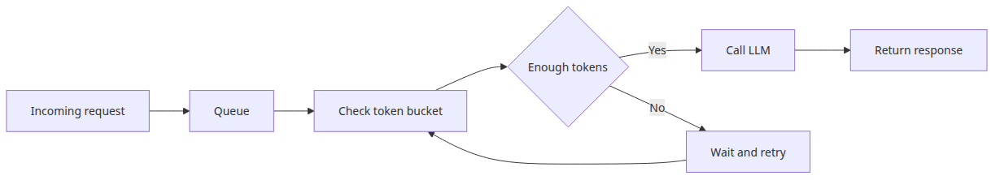
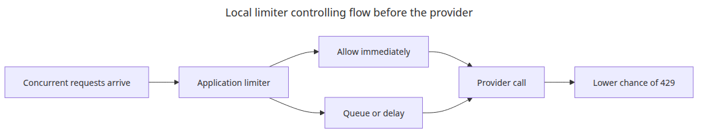
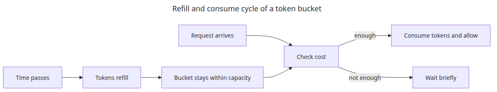
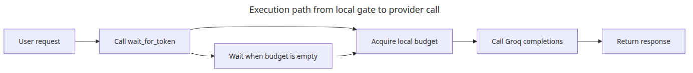
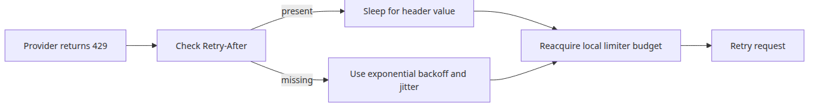
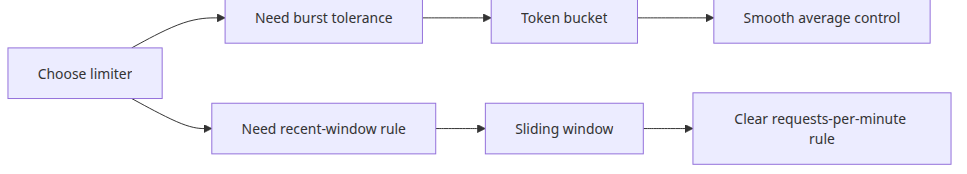

# Rate limit management — patterns for staying within limits

> LLM API Production 101 (6/6)

Example code: [github.com/yeongseon-books/llm-api-production-101](https://github.com/yeongseon-books/llm-api-production-101/tree/main/en/06-rate-limit-management)

Any team that runs APIs long enough eventually sees the same scene. A path that usually works fine starts failing at a busy moment, and the logs begin to fill with 429s or rate-limit warnings. LLM APIs are not different. In some ways they are harsher, because each request can be large in token volume and expensive in downstream compute. When traffic spikes, the pain shows up quickly.

Systems usually fail here in one of two directions. The first is doing nothing and letting every request hit the provider as fast as it arrives. The second is overcorrecting and serializing far more traffic than necessary, which wastes available throughput. Good production behavior sits between those extremes. Send requests aggressively enough to use the allowed budget, but conservatively enough that your own application becomes the first line of control.

This post implements two simple local limiters for that job: a token bucket and a sliding-window limiter. The goal is not to model every provider policy in abstract detail. It is to build the smallest application-side control layer that can shape request flow before the provider has to reject it.

The main idea is simple: **rate-limit handling is not apologizing after a 429, it is controlling request flow before the 429 happens**.


---

## Questions this chapter answers

- What do RPM, TPM, and concurrency limits each mean, and where do they conflict?
- How should the `Retry-After` header on 429 responses combine with your own backoff?
- When does pooling across multiple models or accounts actually help?
- Should you reach for token bucket or leaky bucket for LLM API limits?
- Which metrics let you detect approaching limits and queue before failure?

## Runtime setup

The examples assume Python 3.10 or later and the official `groq` SDK.

```bash
python3 -m venv .venv
source .venv/bin/activate
pip install groq
export GROQ_API_KEY="your-issued-key"
```

---

## Why the application needs its own limiter


Retries and backoff are necessary, but they are still reactive once you have already exceeded the provider’s allowance. A local limiter is useful for three reasons:

- it absorbs short traffic spikes before they reach the provider
- it controls the combined flow from multiple internal code paths
- it turns rate limits into an application policy instead of a remote surprise

Imagine twenty web requests arriving at the same moment, all triggering the same LLM call. Without a local control layer, they all rush to the provider together. With a limiter, some are allowed immediately and others wait in a controlled way.

---

## Where a token bucket fits best


A token bucket refills at a steady rate. Each request consumes one or more tokens. That gives you a useful balance: short bursts are allowed up to the bucket size, but the long-term average stays bounded.

For example, if five tokens are added per second and the bucket capacity is ten, a quiet period can accumulate enough room for a burst of ten requests. After that, sustained traffic still settles back to about five per second.

That makes token buckets a good fit for user-facing traffic with short spikes.

---

## Implementing a token bucket

```python
import time

class TokenBucket:
    def __init__(self, capacity: int, refill_rate_per_second: float) -> None:
        self.capacity = capacity
        self.tokens = float(capacity)
        self.refill_rate_per_second = refill_rate_per_second
        self.last_refill = time.monotonic()

    def _refill(self) -> None:
        now = time.monotonic()
        elapsed = now - self.last_refill
        self.tokens = min(
            self.capacity,
            self.tokens + elapsed * self.refill_rate_per_second,
        )
        self.last_refill = now

    def allow(self, cost: float = 1.0) -> bool:
        self._refill()
        if self.tokens >= cost:
            self.tokens -= cost
            return True
        return False
```

Usage is small and clear:

```python
bucket = TokenBucket(capacity=10, refill_rate_per_second=5)

if bucket.allow():
    print("request allowed")
else:
    print("wait before sending")
```

In a first implementation, treating every request as cost `1` is often enough. Later, some systems also scale cost by expected token usage.

That token-based variant matters for LLM workloads because provider limits are often a mix of RPM and TPM. A small request and a 20,000-token request should not necessarily consume the same local budget.

```python
def estimate_token_cost(prompt_tokens: int, reserved_completion_tokens: int) -> int:
    return prompt_tokens + reserved_completion_tokens

bucket = TokenBucket(capacity=40_000, refill_rate_per_second=20_000 / 60)
cost = estimate_token_cost(prompt_tokens=1200, reserved_completion_tokens=800)

if bucket.allow(cost=cost):
    print("token-budget request allowed")
else:
    print("wait for token budget to refill")
```

---

## Where a sliding window fits best

A sliding-window limiter counts how many requests occurred inside the most recent time window. If the policy is “no more than 100 requests in the last 60 seconds,” this model maps directly onto that rule.

It is less burst-friendly than a token bucket, but it is easier to reason about when the provider policy is stated in explicit window terms such as requests per minute.

---

## Implementing a sliding-window limiter

```python
import time
from collections import deque

class SlidingWindowLimiter:
    def __init__(self, max_requests: int, window_seconds: int) -> None:
        self.max_requests = max_requests
        self.window_seconds = window_seconds
        self.events: deque[float] = deque()

    def allow(self) -> bool:
        now = time.monotonic()

        while self.events and now - self.events[0] >= self.window_seconds:
            self.events.popleft()

        if len(self.events) >= self.max_requests:
            return False

        self.events.append(now)
        return True
```

This keeps only recent events inside the active window and rejects requests once the count is full.

---

## Putting a limiter in front of Groq calls


Here is a small end-to-end example using a token bucket as a gate before the provider call.

```python
import os
import time

from groq import Groq

class TokenBucket:
    def __init__(self, capacity: int, refill_rate_per_second: float) -> None:
        self.capacity = capacity
        self.tokens = float(capacity)
        self.refill_rate_per_second = refill_rate_per_second
        self.last_refill = time.monotonic()

    def _refill(self) -> None:
        now = time.monotonic()
        elapsed = now - self.last_refill
        self.tokens = min(
            self.capacity,
            self.tokens + elapsed * self.refill_rate_per_second,
        )
        self.last_refill = now

    def wait_for_token(self, cost: float = 1.0) -> None:
        while True:
            self._refill()
            if self.tokens >= cost:
                self.tokens -= cost
                return
            time.sleep(0.1)

bucket = TokenBucket(capacity=10, refill_rate_per_second=5)
client = Groq(api_key=os.environ["GROQ_API_KEY"])

def limited_completion(prompt: str) -> str:
    bucket.wait_for_token()
    completion = client.chat.completions.create(
        model="llama-3.1-8b-instant",
        messages=[{"role": "user", "content": prompt}],
        temperature=0,
    )
    return completion.choices[0].message.content

print(limited_completion("Explain the difference between a list and a tuple in Python."))
```

<!-- injected-output:start -->
**Output**

    **Lists vs Tuples in Python**
    =====================================

    In Python, `lists` and `tuples` are two types of data structures that can store multiple values. While they share some similarities, they have distinct differences in terms of their usage, behavior, and performance.

    **Lists**
    ---------

    A `list` is a mutable data structure that can be modified after creation. It is defined using square brackets `[]` and elements are separated by commas.

    **Example:**
    ```python
    my_list = [1, 2, 3, 4, 5]
    print(my_list)  # Output: [1, 2, 3, 4, 5]

    # Modifying the list
    my_list[0] = 10
    print(my_list)  # Output: [10, 2, 3, 4, 5]
    ```
    **Tuples**
    ---------

    A `tuple` is an immutable data structure that cannot be modified after creation. It is defined using parentheses `()` and elements are separated by commas.

    **Example:**
    ```python
    my_tuple = (1, 2, 3, 4, 5)
    print(my_tuple)  # Output: (1, 2, 3, 4, 5)

    # Attempting to modify the tuple will raise an error
    try:
        my_tuple[0] = 10
    except TypeError:
        print("Tuples are immutable")
    ```
    **Key differences:**

    1. **Mutability**: Lists are mutable, while tuples are immutable.
    2. **Syntax**: Lists use square brackets `[]`, while tuples use parentheses `()`.
    3. **Performance**: Tuples are generally faster than lists because they are immutable and can be stored in a single block of memory.
    4. **Use cases**: Lists are suitable for dynamic data structures, while tuples are suitable for static data structures.

    **When to use each:**

    * Use lists when you need to modify the data structure frequently.
    * Use tuples when you need to store a fixed set of values and don't need to modify them.

    In summary, while both lists and tuples can store multiple values, lists are mutable and suitable for dynamic data structures, while tuples are immutable and suitable for static data structures.

<!-- injected-output:end -->

The important detail is ordering: the application acquires local permission before it talks to the provider. That turns a remote hard limit into a local flow-control decision.

---

## What to do after a 429 anyway


Even with a local limiter, you may still receive a 429. Multiple workers may be competing. The provider may enforce token-based limits that your simple request counter does not see. That is why 429 handling still matters.

A good default rule is:

- treat 429 as retryable
- apply longer backoff than for ordinary transient errors
- optionally make the local limiter more conservative for a short period

In other words, the local limiter is the proactive layer, and 429 handling is the reactive recovery layer.

Here is a runnable recovery example that honors `Retry-After` when present, adds bounded exponential backoff with jitter, and reacquires local permission before retrying.

```python
import os
import random
import time

from groq import APIStatusError, Groq

class TokenBucket:
    def __init__(self, capacity: int, refill_rate_per_second: float) -> None:
        self.capacity = capacity
        self.tokens = float(capacity)
        self.refill_rate_per_second = refill_rate_per_second
        self.last_refill = time.monotonic()

    def _refill(self) -> None:
        now = time.monotonic()
        elapsed = now - self.last_refill
        self.tokens = min(self.capacity, self.tokens + elapsed * self.refill_rate_per_second)
        self.last_refill = now

    def wait_for_token(self, cost: float = 1.0) -> None:
        while True:
            self._refill()
            if self.tokens >= cost:
                self.tokens -= cost
                return
            time.sleep(0.1)

bucket = TokenBucket(capacity=10, refill_rate_per_second=5)
client = Groq(api_key=os.environ["GROQ_API_KEY"], max_retries=0)

def retry_after_seconds(exc: APIStatusError) -> float | None:
    value = exc.response.headers.get("retry-after")
    if value is None:
        return None
    try:
        return float(value)
    except ValueError:
        return None

def limited_completion_with_429(prompt: str) -> str:
    for attempt in range(3):
        bucket.wait_for_token()
        try:
            completion = client.chat.completions.create(
                model="llama-3.1-8b-instant",
                messages=[{"role": "user", "content": prompt}],
                temperature=0,
            )
            return completion.choices[0].message.content
        except APIStatusError as exc:
            if exc.status_code != 429 or attempt == 2:
                raise

            retry_after = retry_after_seconds(exc)
            sleep_seconds = retry_after if retry_after is not None else min(2**attempt, 8) + random.uniform(0, 0.5)
            time.sleep(sleep_seconds)

    raise RuntimeError("unreachable")
```

---

## Choosing token bucket versus sliding window


Both are valid. The better choice depends on the traffic pattern.

### Token bucket works well when

- short bursts are acceptable
- you want smooth average-rate control
- traffic has user-driven spikes

### Sliding window works well when

- the provider policy is stated as requests per minute or similar
- you want a direct “how many in the last N seconds” rule
- operator clarity matters more than burst smoothing

In many systems, starting with a token bucket is a reasonable default, then switching to a window-based limiter when a provider policy maps more naturally onto it.

---

## Limits of a single-process limiter

The examples in this post are intentionally local to one process. That means they have obvious boundaries:

- multiple workers do not share state
- multiple servers do not share state
- user-specific quotas and global quotas are harder to combine

Those are not reasons to ignore the pattern. They are reasons to treat this as the conceptual baseline before moving to shared counters in Redis or another coordination layer.

---

## Closing

In this final post, we implemented a token bucket and a sliding-window limiter, then used a local gate in front of a Groq API call to control flow before the provider had to reject it. The practical lesson is simple: rate limits are easier to live with when your application manages them deliberately instead of discovering them through avoidable 429s.

That closes the series. Structured output fixed the response contract. Tool calling connected the model to functions. Streaming changed how partial output is consumed. Caching reduced repeated cost. Retries handled temporary failure. Rate-limit control shaped the outer traffic boundary. Together, those pieces form a workable baseline for production LLM API integrations.

## Operational checklist

- [ ] Documented RPM/TPM/concurrency limits per model in a single table
- [ ] Built a client that honors `Retry-After` first on 429 responses
- [ ] Added a proactive token-bucket limiter that blocks calls before the wall
- [ ] Defined routing rules and failure isolation when pooling keys/accounts
- [ ] Set alarm thresholds for token usage and limit-proximity events

<!-- toc:begin -->
## In this series

- [Structured output — JSON mode and response schemas](./01-structured-output.md)
- [Tool calling — connecting functions to the model](./02-tool-calling.md)
- [Streaming in depth — chunk handling and error recovery](./03-streaming-in-depth.md)
- [Caching strategies — reducing cost and latency](./04-caching-strategies.md)
- [Retry and error handling — making API calls reliable](./05-retry-and-error-handling.md)
- **Rate limit management — patterns for staying within limits (current)**

<!-- toc:end -->

---

## References

- <https://console.groq.com/docs/errors>
- <https://en.wikipedia.org/wiki/Token_bucket>
- <https://konghq.com/blog/engineering/how-to-design-a-scalable-rate-limiting-algorithm>

Tags: LLM, OpenAI, Streaming, Python
