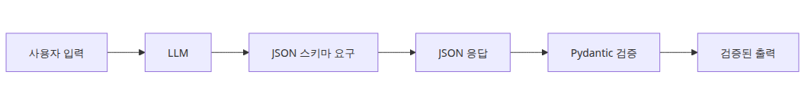
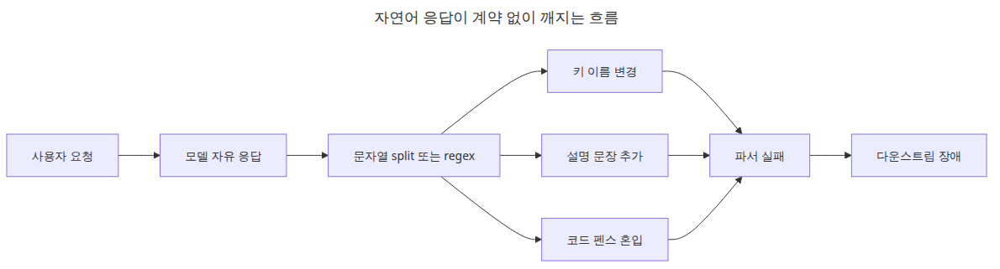
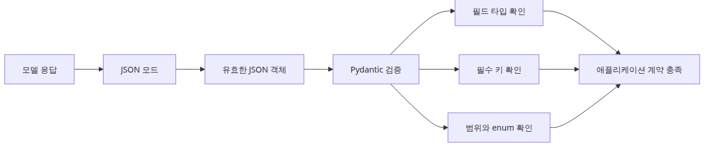
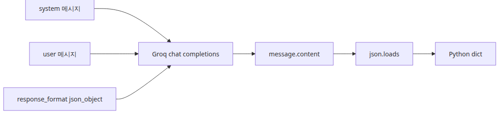
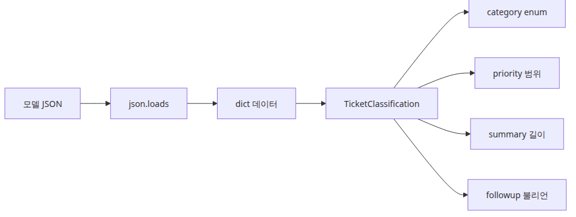
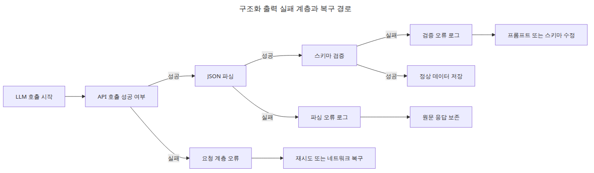

# 구조화 출력 — JSON 모드와 응답 스키마

LLM API를 처음 운영 경로에 올리면 많은 팀이 모델 답변의 품질부터 걱정합니다. 그런데 실제로 더 먼저 터지는 문제는 답변의 내용보다 형태입니다. 데모에서는 보기 좋은 문단 하나면 충분하지만, 서비스는 필드 이름과 타입이 고정된 응답을 원합니다. 데이터베이스에 넣어야 하고, 다른 서비스에 넘겨야 하며, 후속 로직이 그 응답을 분기 조건으로 사용하기 때문입니다.

초기 구현은 대개 단순해 보입니다. 프롬프트에 “JSON으로 반환하세요”라고 쓰고, 응답 문자열에 `json.loads()`를 적용합니다. 짧은 테스트에서는 잘 돌아가는 것처럼 보입니다. 하지만 프롬프트가 길어지고 예외 케이스가 늘어나면 모델이 설명 문장을 앞에 붙이거나, 코드 펜스를 씌우거나, 키 이름을 바꾸는 순간부터 문제가 시작됩니다.

이 실패는 모델이 멍청해서 생기는 문제가 아닙니다. 텍스트 생성과 애플리케이션 로직 사이에 명시적인 계약이 없어서 생기는 문제입니다. 사람이 읽기 좋은 응답과 프로그램이 안전하게 소비할 수 있는 응답은 같은 것이 아닙니다. 운영에서는 후자가 먼저 확보되어야 합니다.

이 글은 그 느슨한 경계를 계약으로 바꾸는 방법을 다룹니다. Groq의 JSON 모드로 응답 형태를 좁히고, Pydantic으로 의미 규칙까지 검증해 “그럴듯한 텍스트”를 “실패 가능성이 명확한 데이터 경로”로 바꾸겠습니다.

이 글은 LLM API Production 101 시리즈의 첫 번째 글입니다.

여기서는 JSON 모드와 응답 스키마를 이용해 구조화 출력 계약을 만드는 방법을 살펴보겠습니다.

## 이 글에서 다룰 문제

- 왜 자유 형식 텍스트 파싱은 운영 환경에서 빠르게 깨질까요?
- JSON 모드는 정확히 무엇을 보장하고, 무엇은 보장하지 않을까요?
- Groq Python SDK에서 구조화 출력을 어떻게 요청해야 할까요?
- Pydantic 검증은 JSON 파싱 뒤에 왜 한 단계 더 필요할까요?
- 구조화 출력 계약이 깨졌을 때 로그와 복구 경로를 어떻게 나눠야 할까요?

## 왜 이 글이 중요한가

구조화 출력은 LLM 애플리케이션의 자동화를 여는 첫 관문입니다. 응답을 사람이 읽기만 한다면 문장 품질이 중요하겠지만, 응답을 다른 코드가 즉시 소비해야 한다면 형식 안정성이 더 중요합니다. 분류, 추출, 후속 API 호출, 비즈니스 규칙 적용은 모두 구조가 안정적이라는 전제 위에서만 안전하게 작동합니다.

현업에서는 이 경계를 프롬프트 요령으로 버티려는 시도를 자주 봅니다. “정확히 JSON으로 답하라”는 문구를 더 길게 쓰고, 실패하면 파서를 조금 더 복잡하게 붙입니다. 하지만 이 방식은 문제를 해결하는 것이 아니라 프롬프트와 후처리 코드 사이에 책임을 흩뿌리는 일에 가깝습니다. 운영에서 필요한 것은 더 영리한 문자열 파싱이 아니라 더 명확한 계약입니다.

JSON 모드와 스키마 검증을 함께 쓰면 실패가 조용히 지나가지 않습니다. 파싱이 안 되면 파싱 계층에서, 의미가 안 맞으면 검증 계층에서 바로 멈춥니다. 이 명시성이 있어야 재시도, 폴백, 로깅, 회귀 테스트도 설계할 수 있습니다.

## 구조화 출력을 이해하는 가장 좋은 방법: 프롬프트 기교가 아니라 응답 계약으로 보는 것입니다

구조화 출력은 모델을 더 잘 설득하는 기술이 아니라, 애플리케이션이 기대하는 응답 경계를 좁히는 기술입니다. 먼저 모델이 JSON 객체를 반환하게 만들고, 그다음 애플리케이션이 그 객체를 자신이 아는 스키마로 검증합니다. 이 두 단계가 분리되어야 문제의 원인도 분리해서 볼 수 있습니다.

이 관점이 중요한 이유는 운영상의 책임 분리가 선명해지기 때문입니다. JSON 모드는 구문 안정성을 높이고, Pydantic은 비즈니스 의미를 검사합니다. 둘 중 하나만 있으면 아직 경계가 느슨합니다. 둘이 함께 있어야 “파싱 가능한 응답”과 “애플리케이션이 받아도 되는 응답”이 구분됩니다.

> 프로덕션의 구조화 출력은 모델에게 예쁘게 말하게 하는 문제가 아니라, 애플리케이션이 신뢰할 수 있는 실패 경계를 만드는 문제입니다.

## 핵심 개념



*구조화 출력: JSON 모드와 응답 스키마*

### 왜 자연어 파싱은 오래 버티지 못하는가



*자연어 응답이 계약 없이 깨지는 흐름*

초기 구현은 종종 짧고 매끈해 보입니다. 하지만 그 매끈함은 계약이 빠져 있다는 뜻이기도 합니다. 아래 코드는 짧지만, 출력 형식이 조금만 바뀌어도 바로 깨집니다.

```python
raw_text = "positive, confidence=0.91"
label, confidence = raw_text.split(",")
```

이 패턴의 문제는 분명합니다. 필드 이름 안정성, 값 타입 안정성, 누락 데이터 실패 처리가 모두 코드 밖에 흩어져 있습니다. 운영에서는 이 규칙을 프롬프트와 문자열 파서에 나눠 두지 말고, 하나의 계약으로 모아야 합니다.

### JSON 모드가 보장하는 것과 보장하지 않는 것



*JSON 모드와 스키마 검증의 책임 경계*

Groq의 `response_format={"type": "json_object"}`는 모델을 JSON 객체 쪽으로 강하게 유도합니다. 이 덕분에 문자열 수술 없이 파싱 가능한 응답을 받을 가능성이 커집니다. 다만 JSON 문법이 맞는다고 해서 비즈니스 의미까지 맞는 것은 아닙니다.

```json
{
  "sentiment": "positive",
  "confidence": "high"
}
```

위 응답은 문법적으로는 유효하지만 `confidence`가 숫자가 아니라 문자열입니다. 그래서 실제 경로는 두 단계로 나뉘어야 합니다. 먼저 JSON 객체를 받게 만들고, 그다음 그 객체가 애플리케이션 스키마와 일치하는지 확인해야 합니다.

### Groq SDK로 JSON 모드 요청 보내기



*JSON 모드 요청과 응답 파싱 흐름*

아래 예제는 고객 지원 문의에서 `category`, `priority`, `summary`를 추출합니다. 코드 블록은 그대로 복사해 실행할 수 있도록 영어 원문을 유지했습니다.

```python
import json
import os

from groq import Groq

client = Groq(api_key=os.environ["GROQ_API_KEY"])

messages = [
    {
        "role": "system",
        "content": (
            "You classify customer support tickets. "
            "category must be one of billing/account/bug/shipping. "
            "priority must be an integer from 1 to 5. "
            "summary must be a string between 8 and 120 characters. "
            "Return exactly one JSON object with the keys category, priority, and summary."
        ),
    },
    {
        "role": "user",
        "content": (
            "Ticket: payment succeeded but the order is missing from my order history. "
            "I do not want a refund yet. I need the status checked quickly."
        ),
    },
]

completion = client.chat.completions.create(
    model="llama-3.1-8b-instant",
    messages=messages,
    response_format={"type": "json_object"},
    temperature=0,
)

content = completion.choices[0].message.content
payload = json.loads(content)

print(payload)
```

<!-- injected-output:start -->
**실행 결과**

    {'category': 'billing', 'priority': 3, 'summary': 'Order missing from order history after successful payment'}

<!-- injected-output:end -->

여기서 중요한 점은 세 가지입니다. 프롬프트 안에서도 JSON 객체 하나를 반환하라고 다시 적어 계약을 읽기 쉽게 만들었다는 점, `temperature=0`으로 변동성을 줄였다는 점, 그리고 `json.loads()`는 파싱만 할 뿐 의미 검증은 하지 않는다는 점입니다.

### Pydantic으로 응답을 잠그기



*모델 출력과 검증기 구조의 관계*

이제 JSON 문자열을 애플리케이션 타입으로 바꿉니다. 이 단계부터 구조화 출력은 실제 운영 경계가 됩니다.

```python
import json
import os
from enum import Enum

from groq import Groq
from pydantic import BaseModel, Field, ValidationError

class Category(str, Enum):
    billing = "billing"
    account = "account"
    bug = "bug"
    shipping = "shipping"

class TicketClassification(BaseModel):
    category: Category
    priority: int = Field(ge=1, le=5)
    summary: str = Field(min_length=8, max_length=120)
    customer_needs_followup: bool

client = Groq(api_key=os.environ["GROQ_API_KEY"])

completion = client.chat.completions.create(
    model="llama-3.1-8b-instant",
    messages=[
        {
            "role": "system",
            "content": (
                "Classify the support request. "
                "category must be one of billing/account/bug/shipping. "
                "priority must be an integer from 1 to 5. "
                "summary must be a string between 8 and 120 characters. "
                "customer_needs_followup must be a boolean. "
                "Return exactly one JSON object with the keys category, priority, summary, and customer_needs_followup."
            ),
        },
        {
            "role": "user",
            "content": (
                "Ticket: password reset emails never arrive. "
                "I need access restored today because work is blocked."
            ),
        },
    ],
    response_format={"type": "json_object"},
    temperature=0,
)

raw = completion.choices[0].message.content
data = json.loads(raw)

try:
    ticket = TicketClassification.model_validate(data)
except ValidationError as exc:
    print("validation failed")
    print(exc)
    raise

print(ticket.model_dump())
```

<!-- injected-output:start -->
**실행 결과**

    {'category': <Category.bug: 'bug'>, 'priority': 5, 'summary': 'Password reset emails not arriving, urgent access restoration needed', 'customer_needs_followup': True}

<!-- injected-output:end -->

검증이 붙는 순간 응답 경계가 강해집니다. 허용되지 않은 카테고리, 잘못된 타입, 누락 필드가 모두 즉시 실패합니다. 운영에서는 조용한 오염보다 시끄러운 실패가 훨씬 안전합니다.

### 실패를 계층으로 나눠 보기



*구조화 출력 실패 계층과 복구 경로*

실패를 요청 계층, JSON 파싱 계층, 스키마 검증 계층으로 나누면 로그와 복구 정책이 선명해집니다.

```python
import json
import logging
import os

from groq import Groq
from pydantic import BaseModel, Field, ValidationError
from enum import Enum

class Category(str, Enum):
    billing = "billing"
    account = "account"
    bug = "bug"
    shipping = "shipping"

class TicketClassification(BaseModel):
    category: Category
    priority: int = Field(ge=1, le=5)
    summary: str = Field(min_length=8, max_length=120)
    customer_needs_followup: bool

logger = logging.getLogger(__name__)
client = Groq(api_key=os.environ["GROQ_API_KEY"])

try:
    completion = client.chat.completions.create(
        model="llama-3.1-8b-instant",
        messages=[
            {
                "role": "system",
                "content": (
                    "Classify the support request. "
                    "category must be one of billing/account/bug/shipping. "
                    "priority must be an integer from 1 to 5. "
                    "summary must be a string between 8 and 120 characters. "
                    "customer_needs_followup must be a boolean. "
                    "Return exactly one JSON object with the keys category, priority, summary, and customer_needs_followup."
                ),
            },
            {
                "role": "user",
                "content": "Ticket: payment was approved but the order is missing.",
            },
        ],
        response_format={"type": "json_object"},
        temperature=0,
    )
    raw = completion.choices[0].message.content
    data = json.loads(raw)
    ticket = TicketClassification.model_validate(data)
except json.JSONDecodeError:
    logger.exception("json parse failed")
except ValidationError:
    logger.exception("schema validation failed")
except Exception:
    logger.exception("llm request failed")
```

이렇게 분리해 두면 요청 실패는 재시도 대상으로, JSON 파싱 실패는 원문 보존과 프롬프트 재검토 대상으로, 스키마 실패는 계약 단순화나 필드 정의 보강 대상으로 각각 다르게 다룰 수 있습니다.

## 흔히 헷갈리는 지점

- JSON 모드를 켰다고 해서 비즈니스 규칙까지 자동으로 보장되는 것은 아닙니다.
- `json.loads()` 성공은 스키마 검증 성공과 같은 뜻이 아닙니다.
- 구조화 출력 문제를 프롬프트 문구만 손봐서 해결하려 하면 장애 원인이 더 흐려집니다.
- enum, 범위, 필수 필드 같은 규칙은 프롬프트 설명보다 코드 검증에 먼저 있어야 합니다.
- 검증 실패를 “모델 품질 문제”로만 보면 로깅과 복구 계층 설계가 늦어집니다.

## 운영 체크리스트

- [ ] Pydantic 모델 또는 JSON Schema로 출력 구조를 명시했다
- [ ] 스키마 위반 시 로깅과 재시도 기준을 분리했다
- [ ] enum, 범위, 필수 여부를 코드 검증 계층에 반영했다
- [ ] 검증 실패 시 원문 응답을 추적 가능하게 남겼다
- [ ] 샘플 입력 기반 회귀 테스트로 스키마 변경 영향을 확인했다

## 정리

이번 글에서는 구조화 출력을 프롬프트 요령이 아니라 응답 계약으로 다뤘습니다. `response_format={"type": "json_object"}`는 출력의 구문 형태를 좁혀 주고, Pydantic은 그 출력이 애플리케이션 규칙을 만족하는지 검사합니다. 이 둘이 함께 있어야 문자열 파싱에 기대던 경로를 운영 가능한 데이터 경계로 바꿀 수 있습니다.

중요한 것은 실패가 더 이상 애매하지 않다는 점입니다. 파싱이 실패했는지, JSON은 맞지만 스키마가 틀렸는지, 요청 자체가 실패했는지가 계층별로 드러납니다. 이 차이가 있어야 재시도 정책, 폴백 설계, 품질 로그가 모두 현실적인 형태를 갖습니다.

시리즈의 다음 글에서는 이 계약을 함수 실행 요청까지 확장합니다. 구조화 출력이 데이터를 안전하게 받는 방법이었다면, 툴 호출은 그 데이터를 바탕으로 애플리케이션 기능을 안전하게 연결하는 방법입니다.

<!-- toc:begin -->
## 시리즈 목차

- **구조화 출력 — JSON 모드와 응답 스키마 (현재 글)**
- 툴 호출 — 함수를 모델에 연결하기 (예정)
- 스트리밍 심화 — 청크 처리와 오류 복구 (예정)
- 캐싱 전략 — 비용과 지연 시간 줄이기 (예정)
- 재시도와 오류 처리 — 안정적인 API 호출 만들기 (예정)
- 속도 제한 관리 — Rate Limit 대응 패턴 (예정)

<!-- toc:end -->

## 참고 자료

### 공식 문서
- <https://console.groq.com/docs/text-chat>
- <https://console.groq.com/docs/text-chat#json-mode>
- <https://docs.pydantic.dev/latest/concepts/models/>

### 관련 시리즈
- [툴 호출 — 함수를 모델에 연결하기](./02-tool-calling.md)
- [LLM API Production 101 시리즈](../)
- [LLM App Foundations 101](../../llm-app-foundations-101/ko/01-llm-api-first-call.md) — 이 시리즈가 시작되는 지점에 있는 "첫 호출, 토큰, 프롬프트 기초"를 정리합니다. 구조화 출력이나 툴 호출이 어떤 메시지 패턴 위에서 작동하는지가 흐릿하면 한 단계 위로 올라가 읽기를 권장합니다.

Tags: LLM, OpenAI, Streaming, Python
