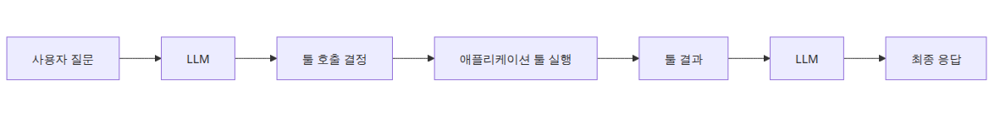
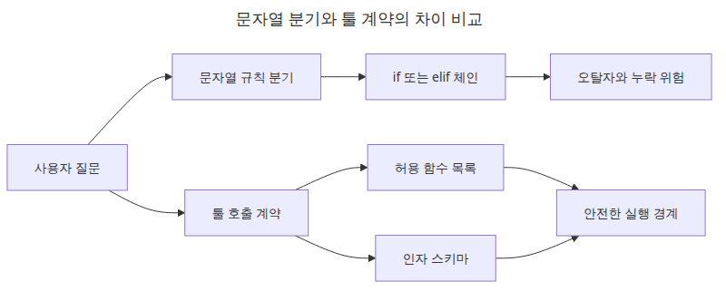
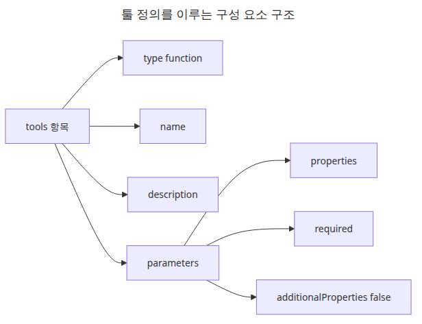
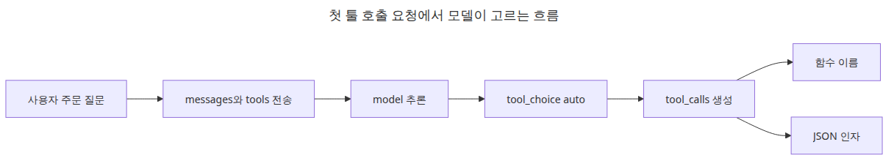
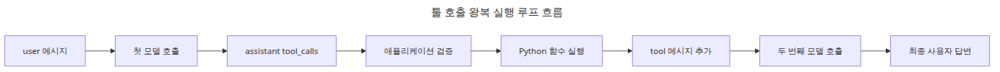
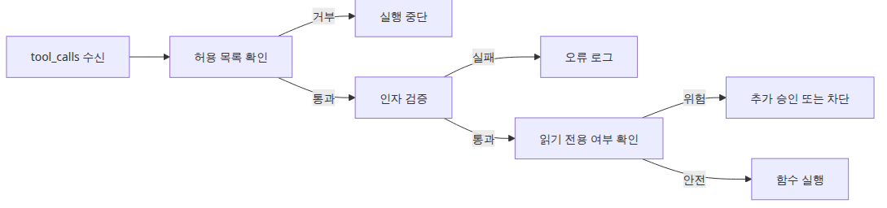

# 툴 호출 — 함수를 모델에 연결하기

> LLM API 프로덕션 101 시리즈 (2/6)

예제 코드: [github.com/yeongseon-books/llm-api-production-101](https://github.com/yeongseon-books/llm-api-production-101/tree/main/ko/02-tool-calling)

구조화 출력까지 붙이고 나면 다음 요구가 자연스럽게 따라옵니다. 모델이 답변만 하지 말고, 애플리케이션 기능을 직접 선택해서 실행하게 만들고 싶다는 요구입니다. 예를 들어 배송 상태를 물으면 `get_order_status()`를 호출하고, 환율을 묻으면 내부 가격 조회 함수를 실행하고, 일정 생성 요청이 오면 캘린더 API를 붙이고 싶어집니다. 이때 많은 입문자가 모델에게 함수 이름을 문자열로 내놓게 한 뒤 `if/elif`로 해석합니다. 작게는 동작하지만, 호출 규약이 느슨하면 곧 예외 처리가 늘어납니다.

툴 호출의 본질은 모델에게 "무슨 말을 할까"만 맡기는 것이 아니라 "어떤 함수가 필요할까"까지 맡기는 데 있습니다. 그렇다고 모델이 마음대로 코드를 실행하게 두는 것은 아닙니다. 애플리케이션이 도구 목록, 인자 스키마, 실행 권한을 모두 통제하고, 모델은 그 안에서 선택만 합니다. 결국 툴 호출도 구조화 출력의 연장선입니다. 텍스트가 아니라 함수 호출 계약을 JSON 형태로 주고받는 셈입니다.

이번 글에서는 Groq API의 `tools` 파라미터와 `tool_calls` 응답을 기준으로, 함수 실행 루프를 끝까지 만듭니다. 모델이 도구를 선택하면 애플리케이션은 인자를 파싱하고, 실제 Python 함수를 실행하고, 그 결과를 다시 대화에 넣어 한 번 더 모델을 부릅니다. 이 루프를 정확히 이해해야 나중에 검색, 데이터 조회, 외부 API 연동 같은 기능을 안정적으로 붙일 수 있습니다.

핵심은 간단합니다. **툴 호출은 모델 자율성이 아니라 애플리케이션이 설계한 실행 경계입니다.**



*툴 호출: 함수를 모델에 연결하기*
---

<!-- a-grade-intro:begin -->
## 핵심 질문

함수를 모델에 어떻게 연결해야 도구 호출이 안전하고 정확할까요?

이 글은 그 질문에 답하기 위해 Tool Calling의 핵심 결정과 운영 함정을 살펴봅니다.

<!-- a-grade-intro:end -->

## 이 글에서 답할 질문

- Tool calling은 함수 호출과 어떻게 다르고, LLM이 진짜로 함수를 실행하는가?
- 도구 정의(name, description, parameters)는 어떻게 작성해야 모델이 헷갈리지 않는가?
- 여러 도구가 있을 때 모델이 잘못된 도구를 고르는 문제를 어떻게 줄이는가?
- Tool 호출 결과를 다시 모델에 넘기는 멀티턴 흐름은 어떻게 구성하는가?
- Tool 실행이 실패하거나 타임아웃됐을 때 어떻게 응답을 회복하는가?

## 실행 준비

예제를 그대로 따라 하려면 Python 3.10 이상에서 아래 준비를 먼저 하면 됩니다.

```bash
python3 -m venv .venv
source .venv/bin/activate
pip install groq pydantic
export GROQ_API_KEY="여기에-발급받은-키"
```

이 글에서는 `groq` SDK와 Pydantic 검증을 함께 사용합니다.

---

## 왜 함수 이름 문자열만으로는 부족한가



*문자열 분기와 툴 계약의 차이 비교*
초기 구현은 보통 아래처럼 시작합니다.

```python
if "배송" in user_question:
    result = get_order_status(order_id)
elif "환불" in user_question:
    result = get_refund_policy()
```

또는 모델에게 `{"function": "get_order_status", "order_id": "A-100"}` 같은 문자열을 출력하게 만들고 직접 파싱합니다. 문제는 이 패턴이 모델과 애플리케이션 사이의 계약을 코드와 프롬프트에 나눠 숨긴다는 점입니다. 함수 이름 오탈자, 필수 인자 누락, 잘못된 타입, 허용되지 않은 함수 호출이 모두 뒤늦게 드러납니다.

툴 호출 인터페이스를 쓰면 장점이 세 가지입니다.

- 모델이 선택할 수 있는 함수 목록을 명시적으로 제한합니다.
- 각 함수의 인자 스키마를 JSON Schema 형태로 설명합니다.
- 응답에서 `tool_calls`를 구조적으로 읽을 수 있습니다.

이 구조는 "모델이 코드를 실행한다"는 오해를 줄여 줍니다. 실제 실행은 여전히 애플리케이션 책임입니다. 모델은 함수 이름과 인자 초안을 제안할 뿐입니다.

---

## `tools` 파라미터는 무엇을 담는가



*툴 정의를 이루는 구성 요소 구조*
Groq 채팅 API에서 툴은 보통 `type: function` 항목으로 정의합니다. 각 툴에는 이름, 설명, 파라미터 스키마가 들어갑니다. 예제로 주문 상태 조회 함수를 열어 보겠습니다.

```python
tools = [
    {
        "type": "function",
        "function": {
            "name": "get_order_status",
            "description": "주문 번호로 배송 상태를 조회합니다.",
            "parameters": {
                "type": "object",
                "properties": {
                    "order_id": {
                        "type": "string",
                        "description": "예: ORD-1001 같은 주문 번호",
                    }
                },
                "required": ["order_id"],
                "additionalProperties": False,
            },
        },
    }
]
```

여기서 중요한 것은 함수 시그니처를 코드만이 아니라 모델도 읽을 수 있는 형태로 준다는 점입니다. `description`은 모델이 언제 이 도구를 써야 하는지 판단하는 단서가 되고, `parameters`는 어떤 인자가 필요한지 알려 줍니다. `additionalProperties=False` 같은 제약도 넣어 두면 불필요한 인자 생성을 줄이는 데 도움이 됩니다.

---

## 첫 번째 툴 호출 요청 만들기



*첫 툴 호출 요청에서 모델이 고르는 흐름*
이제 실제 호출을 보겠습니다. 아래 코드는 모델에게 주문 상태 질문을 주고, 툴 사용이 필요하면 `tool_calls`를 반환하게 합니다.

```python
import os

from groq import Groq

client = Groq(api_key=os.environ["GROQ_API_KEY"])

tools = [
    {
        "type": "function",
        "function": {
            "name": "get_order_status",
            "description": "주문 번호로 배송 상태를 조회합니다.",
            "parameters": {
                "type": "object",
                "properties": {
                    "order_id": {"type": "string"}
                },
                "required": ["order_id"],
                "additionalProperties": False,
            },
        },
    }
]

completion = client.chat.completions.create(
    model="llama-3.1-8b-instant",
    messages=[
        {
            "role": "system",
            "content": "주문 관련 질문은 필요한 경우 툴을 사용하세요.",
        },
        {
            "role": "user",
            "content": "주문 번호 ORD-1001의 배송 상태를 알려줘.",
        },
    ],
    tools=tools,
    tool_choice="auto",
    temperature=0,
)

message = completion.choices[0].message
print(message.tool_calls)
```

<!-- injected-output:start -->
**출력 결과**

    [ChatCompletionMessageToolCall(id='pb8r00zh0', function=Function(arguments='{"order_id":"ORD-1001"}', name='get_order_status'), type='function')]

<!-- injected-output:end -->

`tool_choice="auto"`는 모델이 필요할 때 도구를 고르게 합니다. 응답 텍스트가 곧바로 오지 않고 `tool_calls`가 채워지는 경우가 핵심입니다. 이때 애플리케이션은 그 구조를 읽고 실제 함수를 실행해야 합니다.

---

## `tool_calls`를 파싱하고 함수로 연결하기

툴 호출 응답은 보통 함수 이름과 JSON 문자열 형태의 인자를 포함합니다. 따라서 실행 전에는 두 가지 검사가 필요합니다. 첫째, 허용된 함수 이름인지 확인합니다. 둘째, 인자를 JSON으로 파싱하고 검증합니다.

```python
import json
import os

from groq import Groq
from pydantic import BaseModel

class OrderStatusArgs(BaseModel):
    order_id: str

def get_order_status(order_id: str) -> dict:
    fake_db = {
        "ORD-1001": {"status": "in_transit", "eta_days": 2},
        "ORD-1002": {"status": "delivered", "eta_days": 0},
    }
    return fake_db.get(order_id, {"status": "not_found", "eta_days": None})

available_tools = {
    "get_order_status": get_order_status,
}

client = Groq(api_key=os.environ["GROQ_API_KEY"])

tools = [
    {
        "type": "function",
        "function": {
            "name": "get_order_status",
            "description": "주문 번호로 배송 상태를 조회합니다.",
            "parameters": {
                "type": "object",
                "properties": {
                    "order_id": {"type": "string"}
                },
                "required": ["order_id"],
                "additionalProperties": False,
            },
        },
    }
]

completion = client.chat.completions.create(
    model="llama-3.1-8b-instant",
    messages=[
        {"role": "system", "content": "주문 질문은 툴을 사용해 확인하세요."},
        {"role": "user", "content": "ORD-1001 상태를 확인해 주세요."},
    ],
    tools=tools,
    tool_choice="auto",
    temperature=0,
)

message = completion.choices[0].message

for tool_call in message.tool_calls or []:
    function_name = tool_call.function.name
    arguments = json.loads(tool_call.function.arguments)

    if function_name not in available_tools:
        raise ValueError(f"unknown tool: {function_name}")

    validated_args = OrderStatusArgs.model_validate(arguments)
    result = available_tools[function_name](**validated_args.model_dump())
    print(function_name, arguments, result)
```

<!-- injected-output:start -->
**출력 결과**

    get_order_status {'order_id': 'ORD-1001'} {'status': 'in_transit', 'eta_days': 2}

<!-- injected-output:end -->

이 단계에서는 아직 최종 사용자 답변이 완성되지 않았습니다. 모델은 툴 사용 계획을 제안했고, 애플리케이션은 그 계획을 실행했습니다. 다음 단계에서 이 실행 결과를 대화에 다시 넣어야 자연어 응답이 완성됩니다.

---

## 함수 실행 루프를 끝까지 만들기



*툴 호출 왕복 실행 루프 흐름*
툴 호출은 한 번의 API 호출로 끝나지 않는 경우가 많습니다. 일반적인 패턴은 다음과 같습니다.

1. 사용자 메시지와 `tools` 목록을 보냅니다.
2. 모델이 `tool_calls`를 반환합니다.
3. 애플리케이션이 실제 함수를 실행합니다.
4. 함수 결과를 `tool` 역할 메시지로 대화에 추가합니다.
5. 같은 대화 이력을 다시 모델에 보내 최종 답변을 받습니다.

아래 예제는 이 전체 루프를 보여 줍니다.

```python
import json
import os

from groq import Groq
from pydantic import BaseModel

class OrderStatusArgs(BaseModel):
    order_id: str

def get_order_status(order_id: str) -> dict:
    fake_db = {
        "ORD-1001": {
            "status": "in_transit",
            "location": "Seoul hub",
            "eta_days": 2,
        }
    }
    return fake_db.get(order_id, {"status": "not_found"})

tools = [
    {
        "type": "function",
        "function": {
            "name": "get_order_status",
            "description": "주문 번호로 배송 상태를 조회합니다.",
            "parameters": {
                "type": "object",
                "properties": {
                    "order_id": {"type": "string"}
                },
                "required": ["order_id"],
                "additionalProperties": False,
            },
        },
    }
]

available_tools = {"get_order_status": get_order_status}

client = Groq(api_key=os.environ["GROQ_API_KEY"])

messages = [
    {"role": "system", "content": "주문 질문은 툴로 확인한 뒤 한국어로 간단히 답하세요."},
    {"role": "user", "content": "ORD-1001 배송 상태 알려줘."},
]

first = client.chat.completions.create(
    model="llama-3.1-8b-instant",
    messages=messages,
    tools=tools,
    tool_choice="auto",
    temperature=0,
)

assistant_message = first.choices[0].message
messages.append(assistant_message.model_dump())

if not assistant_message.tool_calls:
    print(assistant_message.content)
    raise SystemExit(0)

for tool_call in assistant_message.tool_calls or []:
    function_name = tool_call.function.name
    if function_name not in available_tools:
        raise ValueError(f"unknown tool: {function_name}")

    try:
        arguments = json.loads(tool_call.function.arguments)
        validated_args = OrderStatusArgs.model_validate(arguments)
    except json.JSONDecodeError as exc:
        raise ValueError("tool arguments were not valid JSON") from exc

    tool_result = available_tools[function_name](**validated_args.model_dump())

    messages.append(
        {
            "role": "tool",
            "tool_call_id": tool_call.id,
            "name": function_name,
            "content": json.dumps(tool_result, ensure_ascii=False),
        }
    )

final = client.chat.completions.create(
    model="llama-3.1-8b-instant",
    messages=messages,
    tools=tools,
    temperature=0,
)

print(final.choices[0].message.content)
```

이 루프의 좋은 점은 역할 경계가 명확하다는 데 있습니다. 모델은 도구를 선택하고 설명을 구성합니다. 애플리케이션은 실제 데이터 접근과 권한을 통제합니다. 툴 결과를 다시 메시지로 넣을 때 `tool_call_id`를 보존하는 이유도 이 추적성을 유지하기 위해서입니다.

---

## 운영에서 특히 조심할 점



*툴 실행 전에 거치는 운영 방어 단계*
툴 호출을 붙이면 모델이 더 똑똑해진 것처럼 보이지만, 운영 관점에서는 실패 지점이 늘어납니다. 특히 아래 항목을 초기에 잡아 두는 편이 좋습니다.

첫째, **허용 목록 밖 함수는 절대 실행하지 않습니다.** 모델 응답에 나온 함수 이름을 바로 `globals()`에서 찾는 패턴은 위험합니다.

둘째, **인자 검증을 생략하지 않습니다.** 가장 단순한 문자열 파싱 패턴에서는 `json.loads()` 뒤에 바로 `**arguments`를 넘기기 쉽지만, 실전에서는 Pydantic 모델이나 직접 검증을 붙여야 합니다.

셋째, **부작용 있는 함수는 읽기 전용 함수보다 더 엄격히 분리합니다.** 주문 조회와 결제 취소는 같은 무게가 아닙니다. 툴 호출 설계에서 조회와 변경을 같은 수준으로 두면 사고가 커집니다.

넷째, **툴 결과는 항상 로그 가능 형태로 남깁니다.** 어떤 질문에서 어떤 도구가 어떤 인자로 호출되었는지 추적할 수 있어야 장애 분석이 가능합니다.

---

## 마무리

이번 글에서는 `tools` 파라미터를 사용해 함수 목록과 인자 스키마를 모델에 공개하고, `tool_calls` 응답을 읽어 실제 Python 함수 실행 루프를 완성했습니다. 중요한 점은 모델이 실행 권한을 갖는 것이 아니라, 애플리케이션이 설계한 안전한 도구 상자 안에서 선택권만 가진다는 사실입니다.

앞선 글에서 구조화 출력으로 응답 계약을 고정했다면, 툴 호출은 그 계약을 "함수 실행 요청"으로 확장한 형태입니다. 다음 주제에서는 같은 원칙을 스트리밍 경로에 적용해, 응답이 한 번에 오지 않는 상황에서 청크를 어떻게 복원하고 오류를 어떻게 다뤄야 하는지 보겠습니다.

## 시니어 엔지니어는 이렇게 생각합니다

- **도구 정의가 거의 모든 것을 결정** — 이름·설명·파라미터가 호출 정확도를 좌우합니다.
- **최소 권한 원칙을 도구에** — 권한 경계를 좁혀 사고를 막습니다.
- **결과 형식을 표준화** — 모델이 다음 단계를 안정적으로 결정합니다.
- **idempotency가 재시도 안전성** — destructive operation은 확인 게이트를 둡니다.
- **관측·로깅이 모든 호출에** — 도구 호출이 사고 추적의 단위입니다.

## 운영 체크리스트

- [ ] 각 도구의 `description`을 사용 시점이 명확히 드러나도록 작성했다
- [ ] 파라미터에 타입, enum, 필수 여부를 정확히 명시했다
- [ ] tool 결과를 `role: tool` 메시지로 다시 모델에 전달하는 루프를 구현했다
- [ ] 도구 실행 실패 시 모델이 사용자에게 설명할 수 있도록 에러 메시지를 표준화했다
- [ ] 동일 도구 반복 호출이나 무한 루프를 막는 가드(최대 호출 수)를 두었다

<!-- toc:begin -->
## 시리즈 목차

- [구조화 출력 — JSON 모드와 응답 스키마](./01-structured-output.md)
- **툴 호출 — 함수를 모델에 연결하기 (현재 글)**
- 스트리밍 심화 — 청크 처리와 오류 복구 (예정)
- 캐싱 전략 — 비용과 지연 시간 줄이기 (예정)
- 재시도와 오류 처리 — 안정적인 API 호출 만들기 (예정)
- 속도 제한 관리 — Rate Limit 대응 패턴 (예정)

<!-- toc:end -->

---

## 참고 자료

- <https://console.groq.com/docs/tool-use>
- <https://json-schema.org/understanding-json-schema/>

Tags: LLM, OpenAI, Streaming, Python
