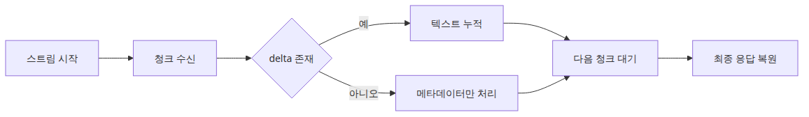

# 스트리밍 심화 — 청크 처리와 오류 복구

> LLM API 프로덕션 101 시리즈 (3/6)

예제 코드: [github.com/yeongseon-books/llm-api-production-101](https://github.com/yeongseon-books/llm-api-production-101/tree/main/ko/03-streaming-in-depth)

스트리밍은 데모에서는 화려한 효과처럼 보이지만, 운영에서는 부분 응답을 다루는 프로토콜 문제입니다. 첫 글자라도 빨리 보여 주면 사용자는 앱이 살아 있다고 느끼고, 긴 답변에서도 이탈이 줄어듭니다. 하지만 구현 난도는 단순한 `stream=True` 한 줄에서 끝나지 않습니다. 청크가 비어 있을 수 있고, 연결이 중간에 끊길 수 있으며, 마지막 메타데이터가 오기 전에 타임아웃이 날 수 있습니다. 완성된 문자열 하나를 받던 시절과는 실패 모양이 달라집니다.

앞선 글에서 스트리밍의 기본 소비 패턴을 익혔다면, 이제는 스트림을 운영 경로로 다루는 기준이 필요합니다. 사용자에게 보이는 텍스트를 점진적으로 출력하면서도, 내부적으로는 최종 답변을 복원하고, 청크 누락이나 장시간 무응답을 감지하고, 실패했을 때 어디까지가 정상 출력이었는지 판단할 수 있어야 합니다. 이 경계가 흐리면 "가끔 답변이 반쯤만 나온다" 같은 장애가 생겨도 재현과 복구가 어렵습니다.

이번 글에서는 Groq Python SDK를 기준으로 청크 처리 루프를 강화합니다. `delta.content`가 없는 청크를 건너뛰는 기본기부터, 동기 루프 바깥에서 읽기 타임아웃을 거는 패턴, 네트워크 오류가 발생했을 때 부분 결과를 보존하는 복구 흐름까지 다룹니다. 목표는 멋진 실시간 출력이 아니라, **중간에 흔들려도 무슨 일이 일어났는지 설명 가능한 스트리밍 소비자**를 만드는 것입니다.


---

## 실행 준비

예제는 Python 3.10 이상과 `groq` SDK를 가정합니다.

```bash
python3 -m venv .venv
source .venv/bin/activate
pip install groq
export GROQ_API_KEY="여기에-발급받은-키"
```

---

## 스트리밍에서는 무엇이 달라지는가

비스트리밍 호출은 결과가 한 번에 옵니다. 실패도 대체로 "성공" 또는 "예외" 둘 중 하나로 보입니다. 스트리밍은 다릅니다. 응답이 여러 이벤트로 나뉘어 오므로, 같은 요청 안에 성공과 실패가 섞일 수 있습니다. 예를 들어 아래 상황을 생각해 볼 수 있습니다.

- 첫 30개 청크는 정상 도착
- 이후 12초 동안 새 청크 없음
- 결국 연결 예외 발생

이 요청은 완전한 성공도 아니고, 완전한 실패도 아닙니다. 사용자는 이미 일부 답변을 봤고, 서버 로그에는 부분 결과가 남아 있으며, 재시도를 하더라도 같은 문장을 앞에서 다시 보여 줄지 이어서 보여 줄지 결정해야 합니다. 그래서 스트리밍 경로는 결과를 "최종 문자열" 대신 "부분 상태를 가진 세션"으로 다루는 편이 자연스럽습니다.

운영 관점에서 최소한 다음 상태는 추적해야 합니다.

- 지금까지 누적한 텍스트
- 마지막으로 유효한 텍스트 청크를 받은 시각
- 종료 신호를 정상적으로 받았는지 여부
- 예외가 났다면 어느 단계에서 났는지

---

## 가장 기본적인 청크 소비 루프

먼저 기준이 되는 최소 구현부터 보겠습니다.

```python
import os

from groq import Groq

client = Groq(api_key=os.environ["GROQ_API_KEY"])

stream = client.chat.completions.create(
    model="llama-3.1-8b-instant",
    messages=[
        {
            "role": "user",
            "content": "FastAPI의 의존성 주입을 입문자 관점에서 설명해 주세요.",
        }
    ],
    temperature=0.2,
    stream=True,
)

parts: list[str] = []

for chunk in stream:
    delta = chunk.choices[0].delta.content
    if delta:
        print(delta, end="", flush=True)
        parts.append(delta)

final_text = "".join(parts)
print("\n---")
print(final_text)
```

~~~
출력 결과
FastAPI는 Python으로 작성된 웹 프레임워크로, 의존성 주입(Dependency Injection) 기능을 제공합니다. 의존성 주입은 객체 간의 의존성을 분리하여 객체를 독립적으로 개발하고 테스트할 수 있도록 하는 디자인 패턴입니다.

### 의존성 주입이란?

의존성 주입은 객체가 다른 객체에 의존하는 것을 분리하여, 객체를 독립적으로 개발하고 테스트할 수 있도록 하는 디자인 패턴입니다. 예를 들어, 객체 A가 객체 B에 의존하는 경우, 객체 A는 객체 B의 구현을 알 필요가 없으며, 객체 B의 인터페이스만 알면 됩니다.

### FastAPI에서 의존성 주입 사용하기

FastAPI에서는 의존성 주입을 위해 `Depends` 데코레이터를 제공합니다. `Depends` 데코레이터는 함수에 의존성을 주입할 수 있도록 합니다.

#### 예시

    ```python
    from fastapi import FastAPI, Depends
    from pydantic import BaseModel
    
    app = FastAPI()
    
    class User(BaseModel):
        id: int
        name: str
    
    def get_user():
        return User(id=1, name="John")
    
    @app.get("/user")
    async def read_user(user: User = Depends(get_user)):
        return user
    ```

위 예시에서, `get_user` 함수는 `User` 객체를 반환합니다. `Depends` 데코레이터를 사용하여 `read_user` 함수에 `get_user` 함수의 결과를 주입합니다.

#### 의존성 주입의 장점

의존성 주입의 장점은 다음과 같습니다.

*   객체를 독립적으로 개발하고 테스트할 수 있습니다.
*   객체 간의 의존성을 분리하여, 객체를 쉽게 교체할 수 있습니다.
*   객체의 의존성을 관리하기가 더 쉽습니다.

#### 의존성 주입의 단점

의존성 주입의 단점은 다음과 같습니다.

*   의존성 주입을 사용할 때, 코드가 더 복잡해질 수 있습니다.
*   의존성 주입을 사용할 때, 객체 간의 의존성을 관리하기가 더 어려울 수 있습니다.

### 의존성 주입의 유형

의존성 주입에는 두 가지 유형이 있습니다.

*   **생성자 주입**: 객체를 생성할 때, 의존성을 주입합니다.
*   ** setter 주입**: 객체가 생성된 후, 의존성을 주입합니다.

FastAPI에서는 생성자 주입을 사용합니다.

### 의존성 주입의 예시

    ```python
    from fastapi import FastAPI, Depends
    ... (truncated)
~~~python
from fastapi import FastAPI
from fastapi import Depends

app = FastAPI()

def get_db():
    # DB 연결을 반환하는 함수
    return "DB 연결"

@app.get("/")
async def read_root(db: str = Depends(get_db)):
    return {"message": f"DB 연결: {db}"}
```

#### 2. Pydantic 모델 사용

Pydantic 모델을 사용하여 의존성을 주입할 수 있습니다.

```python
from fastapi import FastAPI
from pydantic import BaseModel

class DBConfig(BaseModel):
    db: str

app = FastAPI()

@app.get("/")
async def read_root(db_config: DBConfig):
    return {"message": f"DB 연결: {db_config.db}"}
```

#### 3. 의존성 주입 라이브러리 사용

FastAPI에서 의존성 주입 라이브러리를 사용할 수 있습니다. 예를 들어, `inject` 라이브러리를 사용할 수 있습니다.

```python
from fastapi import FastAPI
from inject import inject

app = FastAPI()
... (truncated)
```

이 루프가 중요한 이유는 두 경로를 동시에 만족하기 때문입니다. 사용자에게는 부분 응답을 즉시 보여 주고, 애플리케이션에는 사후 저장·검증·캐시를 위한 완성 문자열을 남깁니다. 다만 운영에서는 이 코드가 아직 부족합니다. 청크가 없는 이벤트 처리, 장시간 정지 감지, 예외 처리, 종료 상태 기록이 비어 있기 때문입니다.

---

## 청크가 비어 있는 경우를 정상으로 다루기

스트리밍을 처음 붙이면 많은 개발자가 모든 청크에 텍스트가 들어 있다고 가정합니다. 실제로는 역할 정보만 있거나 종료와 메타데이터만 가진 청크도 올 수 있습니다. 따라서 `delta.content`가 `None`이어도 예외로 취급하지 않는 편이 좋습니다.

```python
for chunk in stream:
    choice = chunk.choices[0]
    delta = choice.delta.content

    if delta is not None and delta != "":
        print(delta, end="", flush=True)
        parts.append(delta)

    if choice.finish_reason is not None:
        print(f"\nfinish_reason={choice.finish_reason}")
```

이 작은 분기가 중요한 이유는 스트리밍 로그를 덜 시끄럽게 만들기 때문입니다. 빈 청크를 매번 경고로 남기면 정상 프로토콜 이벤트가 노이즈가 됩니다. 대신 "텍스트가 없는 청크도 있다"는 사실을 소비자가 기본 전제로 받아들이는 편이 낫습니다.

---

## 타임아웃은 루프 바깥에서 강제해야 한다

스트리밍 경로에서 흔한 실수는 동기 `for chunk in stream:` 루프 안에서 청크 간 무응답을 직접 감지할 수 있다고 믿는 것입니다. 실제로는 이 루프가 다음 청크를 기다리는 동안 블로킹됩니다. 따라서 루프 본문 안의 `time.monotonic()` 비교만으로는 "8초째 아무 청크도 오지 않는다"는 상황을 스스로 감지할 수 없습니다.

청크 간 무응답을 실제로 잡으려면 루프 바깥에서 제한을 걸어야 합니다. 방법은 보통 세 가지입니다.

- HTTP 클라이언트의 read timeout을 설정합니다.
- 비동기 스트림을 `asyncio.wait_for()`로 감쌉니다.
- 별도 스레드나 태스크가 읽고, 소비자는 queue deadline을 감시합니다.

아래는 비동기 스트림에 `asyncio.wait_for()`를 적용해 청크 간 무응답을 강제하는 예제입니다.

```python
import asyncio
import os

from groq import AsyncGroq

INACTIVITY_TIMEOUT_SECONDS = 8.0

client = AsyncGroq(api_key=os.environ["GROQ_API_KEY"])

async def consume_stream(prompt: str) -> dict:
    stream = await client.chat.completions.create(
        model="llama-3.1-8b-instant",
        messages=[{"role": "user", "content": prompt}],
        stream=True,
    )

    parts: list[str] = []

    while True:
        try:
            chunk = await asyncio.wait_for(
                anext(stream),
                timeout=INACTIVITY_TIMEOUT_SECONDS,
            )
        except asyncio.TimeoutError as exc:
            return {"status": "timeout", "text": "".join(parts), "error": str(exc)}
        except StopAsyncIteration:
            return {"status": "completed", "text": "".join(parts)}

        delta = chunk.choices[0].delta.content
        if delta:
            parts.append(delta)
            print(delta, end="", flush=True)

asyncio.run(consume_stream("Python에서 context manager가 필요한 이유를 설명해 주세요."))
```

~~~
출력 결과
Python의 context manager는 try-except문과 finally문을 편리하게 사용하도록 도와주는 기능입니다. 다음의 장점으로 필요성을 느낄 수 있습니다.

### 1. 예외 처리를 편리하게 사용할 수 있다.

try-except문과 finally문은 일반적인 프로그래밍에서 자주 사용되지만, 그 코드가 길어지면 유지 보수를 어렵게 만든다. 또한, 자원을 사용하는 경우에는 finally문에서 자원을 반납해줘야 하는데, 이는 예외가 발생했을 때도 반납하도록 하기 위해 try-except문이 여러 번 나열되어야 하므로 코드의 복잡성이 높아집니다. context manager는 이 문제를 해결해 줍니다.

### 2. 자원을 사용 후 반납하는 코드를 간결화 할 수 있다.

자원을 사용한 코드를 작성해야 할 때, try-finally문이 나열되어 복잡하다. context manager는 이 문제를 해결해 줍니다.

### 3. 안전하고 깔끔한 자원 관리

context manager를 사용하면 finally 문에 자원이 release 된것을 보장할 수 있습니다. 또한 이 문이 실행되었을 때, 예외가 나더라도 자원이 release 되기 때문에 안전하게 코드를 작성할 수 있습니다.

### 4. 복잡한 리소스 관리

리소스를 사용할 떈, 리소스를 반납하는 코드가 복잡해졌다면 context manager를 사용할수 있습니다. context manager 는 리소스를 반납하는 코드를 관리해주기 때문에 코드를 더 깔끔하게 관리할수 있습니다.

### 5. 더 많은 메모리를 저장할 수 있다.

contextmanager로 메모리를 관리할 수 있습니다. 메모리를 너무 많이 사용하게 되면 메모리 문제가 발생할 수 있는데 contextmanager로 메모리 관리를 할 수 있으니 메모리를 관리할 수 있습니다.

### 예제 코드

    ```python
    import contextlib
    
    # 자원을 사용할 때 context manager를 사용하지 않을 경우
    file = open('test.txt', 'r')
    try:
        contents = file.read()
    finally:
        file.close()
    
    # 자원을 사용할 때 context manager를 사용
    with open('test.txt', 'r') as file:
        contents = file.read()
    ```

위 예제에서 context manager를 사용하지 않았을 때는 finally문이 코드의 끝 부분에 위치해야 하는 것이 보입니다. 반면에 context manager를 사용하면 with문을 사용하여 코드를 더 깔끔하게 관리할 수 있습니다.
~~~python
class ResourceContext:
    def __init__(self, name):
        self.name = name
        print(f"Opened {name}")

    def __enter__(self):
        return self

    def __exit__(self, exc_type, exc_val, exc_tb):
        print(f"Closed {self.name}")

# 사용 예시 1 : context manager를 직접 구현
with ResourceContext("file"):
    # file에 액세스합니다.
    pass

# 사용 예시 2 : 리소스 해제를 자동으로 함.
from contextlib import contextmanager

@contextmanager
def resource_context_resource(name):
    try:
        # 리소스를 사용합니다.
        print(f"Opened {name}")
        yield
    finally:
        # 리소스를 해제합니다.
        print(f"Closed {name}")

with resource_context_resource("resource"):
    # resource에 액세스합니다.
    pass

# 사용 예시 3 : with문 없이 Context Manager를 사용
with open("/etc/passwd", 'rb') as fp:
    # file이 열려 있음
    print(fp)
```

- **__enter__()**: 리소스를 사용하기 전에 호출되며, 리소스가 사용하기 위해서는 반드시 호출되는데 이 때 리소스를 사용하기 위한 설정이나 초기화 과정을 수행해야 한다.
- **__exit__()**: 리소스를 사용하고 난 후에 호출되며, 이 때 예외가 발생하지 않았다면 리소스가 사용되었다는 것을 인식하고 리소스를 반납(해제)한다. 리소스가 여러 개인 경우 여러 개의 리소스를 반납한다. 
... (truncated)
```

핵심은 총 요청 시간보다 "진행이 있는가"를 별도 신호로 보되, 그 제한은 루프 본문이 아니라 스트림 읽기 자체에 걸어야 한다는 점입니다.

동기 코드 경로를 유지하고 싶다면 클라이언트 생성 시 transport timeout을 함께 거는 편이 낫습니다. 다만 아래 `timeout=8.0`은 거친 클라이언트 제한일 뿐, 청크마다 읽기 간격을 정밀하게 감시하는 장치는 아닙니다. 그런 정밀 제어가 필요하면 앞의 비동기 래퍼처럼 read 자체를 감싸야 합니다.

```python
import os

from groq import Groq

client = Groq(
    api_key=os.environ["GROQ_API_KEY"],
    timeout=8.0,
)

stream = client.chat.completions.create(
    model="llama-3.1-8b-instant",
    messages=[{"role": "user", "content": "Python의 generator를 설명해 주세요."}],
    stream=True,
)

for chunk in stream:
    delta = chunk.choices[0].delta.content
    if delta:
        print(delta, end="", flush=True)
```

~~~
출력 결과
**Python의 Generator**
=======================

Generator는 이터레이터를 포함하는 함수입니다. 이터레이터는 다음 항목을 반환할 수 있는 시퀀스 객체를 나타냅니다. Generator 함수는 반복 가능한 객체를 생성하고, 반복자 객체를 반환합니다.

**Generator의 특징**
-------------------

1.  **반복 가능한 객체 생성**: Generator 함수는 반복 가능한 객체를 생성합니다.
2.  **이터레이터 반환**: Generator 함수는 이터레이터 객체를 반환합니다.
3.  **중간에 멈출 수 있다**: Generator는 반복 중에 멈출 수 있습니다.
4.  **다음 항목 생성**: Generator를 다시 호출하면 이전의 값을 유지하고 다음 항목을 반환합니다.

### 예제 코드

    ```python
    def generator(n):
        for i in range(n):
            yield i
    
    gen = generator(5)
    print(next(gen))  # 0
    print(next(gen))  # 1
    print(next(gen))  # 2
    print(next(gen))  # 3
    print(next(gen))  # 4
    
    # Generator에서 멈추고 다시 시작
    gen = generator(10)
    print(next(gen))  # 0
    ```

### 사용 방법

1.  Generator 함수를 정의합니다.
2.  `yield` 키워드를 사용하여 값이나 시퀀스를 반환합니다.
3.  Generator 함수를 호출하여 이터레이터를 획득합니다.
4.  `next()` 함수를 호출하여 다음 항목을 획득합니다.

### Generator Advantages

1.  **메모리 절약**: Generator는 전체 시퀀스를 메모리에 로드하지 않습니다. 대신, 필요할 때만 이터레이터가 다음 항목을 생성합니다.
2.  **연산 성능 향상**: Generator는 데이터가 많을 때 성능이 오히려 저하되는 이터레이터보다 더 빠르게 작동할 수 있습니다.

### Best Practices

1.  Generator 함수에서 `yield` 키워드를 사용하여 반복 가능한 값이나 시퀀스를 반환합니다.
2.  반복 중에 멈추고 다시시작하기 위해 Generator 함수에서 `yield from` 키워드를 사용합니다.
3.  이터레이터를 사용하는 코드에서는 `next()` 함수 대신 Generator 함수를 호출합니다.

### 예제 (2)
    ```python
    def fibonacci(n):
        a, b = 0, 1
        for _ in range(n):
            yield a
            a, b = b, a + b
    
    fib_gen = fibonacci(10)
    for item in fib_gen:
    ... (truncated)
~~~python
def 제너레이터_함수(인수):
    for 반복문:
        값 = 계산식
        yield 리턴값
```

제너레이터 함수에서는 `yield` 키워드를 사용하여 값을 반환합니다.

### 작동 방식

```python
def 제너레이터_함수():
    값1 = 값
    값2 = 값
    yield 값1
    yield 값2
```

제너레이터 함수를 호출할 때, 값1이 반환된다. 이후에, 제너레이터 함수는 해당 지점에서 멈추고, 해당하는 부분부터 다음 호출때부터 다시 계산한다.

### 예시

```python
def 제너레이터_함수():
    for i in range(5):
        yield i

for i in 제너레이터_함수():
    print(i)
```

~~~
출력 결과
0
1
2
3
4
~~~

이 프로그램은 0부터 4까지의 값을 출력합니다.

### 제너레이터의 장점

- 제너레이터는 메모리 사용량을 줄일 수 있습니다. 일반적으로 함수는 전체 데이터를 메모리에 넣고 사용하는 반면, 제너레이터는 하나의 데이터를 사용하는 것에만 집중합니다.
- 제너레이터는 효율적인 계산을 수행할 수 있습니다. 일반적으로 함수는 전체 데이터를 계산하는 반면, 제너레이터는 데이터가 생성되면 즉시 값을 반환하고, 그 다음 값을 사용합니다.

### 제너레이터의 제한점

- 제너레이터는 반드시 함수로 생성되어야 합니다.
- 제너레이터는 값을 직접 반환할 수 없습니다. 대신에, `yield` 키워드를 사용하여 값을 반환해야 합니다.

### 제너레이터 사용하기

- `next()` : 제너레이터의 다음 값을 반환합니다.
- `iter()`  : 제너레이터의 반복자(iterable)로 사용할 수 있습니다.
- `list()` : 제너레이터의 전부를 리스트에 저장합니다.
- `tuple()` : 제너레이터의 전부를 튜플에 저장합니다.
- `dict()` : 제너레이터의 전부를 사전에 저장합니다.

... (truncated)
```

---

## 부분 결과를 버리지 않는 오류 처리

스트리밍 중 예외가 나면 가장 아쉬운 실수는 지금까지 받은 텍스트를 통째로 버리는 것입니다. 사용자는 이미 절반쯤 읽었을 수도 있고, 내부적으로도 그 조각이 디버깅 단서가 됩니다. 그래서 스트림 소비자는 부분 결과를 항상 보존할 수 있게 설계하는 편이 좋습니다.

```python
import os

from groq import Groq

def stream_text(prompt: str) -> dict:
    client = Groq(api_key=os.environ["GROQ_API_KEY"])
    stream = client.chat.completions.create(
        model="llama-3.1-8b-instant",
        messages=[{"role": "user", "content": prompt}],
        temperature=0.2,
        stream=True,
    )

    parts: list[str] = []
    finish_reason = None

    try:
        for chunk in stream:
            choice = chunk.choices[0]
            delta = choice.delta.content
            if delta:
                parts.append(delta)
                print(delta, end="", flush=True)

            if choice.finish_reason is not None:
                finish_reason = choice.finish_reason

        return {
            "status": "completed",
            "text": "".join(parts),
            "finish_reason": finish_reason,
            "saw_finish_reason": finish_reason is not None,
        }
    except Exception as exc:
        return {
            "status": "failed",
            "text": "".join(parts),
            "error": str(exc),
            "finish_reason": finish_reason,
            "saw_finish_reason": finish_reason is not None,
        }
```

이 함수는 스트리밍을 결과 객체로 바꿉니다. 성공이면 `completed`, 그 외 예외는 `failed`로 표기합니다. timeout은 앞 절에서처럼 클라이언트나 비동기 래퍼가 강제하고, 이 함수는 그 결과를 일반 예외 경로로 받아 상위 레이어에서 분류하도록 두는 편이 구현이 단순합니다. 또한 종료 신호를 실제로 봤는지 함께 반환하므로, 상위 레이어는 "부분 응답은 있었지만 정상 종료는 아니었다"는 상태를 분리해서 다룰 수 있습니다.

---

## 청크 누락을 의심해야 하는 신호

네트워크 프로토콜 차원에서 청크 하나가 조용히 사라졌는지 완벽히 판정하기는 어렵습니다. 대신 애플리케이션은 이상 신호를 감지할 수 있습니다.

- 문장이 비정상적으로 잘린 채 종료됨
- 코드 블록이 닫히지 않음
- `finish_reason` 없이 연결 종료
- 사용량 메타데이터가 기대되는데 끝 청크가 없음

이 신호를 발견하면 "모델이 원래 이렇게 답했다"고 넘기지 말고, **부분 응답 가능성**으로 분류하는 편이 낫습니다. 예를 들어 Markdown 응답이라면 백틱 개수나 닫히지 않은 괄호를 가볍게 검사할 수 있고, JSON 스트리밍 경로라면 마지막에 `json.loads()`가 되는지 확인할 수 있습니다. 중요한 점은 이 검사가 품질 평가가 아니라 **전송 완전성 확인**이라는 사실입니다.

---

## 재시도는 어디서부터 할 것인가

스트리밍 실패 뒤 재시도는 단순하지 않습니다. 앞부분을 이미 사용자에게 보여 줬다면 전체를 다시 시작할지, 부분 응답 뒤에 "연결이 끊겨 다시 시도합니다"를 붙일지 판단이 필요합니다. 일반적으로는 두 경로를 구분하는 편이 좋습니다.

첫째, **내부 파이프라인**에서는 전체 재시도가 안전할 수 있습니다. 사용자에게 아직 아무것도 전달하지 않았다면 새 요청을 만들어 다시 받으면 됩니다.

둘째, **대화형 UI**에서는 부분 응답 보존이 낫습니다. 사용자가 이미 읽기 시작했기 때문입니다. 이 경우에는 부분 결과를 화면에 남기고, 실패 사실을 명시한 뒤 새 응답을 별도 구간으로 이어 붙이는 편이 혼란이 적습니다.

스트리밍을 멱등한 API처럼 다루기 어렵다는 점을 여기서 기억해야 합니다. 이미 흘려보낸 토큰은 회수할 수 없습니다. 또한 단순 동기 이터레이터만으로는 청크 간 정지를 직접 감시할 수 없으므로, 재시도 정책을 세울 때는 클라이언트 timeout 설정이나 비동기 래퍼를 함께 설계해야 합니다.

아래는 부분 결과를 사용자에게 남긴 채 호출자가 복구 정책을 결정하는 간단한 예제입니다.

```python
result = stream_text("FastAPI와 Flask의 차이를 설명해 주세요.")

print("partial_text=")
print(result["text"])

if result["status"] == "completed":
    print("stream completed normally")
else:
    print("stream interrupted")
    print("show retry button to the user")
```

---

## 마무리

이번 글에서는 스트리밍을 단순한 UI 효과가 아니라 부분 상태를 가진 응답 프로토콜로 다뤘습니다. 핵심은 네 가지입니다. 텍스트가 없는 청크를 정상으로 처리할 것, 읽기 타임아웃은 루프 바깥에서 강제할 것, 예외가 나도 누적 텍스트를 버리지 않을 것, 종료 신호와 응답 완전성을 별도로 확인할 것입니다.

앞선 글에서 구조화 출력과 툴 호출로 계약을 단단하게 만들었다면, 스트리밍은 그 계약을 시간축 위로 펼친 형태입니다. 다음 주제에서는 이 시간축에서 발생하는 비용과 지연을 줄이기 위해, 동일하거나 유사한 요청을 다시 계산하지 않도록 캐시 계층을 어디에 두어야 하는지 살펴보겠습니다.

<!-- toc:begin -->
## 시리즈 목차

- [구조화 출력 — JSON 모드와 응답 스키마](./01-structured-output.md)
- [툴 호출 — 함수를 모델에 연결하기](./02-tool-calling.md)
- **스트리밍 심화 — 청크 처리와 오류 복구 (현재 글)**
- 캐싱 전략 — 비용과 지연 시간 줄이기 (예정)
- 재시도와 오류 처리 — 안정적인 API 호출 만들기 (예정)
- 속도 제한 관리 — Rate Limit 대응 패턴 (예정)

<!-- toc:end -->

---

## 참고 자료

- <https://console.groq.com/docs/text-chat>
- <https://developer.mozilla.org/en-US/docs/Web/API/Server-sent_events>

Tags: LLM, OpenAI, Streaming, Python
