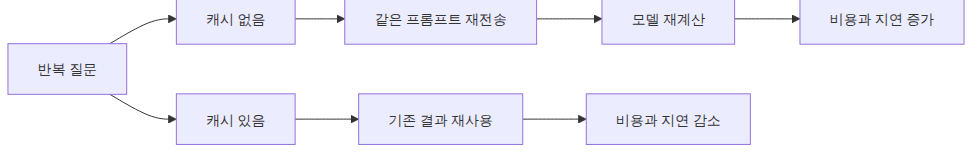
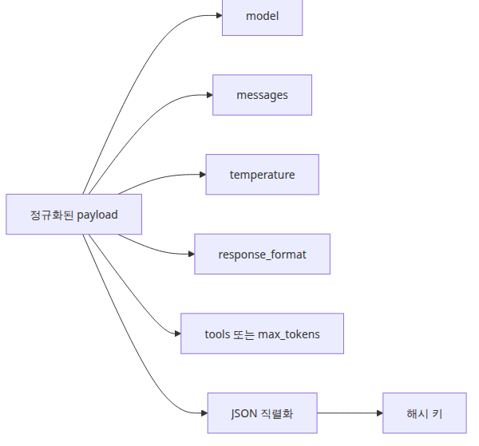
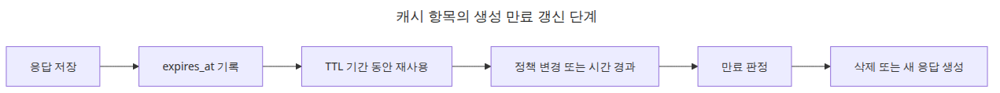
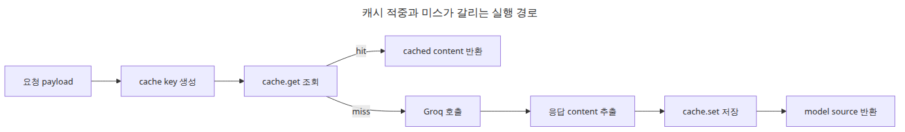
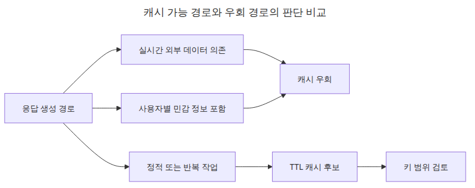

# 캐싱 전략 — 비용과 지연 시간 줄이기

LLM 기능이 실제 트래픽을 받기 시작하면 비용 문제는 생각보다 빨리 눈에 들어옵니다. 같은 질문이 반복되고, 같은 시스템 프롬프트가 다시 전송되고, 같은 컨텍스트가 다시 직렬화되고, 결국 같은 답을 또 생성하는 일이 많기 때문입니다. 이때 많은 팀이 먼저 모델 교체나 프롬프트 축소를 고민하지만, 더 앞단에 있는 해법이 있습니다. 이미 계산한 일을 다시 하지 않는 것입니다.

캐시는 새로운 개념이 아닙니다. 웹 서버, 데이터베이스, CDN, 검색 시스템이 모두 오래전부터 풀어 온 문제입니다. 다만 LLM 경로에서는 “무엇을 같은 요청으로 볼 것인가”가 더 까다롭습니다. 겉으로 보이는 사용자 질문이 같아도 모델, 시스템 프롬프트, temperature, 구조화 출력 옵션이 다르면 사실상 다른 작업일 수 있습니다.

그래서 LLM 캐시는 단순히 응답 문자열을 저장하는 상자가 아닙니다. 어떤 입력 조합이 동일한 작업을 의미하는지 정의하는 계약입니다. 이 계약이 느슨하면 잘못된 재사용이 생기고, 너무 엄격하면 적중률이 떨어집니다. 결국 캐시 설계의 핵심은 저장 방식보다 동일성의 정의에 있습니다.

이번 글에서는 가장 작은 운영형 캐시부터 출발하겠습니다. 요청 payload를 정규화해 해시 키를 만들고, TTL 기반 인메모리 캐시를 붙여 비용과 지연 시간을 줄이는 패턴을 정리합니다.

이 글은 LLM API Production 101 시리즈의 네 번째 글입니다.

여기서는 요청 해시와 TTL을 기반으로 같은 작업의 재계산을 피하는 캐싱 전략을 살펴보겠습니다.

## 이 글에서 다룰 문제

- LLM 응답 캐시는 일반 HTTP 응답 캐시와 무엇이 다를까요?
- 사용자 질문 말고 어떤 입력까지 캐시 키에 포함해야 할까요?
- 요청 payload를 안정적인 해시 키로 만드는 방법은 무엇일까요?
- TTL은 왜 필수이고, 어떤 응답은 왜 캐시하지 말아야 할까요?
- 프롬프트 정책이나 모델 버전이 바뀌었을 때 캐시 무효화는 어떻게 설계해야 할까요?

## 왜 이 글이 중요한가

캐시는 비용 절감 수단이면서 동시에 정확성 경계입니다. 같은 작업을 다시 계산하지 않으면 지연 시간과 토큰 사용량을 동시에 줄일 수 있습니다. 하지만 잘못된 캐시 키는 다른 작업에 대해 이전 결과를 재사용하게 만들고, 그 순간 캐시는 성능 최적화가 아니라 품질 저하 장치가 됩니다.

LLM 경로에서는 특히 시스템 프롬프트와 생성 옵션이 중요합니다. 사용자가 같은 질문을 했더라도 요약기 프롬프트와 분류기 프롬프트는 같은 작업이 아닙니다. temperature가 0인지 0.8인지도 결과 의미에 영향을 줄 수 있습니다. 그래서 캐시는 “보이는 질문”이 아니라 “실행 계약 전체”를 기준으로 설계해야 합니다.

또한 캐시는 만료와 무효화까지 포함해 생각해야 합니다. 오래된 응답을 영원히 재사용하면 비용은 줄어들지 몰라도 정확성과 신뢰가 무너집니다. TTL과 버전 필드는 캐시를 정직하게 유지하는 최소 장치입니다.

## 캐싱을 이해하는 가장 좋은 방법: 프롬프트 출력 저장소가 아니라 같은 요청을 다시 계산하지 않는 계약으로 보는 것입니다

LLM 캐시를 이해할 때 가장 먼저 바꿔야 할 관점은 “질문과 답변을 저장한다”는 생각입니다. 실제로 저장하는 것은 질문 문장 하나가 아니라, 모델 호출을 정의하는 전체 요청 payload에 가깝습니다. 모델명, 메시지 목록, temperature, 응답 형식, 필요하다면 도구 정의까지 함께 봐야 비로소 같은 작업인지 판단할 수 있습니다.

이 관점은 구현을 단순하게 만듭니다. 사람이 읽을 수 있는 규칙을 여기저기 흩뿌리는 대신, 정규화된 요청 payload 전체를 canonical JSON으로 만들고 그 문자열을 해시하면 됩니다. 그러면 캐시 키는 요청 계약의 축약본이 됩니다.

> LLM 캐시의 핵심은 응답을 저장하는 기술이 아니라, 어떤 요청이 정말 같은 작업인지 엄격하게 정의하는 일입니다.

## 핵심 개념


*캐싱 전략: 비용과 지연 시간 줄이기*

### 왜 LLM 호출 앞에 캐시가 필요한가



*반복 요청에서 비용이 다시 쌓이는 흐름*

운영 로그를 보면 반복은 생각보다 많습니다. FAQ형 챗봇, 비슷한 문장 교정을 반복하는 내부 도구, 같은 리포트를 여러 사용자가 보는 대시보드, 같은 질문을 조금씩 바꿔 재질문하는 대화 세션이 모두 그렇습니다. 이런 경로에서는 매번 전체 호출 비용을 다시 내는 것이 비효율적입니다.

문제는 “같은 요청”을 눈으로 판단하면 안 된다는 점입니다. 사람이 보기에는 같아 보여도 모델, 시스템 프롬프트, 생성 옵션이 달라지면 사실상 다른 작업입니다. 캐시는 바로 이 경계를 명확히 해 줘야 합니다.

### 캐시 키에는 무엇이 들어가야 하는가



*캐시 키를 이루는 요청 구성 요소 구조*

가장 흔한 실수는 사용자 질문 문자열만 키로 쓰는 것입니다.

```python
cache[user_prompt] = response_text
```

이 방식은 너무 느슨합니다. 같은 사용자 질문이라도 모델이 다를 수 있고, 시스템 프롬프트가 다를 수 있으며, `temperature=0`인지 `temperature=0.8`인지도 다를 수 있습니다. JSON 응답을 기대하는 요청과 자유 텍스트를 기대하는 요청도 같은 작업이 아닙니다.

안전한 기본값은 `model`, `messages`, `temperature`, `response_format`, 그리고 필요할 때 `tools`, `max_tokens` 같은 생성 옵션까지 포함하는 것입니다. 즉, 캐시 키는 사람이 읽는 질문이 아니라 정규화된 요청 구조를 대표해야 합니다.

### 요청 해시 만들기

아래 함수는 요청 payload를 canonical JSON으로 만든 뒤 SHA-256 해시로 바꿉니다.

```python
import hashlib
import json
from typing import Any

def build_cache_key(payload: dict[str, Any]) -> str:
    canonical = json.dumps(
        payload,
        ensure_ascii=False,
        sort_keys=True,
        separators=(",", ":"),
    )
    return hashlib.sha256(canonical.encode("utf-8")).hexdigest()

request_payload = {
    "model": "llama-3.1-8b-instant",
    "messages": [
        {"role": "system", "content": "You are a concise summarizer."},
        {"role": "user", "content": "Summarize the difference between FastAPI and Flask in three sentences."},
    ],
    "temperature": 0,
}

print(build_cache_key(request_payload))
```

<!-- injected-output:start -->
**실행 결과**

    6b8029d33b678c483174d55c429edd51a4ab075fab3943a4069fbc89476a6d8f

<!-- injected-output:end -->

`sort_keys=True`는 딕셔너리 키 순서 차이로 같은 요청이 다른 키가 되는 일을 막아 줍니다. `separators`는 불필요한 공백 차이를 없앱니다. 결국 이 해시는 요청 계약 전체를 고정 길이 키로 압축한 결과입니다.

### TTL이 왜 필요한가



*캐시 항목의 생성 만료 갱신 단계*

해시 키만 있으면 캐시는 만들 수 있습니다. 하지만 TTL이 없으면 응답이 영원히 남습니다. 모델 버전이 바뀌거나 프롬프트 정책이 바뀌어도 예전 답을 계속 재사용할 수 있고, 메모리도 계속 증가합니다. TTL은 캐시가 진실의 원본이 아니라 일정 시간 동안만 유효한 복사본이라는 사실을 코드로 표현합니다.

정적 FAQ는 긴 TTL이 가능하지만, 실시간성이 높은 요약은 더 짧아야 합니다. 외부 상태에 의존하는 툴 호출 결과는 TTL을 아주 짧게 두거나 아예 캐시하지 않는 편이 낫습니다. 정답 숫자보다 중요한 것은 TTL을 명시적으로 설계한다는 습관입니다.

### 인메모리 TTL 캐시 구현

단일 프로세스 기준의 최소 구현은 아래와 같습니다.

```python
import time
from dataclasses import dataclass
from typing import Any

@dataclass
class CacheEntry:
    value: Any
    expires_at: float

class TTLCache:
    def __init__(self) -> None:
        self._store: dict[str, CacheEntry] = {}

    def get(self, key: str) -> Any | None:
        entry = self._store.get(key)
        if entry is None:
            return None

        if time.time() >= entry.expires_at:
            del self._store[key]
            return None

        return entry.value

    def set(self, key: str, value: Any, ttl_seconds: int) -> None:
        self._store[key] = CacheEntry(
            value=value,
            expires_at=time.time() + ttl_seconds,
        )

    def delete(self, key: str) -> None:
        self._store.pop(key, None)
```

이 구현은 lazy eviction을 사용합니다. 읽을 때 만료 여부를 확인하고 지난 항목을 제거합니다. 단순하지만 핵심 동작을 이해하기에는 충분합니다. 다만 이 캐시는 현재 프로세스 안에서만 공유되므로, 여러 워커나 여러 서버가 있는 환경에서는 서비스 전체 공유 캐시가 아닙니다.

### Groq 호출 앞에 캐시 붙이기



*캐시 적중과 미스가 갈리는 실행 경로*

이제 실제 호출 앞에 캐시를 둡니다.

```python
import hashlib
import json
import os
import time
from dataclasses import dataclass
from typing import Any

from groq import Groq

@dataclass
class CacheEntry:
    value: Any
    expires_at: float

class TTLCache:
    def __init__(self) -> None:
        self._store: dict[str, CacheEntry] = {}

    def get(self, key: str) -> Any | None:
        entry = self._store.get(key)
        if entry is None:
            return None
        if time.time() >= entry.expires_at:
            del self._store[key]
            return None
        return entry.value

    def set(self, key: str, value: Any, ttl_seconds: int) -> None:
        self._store[key] = CacheEntry(value=value, expires_at=time.time() + ttl_seconds)

def build_cache_key(payload: dict[str, Any]) -> str:
    canonical = json.dumps(
        payload,
        ensure_ascii=False,
        sort_keys=True,
        separators=(",", ":"),
    )
    return hashlib.sha256(canonical.encode("utf-8")).hexdigest()

cache = TTLCache()
client = Groq(api_key=os.environ["GROQ_API_KEY"])

def cached_completion(payload: dict[str, Any], ttl_seconds: int = 300) -> dict[str, Any]:
    key = build_cache_key(payload)
    cached = cache.get(key)
    if cached is not None:
        return {"source": "cache", "content": cached}

    completion = client.chat.completions.create(**payload)
    content = completion.choices[0].message.content
    cache.set(key, content, ttl_seconds=ttl_seconds)
    return {"source": "model", "content": content}

payload = {
    "model": "llama-3.1-8b-instant",
    "messages": [
        {"role": "system", "content": "You are a concise Python tutor."},
        {"role": "user", "content": "Explain Python dataclasses in three sentences."},
    ],
    "temperature": 0,
}

print(cached_completion(payload))
print(cached_completion(payload))
```

<!-- injected-output:start -->
**실행 결과**

    {'source': 'model', 'content': 'Python dataclasses are a feature introduced in Python 3.7 that allows you to create classes with minimal boilerplate code, making it easier to define simple data structures. They automatically generate special methods like `__init__`, `__repr__`, and `__eq__` for you, reducing the amount of code you need to write. Dataclasses can be used to create immutable or mutable data structures, and they support features like type hints and fields with default values.'}
    {'source': 'cache', 'content': 'Python dataclasses are a feature introduced in Python 3.7 that allows you to create classes with minimal boilerplate code, making it easier to define simple data structures. They automatically generate special methods like `__init__`, `__repr__`, and `__eq__` for you, reducing the amount of code you need to write. Dataclasses can be used to create immutable or mutable data structures, and they support features like type hints and fields with default values.'}

<!-- injected-output:end -->

첫 번째 요청은 모델로 가고, 두 번째는 같은 payload이므로 캐시를 적중합니다. 여기서 `source`를 함께 반환하는 이유는 캐시 동작을 로그와 메트릭에서 관측 가능하게 만들기 위해서입니다.

### 어떤 경로는 캐시하지 말아야 한다



*캐시 가능 경로와 우회 경로의 판단 비교*

모든 응답이 캐시 대상은 아닙니다. 빠르게 바뀌는 외부 데이터에 의존하는 응답, 사용자별 권한이 다른 응답, 민감한 개인정보를 포함하는 응답, 높은 temperature에서 다양성이 중요한 생성 작업은 특히 조심해야 합니다. 같은 질문이라도 정답이 실제로 달라질 수 있기 때문입니다.

무효화는 TTL만으로 끝나지 않습니다. 프롬프트 정책, 모델, 출력 형식, 비즈니스 규칙이 바뀌었다면 캐시 버전도 함께 바꾸는 편이 안전합니다.

```python
messages = [
    {"role": "system", "content": "You are a concise summarizer."},
    {"role": "user", "content": "Summarize the FastAPI and Flask difference."},
]

payload = {
    "cache_version": "v2",
    "model": "llama-3.1-8b-instant",
    "messages": messages,
    "temperature": 0,
}
```

이 패턴은 오래된 항목이 자연 만료되기를 기다리는 것보다 훨씬 예측 가능합니다. 새 계약에는 새 버전을 쓰면 됩니다.

## 흔히 헷갈리는 지점

- 사용자 질문만 같으면 같은 캐시 키로 봐도 된다고 생각하기 쉽지만 대부분은 너무 느슨합니다.
- TTL은 성능 옵션이 아니라 정확성 유지 장치입니다.
- 인메모리 캐시는 단일 프로세스 예제일 뿐 서비스 전체 공유 캐시가 아닙니다.
- 외부 상태나 사용자 권한이 반영된 응답은 캐시 키에 범위를 넣거나 아예 캐시하지 않아야 합니다.
- 캐시 적중률만 높이면 된다고 생각하면 오래된 응답 재사용이라는 더 큰 문제를 놓치기 쉽습니다.

## 운영 체크리스트

- [ ] 모델, 메시지, temperature, 응답 형식을 캐시 키에 포함했다
- [ ] canonical JSON 직렬화와 해시로 안정적인 요청 키를 만들었다
- [ ] TTL을 workload별로 명시하고 기본값을 코드에 고정했다
- [ ] 사용자별·민감 정보 응답의 캐시 정책을 별도로 정했다
- [ ] 모델/프롬프트 변경 시 `cache_version`으로 명시적 무효화를 지원했다

## 정리

이번 글에서는 요청 해시와 TTL을 기반으로 한 가장 작은 LLM 캐시를 만들었습니다. 핵심은 응답 문자열을 저장하는 행위보다, 어떤 요청이 정말 같은 작업인지 정확하게 정의하는 데 있습니다. 이 경계가 명확해야 캐시는 비용과 지연 시간을 줄이면서도 품질을 해치지 않습니다.

또한 캐시는 유효 기간과 무효화까지 포함해 생각해야 합니다. TTL과 버전 필드가 없으면 캐시는 금방 오래된 응답 저장소가 됩니다. 반대로 이 두 장치가 있으면 캐시는 단순한 최적화가 아니라 운영 계약의 일부가 됩니다.

다음 글에서는 반복 비용이 아니라 실패 경로를 다룹니다. 캐시로 해결되지 않는 일시적 장애를 언제, 무엇만, 얼마나 재시도해야 안정성이 올라가는지 살펴보겠습니다.

<!-- toc:begin -->
## 시리즈 목차

- [구조화 출력 — JSON 모드와 응답 스키마](./01-structured-output.md)
- [툴 호출 — 함수를 모델에 연결하기](./02-tool-calling.md)
- [스트리밍 심화 — 청크 처리와 오류 복구](./03-streaming-in-depth.md)
- **캐싱 전략 — 비용과 지연 시간 줄이기 (현재 글)**
- 재시도와 오류 처리 — 안정적인 API 호출 만들기 (예정)
- 속도 제한 관리 — Rate Limit 대응 패턴 (예정)

<!-- toc:end -->

## 참고 자료

### 공식 문서
- <https://console.groq.com/docs/text-chat>
- <https://docs.python.org/3/library/hashlib.html>

### 관련 시리즈
- [스트리밍 심화 — 청크 처리와 오류 복구](./03-streaming-in-depth.md)
- [재시도와 오류 처리 — 안정적인 API 호출 만들기](./05-retry-and-error-handling.md)

Tags: LLM, OpenAI, Streaming, Python
