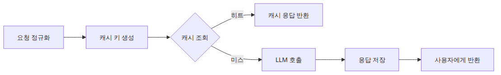

# 캐싱 전략 — 비용과 지연 시간 줄이기

> LLM API 프로덕션 101 시리즈 (4/6)

예제 코드: [github.com/yeongseon-books/llm-api-production-101](https://github.com/yeongseon-books/llm-api-production-101/tree/main/ko/04-caching-strategies)

LLM API를 운영 환경에 붙이면 성능 문제보다 먼저 비용 문제가 눈에 들어오는 경우가 많습니다. 같은 질문이 반복되는데도 매번 모델을 다시 부르고, 같은 시스템 프롬프트와 같은 컨텍스트를 매 요청마다 토큰으로 재전송하면 응답 시간과 사용량이 같이 커집니다. 이때 많은 팀이 모델 교체나 프롬프트 축소부터 고민하지만, 실제로는 더 싼 해법이 앞에 있는 경우가 많습니다. 이미 계산한 답을 다시 쓰는 일, 즉 캐싱입니다.

캐시는 새 개념이 아닙니다. 웹 서버, DB, CDN, 검색 시스템은 모두 오래전부터 같은 문제를 풀어 왔습니다. 다만 LLM 경로에서는 캐시 키를 무엇으로 잡을지, 어떤 조건에서 재사용이 안전한지, TTL을 얼마나 둘지 판단이 더 까다롭습니다. 일반 API에서는 요청 URL과 파라미터가 같으면 같은 응답을 기대하기 쉽지만, 생성형 모델은 temperature, system 메시지, 컨텍스트 조각, 모델 버전이 조금만 달라도 결과가 바뀔 수 있기 때문입니다. 그래서 LLM 캐시는 단순히 딕셔너리 하나를 두는 문제가 아니라, **어떤 입력 조합을 동일한 작업으로 간주할 것인가**를 먼저 정하는 문제입니다.

이번 글에서는 요청 해시 기반 인메모리 캐시와 TTL 패턴을 중심으로, 가장 작은 운영형 캐시를 만드는 방법을 정리합니다. 목표는 Redis나 분산 캐시까지 한 번에 다루는 것이 아닙니다. 우선 단일 프로세스 기준으로 캐시가 어떤 구조를 가져야 하고, 어떤 입력을 키에 포함해야 하며, 언제 캐시를 버려야 하는지 정확히 이해하는 데 있습니다. 이 기준이 잡히면 나중에 프로세스 간 공유 캐시로 옮기는 일도 어렵지 않습니다.

핵심은 간단합니다. **LLM 캐시는 프롬프트 결과를 저장하는 상자가 아니라, 같은 작업을 다시 계산하지 않기 위한 계약입니다.**


---

## 실행 준비

예제는 Python 3.10 이상과 `groq` SDK를 가정합니다.

```bash
python3 -m venv .venv
source .venv/bin/activate
pip install groq
export GROQ_API_KEY="여기에-발급받은-키"
```

---

## 왜 LLM 호출 앞에 캐시가 필요한가

운영 로그를 보면 LLM 요청은 생각보다 반복적입니다. 특히 아래 패턴에서 그렇습니다.

- 자주 묻는 질문 챗봇
- 같은 템플릿으로 문장 교정이나 요약을 반복하는 내부 도구
- 대시보드에서 같은 리포트를 여러 사용자가 조회하는 경로
- 한 세션 안에서 같은 문맥을 조금씩 바꿔 여러 번 다시 묻는 인터랙션

이런 요청은 결과를 다시 계산해도 큰 이득이 없습니다. 응답 시간이 줄지 않고, 토큰 비용만 다시 나갑니다. 캐시가 없으면 시스템은 이미 계산한 출력을 매번 새로 만드는 셈입니다.

여기서 중요한 점은 "같은 질문"을 사람이 읽는 문장 수준에서 판단하면 안 된다는 것입니다. 실제 캐시 키는 시스템 메시지, 사용자 메시지, temperature, 모델명, 선택된 옵션까지 포함한 **정규화된 요청 구조**를 기준으로 만들어야 합니다. 사용자 문장만 같다고 같은 작업이 아닐 수 있기 때문입니다.

---

## 무엇을 캐시 키에 넣어야 하는가

가장 흔한 실수는 사용자 질문 문자열만 키로 쓰는 것입니다.

```python
cache[user_prompt] = response_text
```

이 방식은 간단하지만 금방 잘못된 재사용을 만듭니다. 예를 들어 아래 두 요청은 사용자 질문이 같아도 다른 작업입니다.

- 모델이 `llama-3.1-8b-instant`인지, 다른 모델인지
- system 메시지가 요약기인지 번역기인지
- temperature가 0인지 0.8인지
- 구조화 출력인지 자유 텍스트인지

따라서 캐시 키는 적어도 다음 정보를 포함하는 편이 안전합니다.

- `model`
- `messages`
- `temperature`
- `response_format`
- 필요한 경우 `tools`, `max_tokens`, 기타 생성 옵션

실전에서는 이 입력을 정규화한 뒤 JSON 문자열로 직렬화하고, 그 결과를 해시하는 방식이 가장 다루기 쉽습니다. 사람이 읽기엔 길지만, 캐시 키로는 짧고 안정적입니다.

---

## 요청 해시를 만드는 가장 작은 함수

아래 예제는 캐시에 사용할 요청 해시를 만듭니다. 핵심은 정렬된 JSON 직렬화와 SHA-256 해시입니다.

```python
import hashlib
import json
from typing import Any

def build_cache_key(payload: dict[str, Any]) -> str:
    canonical = json.dumps(
        payload,
        ensure_ascii=False,
        sort_keys=True,
        separators=(",", ":"),
    )
    return hashlib.sha256(canonical.encode("utf-8")).hexdigest()

request_payload = {
    "model": "llama-3.1-8b-instant",
    "messages": [
        {"role": "system", "content": "당신은 간결한 요약기입니다."},
        {"role": "user", "content": "FastAPI와 Flask의 차이를 세 문장으로 정리해 주세요."},
    ],
    "temperature": 0,
}

print(build_cache_key(request_payload))
```

~~~
출력 결과
d825e2316b05debea2c4ff2bdaa3cfdcab11ad95069ff965050c3d362dfe17d1
~~~

이 함수가 하는 일은 단순합니다. 같은 의미의 payload가 같은 문자열이 되도록 JSON을 정규화하고, 그 결과를 고정 길이 해시로 바꿉니다. `sort_keys=True`를 빼면 딕셔너리 키 순서 차이 때문에 같은 요청이 다른 키를 가질 수 있습니다. `separators`를 고정하는 이유는 공백 차이까지 제거하기 위해서입니다.

---

## TTL이 필요한 이유

해시 키만 있으면 캐시는 만들 수 있지만, TTL이 없으면 곧 다른 문제가 생깁니다. 오래된 응답이 영원히 남고, 모델 버전이나 프롬프트 정책이 바뀌어도 예전 답을 계속 재사용할 수 있기 때문입니다. 메모리도 계속 불어납니다.

TTL은 캐시가 진실의 원본이 아니라 **일정 시간 동안만 재사용 가능한 복사본**이라는 사실을 코드로 표현합니다. LLM 경로에서는 특히 아래 기준으로 TTL을 생각하면 좋습니다.

- 정적 FAQ: 길게
- 내부 초안 생성: 중간
- 실시간성 높은 데이터 요약: 짧게
- 툴 호출/외부 데이터 의존 응답: 매우 짧게 또는 캐시 제외

TTL은 정답이 하나인 값이 아니라 서비스 성격의 함수입니다. 중요한 것은 TTL을 코드에서 명시적으로 다룬다는 점입니다.

---

## 인메모리 TTL 캐시 구현

아래 코드는 단일 프로세스용 인메모리 TTL 캐시입니다. `expires_at`을 함께 저장하고, 조회 시 만료 여부를 검사합니다.

```python
import time
from dataclasses import dataclass
from typing import Any

@dataclass
class CacheEntry:
    value: Any
    expires_at: float

class TTLCache:
    def __init__(self) -> None:
        self._store: dict[str, CacheEntry] = {}

    def get(self, key: str) -> Any | None:
        entry = self._store.get(key)
        if entry is None:
            return None

        if time.time() >= entry.expires_at:
            del self._store[key]
            return None

        return entry.value

    def set(self, key: str, value: Any, ttl_seconds: int) -> None:
        self._store[key] = CacheEntry(
            value=value,
            expires_at=time.time() + ttl_seconds,
        )

    def delete(self, key: str) -> None:
        self._store.pop(key, None)
```

이 구현은 단순하지만 글의 목적에는 충분합니다. 조회 시 만료를 확인하는 lazy eviction 패턴을 쓰고 있으므로, 별도 정리 스레드가 없어도 기본 동작은 맞습니다. 메모리 점유를 더 엄격히 관리하려면 주기적 정리나 최대 크기 제한까지 붙여야 하지만, 핵심 캐시 동작을 이해하는 데는 이 정도면 충분합니다. 다만 이 캐시는 현재 프로세스 안에서만 보입니다. Uvicorn이나 Gunicorn 워커가 여러 개라면 각 워커가 자기 메모리에 따로 캐시를 가지므로, 이 예제를 서비스 전체 공유 캐시로 보면 안 됩니다.

---

## Groq 호출 앞에 캐시를 붙이기

이제 실제 LLM 호출 경로에 캐시를 넣어 보겠습니다.

```python
import hashlib
import json
import os
import time
from dataclasses import dataclass
from typing import Any

from groq import Groq

@dataclass
class CacheEntry:
    value: Any
    expires_at: float

class TTLCache:
    def __init__(self) -> None:
        self._store: dict[str, CacheEntry] = {}

    def get(self, key: str) -> Any | None:
        entry = self._store.get(key)
        if entry is None:
            return None
        if time.time() >= entry.expires_at:
            del self._store[key]
            return None
        return entry.value

    def set(self, key: str, value: Any, ttl_seconds: int) -> None:
        self._store[key] = CacheEntry(value=value, expires_at=time.time() + ttl_seconds)

def build_cache_key(payload: dict[str, Any]) -> str:
    canonical = json.dumps(
        payload,
        ensure_ascii=False,
        sort_keys=True,
        separators=(",", ":"),
    )
    return hashlib.sha256(canonical.encode("utf-8")).hexdigest()

cache = TTLCache()
client = Groq(api_key=os.environ["GROQ_API_KEY"])

def cached_completion(payload: dict[str, Any], ttl_seconds: int = 300) -> dict[str, Any]:
    key = build_cache_key(payload)
    cached = cache.get(key)
    if cached is not None:
        return {"source": "cache", "content": cached}

    completion = client.chat.completions.create(**payload)
    content = completion.choices[0].message.content
    cache.set(key, content, ttl_seconds=ttl_seconds)
    return {"source": "model", "content": content}

payload = {
    "model": "llama-3.1-8b-instant",
    "messages": [
        {"role": "system", "content": "당신은 간결한 Python 튜터입니다."},
        {"role": "user", "content": "Python의 dataclass를 세 문장으로 설명해 주세요."},
    ],
    "temperature": 0,
}

print(cached_completion(payload))
print(cached_completion(payload))
```

첫 번째 호출은 모델로 가고, 두 번째 호출은 같은 payload이므로 캐시에서 바로 반환됩니다. 응답 본문만 저장했지만, 필요하다면 사용량 정보나 모델명도 같이 저장할 수 있습니다. 중요한 것은 캐시 적중 여부를 `source` 같은 필드로 명시해 두는 습관입니다. 운영에서 hit ratio를 보려면 이 정보가 필요합니다.

---

## 어떤 응답은 캐시하지 말아야 한다

캐시는 유용하지만 모든 경로에 자동으로 붙이면 위험합니다. 특히 아래 경우는 주의해야 합니다.

- 실시간 외부 데이터에 의존하는 응답
- 사용자별 권한 차이가 큰 응답
- 민감한 개인정보가 본문에 포함된 응답
- 높은 temperature로 다양성이 중요한 생성 작업

예를 들어 툴 호출로 주문 상태를 조회한 뒤 만든 답변은 짧은 TTL이라도 조심해야 합니다. 같은 질문이라도 주문 상태가 몇 분 뒤 바뀔 수 있기 때문입니다. 또한 사용자별 컨텍스트가 섞인 응답은 키 설계를 잘못하면 다른 사용자의 결과를 잘못 재사용할 수 있습니다. 이 지점에서 캐시는 성능 도구이면서 동시에 보안 경계가 됩니다. 실무 규칙으로는 한 줄이면 충분합니다. 응답이 사용자별 또는 테넌트별로 달라진다면 그 식별자를 캐시 키에 포함하거나, 아예 캐시를 우회합니다.

---

## TTL 선택과 무효화 전략

TTL만 정하면 끝나는 것도 아닙니다. 아래처럼 캐시를 명시적으로 버리는 경로도 종종 필요합니다.

- 시스템 프롬프트 변경
- 모델 변경
- 출력 포맷 변경
- 비즈니스 룰 변경

가장 쉬운 방법은 캐시 키 payload에 버전 문자열을 포함하는 것입니다.

```python
messages = [
    {"role": "system", "content": "당신은 간결한 요약기입니다."},
    {"role": "user", "content": "FastAPI와 Flask 차이를 정리해 주세요."},
]

payload = {
    "cache_version": "v2",
    "model": "llama-3.1-8b-instant",
    "messages": messages,
    "temperature": 0,
}
```

이렇게 하면 프롬프트 정책이나 후처리 규약이 바뀔 때 `cache_version`만 올려도 기존 캐시와 새 캐시가 자연스럽게 분리됩니다. TTL만 믿고 오래된 응답이 서서히 빠지길 기다리는 것보다 훨씬 명확합니다.

---

## 마무리

이번 글에서는 요청 해시 기반 인메모리 캐시와 TTL 패턴을 기준으로, LLM 호출 앞단에 둘 수 있는 가장 작은 캐시 계층을 만들었습니다. 핵심은 세 가지입니다. 사용자 질문만이 아니라 전체 요청 구조를 키에 포함할 것, TTL로 재사용 가능 기간을 명시할 것, 캐시하면 안 되는 경로를 분리할 것입니다.

앞선 글에서 구조화 출력, 툴 호출, 스트리밍처럼 LLM 응답의 형태와 흐름을 다뤘다면, 캐시는 그 흐름의 반복 비용을 줄이는 레이어입니다. 다음 주제에서는 캐시로 해결되지 않는 실패를 다룹니다. 같은 요청을 다시 계산할지 여부가 아니라, 실패한 요청을 언제 어떻게 재시도해야 안정성이 올라가는지 살펴보겠습니다.

<!-- toc:begin -->
## 시리즈 목차

- [구조화 출력 — JSON 모드와 응답 스키마](./01-structured-output.md)
- [툴 호출 — 함수를 모델에 연결하기](./02-tool-calling.md)
- [스트리밍 심화 — 청크 처리와 오류 복구](./03-streaming-in-depth.md)
- **캐싱 전략 — 비용과 지연 시간 줄이기 (현재 글)**
- 재시도와 오류 처리 — 안정적인 API 호출 만들기 (예정)
- 속도 제한 관리 — Rate Limit 대응 패턴 (예정)

<!-- toc:end -->

---

## 참고 자료

- <https://console.groq.com/docs/text-chat>
- <https://docs.python.org/3/library/hashlib.html>

Tags: LLM, OpenAI, Streaming, Python
