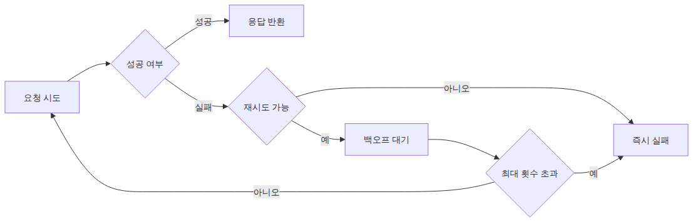
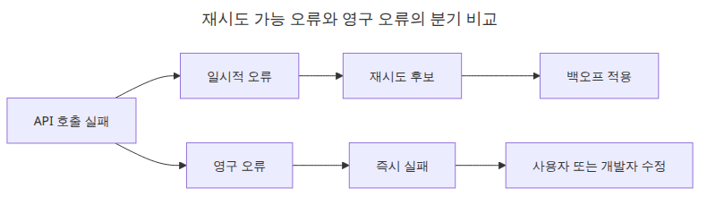
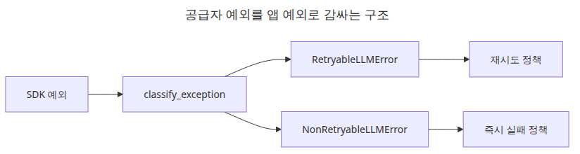
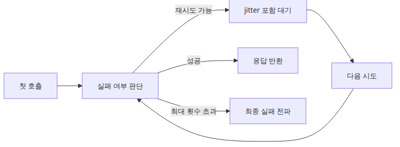
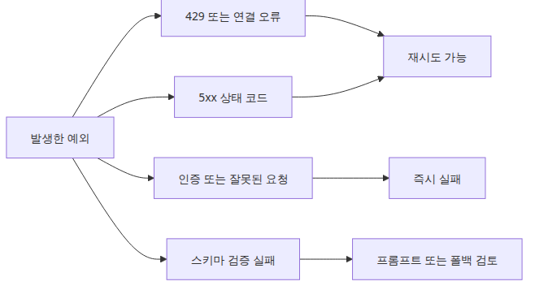
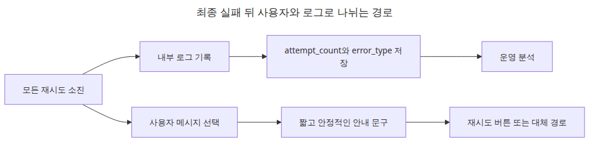

# 재시도와 오류 처리 — 안정적인 API 호출 만들기

> LLM API 프로덕션 101 시리즈 (5/6)

예제 코드: [github.com/yeongseon-books/llm-api-production-101](https://github.com/yeongseon-books/llm-api-production-101/tree/main/ko/05-retry-and-error-handling)

LLM API를 운영 경로에 붙이면 실패는 예외가 아니라 일상입니다. 네트워크가 잠깐 흔들릴 수 있고, 공급자 API가 순간적으로 느려질 수 있으며, 클라이언트가 제한 시간 안에 응답을 못 받을 수도 있습니다. 문제는 실패 그 자체보다, 실패 뒤의 코드가 얼마나 예측 가능하게 동작하느냐입니다. 같은 오류를 매번 손으로 다시 던지고 로그만 찍는 수준에서는 서비스가 금방 거칠어집니다.

이 지점에서 가장 흔한 실수는 모든 예외를 한데 묶어 재시도하는 것입니다. 인증 오류도 다시 시도하고, 잘못된 요청 본문도 다시 시도하고, 모델이 구조화 출력 검증에 실패한 경우도 같은 정책으로 되풀이합니다. 이렇게 하면 일시적 장애와 영구 오류가 구분되지 않습니다. 결국 재시도는 안정성을 높이는 대신 지연 시간을 늘리고, 공급자 쿼터만 더 씁니다.

그래서 재시도는 "실패하면 다시 해 본다"가 아니라 **어떤 오류가 일시적인지 분류하고, 그 경우에만 제어된 간격으로 다시 호출한다**는 정책이어야 합니다. 이번 글에서는 `tenacity`를 사용해 지수 백오프 기반 재시도를 붙이고, 오류를 일시적/영구적 범주로 나누는 패턴을 정리합니다. 목표는 예외를 없애는 것이 아니라, 실패가 나더라도 그 실패가 예측 가능한 형태로 드러나게 만드는 것입니다.

핵심은 단순합니다. **재시도는 친절한 무한 반복이 아니라, 오류 분류를 전제로 한 제한된 복구 전략입니다.**


---

## 이 글에서 답할 질문

- 어떤 LLM API 에러가 재시도 가능하고, 어떤 에러는 절대 재시도하면 안 되는가?
- 지수 백오프(exponential backoff)와 jitter는 왜 함께 써야 하는가?
- 스트리밍 도중 에러가 났을 때 재시도 단위는 무엇이어야 하는가?
- 재시도가 비용을 폭발시키는 것을 막기 위한 상한선은 어떻게 정하는가?
- Idempotency 키를 못 쓰는 LLM API에서 중복 호출을 어떻게 방지하는가?

## 실행 준비

예제는 Python 3.10 이상과 `groq`, `tenacity` 패키지를 가정합니다.

```bash
python3 -m venv .venv
source .venv/bin/activate
pip install groq tenacity
export GROQ_API_KEY="여기에-발급받은-키"
```

---

## 왜 모든 실패를 같은 예외로 다루면 안 되는가


재시도는 일시적 실패를 흡수할 때만 가치가 있습니다. 예를 들어 잠깐의 네트워크 흔들림, 순간적인 read timeout, 짧은 5xx 응답은 몇 초 뒤 다시 성공할 수 있습니다. 반대로 아래 경우는 재시도로 해결되지 않을 가능성이 큽니다.

- API 키가 잘못된 인증 오류
- 필수 파라미터가 빠진 잘못된 요청
- 애플리케이션 자체의 JSON 파싱 버그
- 스키마 검증 실패 같은 입력 품질 문제

이 둘을 섞으면 장애가 흐려집니다. 영구 오류를 계속 재시도하면 지연 시간만 길어지고, 사용자는 같은 실패를 늦게 받습니다. 그래서 첫 단계는 예외를 **재시도 가능**과 **즉시 실패**로 나누는 일입니다.

---

## tenacity가 주는 것

`tenacity`는 재시도 조건, 대기 간격, 최대 횟수, 실패 시 로깅을 데코레이터로 묶어 주는 라이브러리입니다. 장점은 재시도 로직을 `while True`와 `sleep()`으로 직접 흩뿌리지 않아도 된다는 점입니다. 정책이 호출 코드 바깥으로 분리되므로 읽기와 수정이 쉬워집니다.

가장 기본적인 형태는 아래와 같습니다.

```python
from tenacity import retry, stop_after_attempt, wait_exponential

@retry(
    stop=stop_after_attempt(3),
    wait=wait_exponential(multiplier=1, min=1, max=8),
)
def flaky_operation() -> str:
    raise RuntimeError("temporary failure")
```

이 예제는 원리만 보여 줍니다. 실제 운영에서는 어떤 예외에서 재시도할지 더 엄격히 제한해야 합니다.

---

## 오류 분류용 예외 계층 만들기


가장 다루기 쉬운 패턴은 애플리케이션 안에서 오류를 다시 분류하는 것입니다. 아래처럼 일시적 오류와 영구 오류를 나눌 수 있습니다.

```python
class RetryableLLMError(Exception):
    pass

class NonRetryableLLMError(Exception):
    pass
```

그 다음, 공급자 SDK 예외나 내부 예외를 받아 이 둘 중 하나로 감싸면 재시도 정책이 단순해집니다. 재시도 데코레이터는 `RetryableLLMError`만 보면 됩니다.

---

## 지수 백오프 재시도 붙이기


이제 Groq 호출을 감싸 보겠습니다. 아래 예제는 일시적 공급자 오류만 재시도 대상으로 올리고, 그 외는 즉시 실패시킵니다. 한 가지 운영 포인트가 더 있습니다. Groq 클라이언트 자체에도 기본 재시도 동작이 있을 수 있으므로, `tenacity` 예제를 보여 줄 때는 SDK 재시도를 꺼 두는 편이 정책을 읽기 쉽습니다.

```python
import os

from groq import APIConnectionError, APIStatusError, Groq, RateLimitError
from tenacity import (
    before_sleep_log,
    retry,
    retry_if_exception_type,
    stop_after_attempt,
    wait_exponential_jitter,
)
import logging

logger = logging.getLogger(__name__)
logging.basicConfig(level=logging.INFO)
client = Groq(api_key=os.environ["GROQ_API_KEY"], max_retries=0)

class RetryableLLMError(Exception):
    pass

class NonRetryableLLMError(Exception):
    pass

@retry(
    retry=retry_if_exception_type(RetryableLLMError),
    wait=wait_exponential_jitter(initial=1, max=8),
    stop=stop_after_attempt(3),
    before_sleep=before_sleep_log(logger, logging.WARNING),
    reraise=True,
)
def call_llm(messages: list[dict]) -> str:
    try:
        completion = client.chat.completions.create(
            model="llama-3.1-8b-instant",
            messages=messages,
            temperature=0,
        )
        return completion.choices[0].message.content
    except RateLimitError as exc:
        raise RetryableLLMError("provider rate limit hit") from exc
    except APIConnectionError as exc:
        raise RetryableLLMError("provider connection failed") from exc
    except APIStatusError as exc:
        if exc.status_code >= 500:
            raise RetryableLLMError(f"provider server error: {exc.status_code}") from exc
        raise NonRetryableLLMError(f"provider request failed: {exc.status_code}") from exc

messages = [
    {"role": "system", "content": "당신은 간결한 Python 튜터입니다."},
    {"role": "user", "content": "Python의 context manager를 세 문장으로 설명해 주세요."},
]

try:
    text = call_llm(messages)
    print(text)
except NonRetryableLLMError as exc:
    logger.error("retry 없이 실패한 요청입니다: %s", exc)
except RetryableLLMError as exc:
    logger.error("재시도 후에도 실패한 요청입니다: %s", exc)
```

<!-- injected-output:start -->
**출력 결과**

    Python의 context manager는 자원 관리를 위한 디자인 패턴입니다. 
    이 패턴은 try-finally 블록을 사용하여 자원을 열고 닫는 것을 자동화합니다. 
    context manager는 with 문을 사용하여 사용할 수 있으며, try-finally 블록의 복잡성을 줄여줍니다.

<!-- injected-output:end -->

핵심은 세 가지입니다. 첫째, `retry_if_exception_type(RetryableLLMError)`로 재시도 대상을 명시합니다. 둘째, `wait_exponential_jitter`로 대기 간격을 점진적으로 늘리면서 동시에 지터를 섞습니다. 셋째, `reraise=True`로 최종 실패를 숨기지 않습니다.

---

## 재시도 가능한 오류와 불가능한 오류를 어떻게 나눌까


현장에서 자주 쓰는 기준은 아래 정도입니다.

### 재시도 가능

- 네트워크 단절
- 연결 실패와 전송 계층 timeout
- 공급자 5xx
- 429 같은 속도 제한 응답 일부

### 재시도 불가 또는 별도 처리

- 인증 실패
- 잘못된 요청 바디
- 없는 모델명
- 애플리케이션 버그
- 구조화 출력 검증 실패

예를 들어 Pydantic 검증 실패는 모델 출력 품질 문제일 수는 있어도, 같은 요청을 바로 다시 보내는 것만으로 낫다고 보장하기 어렵습니다. 이 경우는 재시도보다 프롬프트 수정, 폴백 모델, 사용자 오류 응답 같은 별도 전략이 낫습니다.

---

## 오류 분류를 별도 함수로 빼기

호출 함수 안에 `except`가 길어지면 유지보수가 어렵습니다. 분류를 함수로 분리하면 읽기 쉬워집니다.

```python
def classify_exception(exc: Exception) -> Exception:
    if isinstance(exc, (RateLimitError, APIConnectionError)):
        return RetryableLLMError(str(exc))

    if isinstance(exc, APIStatusError):
        if exc.status_code >= 500:
            return RetryableLLMError(str(exc))
        return NonRetryableLLMError(str(exc))

    return NonRetryableLLMError(f"unexpected error: {exc}")
```

그다음 호출 코드에서는 아래처럼 정리할 수 있습니다.

```python
try:
    completion = client.chat.completions.create(...)
except Exception as exc:
    raise classify_exception(exc) from exc
```

이 구조는 공급자 SDK가 바뀌거나, 특정 예외를 새로 재시도 대상으로 넣고 싶을 때 특히 편합니다.

---

## 재시도 횟수와 백오프는 어떻게 정할까

재시도는 많다고 좋은 것이 아닙니다. 보통은 아래 질문으로 범위를 정합니다.

- 사용자가 몇 초까지 기다릴 수 있는가
- 같은 요청을 몇 번까지 다시 시도할 가치가 있는가
- 호출 비용과 rate limit 예산은 충분한가

대화형 UI에서는 2~3회 정도가 보통 현실적입니다. 내부 배치 작업이라면 더 길게 갈 수 있습니다. `wait_exponential_jitter(initial=1, max=8)`는 무난한 시작점이지만, 이 값도 제품 UX와 에러 빈도에 맞춰 조정해야 합니다. 즉시 5회 재시도하는 방식은 거의 항상 지나칩니다.

---

## 최종 실패를 어떻게 사용자에게 드러낼 것인가


재시도는 실패를 없애는 기술이 아닙니다. 최종 실패를 더 낫게 다루는 기술입니다. 모든 시도가 끝난 뒤에는 애플리케이션이 아래 정도를 분명히 해야 합니다.

- 사용자에게 보여 줄 메시지
- 내부 로그에 남길 원인
- 자동 복구를 멈출 지점

예를 들어 내부 로그에는 `retryable`, `attempt_count`, `final_error_type` 같은 정보를 남기고, 사용자에게는 "잠시 후 다시 시도해 주세요"처럼 짧고 안정적인 문구를 보여 주는 편이 좋습니다. 공급자 내부 예외 문자열을 그대로 노출하는 것은 피하는 편이 낫습니다.

---

## 마무리

이번 글에서는 `tenacity` 데코레이터, 지수 백오프, 오류 분류 계층을 사용해 LLM 호출 재시도 정책을 만드는 방법을 정리했습니다. 핵심은 재시도 횟수보다 분류입니다. 무엇을 다시 시도할지 먼저 정하고, 그다음에야 몇 번 기다릴지를 정해야 합니다.

앞선 글에서 캐시로 반복 비용을 줄였다면, 재시도는 실패 경로를 덜 거칠게 만드는 기술입니다. 마지막 주제에서는 이 두 층보다 더 바깥의 제약을 다룹니다. 공급자 API가 허용한 호출 속도 안에서 안정적으로 요청을 흘려보내기 위해 rate limit을 어떻게 관리할지 살펴보겠습니다.

## 운영 체크리스트

- [ ] HTTP 상태 코드별 재시도 가능 여부를 표로 정리했다
- [ ] 지수 백오프 + jitter + 최대 재시도 횟수를 코드로 강제했다
- [ ] 스트리밍 에러는 청크가 아닌 호출 단위로 재시도하도록 분리했다
- [ ] 재시도 시 토큰/비용 누적 폭주를 막는 가드를 두었다
- [ ] 동일 요청을 추적하는 상관관계 ID를 모든 재시도에 전파했다

<!-- toc:begin -->
## 시리즈 목차

- [구조화 출력 — JSON 모드와 응답 스키마](./01-structured-output.md)
- [툴 호출 — 함수를 모델에 연결하기](./02-tool-calling.md)
- [스트리밍 심화 — 청크 처리와 오류 복구](./03-streaming-in-depth.md)
- [캐싱 전략 — 비용과 지연 시간 줄이기](./04-caching-strategies.md)
- **재시도와 오류 처리 — 안정적인 API 호출 만들기 (현재 글)**
- 속도 제한 관리 — Rate Limit 대응 패턴 (예정)

<!-- toc:end -->

---

## 참고 자료

- <https://tenacity.readthedocs.io/en/latest/>
- <https://console.groq.com/docs/text-chat>

Tags: LLM, OpenAI, Streaming, Python
