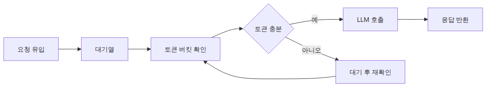

# 속도 제한 관리 — Rate Limit 대응 패턴

> LLM API 프로덕션 101 시리즈 (6/6)

예제 코드: [github.com/yeongseon-books/llm-api-production-101](https://github.com/yeongseon-books/llm-api-production-101/tree/main/ko/06-rate-limit-management)

API를 오래 운영해 본 팀이라면 언젠가 같은 장면을 봅니다. 평소에는 문제없던 호출이 특정 시간대나 배치 시작 시점에 갑자기 실패하고, 로그에는 429 또는 rate limit 관련 메시지가 찍힙니다. LLM API도 예외가 아닙니다. 오히려 입력 토큰과 출력 토큰이 커서 요청 하나의 무게가 큰 만큼, 같은 순간에 트래픽이 몰리면 더 거칠게 제한에 부딪힐 수 있습니다.

이때 많은 시스템이 두 가지 극단으로 흔들립니다. 하나는 아무 제어 없이 요청을 그대로 보내다가 공급자 제한에 계속 부딪히는 방식입니다. 다른 하나는 너무 보수적으로 직렬화해 처리량을 불필요하게 깎는 방식입니다. 좋은 운영은 그 사이에 있습니다. 허용된 속도 안에서는 충분히 빠르게 보내고, 초과 가능성이 보이면 애플리케이션이 먼저 조절하는 것입니다.

이번 글에서는 단일 프로세스 기준으로 rate limit을 다루는 두 가지 기본 패턴, 즉 토큰 버킷과 슬라이딩 윈도우를 구현합니다. 목표는 공급자 정책 전체를 추상 이론으로 설명하는 것이 아니라, 애플리케이션 안에서 **요청을 보내기 전에 스스로 속도를 조절하는 구조**를 만드는 데 있습니다. 이 기본형을 이해하면 나중에 분산 워커, 공유 Redis 카운터, 사용자별 쿼터 같은 더 큰 설계로 확장하기 쉬워집니다.

핵심은 단순합니다. **Rate limit 대응은 429를 받은 뒤 사과하는 일이 아니라, 그 전에 요청 흐름을 제어하는 일입니다.**


---

## 실행 준비

예제는 Python 3.10 이상과 `groq` SDK를 가정합니다.

```bash
python3 -m venv .venv
source .venv/bin/activate
pip install groq
export GROQ_API_KEY="여기에-발급받은-키"
```

---

## 왜 애플리케이션 쪽 제한기가 필요한가

재시도와 백오프만으로는 rate limit을 풀 수 없습니다. 이미 공급자 제한을 넘겨 실패한 뒤에 다시 천천히 보내는 것은 사후 대응입니다. 물론 필요하지만, 더 좋은 방법은 애초에 초과 가능성을 줄이는 것입니다.

애플리케이션 내부 제한기가 필요한 이유는 세 가지입니다.

- 순간 폭주를 공급자 앞에서 흡수할 수 있습니다.
- 여러 내부 호출 경로의 합산 속도를 제어할 수 있습니다.
- 429를 오류가 아니라 제어 신호로 다루기 쉬워집니다.

예를 들어 웹 요청 20개가 동시에 들어와 모두 같은 LLM 경로를 호출하면, 백엔드가 아무 제어 없이 그대로 전달하는 순간 외부 API가 병목이 됩니다. 반대로 애플리케이션이 내부에서 초당 허용량을 알고 있으면 일부는 기다리게 하고 일부만 바로 보낼 수 있습니다.

---

## 토큰 버킷은 어떤 문제에 잘 맞는가

토큰 버킷은 일정 속도로 토큰이 다시 채워지고, 요청이 들어올 때 토큰을 하나씩 소비하는 방식입니다. 장점은 짧은 burst를 어느 정도 허용하면서도 평균 속도를 제어하기 쉽다는 점입니다.

예를 들어 초당 5개의 토큰이 채워지고 버킷 최대 크기가 10이면, 한가한 시간에 모인 여유분으로 잠깐의 10개 burst를 처리할 수 있습니다. 하지만 그 뒤에는 평균적으로 초당 5개 이상을 계속 보낼 수 없습니다. 사용자 요청이 짧게 몰렸다가 다시 잦아드는 웹 트래픽에 잘 맞는 이유가 여기 있습니다.

---

## 토큰 버킷 구현

아래는 가장 작은 형태의 토큰 버킷 구현입니다.

```python
import time

class TokenBucket:
    def __init__(self, capacity: int, refill_rate_per_second: float) -> None:
        self.capacity = capacity
        self.tokens = float(capacity)
        self.refill_rate_per_second = refill_rate_per_second
        self.last_refill = time.monotonic()

    def _refill(self) -> None:
        now = time.monotonic()
        elapsed = now - self.last_refill
        self.tokens = min(
            self.capacity,
            self.tokens + elapsed * self.refill_rate_per_second,
        )
        self.last_refill = now

    def allow(self, cost: float = 1.0) -> bool:
        self._refill()
        if self.tokens >= cost:
            self.tokens -= cost
            return True
        return False
```

사용은 간단합니다.

```python
bucket = TokenBucket(capacity=10, refill_rate_per_second=5)

if bucket.allow():
    print("request allowed")
else:
    print("wait before sending")
```

여기서 `cost`를 1로 고정해도 되지만, LLM 경로에서는 요청 예상 토큰 수를 비용으로 반영하는 방식도 고려할 수 있습니다. 다만 첫 구현에서는 요청 수 기준으로 시작하는 편이 보통 더 단순합니다.

다만 LLM 경로에서는 토큰 기준 제한도 함께 보는 편이 좋습니다. 공급자 정책이 RPM과 TPM을 같이 둘 수 있기 때문입니다. 작은 요청과 큰 요청이 같은 비용으로 보이면 실제 제한과 애플리케이션 제어가 어긋날 수 있습니다.

```python
def estimate_token_cost(prompt_tokens: int, reserved_completion_tokens: int) -> int:
    return prompt_tokens + reserved_completion_tokens

bucket = TokenBucket(capacity=40_000, refill_rate_per_second=20_000 / 60)
cost = estimate_token_cost(prompt_tokens=1200, reserved_completion_tokens=800)

if bucket.allow(cost=cost):
    print("token-budget request allowed")
else:
    print("wait for token budget to refill")
```

---

## 슬라이딩 윈도우는 어떤 문제에 잘 맞는가

슬라이딩 윈도우는 최근 N초 안에 몇 개의 요청이 있었는지 직접 세는 방식입니다. 예를 들어 최근 60초 동안 최대 100개 요청만 허용한다고 정하면, 현재 시점 기준 60초 창 안에 있는 요청 개수를 세고 초과 여부를 판단합니다.

이 방식은 공급자 정책이 "분당 요청 수"처럼 명시적인 창 기반일 때 설명하기 쉽습니다. 단점은 burst 완화가 토큰 버킷보다 덜 부드럽다는 점입니다. 대신 "최근 60초" 기준 정책을 그대로 반영하기 쉽습니다.

---

## 슬라이딩 윈도우 구현

```python
import time
from collections import deque

class SlidingWindowLimiter:
    def __init__(self, max_requests: int, window_seconds: int) -> None:
        self.max_requests = max_requests
        self.window_seconds = window_seconds
        self.events: deque[float] = deque()

    def allow(self) -> bool:
        now = time.monotonic()

        while self.events and now - self.events[0] >= self.window_seconds:
            self.events.popleft()

        if len(self.events) >= self.max_requests:
            return False

        self.events.append(now)
        return True
```

이 구현은 최근 창 밖 이벤트를 제거하고, 남은 요청 수를 기준으로 허용 여부를 판단합니다. 직관적이고 디버깅이 쉬운 대신, 요청 수가 매우 많으면 창 관리 비용을 더 고려해야 합니다. 시리즈 범위에서는 동작 원리를 이해하는 데 충분합니다.

---

## Groq 호출 앞에 제한기 붙이기

이제 실제 호출 경로 앞에 제한기를 둡니다. 아래 예제는 토큰 버킷을 사용합니다.

```python
import os
import time

from groq import Groq

class TokenBucket:
    def __init__(self, capacity: int, refill_rate_per_second: float) -> None:
        self.capacity = capacity
        self.tokens = float(capacity)
        self.refill_rate_per_second = refill_rate_per_second
        self.last_refill = time.monotonic()

    def _refill(self) -> None:
        now = time.monotonic()
        elapsed = now - self.last_refill
        self.tokens = min(
            self.capacity,
            self.tokens + elapsed * self.refill_rate_per_second,
        )
        self.last_refill = now

    def wait_for_token(self, cost: float = 1.0) -> None:
        while True:
            self._refill()
            if self.tokens >= cost:
                self.tokens -= cost
                return
            time.sleep(0.1)

bucket = TokenBucket(capacity=10, refill_rate_per_second=5)
client = Groq(api_key=os.environ["GROQ_API_KEY"])

def limited_completion(prompt: str) -> str:
    bucket.wait_for_token()
    completion = client.chat.completions.create(
        model="llama-3.1-8b-instant",
        messages=[{"role": "user", "content": prompt}],
        temperature=0,
    )
    return completion.choices[0].message.content

print(limited_completion("Python의 list와 tuple 차이를 설명해 주세요."))
```

이 코드는 공급자에게 보내기 전에 먼저 내부 버킷에서 토큰을 확보합니다. 허용량이 없으면 잠깐 기다립니다. 핵심은 외부 API가 막기 전에 내부 제어가 먼저 동작한다는 점입니다.

---

## 429를 받았을 때는 어떻게 할까

내부 제한기가 있다고 해도 429를 완전히 없애지는 못할 수 있습니다. 여러 프로세스가 있거나, 공급자 측 정책이 토큰 기준으로 더 복잡할 수도 있기 때문입니다. 그래서 429는 여전히 처리해야 합니다.

좋은 기본 원칙은 아래와 같습니다.

- 429를 재시도 가능 오류로 분류합니다.
- 다만 즉시 재시도하지 않고 더 긴 backoff를 둡니다.
- 가능하면 내부 제한기 상태도 함께 보수적으로 조정합니다.

즉, 제한기는 사전 제어층이고 429 처리 로직은 사후 복구층입니다. 둘 중 하나만으로는 부족할 수 있습니다.

아래는 `Retry-After` 헤더가 있으면 우선 존중하고, 없으면 지수 백오프와 지터를 적용한 뒤, 재시도 전에 다시 내부 제한기 허가를 받는 예제입니다.

```python
import os
import random
import time

from groq import APIStatusError, Groq

class TokenBucket:
    def __init__(self, capacity: int, refill_rate_per_second: float) -> None:
        self.capacity = capacity
        self.tokens = float(capacity)
        self.refill_rate_per_second = refill_rate_per_second
        self.last_refill = time.monotonic()

    def _refill(self) -> None:
        now = time.monotonic()
        elapsed = now - self.last_refill
        self.tokens = min(self.capacity, self.tokens + elapsed * self.refill_rate_per_second)
        self.last_refill = now

    def wait_for_token(self, cost: float = 1.0) -> None:
        while True:
            self._refill()
            if self.tokens >= cost:
                self.tokens -= cost
                return
            time.sleep(0.1)

bucket = TokenBucket(capacity=10, refill_rate_per_second=5)
client = Groq(api_key=os.environ["GROQ_API_KEY"], max_retries=0)

def retry_after_seconds(exc: APIStatusError) -> float | None:
    value = exc.response.headers.get("retry-after")
    if value is None:
        return None
    try:
        return float(value)
    except ValueError:
        return None

def limited_completion_with_429(prompt: str) -> str:
    for attempt in range(3):
        bucket.wait_for_token()
        try:
            completion = client.chat.completions.create(
                model="llama-3.1-8b-instant",
                messages=[{"role": "user", "content": prompt}],
                temperature=0,
            )
            return completion.choices[0].message.content
        except APIStatusError as exc:
            if exc.status_code != 429 or attempt == 2:
                raise

            retry_after = retry_after_seconds(exc)
            sleep_seconds = retry_after if retry_after is not None else min(2**attempt, 8) + random.uniform(0, 0.5)
            time.sleep(sleep_seconds)

    raise RuntimeError("unreachable")
```

---

## 토큰 버킷과 슬라이딩 윈도우를 언제 고를까

둘 다 정답일 수 있지만 쓰임새가 조금 다릅니다.

### 토큰 버킷이 잘 맞는 경우

- 짧은 burst를 허용하고 싶을 때
- 평균 처리율을 부드럽게 제어하고 싶을 때
- 웹 요청처럼 순간 피크가 있는 트래픽

### 슬라이딩 윈도우가 잘 맞는 경우

- 분당/초당 요청 수 제한을 정책 그대로 반영할 때
- "최근 60초에 몇 개"를 직접 보고 싶을 때
- 운영자에게 설명 가능한 단순 규칙이 필요할 때

처음에는 토큰 버킷 하나로 시작하고, 공급자 정책이 창 기반으로 더 명확하다면 슬라이딩 윈도우로 바꾸는 식도 괜찮습니다.

---

## 단일 프로세스 구현의 한계

이번 글의 예제는 단일 프로세스 기준입니다. 따라서 아래 한계가 있습니다.

- 워커가 여러 개면 각자 따로 세기 때문에 총합 제어가 되지 않습니다.
- 서버 여러 대로 늘어나면 상태를 공유하지 못합니다.
- 사용자별 쿼터와 전체 쿼터를 동시에 관리하기 어렵습니다.

그렇다고 이 예제가 쓸모없다는 뜻은 아닙니다. 오히려 제한기의 의미를 가장 분명하게 보여 줍니다. 다음 단계로 Redis 같은 공유 저장소를 붙이더라도, 지금 구현한 `allow()`와 `wait_for_token()` 사고방식은 그대로 유지됩니다.

---

## 마무리

이번 글에서는 토큰 버킷과 슬라이딩 윈도우라는 두 가지 기본 제한기를 구현하고, Groq 호출 앞단에서 요청 흐름을 스스로 조절하는 패턴을 정리했습니다. 핵심은 429를 받은 뒤에만 반응하지 말고, 애플리케이션이 먼저 허용량을 관리하는 것입니다.

이 시리즈는 여기서 마무리됩니다. 구조화 출력으로 응답 계약을 고정하고, 툴 호출로 함수 실행을 연결하고, 스트리밍·캐시·재시도·속도 제한까지 더하면 LLM API를 데모가 아니라 운영 가능한 경로로 다루는 기본 도구 상자가 갖춰집니다. 다음 단계는 각자의 서비스 맥락에 맞게 이 도구를 조합하는 일입니다.

<!-- toc:begin -->
## 시리즈 목차

- [구조화 출력 — JSON 모드와 응답 스키마](./01-structured-output.md)
- [툴 호출 — 함수를 모델에 연결하기](./02-tool-calling.md)
- [스트리밍 심화 — 청크 처리와 오류 복구](./03-streaming-in-depth.md)
- [캐싱 전략 — 비용과 지연 시간 줄이기](./04-caching-strategies.md)
- [재시도와 오류 처리 — 안정적인 API 호출 만들기](./05-retry-and-error-handling.md)
- **속도 제한 관리 — Rate Limit 대응 패턴 (현재 글)**

<!-- toc:end -->

---

## 참고 자료

- <https://console.groq.com/docs/errors>
- <https://en.wikipedia.org/wiki/Token_bucket>
- <https://konghq.com/blog/engineering/how-to-design-a-scalable-rate-limiting-algorithm>

Tags: LLM, OpenAI, Streaming, Python
