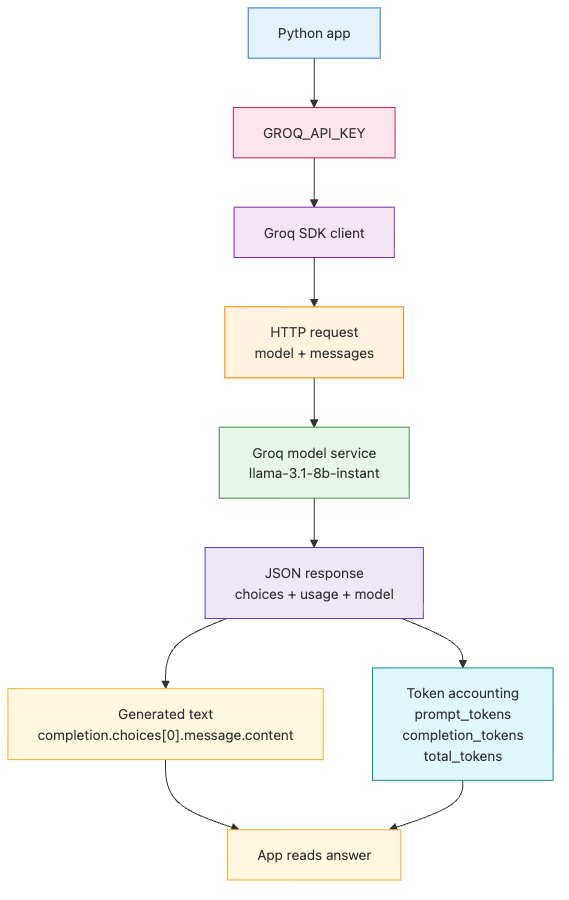

# LLM API first call — sending your first request

> LLM App Foundations 101 (1/6)

Example code: [github.com/yeongseon-books/llm-app-foundations-101](https://github.com/yeongseon-books/llm-app-foundations-101/tree/main/en/01-llm-api-first-call)

The diagram below shows the smallest round trip behind a first LLM API call.


The first confusing thing about LLM application development is not the model. It is the boundary between your code and the model service. A chat UI makes the whole thing feel magical, but the runtime reality is plain: your application sends an HTTP request and receives a JSON response. That round trip is the foundation.

That is why Post 01 starts here. If you do not understand what goes into the request body, what comes back in the response, and where token usage shows up, every later feature feels blurry.

In this post, we will build that first call with the Groq API. The setup is intentionally small. You need one environment variable, `GROQ_API_KEY`, and the official Python SDK, `groq`. The model for every example in this article is `llama-3.1-8b-instant`.

We will cover seven things:

- what an LLM API actually is
- how to create a Groq account and issue an API key
- how to install `groq`
- how to send your first request with `client.chat.completions.create()`
- how to read `choices[0].message.content`, `usage`, and `model`
- how synchronous and asynchronous patterns differ
- one complete executable example you can keep as a starting point

The main idea is simple: **an LLM app begins with request and response structure, not with prompt cleverness**.

---

## What an LLM API is

An LLM API is still an API. The transport is HTTP. The payload is usually JSON. Your code sends input to a remote service, and that service sends structured output back.

From the application's point of view, a typical request answers three questions:

- which model should handle the request
- which messages should be sent as input
- which generation options should shape the output

The response usually answers a different set of questions:

- what text the model generated
- which model produced it
- how many tokens were consumed
- which metadata the provider attached to the result

An SDK makes this feel like a method call, but the underlying contract does not change. `client.chat.completions.create()` still creates a JSON request under the hood and parses a JSON response into a Python object. SDK syntax changes over time, while the mental model of **JSON in, JSON out** stays stable.

Conceptually, the request body looks like this:

```json
{
  "model": "llama-3.1-8b-instant",
  "messages": [
    {
      "role": "user",
      "content": "Show me a small Python example that reads an environment variable."
    }
  ]
}
```

The real response includes more fields, but these three blocks are the ones you should care about first:

```json
{
  "model": "llama-3.1-8b-instant",
  "choices": [
    {
      "message": {
        "role": "assistant",
        "content": "import os\nprint(os.environ['HOME'])"
      }
    }
  ],
  "usage": {
    "prompt_tokens": 24,
    "completion_tokens": 31,
    "total_tokens": 55
  }
}
```

Keep that shape in mind while using the SDK. It will help when you later move to streaming responses, tool calling, or structured outputs.

---

## Creating a Groq account and API key

The account setup is short:

1. Open <https://console.groq.com>.
2. Sign up with GitHub or email.
3. After logging in, open the API Keys section.
4. Create a new key and copy it.
5. Store it in your shell as `GROQ_API_KEY`.

On macOS or Linux, you can start with:

```bash
export GROQ_API_KEY="your-issued-key"
```

On PowerShell:

```powershell
$env:GROQ_API_KEY="your-issued-key"
```

The important habit is keeping the key out of source code. Do not hardcode API keys into Python files. Read them from the environment instead. Every example in this post uses `os.environ["GROQ_API_KEY"]`, which means a missing variable fails immediately.

This tiny script is enough to verify the environment is wired correctly:

```python
import os

api_key = os.environ["GROQ_API_KEY"]
print(f"API key loaded: {api_key[:6]}...")
```

~~~
Output
API key loaded: gsk_Z2...
~~~
You would not print the full key in a real application. A short prefix is enough for local verification.

---

## Installing the SDK

The examples here assume Python 3.10 or later. To install the official SDK:

```bash
python3 -m venv .venv
source .venv/bin/activate
pip install groq
```

If you already have a virtual environment, only `pip install groq` is necessary.

It is also useful to confirm which package version your runtime sees:

```bash
python -c "import groq; print(groq.__version__)"
```

At this point, you have everything you need for a first request.

---

## Sending your first request

Start with the smallest successful program. The code below sends one request in synchronous style and prints only the generated text. This block is self-contained.

```python
import os

from groq import Groq

client = Groq(api_key=os.environ["GROQ_API_KEY"])

completion = client.chat.completions.create(
    model="llama-3.1-8b-instant",
    messages=[
        {
            "role": "user",
            "content": "Explain Python list comprehensions in one paragraph.",
        }
    ],
)

print(completion.choices[0].message.content)
```

~~~
Output
Python list comprehensions are a concise way to create lists from existing lists or other iterables by applying a transformation or filtering function to each element. They consist of brackets containing the expression, which is executed for each element in the input iterable, and can also include conditional statements to filter the output. The basic syntax is: `[expression for element in iterable (if condition)]`, where `expression` is the operation performed on each element, `element` is the variable representing each element in the iterable, `iterable` is the input list or other iterable, and `condition` is an optional condition to apply to each element. For example, `numbers = [x for x in range(10) if x % 2 == 0]` creates a list of even numbers from 0 to 9.
~~~
Three lines matter most.

`Groq(...)` creates the client object that will talk to the API.

`model="llama-3.1-8b-instant"` selects the model.

`messages=[...]` provides the chat input. In this first post, one `user` message is enough. Later posts will show how `system`, `user`, and `assistant` messages work together across multiple turns.

Do not focus on the exact wording of the answer. The important result is structural: the request succeeds, and the generated text is available at `choices[0].message.content`.

---

## Inspecting the response object

Many beginners stop after printing the answer text. That is fine for a smoke test, but it is not enough for a working application. You also need token usage, model identity, and the overall response shape.

The Groq Python SDK returns Pydantic models, so you can convert the response into a dictionary with `to_dict()`. This block is also self-contained.

```python
import json
import os

from groq import Groq

client = Groq(api_key=os.environ["GROQ_API_KEY"])

completion = client.chat.completions.create(
    model="llama-3.1-8b-instant",
    messages=[
        {
            "role": "user",
            "content": "Explain the difference between an HTTP API and an SDK in three sentences.",
        }
    ],
)

print(json.dumps(completion.to_dict(), indent=2, ensure_ascii=False))
```

~~~
Output
{
  "id": "chatcmpl-5850ff58-edee-4ee0-a1f8-6830d809d528",
  "choices": [
    {
      "finish_reason": "stop",
      "index": 0,
      "logprobs": null,
      "message": {
        "content": "An HTTP API is a web-based interface that allows different systems to communicate with each other using standardized HTTP requests and responses, whereas an SDK (Software Development Kit) is a set of pre-written code libraries or tools that enable developers to integrate a specific service or product into their own applications. HTTP APIs typically provide access to data or functionality through a standardized interface, whereas SDKs provide a more comprehensive set of features, including error handling, caching, and other utilities. In general, HTTP APIs are intended for programmatic access, while SDKs are designed for developers to build native integrations.",
        "role": "assistant"
      }
    }
  ],
  "created": 1777646404,
  "model": "llama-3.1-8b-instant",
  "object": "chat.completion",
  "service_tier": "on_demand",
  "system_fingerprint": "fp_7ccc667439",
  "usage": {
    "completion_tokens": 118,
    "prompt_tokens": 50,
    "total_tokens": 168,
    "completion_time": 0.186925794,
    "prompt_time": 0.002393872,
    "queue_time": 0.006974312,
    "total_time": 0.189319666
  },
  "usage_breakdown": null,
  "x_groq": {
    "id": "req_01kqhzq0g9ergv3qy2spemmd0n",
    "seed": 855522485
  }
}
~~~
When you look through that output, pay attention to three fields first.

### `choices[0].message.content`

This is the actual answer text.

```python
text = completion.choices[0].message.content
print(text)
```

Why `choices[0]`? Because the API shape is designed around a list of candidate outputs. For a beginner app, the first one is usually enough.

### `usage`

This is where token accounting lives.

```python
usage = completion.usage
print(f"prompt_tokens={usage.prompt_tokens}")
print(f"completion_tokens={usage.completion_tokens}")
print(f"total_tokens={usage.total_tokens}")
```

Those numbers are not just nice-to-have metadata. They drive cost tracking, context budgeting, latency analysis, and later optimization work. Token usage becomes a major topic in the next post for exactly that reason.

### `model`

The response also records which model generated the output.

```python
print(completion.model)
```

In a small script this may feel redundant, but in real systems it is worth logging. It makes debugging model changes much easier.

There are more fields you will eventually care about. Two worth noting now:

```python
print(completion.id)                              # unique request ID, useful for support queries
print(completion.choices[0].finish_reason)        # "stop", "length", or "tool_calls"
```

`finish_reason` tells you why the model stopped generating. `"stop"` means a natural end. `"length"` means the model ran out of allowed tokens. Logging both from day one saves debugging time later.

---

## Why the HTTP mental model still matters

The SDK handles authentication headers, JSON serialization, response parsing, and typed errors. It does not remove the network boundary.

That boundary explains a lot of beginner problems:

- if the request is slow, network latency may matter more than Python code
- if you get a `401`, check credentials before touching the prompt
- if you get a `429`, think about request rate before model quality
- if a response looks odd, log the full object before guessing

This is the real value of seeing the first call clearly. You stop treating the model as magic and start treating it as a remote service with explicit contracts and failure modes.

---

## Synchronous and asynchronous patterns

Python gives you two common ways to call an LLM API: synchronous code and asynchronous code.

Synchronous code is usually the better teaching tool. It works well for scripts, notebooks, and small command-line programs.

Asynchronous code becomes important when the rest of your application is already async, or when you want to coordinate multiple I/O-bound tasks. FastAPI services, concurrent LLM fan-out calls, and apps that talk to several external APIs at once are typical examples.

Here is the synchronous pattern again:

```python
import os

from groq import Groq

client = Groq(api_key=os.environ["GROQ_API_KEY"])

completion = client.chat.completions.create(
    model="llama-3.1-8b-instant",
    messages=[
        {
            "role": "user",
            "content": "Explain asynchronous programming in one paragraph.",
        }
    ],
)

print(completion.choices[0].message.content)
```

~~~
Output
Asynchronous programming is a paradigm that allows multiple tasks to run concurrently without blocking each other. Instead of executing tasks sequentially, where one task finishes before the next begins, asynchronous programming enables tasks to run in parallel, improving overall system performance and responsiveness. This is achieved through the use of non-blocking calls, callbacks, or promises, which notify the program when a task is completed. As a result, the program can continue to execute other tasks while waiting for the result of a particular task, making it ideal for handling time-consuming operations, such as I/O operations, network requests, or long-running computations, without freezing the application. By leveraging asynchronous programming, developers can write more efficient, scalable, and responsive code for modern applications that require real-time performance.
~~~
And here is the async version. This block is also executable on its own.

```python
import asyncio
import os

from groq import AsyncGroq

client = AsyncGroq(api_key=os.environ["GROQ_API_KEY"])

async def main() -> None:
    completion = await client.chat.completions.create(
        model="llama-3.1-8b-instant",
        messages=[
            {
                "role": "user",
                "content": "Give me two situations where asyncio is useful.",
            }
        ],
    )

    print(completion.choices[0].message.content)

asyncio.run(main())
```

~~~
Output
**Using asyncio for Concurrent Networking**
=====================================================

Situation 1: Simultaneous Networking Request

asyncio is useful when you need to send multiple requests concurrently over the network. For example:

### Example Code
    ```python
    import asyncio
    import aiohttp
    
    async def fetch_page(session, url):
        async with session.get(url) as response:
            return await response.text()
    
    async def main():
        urls = ['https://www.example.com/page1', 'https://www.example.com/page2', 'https://www.example.com/page3']
        async with aiohttp.ClientSession() as session:
            tasks = [fetch_page(session, url) for url in urls]
            pages = await asyncio.gather(*tasks)
            for page in pages:
                print(page)
    
    asyncio.run(main())
    ```

In this example, we use `aiohttp` to send multiple requests concurrently, and then wait for all responses using `asyncio.gather`.

**Using asyncio for CPU-bound Tasks**
=====================================

Situation 2: Concurrent Data Processing

asyncio is also useful when you have many CPU-bound tasks that you need to process concurrently. For example, let's say you need to process a large dataset of numbers by squaring each number.

### Example Code
    ```python
    import asyncio
    import concurrent.futures
    
    def square(x):
        return x ** 2
    
    async def process_data(data):
        loop = asyncio.get_running_loop()
        with concurrent.futures.ThreadPoolExecutor() as executor:
            tasks = [loop.run_in_executor(executor, square, x) for x in data]
            results = await asyncio.gather(*tasks)
            print(results)
    
    data = list(range(1000000))
    asyncio.run(process_data(data))
    ```

In this example, we use `concurrent.futures` to run the CPU-bound task `square` on multiple threads concurrently. Note that the actual benefit of using asyncio for CPU-bound tasks is limited because asyncio is best suited for I/O-bound operations. However, it can still be useful in situations where you need to process data in parallel.
~~~import asyncio
import aiohttp

async def fetch_page(session, url):
    async with session.get(url) as response:
        return await response.text()

async def main():
    urls = ["http://example.com/page1", "http://example.com/page2", "http://example.com/page3"]
    async with aiohttp.ClientSession() as session:
        tasks = [fetch_page(session, url) for url in urls]
        pages = await asyncio.gather(*tasks)
        for page in pages:
            print(page)

asyncio.run(main())
```

In this example, asyncio is used to make multiple network requests concurrently, improving the overall response time.

### Situation 2: Real-time event-driven systems

Real-time event-driven systems, such as live updates, gaming, or interactive chat applications, rely heavily on asyncio for efficient and non-blocking handling of events.

Example (a simple interactive game):

```python
import asyncio
import random

class Game:
    def __init__(self):
        self.score = 0
        self.is_game_over = False

    async def play(self):
        while not self.is_game_over:
            choice = input("Enter a number (1/2) or 'exit' to quit: ")
            if choice.lower() == "exit":
                self.is_game_over = True
            else:
                try:
                    choice = int(choice)
                    if random.random() < 0.8:
                        self.score += choice
                        print(f"You gained {choice} points!")
                    else:
... (truncated)
```

The structure barely changes. Replace `Groq` with `AsyncGroq`, add `await`, and run the top-level coroutine with `asyncio.run()`.

That small syntax shift matters once you want concurrency. The next example sends three requests in parallel. It is a complete runnable script.

```python
import asyncio
import os

from groq import AsyncGroq

client = AsyncGroq(api_key=os.environ["GROQ_API_KEY"])

async def ask(question: str) -> str:
    completion = await client.chat.completions.create(
        model="llama-3.1-8b-instant",
        messages=[{"role": "user", "content": question}],
    )
    return completion.choices[0].message.content or ""

async def main() -> None:
    questions = [
        "Explain the difference between a list and a tuple.",
        "Explain the key property of a Python dictionary.",
        "Explain why exception handling matters.",
    ]
    answers = await asyncio.gather(*(ask(question) for question in questions))

    for index, answer in enumerate(answers, start=1):
        print(f"[{index}] {answer}\n")

asyncio.run(main())
```python
my_list = [1, 2, 3, 4, 5]
my_list[0] = 10  # Modifying an element
my_list.append(6)  # Adding an element
print(my_list)  # Output: [10, 2, 3, 4, 5, 6]
```

### Tuples

*   **Immutable**: Tuples are immutable, meaning their contents cannot be modified after creation. Attempting to modify a tuple will result in a `TypeError`.
*   **Indexed**: Like lists, tuples are also indexed, allowing you to access specific elements by their index.
*   **Fixed Length**: Tuples have a fixed length, which is determined when the tuple is created.
*   **Common Usage**: Tuples are ideal for storing collections of data where the order matters and elements will not change.

**Example:**
```python
my_tuple = (1, 2, 3, 4, 5)
try:
    my_tuple[0] = 10  # Attempting to modify a tuple
except TypeError as e:
    print(e)  # Output: 'tuple' object does not support item assignment
```

~~~
Output
'tuple' object does not support item assignment
~~~
**In Summary**

Lists are mutable, indexed, and can be of any length, making them ideal for scenarios where data needs to be modified or added frequently. Tuples, on the other hand, are immutable, indexed, and have a fixed length, making them suitable for storing collections of data where the order matters, but elements will not change.

**Choosing between Lists and Tuples**

When deciding between a list and a tuple, consider the following:

1.  If the data needs to be modified or added frequently, use a `list`.
2.  If the data will remain constant, use a `tuple`.
3.  If you need to return a value and cannot modify it, consider using a tuple.

Remember that in Python, `list` is generally preferred over `tuple` when dynamic data structures are required, but `tuple` is recommended when static data structures are sufficient.

[2] **Key Property of a Python Dictionary**
======================================

In Python, a dictionary is a mutable data type that stores a collection of key-value pairs. The key property of a Python dictionary is that it uses **keys**, which are immutable objects such as strings, integers, tuples, or frozensets, to store and retrieve values.

**Characteristics of Key Property**

1. **Immutability**: Dictionary keys must be immutable, i.e., they cannot be changed after creation. This ensures that keys are unique and can be used for efficient lookup.
2. **Uniqueness**: Each key must be unique within a dictionary. If you try to use a duplicate key, the old key-value pair will be overwritten.
3. **Hashability**: Dictionary keys must be hashable, meaning that they must have a hash value that can be used to compute the index of the key in a dictionary.

... (truncated)
```

This is where async becomes a design choice. Once several requests are in flight, you also need to think about rate limits, retries, backoff, and timeouts.

---

## A complete example you can keep

Now let us combine everything into one small script. This is a good baseline for future experiments. It reads the environment variable, sends a request, prints the generated answer, and also prints the metadata you should start watching from day one.

```python
import os

from groq import Groq

def main() -> None:
    client = Groq(api_key=os.environ["GROQ_API_KEY"])

    completion = client.chat.completions.create(
        model="llama-3.1-8b-instant",
        messages=[
            {
                "role": "system",
                "content": "You are a concise Python tutor.",
            },
            {
                "role": "user",
                "content": (
                    "Explain the difference between a Python function and a method "
                    "in no more than five sentences, and add one short example line."
                ),
            },
        ],
    )

    content = completion.choices[0].message.content or ""
    usage = completion.usage

    print("=== answer ===")
    print(content)
    print()
    print("=== metadata ===")
    print(f"model: {completion.model}")
    print(f"prompt_tokens: {usage.prompt_tokens}")
    print(f"completion_tokens: {usage.completion_tokens}")
    print(f"total_tokens: {usage.total_tokens}")

if __name__ == "__main__":
    main()
```

~~~
Output
=== answer ===
In Python, a function is a self-contained block of code that can be executed independently, while a method is a function that belongs to a class and is used to perform an operation on a specific object. Functions do not require a specific class or object to be used, whereas methods always operate on an instance of a class. This fundamental difference between functions and methods affects their usage and behavior. 

For instance: `str.upper()` is a method, whereas `sum([1, 2, 3])` is a function.

=== metadata ===
model: llama-3.1-8b-instant
prompt_tokens: 67
completion_tokens: 108
total_tokens: 175
~~~class MyClass:
    def greet(self):
        print("Hello, World!")
```

In this example, `greet` is a method of the `MyClass` class.

=== metadata ===
model: llama-3.1-8b-instant
prompt_tokens: 67
completion_tokens: 130
total_tokens: 197
```

If you save it as `first_call.py`, run it with:

```bash
python first_call.py
```

You should expect three things:

- generated answer text
- `model: llama-3.1-8b-instant`
- numeric token counts for prompt, completion, and total

That is enough to say you have completed the first real milestone of LLM app development.

---

## Closing thoughts

The program we wrote today is short, but it already contains the core loop of an LLM application: load the key from the environment, build a client, send messages to a model, and read text plus metadata from the response.

In the next post, we will stay close to the same API call and zoom in on token accounting. Once prompts get longer, token count becomes the thing that shapes cost, limits, and response behavior. That is the next foundation to put in place.

<!-- toc:begin -->
## In this series

- **LLM API first call — sending your first request (current)**
- Understanding tokens — cost, limits, and context windows (upcoming)
- Prompt engineering basics — system, user, and assistant roles (upcoming)
- Few-shot and chain-of-thought — steering better answers (upcoming)
- Managing conversation state — building a multi-turn chatbot (upcoming)
- Handling streaming responses — real-time output (upcoming)

<!-- toc:end -->

---

## References

- [Groq quickstart](https://console.groq.com/docs/quickstart)
- [Groq Python SDK](https://github.com/groq/groq-python)
- [Groq API reference](https://console.groq.com/docs/api-reference)
- [Groq models](https://console.groq.com/docs/models)

Tags: LLM, OpenAI, Prompt Engineering, Python
